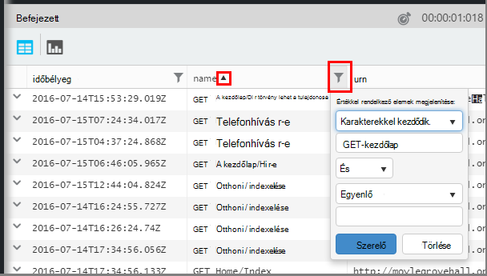

<properties 
    pageTitle="Analytics – az alkalmazás az összefüggéseket a hatékony keresés eszköz használatával |} Microsoft Azure" 
    description="A Analytics, az alkalmazás az összefüggéseket a hatékony diagnosztikai keresési eszköz használatával. " 
    services="application-insights" 
    documentationCenter=""
    authors="danhadari" 
    manager="douge"/>

<tags 
    ms.service="application-insights" 
    ms.workload="tbd" 
    ms.tgt_pltfrm="ibiza" 
    ms.devlang="na" 
    ms.topic="article" 
    ms.date="10/21/2016" 
    ms.author="awills"/>

# Alkalmazás háttérismeretek Analytics használata

[Analytics](app-insights-analytics.md) a hatékony keresés funkció az [Alkalmazás az összefüggéseket](app-insights-overview.md). Ezeket a lapokat a Analytics-lekérdezési nyelv ismertetik.

* **[A bevezető videóból](https://applicationanalytics-media.azureedge.net/home_page_video.mp4)**.
* **[Tesztelése, hogy szimulált adatait a Analytics](https://analytics.applicationinsights.io/demo)** Ha az alkalmazás nem küld adatokat alkalmazás mélyebb még.

## Nyissa meg Analytics

Az alkalmazás háttérismeretek otthoni erőforrása az alkalmazást válassza az analitika.

A belső oktatóprogram végezhető műveletek ötleteket ad.

[Itt szélesebb körű bemutatója](app-insights-analytics-tour.md)van.

## A telemetriai lekérdezés

### Írja be a lekérdezés

A nevét a táblák szerepel a listában, a bal oldali (vagy a [tartományban](app-insights-analytics-reference.md#range-operator) vagy [Unió](app-insights-analytics-reference.md#union-operator) operátorok) kezdődik. Használat `|` létrehozása egy folyamat [operátorokat](app-insights-analytics-reference.md#queries-and-operators). Az IntelliSense kéri, az operátorokat, és a elemeivel kifejezés használható.

Lásd az [analitika nyelvi – áttekintés](app-insights-analytics-tour.md) és a [nyelvi hivatkozást](app-insights-analytics-reference.md).

### Lekérdezések futtatása

1. A lekérdezés egyetlen sortörések is használhatja.
2. Helyezze a kurzort belül, illetve a lekérdezésre, amelyet futtatni szeretne végén.
3. Az Indítás gombra kattintva futtassa a lekérdezést.
4. Üres sorok nem helyezi el a lekérdezés. Több szétválasztott lekérdezés egy lekérdezés lap az üres sorok elválasztva tárolhatja. Csak a mutatót egy fut.

### Mentse a lekérdezést

1. Az aktuális lekérdezés fájl mentéséhez.
2. Nyissa meg a mentett lekérdezés fájlt.
3. Hozzon létre egy új lekérdezést fájlt.

## A részletek megtekintése

Bontsa ki a találatok között, a tulajdonságok teljes listájának megtekintéséhez sor. Bármelyik értéke strukturált – például tulajdonságában, egyéni méretekre vagy a bejegyzésére a kivételt Papírhalom további elemre.

 

## Az eredmények rendezése

Rendezése, szűrése, megjelenítheti és az eredmények a lekérdezés által visszaadott csoportba.

> [AZURE.NOTE] Rendezési, csoportosítási és szűrés a böngészőben nem futtassa újra a lekérdezést. Ezek csak az eredményeket az utolsó lekérdezés által visszaküldött átrendezése. 
> 
> Az alábbi feladatok Server előtt az eredményeket ad vissza, írja be a lekérdezés a [Rendezés](app-insights-analytics-reference.md#sort-operator), [összegezni](app-insights-analytics-reference.md#summarize-operator) és [Hol](app-insights-analytics-reference.md#where-operator) operátorokkal.

Válassza ki az oszlopokat szeretné látni, húzza az oszlopfejléceket átrendezés és oszlopok átméretezése a szegélyek elhúzásával.

### Elemek rendezése és szűrése

A keresési eredmények oszlop vezetője kattintva rendezhetők. Kattintson ismét a más módon történő rendezéséhez, és a harmadik gombra kattintva térjen vissza a lekérdezés által visszaadott eredeti rendelési idő.

A keresés szűkítéséhez használja a szűrő ikonra.

### Elemek csoportosítása

Rendezés több oszlop szerint, a csoportosítás használata. Először engedélyeznie, és húzza a táblázat feletti területre oszlopfejlécek.

### Hiányzik néhány eredmények?

Legfeljebb 10 k sort a portálról eredménye nem. Egy figyelmeztető üzenetet jeleníti meg, ha megnyitja a korlátot fölé. Ebben az esetben, ha rendezheti a találatokat a táblázatban nem mindig, az összes a tényleges első vagy utolsó eredmények megjelenítéséhez. 

Tanácsos szerezze meg a korlátot elkerülése érdekében. Operátorok például használata:

* [Ha időbélyeg > ago(3d)](app-insights-analytics-reference.md#where-operator)
* [a legelső 100 időbélyeg szerint](app-insights-analytics-reference.md#top-operator) 
* [100 készítése](app-insights-analytics-reference.md#take-operator)
* [Összegzés](app-insights-analytics-reference.md#summarize-operator) 

## Diagramok

Válassza ki a diagramot szeretne:

Ha több oszlopot a megfelelő típusú, megadhatja az x és y tengely és méretek szerint az eredmények felosztása egy oszlopban.

Alapértelmezés szerint találat kezdetben táblázatként jelenik meg, és kézi jelölje ki a diagramot. De is használhatja a [irányelv jeleníti meg](app-insights-analytics-reference.md#render-directive) a lekérdezés végén jelölje ki a diagramot.

## Irányítópult rögzítése

Diagram rögzít, vagy a [megosztott irányítópultok](app-insights-dashboards.md) - csak egy táblát, kattintson a PIN-kódot. (Előfordulhat, hogy szeretne [frissítési az alkalmazás által árak csomag](app-insights-pricing.md) Ez a funkció bekapcsolásához.) 

Ez azt jelenti, hogy amikor, összeállított egy irányítópulton a könnyebben figyelhető a teljesítmény vagy a webes szolgáltatások használatát, is elhelyezhet a többi mérési módja miatt összegzik igazán összetett elemzést. 

Ha négy vagy kevesebb oszlop van, akkor rögzítheti a táblázat az irányítópulton. A legfelső hét sorok jelennek meg.

#### Irányítópult-frissítés

A diagram az irányítópult kiemelt ismételt futtatásával a lekérdezés minden fél órán körülbelül automatikusan frissül.

#### Az automatikus egyszerűbb

Egyes esetekben az egyes egyszerűbb alkalmazza a program diagram Ha rögzít egy irányítópult.

Amikor a különálló intervallumokat (általában sávdiagram), a kisebb feltöltött intervallumokat sok megjelenítő diagram pin automatikusan vannak csoportosítva egyetlen "mások" intervallumok. Ha például a lekérdezés:

    requests | summarize count_search = count() by client_CountryOrRegion

Analytics formátumban jelennek meg:

de ha irányítópultra rögzít, fog kinézni:

## Exportálása Excelbe

A lekérdezés futtatása után letöltheti a CSV-fájlból. Kattintson **a exportálása az Excelbe**.

## A Power BI exportálása

Helyezze a kurzort egy lekérdezésben, és válassza a **Power BI exportálása**.

A lekérdezés futtatásakor a Power BI szolgáltatásban. Beállíthatja, hogy a frissítési ütemezés szerint.

A Power BI eredményét adatokat számos különböző forrásokból származó irányítópultokat hozhat létre.

[További tudnivalók a Power bi exportálása](app-insights-export-power-bi.md)

[AZURE.INCLUDE [app-insights-analytics-footer](../../includes/app-insights-analytics-footer.md)]

