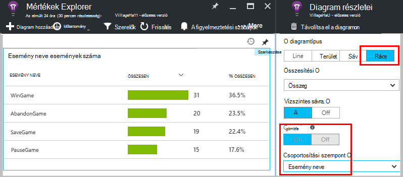

<properties 
    pageTitle="Alkalmazás háttérismeretek API egyéni események és mérőszámok |} Microsoft Azure" 
    description="Néhány kódsorokat az eszköz vagy asztali alkalmazás, a weblap vagy a szolgáltatás, nyomon követheti a használatát, valamint problémáinak diagnosztizálása beszúrása." 
    services="application-insights"
    documentationCenter="" 
    authors="alancameronwills" 
    manager="douge"/>
 
<tags 
    ms.service="application-insights" 
    ms.workload="tbd" 
    ms.tgt_pltfrm="ibiza" 
    ms.devlang="multiple" 
    ms.topic="article" 
    ms.date="10/19/2016" 
    ms.author="awills"/>

# <a name="application-insights-api-for-custom-events-and-metrics"></a>Alkalmazás háttérismeretek API egyéni események és mérőszámok 

*Alkalmazás háttérismeretek az előzetes verzióban.*

Az alkalmazás megtudhatja, hogy milyen felhasználók mivel foglalkoznak vele, vagy problémáinak diagnosztizálása érdekében néhány kódsorokat beszúrása. Az eszközről és az asztali alkalmazások, a webes ügyfelek és a webkiszolgálón telemetriai is küldhet. A [Visual Studio alkalmazás háttérismeretek](app-insights-overview.md) core telemetriai API segítségével küldje el az egyéni események és mértékek és a saját szabványos telemetriai verzióiban. Ez az API az azonos API, az alkalmazás az összefüggéseket szabványos adatgyűjtő által használt.

## <a name="api-summary"></a>API összegzése

Az API egységes néhány kis változatok kívül minden platformon.

A módszer | Használható
---|---
[`TrackPageView`](#page-views) | Lapok, képernyőt használ, pengéit vagy űrlapok
[`TrackEvent`](#track-event) | A felhasználói műveletek és más eseményeket. Nyomon követheti a felhasználó működését, illetve a teljesítmény figyelését használják.
[`TrackMetric`](#track-metric) | Nem kapcsolódik az adott események várólista hosszúságú például teljesítmény mérések
[`TrackException`](#track-exception)|Jelentkezzen be a Kivételek hatóköre diagnosztizálása. Nyomon követheti merülnek fel más események és tehetik vizsgálja meg a Papírhalom nyomkövetések.
[`TrackRequest`](#track-request)| Jelentkezzen be a gyakoriság és a teljesítmény elemzése kiszolgáló kérelmek időtartamát.
[`TrackTrace`](#track-trace)|Diagnosztikai naplózás. Rögzítheti 3rd fél naplók is.
[`TrackDependency`](#track-dependency)|Jelentkezzen be a időtartama és külső összetevők, amelyen az alkalmazás attól függ, hogy hívásokat gyakorisága.

Azt is megteheti, hogy [tulajdonságokat és mérőszámok csatolása](#properties) a legtöbb telemetriai hívásokat. 


## <a name="prep"></a>Előzetes teendők

Ha ezek egyelőre még nem meg:

* Az alkalmazás az összefüggéseket SDK felvenni a projektbe:
 * [ASP.NET-projekt][greenbrown]
 * [Java-projekt][java] 
 * [A JavaScript minden az weblapon][client]   

* Az eszköz vagy a webes kiszolgáló kódot tartalmazza:

    *C#:*`using Microsoft.ApplicationInsights;`

    *VB:*`Imports Microsoft.ApplicationInsights`

    *Java:*`import com.microsoft.applicationinsights.TelemetryClient;`

## <a name="construct-a-telemetryclient"></a>A szerkezet egy TelemetryClient

Egy példányának TelemetryClient Egyenletszerkesztővel (kivéve a JavaScript weblapokon):

*C#:* 

    private TelemetryClient telemetry = new TelemetryClient();

*VISUAL BASIC:* 

    Private Dim telemetry As New TelemetryClient

*Java*

    private TelemetryClient telemetry = new TelemetryClient();

TelemetryClient szál vannak.

Javasoljuk, hogy egy példányának használata `TelemetryClient` az alkalmazás minden modulhoz. Tegyük fel például, előfordulhat, hogy van egy `TelemetryClient` a bejövő HTTP-kérelmeket, a másik pedig egy köztes osztály jelentés jelentés üzleti logikai események webszolgáltatás. Beállíthatja, hogy tulajdonságokat például `TelemetryClient.Context.User.Id` nyomon követéséhez a felhasználók és a munkamenetek, vagy `TelemetryClient.Context.Device.Id` azonosítja a gépen. Ezt az információt a példány által küldött összes eseményének van csatolva.


## <a name="track-event"></a>Esemény nyomon követése

Az alkalmazás hírcsatornájában, egy *Egyéni esemény* egy adatpont, megjelenítheti a egyaránt a [Mértékek Intézőben] [ metrics] egy összesített száma szerint és [Diagnosztikai keresési]egyes előfordulás másként[diagnostic]. (Nem köze az MVC vagy más keretrendszer "események.") 

TrackEvent hívások beszúrása a kódot tartalmazó cellákat számlálnia gyakoriságának felhasználók válasszon egy adott szolgáltatást, hogy milyen gyakran adott célok elérése vagy esetleg ellenőrizze az adott típusú hibát. 

Játék alkalmazásban, például egy eseményt, ha egy felhasználó nyer küldése: 

*A JavaScript*

    appInsights.trackEvent("WinGame");

*C#*
    
    telemetry.TrackEvent("WinGame");

*VISUAL BASIC*


    telemetry.TrackEvent("WinGame")

*Java*

    telemetry.trackEvent("WinGame");


### <a name="view-your-events-in-the-azure-portal"></a>Az események megtekintése az Azure-portálon

Az események számának megtekintéséhez egy [Mérőszám Explorer](app-insights-metrics-explorer.md) lap, adja hozzá az új diagramot, és nyissa meg események.  


Összehasonlítása a más események számát, adja meg a diagram típusának to rács és a csoport esemény neve:




A rács kattintson az esemény nevét, esemény egyedi előfordulását tekintheti át.


Kattintson a részletek megtekintéséhez minden előfordulást.

Szűkítheti a Keresés vagy a metrikus Explorer bizonyos eseményeket, állítsa be az esemény nevét, amely érdekli a lap szűrő:


## <a name="track-metric"></a>Metrikus nyomon követése

Az egyes események nem csatolt mértékek TrackMetric küldhet. Ha például egy sor hossza sikerült figyelheti rendszeres időközönként. 

Mértékek jelennek meg a metrikus Intézőben statisztikai diagramok, de eltérően eseményeket, egyes előfordulások diagnosztikai keresés nem lehet keresni.

Metrikus értékeket kell > = 0 megfelelően jelennek meg.


*A JavaScript*

    appInsights.trackMetric("Queue", queue.Length);

*C#*

    telemetry.TrackMetric("Queue", queue.Length);

*VISUAL BASIC*

    telemetry.TrackMetric("Queue", queue.Length)

*Java*

    telemetry.trackMetric("Queue", queue.Length);

Valójában erre akkor lehet szükség a háttérben szál:

*C#*

    private void Run() {
     var appInsights = new TelemetryClient();
     while (true) {
      Thread.Sleep(60000);
      appInsights.TrackMetric("Queue", queue.Length);
     }
    }


Az eredmények megtekintéséhez nyissa meg a mértékek Intézőt, és adja hozzá az új diagram. Állítsa be a metrikus megjelenítéséhez.


Vannak bizonyos is használhatja [a mértékek számával](#limits) .

## <a name="page-views"></a>Lap nézetek

Lap nézet telemetriai egy eszköz vagy a weblap alkalmazás küldi alapértelmezés szerint minden képernyő vagy a lap betöltésekor. De, amely további vagy különböző időpontokban lap nézetek követéséhez. Például a lapok vagy pengéit megjelenítő alkalmazás, érdemes lehet "lap" nyomon követéséhez, valahányszor a felhasználó megnyit egy új lap. 


Felhasználó és a munkamenet adatokat küldi lap nézetek, valamint tulajdonságként, így a felhasználó és a munkamenet diagramok életben származnak, oldal megtekintése telemetriai esetén.

#### <a name="custom-page-views"></a>Az egyéni nézetek

*A JavaScript*

    appInsights.trackPageView("tab1");

*C#*

    telemetry.TrackPageView("GameReviewPage");

*VISUAL BASIC*

    telemetry.TrackPageView("GameReviewPage")


Ha másik HTML-lapokat belül több lapot, túl adhatja meg az URL-címe:

    appInsights.trackPageView("tab1", "http://fabrikam.com/page1.htm");

#### <a name="timing-page-views"></a>Időzítés lap nézetek

Alapértelmezés szerint az időpontok jelentett "Lap nézet betöltés idő" mért át, amikor a böngésző a kérelem küld, mindaddig, amíg a böngésző lap betöltés esemény neve.

Ehelyett lehetőségek közül választhat:

* Egy közvetlen időtartamot a [trackPageView](https://github.com/Microsoft/ApplicationInsights-JS/blob/master/API-reference.md#trackpageview) hívás.
 * `appInsights.trackPageView("tab1", null, null, null, durationInMilliseconds);`
* Az időzítés hívások lap nézet használata `startTrackPage` és `stopTrackPage`.

*A JavaScript*

    // To start timing a page:
    appInsights.startTrackPage("Page1");

... 

    // To stop timing and log the page:
    appInsights.stopTrackPage("Page1", url, properties, measurements);

Az első paraméterként társít az indítási és leállítási hívások, használhatja a nevét. Az aktuális lap neve alapértelmezés szerint. 

Az eredményül kapott lap betöltés időtartamok metrikus Explorer jelenik meg az indítási és leállítási hívások közötti intervallum származik. Érdemes, milyen intervallum ténylegesen időt.

## <a name="track-request"></a>A kérés nyomon követése

A kiszolgáló SDK használatával jelentkezzen be a HTTP-kérelmeket. 

Is felhívhatja azt saját maga környezetben kérések hasonlóan tetszés a web service modul operációs rendszert futtató nincs.

*C#*

    // At start of processing this request:

    // Operation Id and Name are attached to all telemetry and help you identify
    // telemetry associated with one request:
    telemetry.Context.Operation.Id = Guid.NewGuid().ToString();
    telemetry.Context.Operation.Name = requestName;
    
    var stopwatch = System.Diagnostics.Stopwatch.StartNew();

    // ... process the request ...

    stopwatch.Stop();
    telemetry.TrackRequest(requestName, DateTime.Now,
       stopwatch.Elapsed, 
       "200", true);  // Response code, success


## <a name="operation-context"></a>A művelet környezetben

Telemetriai elemek is lehet tartozó közös csatolásával hozzájuk egy közös művelet azonosítót. A szokásos kérelem nyomon követése a modul végzi a kivételek és más eseményeket küldött HTTP felkérés feldolgozása közben. A [Keresés](app-insights-diagnostic-search.md) és az [analitikai](app-insights-analytics.md)azonosítója segítségével könnyen megtalálja a kérelem társított eseményeket. 

Az azonosító beállítása legkönnyebben egy művelet környezet beállítása a minta használatával:

    // Establish an operation context and associated telemetry item:
    using (var operation = telemetry.StartOperation<RequestTelemetry>("operationName"))
    {
        // Telemetry sent in here will use the same operation ID.
        ...
        telemetry.TrackEvent(...); // or other Track* calls
        ...
        // Set properties of containing telemetry item - for example:
        operation.Telemetry.ResponseCode = "200";
        
        // Optional: explicitly send telemetry item:
        telemetry.StopOperation(operation);

    } // When operation is disposed, telemetry item is sent.

Egy művelet környezetben, beállítása és `StartOperation` létrehoz egy telemetriai cikket, és elküldi, a művelet ejtse vagy explicit módon hívás típusú `StopOperation`. Ha `RequestTelemetry` telemetriai típusúként majd időtartamukat van állítva, a megadott időintervallum indítási és leállítási között.

A művelet kontextusokat nem ágyazható be. Ha már van egy művelet környezetben, a Azonosítójával nem tartozik a benne lévő elemeket, a StartOperation készült elemet is beleértve.

A Keresés a művelet helyi létrehozására való felhasználása esetén a kapcsolódó elemek listája:


## <a name="track-exception"></a>Kivétel nyomon követése

Küldje el a kivételek alkalmazás mélyebb: [őket]tartalmazó cellákat számlálnia[metrics], a problémát; gyakoriság jelzi [egyes előfordulások]vizsgálata[diagnostic]. A jelentéseket a Papírhalom halad tartalmazza.

*C#*

    try
    {
        ...
    }
    catch (Exception ex)
    {
       telemetry.TrackException(ex);
    }

*A JavaScript*

    try
    {
       ...
    }
    catch (ex)
    {
       appInsights.trackException(ex);
    }

A SDK a tényleges sok kivételek automatikusan, így nem mindig kell TrackException külön hívja.

* ASP.NET: [kódírás kivételek tájékozódást segíti, hogy](app-insights-asp-net-exceptions.md)
* J2EE: [Kivételek automatikusan kifogják](app-insights-java-get-started.md#exceptions-and-request-failures)
* A JavaScript: Automatikusan kezelt. Ha automatikus webhelycsoport letiltása, vegye fel a vonal a kódrészletet a weblapokhoz szúrt be:

    ```
    ({
      instrumentationKey: "your key"
      , disableExceptionTracking: true
    })
    ```


## <a name="track-trace"></a>Nyomon követheti nyomon követése 

Ezzel diagnosztizálását küld egy webhely-navigációs pontosan alkalmazás az összefüggéseket. Diagnosztikai adatok mennyiségű küldése, és nézze meg őket a [diagnosztikai keresés][diagnostic]. 

 

[Jelentkezzen be a kártyák] [ trace] Ez az API segítségével külső naplók küldése a portálra.


*C#*

    telemetry.TrackTrace(message, SeverityLevel.Warning, properties);


Keresheti meg az üzenet tartalmát, de (eltérően tulajdonságértékeket) nem szűrhet rajta.

A méretkorlátot `message` sokkal nagyobb, mint a Tulajdonságok korlát.
TrackTrace az egyik előnye, hogy írható viszonylag hosszú adatok az üzenetet. Például sikerült kódolását van a bejegyzés adatok számára.  


Ezeken kívül szinttel is adhat meg az üzenetet. És más telemetriai, például vegyen fel tulajdonságértékeket segíti a szűrés vagy Keresés a nyomkövetési naplók különböző csoportjaihoz használható. Példa:


    var telemetry = new Microsoft.ApplicationInsights.TelemetryClient();
    telemetry.TrackTrace("Slow database response",
                   SeverityLevel.Warning,
                   new Dictionary<string,string> { {"database", db.ID} });

Ez esetben lehetővé teszi, [Keresés][diagnostic], egyszerűen kiszűrésére egy adott adatbázis kapcsolatos adott szinttel azokat az üzeneteket.

## <a name="track-dependency"></a>Függőség nyomon követése

A hívás használatával nyomon követheti a válaszidő és a hívások átirányítása egy külső kódrészlet sikerességéről. Az eredmények megjelennek a portálon függőség diagramokban. 

```C#

            var success = false;
            var startTime = DateTime.UtcNow;
            var timer = System.Diagnostics.Stopwatch.StartNew();
            try
            {
                success = dependency.Call();
            }
            finally
            {
                timer.Stop();
                telemetry.TrackDependency("myDependency", "myCall", startTime, timer.Elapsed, success);
            }
```

Ne feledje, hogy a kiszolgáló SDK tartalmazza a [függőség modul](app-insights-dependencies.md) , amely találja, és nyomon követi az egyes függőség hív automatikusan – például adatbázisok és a REST API-khoz. Akkor telepítenie kell az ügynökkel, hogy a modul működik a kiszolgálón. Ha azt szeretné, hogy az automatikus nyomon követés nem fogta hívások nyomon követésére, vagy ha nem szeretné telepíteni az ügynököt használja a híváshoz.

A szokásos függőség a nyomon követés modul kikapcsolásához [ApplicationInsights.config](app-insights-configuration-with-applicationinsights-config.md) szerkesztése, és a hivatkozás törlése `DependencyCollector.DependencyTrackingTelemetryModule`.


## <a name="flushing-data"></a>Könyvelési adatok

A szokásos módon a SDK időnként döntött, hogy a felhasználó hatással kisméretűvé adatokat küld. Azonban bizonyos esetekben érdemes lehet kiüríteni a puffer – például olyan alkalmazás, amely leállítja használatakor a SDK csomagjában talál.

*C#*

    telemetry.Flush();

    // Allow some time for flushing before shutdown.
    System.Threading.Thread.Sleep(1000);

Ne feledje, hogy a függvény a [kiszolgáló telemetriai csatorna](https://www.nuget.org/packages/Microsoft.ApplicationInsights.WindowsServer.TelemetryChannel/)aszinkron, de szinkron, ha úgy dönt, hogy a memóriában csatorna vagy [állandó csatornát](app-insights-api-filtering-sampling.md#persistence-channel).


## <a name="authenticated-users"></a>A hitelesített felhasználók

A megfelelő web App alkalmazásban a felhasználók a cookie-k jelölt alapértelmezés szerint vannak. Ha az alkalmazás hozzáférni egy másik gépre vagy a böngészőben, vagy törölni a cookie-k többször megszámlálandó előfordulhat, hogy a felhasználó. 

De felhasználók jelentkezzen be az alkalmazásba, ha a pontosabb száma elérheti a hitelesített felhasználói azonosító beállítva a böngésző kódot:

*A JavaScript*

```JS
    // Called when my app has identified the user.
    function Authenticated(signInId) {
      var validatedId = signInId.replace(/[,;=| ]+/g, "_");
      appInsights.setAuthenticatedUserContext(validatedId);
      ...
    }
```

ASP.NET-webhely MVC alkalmazást, például:

*RAZOR*

        @if (Request.IsAuthenticated)
        {
            <script>
                appInsights.setAuthenticatedUserContext("@User.Identity.Name
                   .Replace("\\", "\\\\")"
                   .replace(/[,;=| ]+/g, "_"));
            </script>
        }

Nem szükséges, a tényleges bejelentkezési felhasználónév használni. Csak le kell, hogy a felhasználó egyedi azonosítót. Nem tartalmazhat szóközt, vagy a karaktereket `,;=|`. 

A felhasználói azonosító is beállítása a munkamenet cookie-k és a kiszolgálóra küldött. Ha a kiszolgáló SDK van telepítve, a hitelesített felhasználói azonosító küld az ügyfél- és kiszolgálóoldali telemetriai helyi tulajdonságainak részeként, hogy a szűrés, és keresse meg azt.

Ha az alkalmazás felhasználók csoportosítja fiókok, is átadhatja az azonosító a fiók (korlátozásokkal az azonos karakter).


      appInsights.setAuthenticatedUserContext(validatedId, accountId);

A [Mértékek explorer](app-insights-metrics-explorer.md)létrehozhat olyan diagramot, amely megszámolja a **felhasználók, a hitelesített** és a **felhasználói fiókok**. 

Is [keresési] [ diagnostic] ügyfél adatpontok adott felhasználóneveket és a partnerek számára.

## <a name="properties"></a>Szűrés, keresés és oszthatja fel az adatok tulajdonságok

Akkor tulajdonságokat és Mértékek csatolása az eseményeket (és még metrikus, oldal a nézetek, kivétel és más telemetriai adatokat).

**Tulajdonságok** karakterlánc értékeket a telemetriai a használati jelentések szűrése is használhatja. Ha például ha az alkalmazás több játékok biztosít, érdemes az egyes eseményekhez csatolhat a játék a neve, hogy melyik játékok további népszerű is megjelenik. 

A karakterlánc hossza a körülbelül 1k legfeljebb van. (Ha nagy mennyiségű adat elküldeni kívánt, üzenet paraméter használatával a [TrackTrace](#track-trace).)

**Mértékek** olyan számértékek, grafikusan megjeleníthetők. Érdemes lehet például, hogy van-e a eredmények elérése a gamers fokozatos növekedését. A diagramok is szegmentált küld-e az esemény tulajdonságai, így importálhatott külön vagy más játékok grafikonok-ig halmozott.

Metrikus értékeket kell > = 0 megfelelően jelennek meg.


Vannak bizonyos is használhatja [a tulajdonságait, a tulajdonság értékeit, és a mértékek számával](#limits) .


*A JavaScript*

    appInsights.trackEvent
      ("WinGame",
         // String properties:
         {Game: currentGame.name, Difficulty: currentGame.difficulty},
         // Numeric metrics:
         {Score: currentGame.score, Opponents: currentGame.opponentCount}
         );

    appInsights.trackPageView
        ("page name", "http://fabrikam.com/pageurl.html",
          // String properties:
         {Game: currentGame.name, Difficulty: currentGame.difficulty},
         // Numeric metrics:
         {Score: currentGame.score, Opponents: currentGame.opponentCount}
         );
          

*C#*

    // Set up some properties and metrics:
    var properties = new Dictionary <string, string> 
       {{"game", currentGame.Name}, {"difficulty", currentGame.Difficulty}};
    var metrics = new Dictionary <string, double>
       {{"Score", currentGame.Score}, {"Opponents", currentGame.OpponentCount}};

    // Send the event:
    telemetry.TrackEvent("WinGame", properties, metrics);


*VISUAL BASIC*

    ' Set up some properties:
    Dim properties = New Dictionary (Of String, String)
    properties.Add("game", currentGame.Name)
    properties.Add("difficulty", currentGame.Difficulty)

    Dim metrics = New Dictionary (Of String, Double)
    metrics.Add("Score", currentGame.Score)
    metrics.Add("Opponents", currentGame.OpponentCount)

    ' Send the event:
    telemetry.TrackEvent("WinGame", properties, metrics)


*Java*
    
    Map<String, String> properties = new HashMap<String, String>();
    properties.put("game", currentGame.getName());
    properties.put("difficulty", currentGame.getDifficulty());
    
    Map<String, Double> metrics = new HashMap<String, Double>();
    metrics.put("Score", currentGame.getScore());
    metrics.put("Opponents", currentGame.getOpponentCount());
    
    telemetry.trackEvent("WinGame", properties, metrics);


> [AZURE.NOTE] Ügyeljen arra, nem személyes azonosításra használható információk naplózása a Tulajdonságok parancsot.

**Ha korábban a mértékek**, nyissa meg a metrikus Intézőt, és válassza ki a az egyéni csoportból:


*Ha a metrikus nem jelenik meg, vagy ha az egyéni fejléce nem létezik, zárja be a kijelölt lap, és próbálja meg később. Előfordul, hogy a mértékek keresztül a folyamat összesítenie kell egy óra is eltarthat.*

**Tulajdonságok és mérőszámok használatakor**, a tulajdonság a mérőszám szakasz:


**A diagnosztikai keresési**, megtekintheti a tulajdonságokat és mérőszámok esemény egyes előfordulásainak.


A Keresés mező segítségével lásd: az esemény előfordulások az egy adott tulajdonság értékét.


[További tudnivalók a keresési kifejezések][diagnostic].

#### <a name="alternative-way-to-set-properties-and-metrics"></a>Alternatív módszer tulajdonságainak és mérőszámok beállítása

Ha kényelmesebb, összegyűjtheti külön objektum esemény határozza meg:

    var event = new EventTelemetry();

    event.Name = "WinGame";
    event.Metrics["processingTime"] = stopwatch.Elapsed.TotalMilliseconds;
    event.Properties["game"] = currentGame.Name;
    event.Properties["difficulty"] = currentGame.Difficulty;
    event.Metrics["Score"] = currentGame.Score;
    event.Metrics["Opponents"] = currentGame.Opponents.Length;

    telemetry.TrackEvent(event);

> [AZURE.WARNING] A telemetriai elem példányt nem újrafelhasználása (`event` ebben a példában) Track*() többször hívni. A telemetriai helytelen konfigurációja küldeni jelenhet meg.


## <a name="timed"></a>Időzítési események

Előfordul, hogy szeretné, hogy a diagram időtartamának néhány művelet végrehajtásához. Például, előfordulhat, hogy szeretné, hogy mennyi ideig felhasználók take szempontok játék lehetőségeket. Ez a mértékegység paraméter használja a hasznos példa.


*C#*

    var stopwatch = System.Diagnostics.Stopwatch.StartNew();

    // ... perform the timed action ...

    stopwatch.Stop();

    var metrics = new Dictionary <string, double>
       {{"processingTime", stopwatch.Elapsed.TotalMilliseconds}};

    // Set up some properties:
    var properties = new Dictionary <string, string> 
       {{"signalSource", currentSignalSource.Name}};

    // Send the event:
    telemetry.TrackEvent("SignalProcessed", properties, metrics);


## <a name="defaults"></a>Egyéni telemetriai alapértelmezett tulajdonságai

Ha meg szeretné adni alapértelmezett értékű egyes az egyéni események kézzel írt, beállíthatja őket egy TelemetryClient. Csatolt minden ügyfél által küldött telemetriai elemet. 

*C#*

    using Microsoft.ApplicationInsights.DataContracts;

    var gameTelemetry = new TelemetryClient();
    gameTelemetry.Context.Properties["Game"] = currentGame.Name;
    // Now all telemetry will automatically be sent with the context property:
    gameTelemetry.TrackEvent("WinGame");
    
*VISUAL BASIC*

    Dim gameTelemetry = New TelemetryClient()
    gameTelemetry.Context.Properties("Game") = currentGame.Name
    ' Now all telemetry will automatically be sent with the context property:
    gameTelemetry.TrackEvent("WinGame")

*Java*

    import com.microsoft.applicationinsights.TelemetryClient;
    import com.microsoft.applicationinsights.TelemetryContext;
    ...


    TelemetryClient gameTelemetry = new TelemetryClient();
    TelemetryContext context = gameTelemetry.getContext();
    context.getProperties().put("Game", currentGame.Name);
    
    gameTelemetry.TrackEvent("WinGame");


    
Egyes telemetriai hívások felülbírálhatja a tulajdonság szótárak az alapértelmezett értékeket.

**A JavaScript webes ügyfelek**, [a JavaScript telemetriai inicializálók használja](#js-initializer).

**Az összes telemetriai tulajdonságok hozzáadása a** szabványos webhelycsoport modulokat, adataival [megvalósítása `ITelemetryInitializer` ](app-insights-api-filtering-sampling.md#add-properties).


## <a name="sampling-filtering-and-processing-telemetry"></a>Mintavételezés, szűrés és telemetriai feldolgozása 

A telemetriai feldolgozása, a SDK csomagjában talál az elküldés előtt kód is írhat. A feldolgozás HTTP request gyűjtemény és függőség webhelycsoport például a szokásos telemetriai modulból küldött adatok tartalmazza.

* [Tulajdonságok hozzáadása a](app-insights-api-filtering-sampling.md#add-properties) bevezetésével telemetriai `ITelemetryInitializer` – például számok verzióját szeretné hozzáadni, vagy értékek más tulajdonságok alapján számítja ki. 
* [Szűrés](app-insights-api-filtering-sampling.md#filtering) módosíthatja vagy elvetése telemetriai, a SDK csomagjában talál a bevezetésével elküldése előtt `ITelemetryProcesor`. Ön mit küldött vagy eldobása, de el kell végeznie a fiókot, a hatás a mérési módja miatt. Attól függően, hogy hogyan elveti elemek az azt jelenti, hogy a kapcsolódó elemek közötti lépkedéshez elveszhetnek.
* Az alkalmazás a portálon küldött adatok a hangerő csökkentése csomagolt megoldást [mintavételi](app-insights-api-filtering-sampling.md#sampling) . Igen, a megjelenített mérési módja miatt módosítása nélkül, és az azt jelenti, hogy a problémák azonosítására kapcsolódó elemek, például a kivételek, kérések és lap nézetek közötti navigálással megtartásával.

[tudj meg többet](app-insights-api-filtering-sampling.md)


## <a name="disabling-telemetry"></a>Telemetriai letiltása

**Dinamikusan leállíthatja, és indítsa el** a webhelycsoport, valamint telemetriai továbbításának:

*C#*

```C#

    using  Microsoft.ApplicationInsights.Extensibility;

    TelemetryConfiguration.Active.DisableTelemetry = true;
```

**Tiltsa le a kijelölt szabványos begyűjtők** – például teljesítmény számláló, HTTP-kérések vagy függőségek - törlése vagy ki a megfelelő sorokat a [ApplicationInsights.config]megjegyzést[config]. Tudta ehhez, például ha el szeretné küldeni a saját TrackRequest adatain.

## <a name="debug"></a>Fejlesztői üzemmód

Során hibakeresése során, akkor lehet hasznos, szeretné, hogy a telemetriai végezhető el a folyamat, így az eredmény azonnal láthatja. Akkor is get további üzeneteket, amelyek segítségével nyomon követése bármilyen problémát tapasztal a telemetriai. Kapcsolja ki a gyártási, mint lassíthatja az alkalmazás.


*C#*
    
    TelemetryConfiguration.Active.TelemetryChannel.DeveloperMode = true;

*VISUAL BASIC*

    TelemetryConfiguration.Active.TelemetryChannel.DeveloperMode = True


## <a name="ikey"></a>A kijelölt egyéni telemetriai műszerezettségi kulcs beállítása

*C#*
    
    var telemetry = new TelemetryClient();
    telemetry.InstrumentationKey = "---my key---";
    // ...


## <a name="dynamic-ikey"></a>Dinamikus műszerezettségi billentyűt

Kerülje az másolatot fejlesztése, vizsgálat és a gyártási környezetből telemetriai, hogy [Hozzon létre külön alkalmazás mélyebb erőforrások] is[ create] , és módosíthatja a környezettől függően igényelhetnek.

Ahhoz, hogy a műszerezettségi billentyűt a konfigurációs fájl, hanem azt is megadhatja ilyenkor be a kódot. Egy inicializálni módszer, például egy ASP.NET szolgáltatásban global.aspx.cs kulcs beállítása:

*C#*

    protected void Application_Start()
    {
      Microsoft.ApplicationInsights.Extensibility.
        TelemetryConfiguration.Active.InstrumentationKey = 
          // - for example -
          WebConfigurationManager.Settings["ikey"];
      ...

*A JavaScript*

    appInsights.config.instrumentationKey = myKey; 


Weblapok érdemes lehet állítsa be az érintett webkiszolgálóra állapot, hanem betűhíven kódolása a parancsprogram-be. Például az weblapon egy ASP.NET-alkalmazásban létrehozott:

*JavaScript Razor*

    <script type="text/javascript">
    // Standard Application Insights web page script:
    var appInsights = window.appInsights || function(config){ ...
    // Modify this part:
    }({instrumentationKey:  
      // Generate from server property:
      @Microsoft.ApplicationInsights.Extensibility.
         TelemetryConfiguration.Active.InstrumentationKey"
    }) // ...


## <a name="telemetrycontext"></a>TelemetryContext

TelemetryClient tartalmaz egy helyi tulajdonság, amely számos küldött összes telemetriai adatokkal együtt értéket tartalmazza. A szokásos módon szabványos telemetriai modulok vannak beállítva, de is beállíthatja, hogy őket saját magának. Példa:

    telemetry.Context.Operation.Name = "MyOperationName";

Ha ezek az értékek közül saját magát, fontolja meg a megfelelő sor eltávolítása [ApplicationInsights.config][config], így az értékek és a szokásos értékek nem első zavaros.

* **Összetevő** Az alkalmazás és a verzióját azonosítja
* **Eszköz** Az eszközön, amelyen a alkalmazás fut kapcsolatos adatok (a web Apps alkalmazások, ez a kiszolgáló vagy ügyfél eszközt, amelyből küldi el a telemetriai)
* **InstrumentationKey** A telemetriai helyének Azure-ban az alkalmazás az összefüggéseket erőforrás azonosítja. A ApplicationInsights.config általában felvett
* **Hely** Az eszköz a földrajzi helye azonosítja.
* **Művelet** A web Apps alkalmazások, az aktuális HTTP kérelem. Az alkalmazás másfajta beállíthatja, hogy ez eseményekre együtt.
 * **Azonosító**: a létrehozott érték, amely a különböző eseményeket, felel meg, hogy minden esetben a diagnosztikai keresési nézze meg, amikor keresés "kapcsolódó elemek"
 * **Név**: az azonosító, általában az URL-CÍMÉT a HTTP-kérést. 
 * **SyntheticSource**: Ha nem nulla vagy üres, a karakterlánc azt jelzi, hogy a kérelem forrásának egy keresőrobotokra vagy webhely tesztcélú néven azonosított. Alapértelmezés szerint akkor kimarad az számítások a mértékek Explorer.
* **Tulajdonságok** Az tulajdonságokat küldött összes telemetriai adatokkal. Az egyes hívások nyomon követése * felülírható.
* **Munkamenet** Azonosítja a felhasználó munkamenetet. Létrehozott érték, amely megváltozik, amikor a felhasználó nem be van jelentkezve egy ideje az azonosító értéke.
* **Felhasználói** Felhasználói adatok. 

## <a name="limits"></a>Korlátai


[AZURE.INCLUDE [application-insights-limits](../../includes/application-insights-limits.md)]

*Hogyan kerülheti meg, hogy az adatok időköz határa szerezze-e?*

* [Példákat talál arra](app-insights-sampling.md)használja.

*Mennyi ideig adatok legyen?*

* Lásd:, [adatmegőrzés és adatvédelmi][data].


## <a name="reference-docs"></a>Hivatkozás dokumentumok

* [ASP.NET-hivatkozás](https://msdn.microsoft.com/library/dn817570.aspx)
* [Java-hivatkozás](http://dl.windowsazure.com/applicationinsights/javadoc/)
* [JavaScript-hivatkozás](https://github.com/Microsoft/ApplicationInsights-JS/blob/master/API-reference.md)
* [Android SDK](https://github.com/Microsoft/ApplicationInsights-Android)
* [iOS SDK](https://github.com/Microsoft/ApplicationInsights-iOS)


## <a name="sdk-code"></a>SDK kódot.

* [ASP.NET Core SDK](https://github.com/Microsoft/ApplicationInsights-dotnet)
* [ASP.NET 5](https://github.com/Microsoft/ApplicationInsights-aspnet5)
* [A Windows Server csomagok](https://github.com/Microsoft/applicationInsights-dotnet-server)
* [Java SDK](https://github.com/Microsoft/ApplicationInsights-Java)
* [A JavaScript SDK](https://github.com/Microsoft/ApplicationInsights-JS)
* [Minden platform](https://github.com/Microsoft?utf8=%E2%9C%93&query=applicationInsights)

## <a name="questions"></a>Kérdések

* *Milyen kivételek előfordulhat, hogy throw Track_() hívásokat?*
    
    Nincs lehetőség. Nem kell tördelése őket a kipróbálása-tényleges záradékok. Ha a SDK problémákat észlel, üzeneteket, látni fogja naplózza hibakeresési konzol eredményt ad - és az üzenetek kódszámú keresztül – diagnosztikai keresés.


* *Van-e a REST API-t adatok beolvasása a portálra?*

    Igen, hamarosan. [Folytonos exportálás](app-insights-export-telemetry.md)időközben használata.

## <a name="next"></a>Következő lépések


[Keresési események és naplók][diagnostic]

[Minták és forgatókönyvek](app-insights-code-samples.md)

[Hibaelhárítás][qna]


<!--Link references-->

[client]: app-insights-javascript.md
[config]: app-insights-configuration-with-applicationinsights-config.md
[create]: app-insights-create-new-resource.md
[data]: app-insights-data-retention-privacy.md
[diagnostic]: app-insights-diagnostic-search.md
[exceptions]: app-insights-asp-net-exceptions.md
[greenbrown]: app-insights-asp-net.md
[java]: app-insights-java-get-started.md
[metrics]: app-insights-metrics-explorer.md
[qna]: app-insights-troubleshoot-faq.md
[trace]: app-insights-search-diagnostic-logs.md

 
