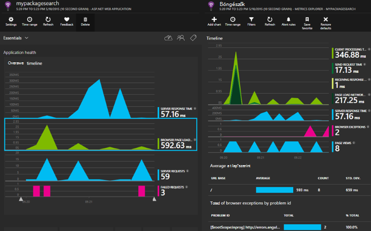

<properties 
    pageTitle="Alkalmazás az összefüggéseket a ASP.NET Core" 
    description="Webalkalmazások elérhetőségét, a teljesítmény és a használat figyelése" 
    services="application-insights" 
    documentationCenter=".net"
    authors="alancameronwills" 
    manager="douge"/>

<tags 
    ms.service="application-insights" 
    ms.workload="tbd" 
    ms.tgt_pltfrm="ibiza" 
    ms.devlang="na" 
    ms.topic="article" 
    ms.date="08/30/2016" 
    ms.author="awills"/>

# Alkalmazás az összefüggéseket a ASP.NET Core

[Visual Studio alkalmazás háttérismeretek](app-insights-overview.md) figyelheti a webalkalmazás az elérhetőség, a teljesítmény és a használatát teszi lehetővé. A visszajelzés, a teljesítmény és az alkalmazás hatékonyságát a helyettesítő az első, a teheti minden fejlesztési életciklus tájékoztatni választási lehetőségek, a tervezés irányát kapcsolatban.

[Microsoft Azure](http://azure.com)-előfizetés kell. Jelentkezzen be Microsoft-fiókkal, amely lehet, hogy a Windows, XBox Live vagy más Microsoft felhőszolgáltatásokhoz. A csapat lehet egy szervezeti előfizetés Azure: kérje meg a tulajdonosát, hogy fel kell vennie Önt a Microsoft-fiók használatával.

## Első lépések

Kövesse az [első lépések útmutató](https://github.com/Microsoft/ApplicationInsights-aspnetcore/wiki/Getting-Started).

## Háttérismeretek alkalmazás használata

Jelentkezzen be a [Microsoft Azure-portálra](https://portal.azure.com) , és keresse meg az erőforrásra, az alkalmazás figyelése létrehozott.

A külön böngészőablakban az alkalmazás használata egy ideig. Láthatja, hogy az alkalmazás az összefüggéseket diagramok szereplő adatok. (Lehet, ha a frissítés gombra.) Lesz kis mennyiségű adattal közben fejleszt, de a fenti diagramokról valójában származnak életben közzététele az alkalmazást, és sok felhasználó. 

A áttekintése lap diagramok a teljesítményét Ön nagy valószínűséggel érdekelhetik: kiszolgáló válaszidő, oldal betöltés idő és sikertelen kérelmek számát. Kattintson az egyes diagramokra kattintva tekintse meg további diagramokat és adatokat.

Nézetek a portálon két fő kategóriába sorolhatók:

* [Mértékek Explorer](app-insights-metrics-explorer.md) megjeleníti a grafikonok és táblázatok mértékek és megszámolja, például válaszidő, a hiba díjak vagy a mértékek, saját maga hozza létre a [API](app-insights-api-custom-events-metrics.md)-val. Szűrés és tulajdonságértékeket kérjen az alkalmazás és a felhasználók jobban ismertetése szerint oszthatja fel az adatokat.
* [Keresés Explorer](app-insights-diagnostic-search.md) egyes eseményekhez, például kérései, a kivételek, a napló halad vagy a saját maga a [API](app-insights-api-custom-events-metrics.md)-val létrehozott események sorolja fel. Szűrése az események keresése és Navigálás a kapcsolódó eseményeket vizsgálja meg problémákat között.
* [Analytics](app-insights-analytics.md) lehetővé teszi az SQL-szerű lekérdezések futtatása a telemetriai fölé, és egy hatékony analitikai és diagnosztikai eszköz.

## Értesítések

* [Megelőző diagnosztikai figyelmeztetések](app-insights-proactive-diagnostics.md) , amelyek akkor anomalous-változások a hiba díjak és más mértékek alapján automatikusan kap.
* Tesztelje a webhely folyamatosan helyekről világszerte [elérhetősége vizsgálatok](app-insights-monitor-web-app-availability.md) beállítása, és elérheti az e-mailek, amint bármely a teszt sikertelen.
* Tudnivalók a mértékek, például válaszidő vagy a kivétel díjak válassza elfogadható határokon kívül [metrikus értesítések](app-insights-monitor-web-app-availability.md) beállításával.

## További telemetriai beszerzése

* [A weblapokhoz hozzáadása telemetriai](app-insights-javascript.md) , oldal használat figyelése és a teljesítmény.
* [Monitor függőségek](app-insights-dependencies.md) kattintva megtekintheti a többi, SQL vagy más külső erőforrások is lassíthatják meg.
* [Használja az API](app-insights-api-custom-events-metrics.md) küldése saját események és az alkalmazás teljesítményének és látogatottságának részletesebb nézetének mértékek.
* [Elérhetőség vizsgálatok](app-insights-monitor-web-app-availability.md) jelölje be az alkalmazás folyamatosan a világon. 

## Forrás megnyitása

[Olvassa el és szerkeszthetik azokat a kódot.](https://github.com/Microsoft/ApplicationInsights-aspnetcore#recent-updates)

