<properties 
    pageTitle="Az alkalmazás az összefüggéseket követés függőség" 
    description="Elemzése használatát, elérhetőségét, és a helyszíni vagy a Microsoft Azure webalkalmazás alkalmazás Hírcsatornájában teljesítményét." 
    services="application-insights" 
    documentationCenter=".net"
    authors="alancameronwills" 
    manager="douge"/>

<tags 
    ms.service="application-insights" 
    ms.workload="tbd" 
    ms.tgt_pltfrm="ibiza" 
    ms.devlang="na" 
    ms.topic="article" 
    ms.date="10/24/2016" 
    ms.author="awills"/>


# <a name="set-up-application-insights-dependency-tracking"></a>Állítsa be az alkalmazás mélyebb: függőség nyomon követése


[AZURE.INCLUDE [app-insights-selector-get-started-dotnet](../../includes/app-insights-selector-get-started-dotnet.md)]


*Függőség* egy külső összetevő, amely szerint az alkalmazás neve. Érdemes a szokásos HTTP, vagy egy adatbázis vagy fájlrendszer nevű szolgáltatás. Visual Studio alkalmazás Hírcsatornájában akkor egyszerűen láthatja mennyi ideig az alkalmazás vár, függőségek, és milyen gyakran egy függőség hibát jelez.

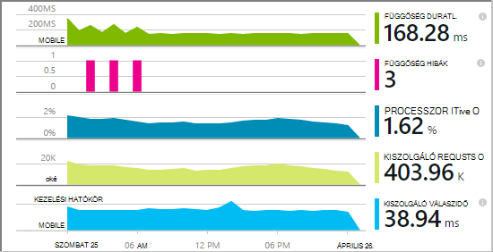

A függőséget ki-be a monitor jelenleg jelentések függőségek ilyen típusú hívásokat:

* ASP.NET
 * SQL-adatbázisait
 * ASP.NET-webhely és a HTTP-alapú kötések használó WCF-szolgáltatások
 * Helyi vagy távoli HTTP hívások
 * Azure DocumentDb, tábla, blob-tárolóhoz és várakozási sora
* Java
 * Hívások [JDBC](http://docs.oracle.com/javase/7/docs/technotes/guides/jdbc/) illesztőprogram, például a MySQL, SQL Server, PostgreSQL vagy SQLite keresztül adatbázishoz.
* JavaScript - weblapokon az [weblapon SDK](app-insights-javascript.md) automatikusan Ajax hívást naplózza, függőségek.

Lync-más függőségek, a [TrackDependency API](app-insights-api-custom-events-metrics.md#track-dependency)saját SDK hívásokat is írhat.


## <a name="to-set-up-dependency-monitoring"></a>Függőség figyelése beállítása

A [Microsoft Azure](http://azure.com) -előfizetése van szüksége.

### <a name="if-your-app-runs-on-your-iis-server"></a>Ha az alkalmazás az IIS-kiszolgálón fut

Ha .NET 4.6-os vagy újabb verziója fut a web App alkalmazásban, akkor bármelyik [telepíteni az alkalmazást az összefüggéseket SDK](app-insights-asp-net.md) az alkalmazást, az alkalmazás az összefüggéseket állapot Monitor telepítése vagy. Mindkét nem szükséges.

Ellenkező esetben a kiszolgálón telepítse a alkalmazás háttérismeretek állapot Monitor:

1. A IIS webkiszolgálón, jelentkezzen be rendszergazdai hitelesítő adataival.
2. Töltse le, és futtassa az [állapot Monitor telepítőt](http://go.microsoft.com/fwlink/?LinkId=506648).
4. A telepítővarázslóban jelentkezzen be a Microsoft Azure.

    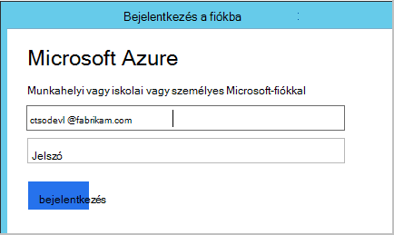

    *Internetkapcsolat hibáinak? Lásd: a [Hibaelhárítás](#troubleshooting).*

5. Válassza ki a telepített webalkalmazás vagy a figyelni kívánt webhelyet, majd állítsa be az erőforrás, amelyben meg szeretné tekinteni az eredményeket az alkalmazás az összefüggéseket portálon.

    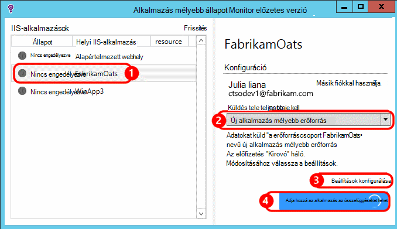

    A szokásos módon, úgy dönt, hogy egy új erőforrás és [erőforráscsoport]konfigurálása[roles].

    Ha már állította be a [webes azt vizsgálja,] ellenkező esetben használata a meglévő erőforrás[ availability] a webhely vagy a [webes ügyfelek figyelése][client].

6. Indítani az IIS Alkalmazást.

    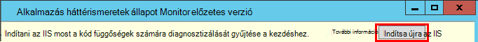

    A webszolgáltatás egy rövid ideig megszakad.

6. Figyelje meg, hogy a figyelni kívánt web Apps alkalmazások ApplicationInsights.config beszúrta.

    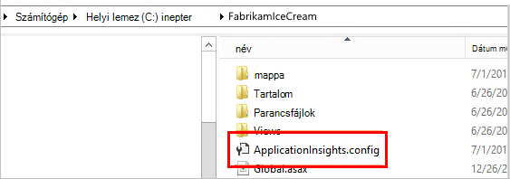

   Is web.config megváltozott.

#### <a name="want-to-reconfigure-later"></a>Konfigurálandó (ismételt) később?

A varázsló elvégzése után újra beállíthatja a agent bármikor. Akkor is is használja, ha a agent telepítette, de néhány tapasztal a kezdeti beállítás volt.

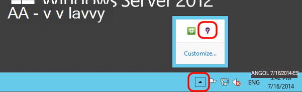


### <a name="if-your-app-runs-as-an-azure-web-app"></a>Ha az alkalmazás-Azure Web App fut

Az Azure-webalkalmazást a Vezérlőpultot adja meg az alkalmazás mélyebb kiterjesztés.

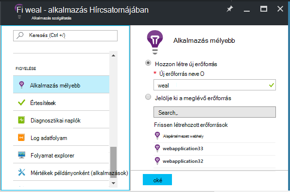


### <a name="if-its-an-azure-cloud-services-project"></a>Ha egy Azure cloud services-projekt

[Parancsfájlok webhelyen és dolgozó szerepköreihez hozzáadása](app-insights-cloudservices.md#dependencies). Vagy a [.NET-keretrendszer 4.6-os vagy újabb verzió telepítéséhez](../cloud-services/cloud-services-dotnet-install-dotnet.md).

## <a name="diagnosis"></a>Diagnosztizálása függőség teljesítménnyel kapcsolatos problémák

Mérje fel, hogy a teljesítmény kérelmek a kiszolgálón, nyissa meg a Teljesítmény lap, és görgessen le a rács kérelmek figyelmébe:

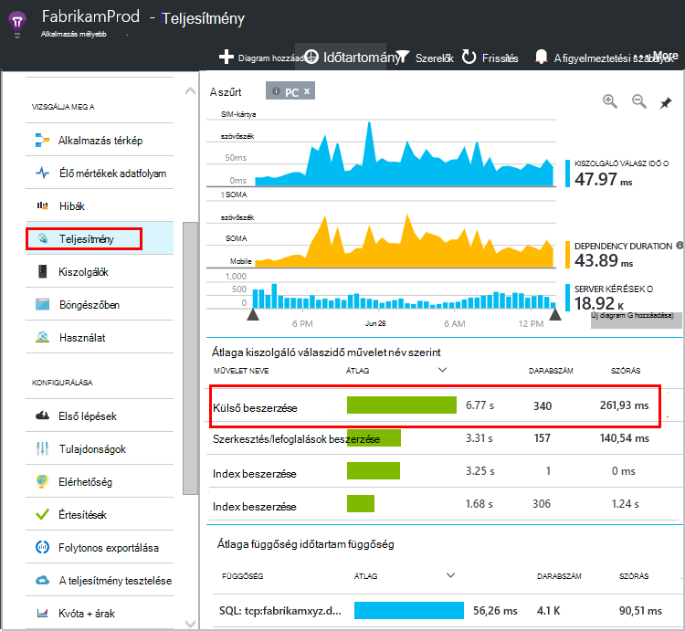

A felső egy túl sokáig tart. Nézzük meg, ha azt láthatja, hogy hol van töltött idő.

Kattintson a sorát különálló kérelem események megtekintéséhez:


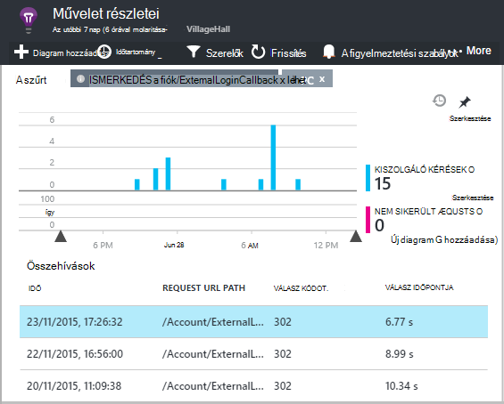

Kattintson a hosszabb ideig futó példányokban, hogy vizsgálja meg további.

Görgessen le a kérelem kapcsolódó távoli függőség hívásokat:

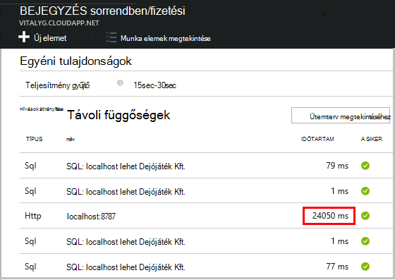

A kérés a hívást kezdeményez egy helyi szolgáltatás töltött idő karbantartási a legtöbb néz. 


Válassza ki, hogy a sor további információk:

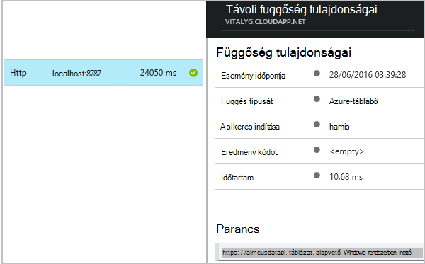

A részleteket a probléma diagnosztizálása elegendő információt tartalmaz.


Egy másik lehetőséget választja nincs függőség hívás hosszú, de az Ütemterv nézetben való átállításával azt láthatja a késleltetés hol történt a belső feldolgozás:


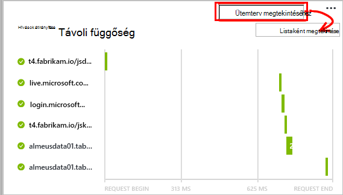


## <a name="failures"></a>Hibák

Ha sikertelen kérelmek, kattintson a diagramra.

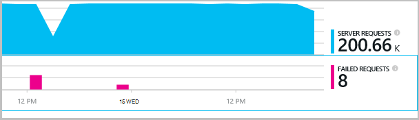

Kattintson egy kérés típusa és a kérelem példány használata esetén keresse meg a sikertelen hívást kezdeményez egy távoli függőséget.


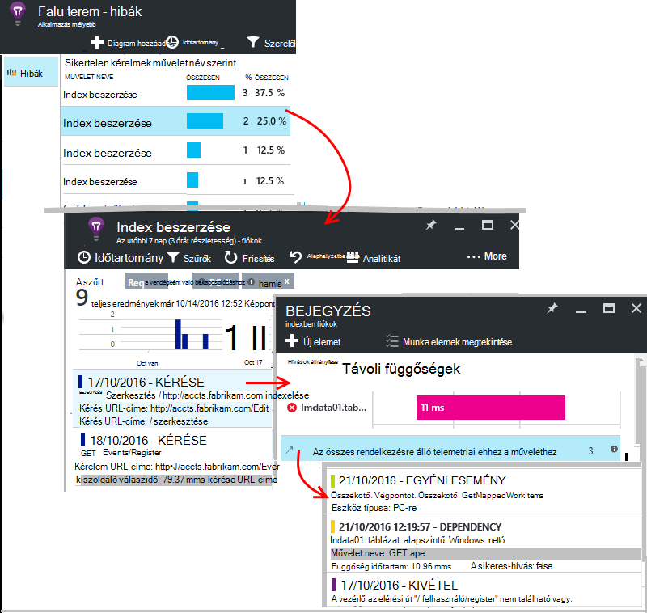


## <a name="custom-dependency-tracking"></a>Egyéni függőség nyomon követése

A normál függőség követése modul automatikusan feltárja a külső függőségeket, például az adatbázisok és a REST API-khoz. De érdemes lehet néhány további összetevőit ugyanúgy kell kezelni. 

Kód, amely az objektumfüggőségekre vonatkozó információk, elküldi a azonos [TrackDependency API](app-insights-api-custom-events-metrics.md#track-dependency) a normál modul által használt írhat.

A kód generál egy összeállítás kézzel írt nem saját magának az, ha például sikerült, az összes hívások meg, hogy milyen hozzájárulása, a válasz időpontok van időt. Ahhoz, hogy az adatok jelennek meg az alkalmazást az összefüggéseket a függőség diagramok, küldje el a `TrackDependency`.

```C#

            var startTime = DateTime.UtcNow;
            var timer = System.Diagnostics.Stopwatch.StartNew();
            try
            {
                success = dependency.Call();
            }
            finally
            {
                timer.Stop();
                telemetry.TrackDependency("myDependency", "myCall", startTime, timer.Elapsed, success);
            }
```

Kapcsolja ki a szokásos függőség a nyomon követés modul szeretné, ha a hivatkozás DependencyTrackingTelemetryModule eltávolítása [ApplicationInsights.config](app-insights-configuration-with-applicationinsights-config.md).

## <a name="troubleshooting"></a>Hibaelhárítás

*Függőség sikeres jelző mindig igaz vagy hamis érték jeleníti meg.*

* Frissítse a SDK legújabb verzióját. Ha .NET verziójától kisebb, mint 4.6, telepítse az [állapot monitor](app-insights-monitor-performance-live-website-now.md).

## <a name="next-steps"></a>Következő lépések

- [A kivételek](app-insights-asp-net-exceptions.md)
- [Felhasználói és lapon adatok][client]
- [Elérhetőség](app-insights-monitor-web-app-availability.md)


<!--Link references-->

[api]: app-insights-api-custom-events-metrics.md
[apikey]: app-insights-api-custom-events-metrics.md#ikey
[availability]: app-insights-monitor-web-app-availability.md
[azure]: ../insights-perf-analytics.md
[client]: app-insights-javascript.md
[diagnostic]: app-insights-diagnostic-search.md
[metrics]: app-insights-metrics-explorer.md
[netlogs]: app-insights-asp-net-trace-logs.md
[portal]: http://portal.azure.com/
[qna]: app-insights-troubleshoot-faq.md
[redfield]: app-insights-asp-net-dependencies.md
[roles]: app-insights-resources-roles-access-control.md

 
