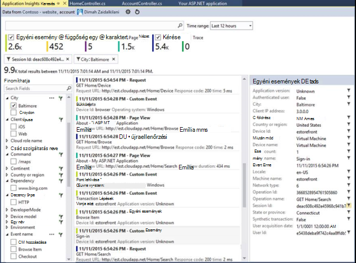
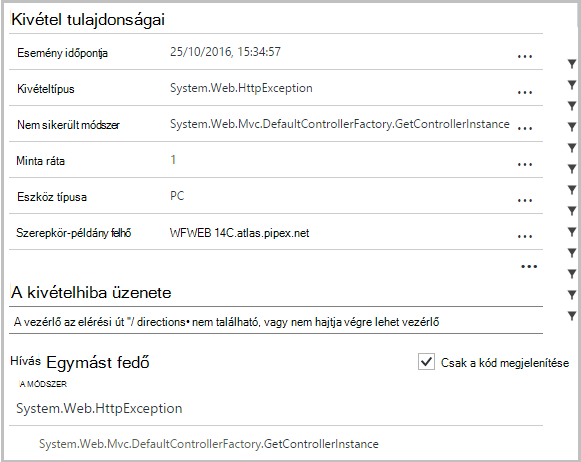
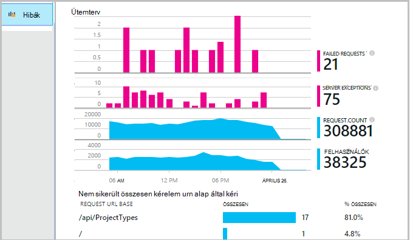
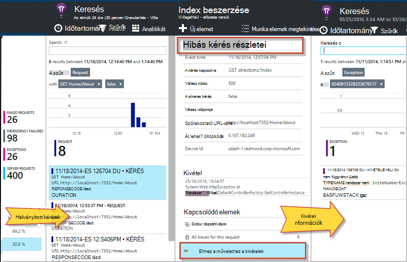
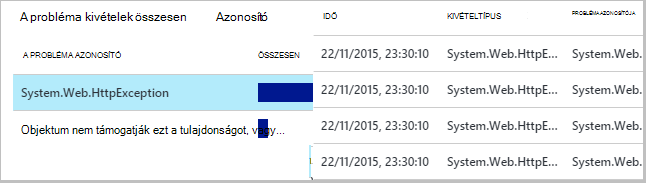
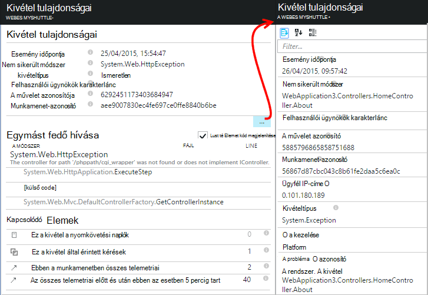
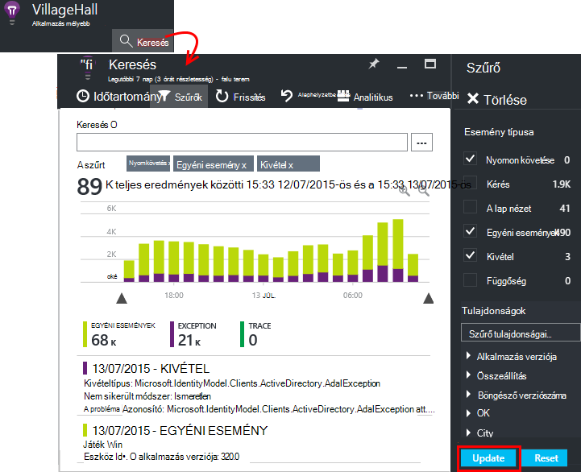
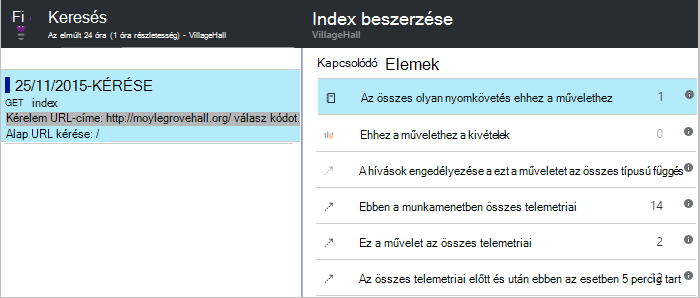

<properties 
    pageTitle="Hibák és a kivételek az alkalmazás az összefüggéseket a ASP.NET-alkalmazások diagnosztizálása" 
    description="ASP.NET-alkalmazások együtt kérelem telemetriai alóli kivételek rögzíthet." 
    services="application-insights" 
    documentationCenter=".net"
    authors="alancameronwills" 
    manager="douge"/>

<tags 
    ms.service="application-insights" 
    ms.workload="tbd" 
    ms.tgt_pltfrm="ibiza" 
    ms.devlang="na" 
    ms.topic="article" 
    ms.date="10/27/2016" 
    ms.author="awills"/>


# <a name="set-up-application-insights-diagnose-exceptions"></a>Állítsa be az alkalmazás az összefüggéseket: kivételek diagnosztizálása

[AZURE.INCLUDE [app-insights-selector-get-started-dotnet](../../includes/app-insights-selector-get-started-dotnet.md)]


Az alkalmazás a [Visual Studio alkalmazás háttérismeretek]megfigyelésével[start], sikertelen kérelmek összefüggésbe hozhatja kivételekkel és más eseményeket, az ügyfél és a kiszolgálón, így gyorsan felderítheti a okok.

ASP.NET-alkalmazás figyelése, fel kell [venni az alkalmazást az összefüggéseket SDK] [ greenbrown] alkalmazás vagy [állapot Monitor az IIS-kiszolgálóra telepítse][redfield], vagy, ha az alkalmazás az Azure Web App, hoz létre a [Hírcsatornájában alkalmazásbővítmények](app-insights-azure-web-apps.md).

## <a name="diagnosing-exceptions-using-visual-studio"></a>Visual Studio segítségével kivételek diagnosztizálása

Nyissa meg a alkalmazásmegoldássá a Visual Studióban, ami segítheti a hibakereséshez.

A kiszolgálón vagy F5 segítségével a fejlesztői számítógépen, futtassa az alkalmazást.

Nyissa meg az alkalmazás az összefüggéseket keresőablak a Visual Studióban, és állítsa be az alkalmazás események megjelenítéséhez. Hibakeresése, közben végezheti el ez az alkalmazás az összefüggéseket gombra kattintva.



Figyelje meg, hogy a jelentésben csak kivételek szűrheti. 

*Kivételek megjelenítő? Lásd: a [Kivételek rögzíthet](#exceptions).*

Kattintson egy kivétel jelentés annak Papírhalom nyomkövetési megjelenítése gombra.



Kattintson a Papírhalom nyomkövetésben nyissa meg a megfelelő fájlt sor hivatkozást.  

## <a name="diagnosing-failures-using-the-azure-portal"></a>Az Azure portálon hibák diagnosztizálása

Az alkalmazás alkalmazás háttérismeretek áttekintése a hibák csempére kivételek diagramok láthatók, és sikertelen a HTTP kérelmek együtt a kérelem listájának URL-címeit, amelyek a leggyakoribb hibák okozhatnak.



Kattintson a hibát egyedi előfordulását eléréséhez a listában a hibás kérés típusok közül. Itt kattintson a kivételek vagy bármely, társított nyomkövetési adatok:




**Másik lehetőségként** elindíthatja a kivételek listájáról, amikor találhatók további lefelé a hibák lap. Tartsa a gombra kattintva, amíg el nem ahányat egyes kivételek.




*Kivételek megjelenítő? Lásd: a [Kivételek rögzíthet](#exceptions).*

Innen tekintse meg a Papírhalom nyomon követése és minden kivétel részletes tulajdonságait, és a nyomkövetési napló kapcsolódó vagy más események keresése.




[További tudnivalók a diagnosztikai keresési][diagnostic].


## <a name="dependency-failures"></a>Függőség hibák

*Függőség* a szolgáltatás, amely az alkalmazás felhívja, általában REST API-t vagy egy adatbázis-kapcsolaton keresztül. [Alkalmazás háttérismeretek állapot Monitor] [ redfield] automatikusan figyeli adattípusokra függőség hívások hívás időtartam és a megoldás sikeres vagy sikertelen mérési. 

Függőség adatokat lekérdezni, [telepítenie] kell az állapot Monitor[ redfield] az IIS-kiszolgálón, vagy ha az alkalmazás az Azure Web App, a [Alkalmazásbővítmény az összefüggéseket](app-insights-azure-web-apps.md). 

Függőségek sikertelen hívások megjelennek a hibák lap, és megtalálhatja őket a kapcsolódó elemek a kérés részleteinek és a kivétel részleteit.

*Nincs függő hibák? az jó. De, amelyről függőség adatok ellenőrzéséhez nyissa meg a teljesítményét lap, és tekintse meg a függőség időtartam diagram.*

 

## <a name="custom-tracing-and-log-data"></a>Egyéni nyomkövetési és naplóadatok

Diagnosztikai adatok beolvasása az alkalmazás-specifikus, beszúrhat saját telemetriai adatokat küldeni kódot. Ez a kérést, oldal megtekintése és egyéb automatikusan gyűjtött adatok mellett diagnosztikai keresési jelenik meg. 

Több lehetőség közül választhat:

* [TrackEvent()](app-insights-api-custom-events-metrics.md#track-event) jellemzően szokásai kíséréséhez, de egyéni események a diagnosztikai keresés jelenik meg az adatokat is küld. Események elnevezése és végezheti a karakterlánc-tulajdonságok és numerikus mértékek, amelyen [a diagnosztikai keresések szűrése]is[diagnostic].
* [TrackTrace()](app-insights-api-custom-events-metrics.md#track-trace) elküldheti a bejegyzés például hosszabb adatokat.
* [TrackException()](#exceptions) Papírhalom nyomkövetési naplók küldése [További információ a kivételek](#exceptions).
* Ha már használ egy naplózás keretrendszer, például Log4Net vagy NLog, akkor [ezeket a naplók rögzítése] [ netlogs] és a diagnosztikai keresési kérelem és a kivétel adatok mellett megtekintheti őket.

Az alábbi események megtekintéséhez nyissa meg a [keresési][diagnostic], nyissa meg a szűrő, és válassza az egyéni esemény, a nyomkövetési vagy a kivétel.





> [AZURE.NOTE] Ha az alkalmazás telemetriai sok hoz létre, a adaptív mintavételnél modul automatikusan csökkenti a kötet, amely csak képviselő részét, események küldésével a rendszer elküldi a portálon. Események azonos művelet részét képező kijelölt vagy csoportként kijelöletlen, hogy meg tudja nyitni a kapcsolódó eseményeket között lesz. [Tudjon meg többet mintavételnél.](app-insights-sampling.md)

### <a name="how-to-see-request-post-data"></a>Kérelem bejegyzés adatainak megtekintése

Kérés részleteinek az alkalmazás bejegyzés hívás küldött adatok nem tartalmazzák. Ezeket az adatokat kell jelenteni:

* [Telepítse a SDK] [ greenbrown] a alkalmazás projektben.
* Kód beszúrása [Microsoft.ApplicationInsights.TrackTrace()]felhívni az alkalmazásban[api]. A bejegyzés adatok küldése az üzenet paraméter. Korlátozva van a megengedett méretét, ezért csak az alapvető adatok küldése.
* Amikor egy hibás kérés vizsgálatához keresse meg a társított halad.  




## <a name="exceptions"></a>Kivételek és a kapcsolódó diagnosztikai adatok rögzítése

Kezdetben nem látható a portálon a kivételek okozó hibák az alkalmazásban. Láthatja, hogy a böngésző kivételek (a [JavaScript SDK] használata[ client] a weblapokon). De a legtöbb kiszolgáló kivételek IIS szerint javítsa, és ki kell írni egy kicsit kód fájlokat.

képes vagy:

* **Jelentkezzen be a kivételek kifejezetten** vonalkód eseménykezelők a jelentést a kivételek.
* **Kivétel automatikus rögzítése** az ASP.NET keretrendszer konfigurálásával. A szükséges kiegészítés keretrendszer különböző típusú eltérőek.

## <a name="reporting-exceptions-explicitly"></a>A kivételek kifejezetten jelentése

Legegyszerűbb módja, ha be szeretne szúrni egy kivétel kezelő hívást kezdeményez TrackException().

A JavaScript

    try 
    { ...
    }
    catch (ex)
    {
      appInsights.trackException(ex, "handler loc",
        {Game: currentGame.Name, 
         State: currentGame.State.ToString()});
    }

C#

    var telemetry = new TelemetryClient();
    ...
    try 
    { ...
    }
    catch (Exception ex)
    {
       // Set up some properties:
       var properties = new Dictionary <string, string> 
         {{"Game", currentGame.Name}};

       var measurements = new Dictionary <string, double>
         {{"Users", currentGame.Users.Count}};

       // Send the exception telemetry:
       telemetry.TrackException(ex, properties, measurements);
    }

VISUAL BASIC

    Dim telemetry = New TelemetryClient
    ...
    Try
      ...
    Catch ex as Exception
      ' Set up some properties:
      Dim properties = New Dictionary (Of String, String)
      properties.Add("Game", currentGame.Name)

      Dim measurements = New Dictionary (Of String, Double)
      measurements.Add("Users", currentGame.Users.Count)
  
      ' Send the exception telemetry:
      telemetry.TrackException(ex, properties, measurements)
    End Try

A tulajdonságok és mértékek paraméterek nem kötelező, de hasznos, ha a [Szűrés és hozzáadása] [ diagnostic] további információt. Például ha az alkalmazás, amely futtatását is lehetővé teszi, hogy több játékok, találta a kivétel kapcsolódó összes jelentés egy adott mérkőzés szavakat. Annyi elemek szótárakat tetszés szerint hozzáadhat.

## <a name="browser-exceptions"></a>Kivételek a böngészőben

A legtöbb böngészőben kivételek jelentik.

Az weblapon a tartalomkézbesítési hálózatok vagy egy másik tartomány parancsfájlok tartalmaz, győződjön meg arról, a parancsprogram címke van az attribútum ```crossorigin="anonymous"```, és az, hogy a kiszolgáló küld [CORS fejlécek](http://enable-cors.org/). Ez teszi lehetővé a Papírhalom nyomon követése és részletekhez tartozó beszerzése az ezek az erőforrások esetén nem kezelt JavaScript kivételek.

## <a name="web-forms"></a>Webes űrlap

Webes űrlap esetén a HTTP-modul fogja tudni gyűjt a kivételek, ha nincs beállítva CustomErrors átirányítások nem nem.

De ha átirányítja az aktív, a következő sorok hozzáadása a Global.asax.cs Application_Error függvény. (Global.asax fájl hozzáadása, ha még nincs egyik.)

*C#*

    void Application_Error(object sender, EventArgs e)
    {
      if (HttpContext.Current.IsCustomErrorEnabled && Server.GetLastError  () != null)
      {
         var ai = new TelemetryClient(); // or re-use an existing instance

         ai.TrackException(Server.GetLastError());
      }
    }


## <a name="mvc"></a>MVC

Ha a [CustomErrors](https://msdn.microsoft.com/library/h0hfz6fc.aspx) beállítások `Off`, majd a kivételek érhetők el a [HTTP-modul](https://msdn.microsoft.com/library/ms178468.aspx) gyűjthetők össze az. Jó helyen jár Ha `RemoteOnly` (alapértelmezett), vagy `On`, a kivétel lesz bejelölve, és nem érhető el az alkalmazást az összefüggéseket automatikusan összegyűjtéséhez. Amely szerint az [System.Web.Mvc.HandleErrorAttribute osztály](http://msdn.microsoft.com/library/system.web.mvc.handleerrorattribute.aspx)felülbírálása és a többszörösen definiált osztály alkalmazásáról a különböző MVC verziójához ([github forrás](https://github.com/AppInsightsSamples/Mvc2UnhandledExceptions/blob/master/MVC2App/Controllers/AiHandleErrorAttribute.cs)) alább látható módon háríthatja el:

    using System;
    using System.Web.Mvc;
    using Microsoft.ApplicationInsights;

    namespace MVC2App.Controllers
    {
      [AttributeUsage(AttributeTargets.Class | AttributeTargets.Method, Inherited = true, AllowMultiple = true)] 
      public class AiHandleErrorAttribute : HandleErrorAttribute
      {
        public override void OnException(ExceptionContext filterContext)
        {
            if (filterContext != null && filterContext.HttpContext != null && filterContext.Exception != null)
            {
                //If customError is Off, then AI HTTPModule will report the exception
                if (filterContext.HttpContext.IsCustomErrorEnabled)
                {   //or reuse instance (recommended!). see note above  
                    var ai = new TelemetryClient();
                    ai.TrackException(filterContext.Exception);
                } 
            }
            base.OnException(filterContext);
        }
      }
    }

#### <a name="mvc-2"></a>MVC 2

Cserélje ki az új attribútum, a vezérlők a HandleError attribútum.

    namespace MVC2App.Controllers
    {
       [AiHandleError]
       public class HomeController : Controller
       {
    ...

[Minta](https://github.com/AppInsightsSamples/Mvc2UnhandledExceptions)

#### <a name="mvc-3"></a>3 MVC

Regisztráció `AiHandleErrorAttribute` Global.asax.cs globális szűrőként:

    public class MyMvcApplication : System.Web.HttpApplication
    {
      public static void RegisterGlobalFilters(GlobalFilterCollection filters)
      {
         filters.Add(new AiHandleErrorAttribute());
      }
     ...

[Minta](https://github.com/AppInsightsSamples/Mvc3UnhandledExceptionTelemetry)


#### <a name="mvc-4-mvc5"></a>4, MVC5 MVC

Regisztráció AiHandleErrorAttribute FilterConfig.cs globális szűrőként:

    public class FilterConfig
    {
      public static void RegisterGlobalFilters(GlobalFilterCollection filters)
      {
        // Default replaced with the override to track unhandled exceptions
        filters.Add(new AiHandleErrorAttribute());
      }
    }

[Minta](https://github.com/AppInsightsSamples/Mvc5UnhandledExceptionTelemetry)

## <a name="web-api-1x"></a>A webes API 1.x


System.Web.Http.Filters.ExceptionFilterAttribute felülbírálása:

    using System.Web.Http.Filters;
    using Microsoft.ApplicationInsights;

    namespace WebAPI.App_Start
    {
      public class AiExceptionFilterAttribute : ExceptionFilterAttribute
      {
        public override void OnException(HttpActionExecutedContext actionExecutedContext)
        {
            if (actionExecutedContext != null && actionExecutedContext.Exception != null)
            {  //or reuse instance (recommended!). see note above 
                var ai = new TelemetryClient();
                ai.TrackException(actionExecutedContext.Exception);    
            }
            base.OnException(actionExecutedContext);
        }
      }
    }

Adja hozzá a többszörösen definiált attribútumot adott vezérlők, vagy vegye fel a WebApiConfig osztály a globális szűrő beállításait: 

    using System.Web.Http;
    using WebApi1.x.App_Start;

    namespace WebApi1.x
    {
      public static class WebApiConfig
      {
        public static void Register(HttpConfiguration config)
        {
            config.Routes.MapHttpRoute(name: "DefaultApi", routeTemplate: "api/{controller}/{id}",
                defaults: new { id = RouteParameter.Optional });
            ...
            config.EnableSystemDiagnosticsTracing();

            // Capture exceptions for Application Insights:
            config.Filters.Add(new AiExceptionFilterAttribute());
        }
      }
    }

[Minta](https://github.com/AppInsightsSamples/WebApi_1.x_UnhandledExceptions)

Vannak olyan esetek, amelyek a kivétel szűrőket nem tudják kezelni számos. Példa:

* A vezérlő konstruktorok kivételek. 
* Az üzenet kezelők kivételek. 
* Kivételek továbbítás közben. 
* Válasz tartalom közbeni kivételek. 

## <a name="web-api-2x"></a>A webes API 2.x

Adja hozzá egy IExceptionLogger végrehajtása:

    using System.Web.Http.ExceptionHandling;
    using Microsoft.ApplicationInsights;

    namespace ProductsAppPureWebAPI.App_Start
    {
      public class AiExceptionLogger : ExceptionLogger
      {
        public override void Log(ExceptionLoggerContext context)
        {
            if (context !=null && context.Exception != null)
            {//or reuse instance (recommended!). see note above 
                var ai = new TelemetryClient();
                ai.TrackException(context.Exception);
            }
            base.Log(context);
        }
      }
    }

Adja hozzá a szolgáltatások WebApiConfig:

    using System.Web.Http;
    using System.Web.Http.ExceptionHandling;
    using ProductsAppPureWebAPI.App_Start;

    namespace WebApi2WithMVC
    {
      public static class WebApiConfig
      {
        public static void Register(HttpConfiguration config)
        {
            // Web API configuration and services

            // Web API routes
            config.MapHttpAttributeRoutes();

            config.Routes.MapHttpRoute(
                name: "DefaultApi",
                routeTemplate: "api/{controller}/{id}",
                defaults: new { id = RouteParameter.Optional }
            );
            config.Services.Add(typeof(IExceptionLogger), new AiExceptionLogger()); 
        }
      }
  }

[Minta](https://github.com/AppInsightsSamples/WebApi_2.x_UnhandledExceptions)

Alternatív megoldásként teheti:

2. A csak ExceptionHandler cserélje IExceptionHandler egy egyéni végrehajtását. Ha továbbra is képes válassza ki, mely válaszüzenetet küldeni (nem Ha a kapcsolat megszakadt példány) keretében csak Link 
3. Kivétel szűrők (leírtak szerint a fenti webes API 1.x vezérlők csoportban) – nem minden esetben hívja.


## <a name="wcf"></a>WCF

Adja hozzá a attribútum fejlettebb, és alkalmazza a IErrorHandler és IServiceBehavior osztály.

    using System;
    using System.Collections.Generic;
    using System.Linq;
    using System.ServiceModel.Description;
    using System.ServiceModel.Dispatcher;
    using System.Web;
    using Microsoft.ApplicationInsights;

    namespace WcfService4.ErrorHandling
    {
      public class AiLogExceptionAttribute : Attribute, IErrorHandler, IServiceBehavior
      {
        public void AddBindingParameters(ServiceDescription serviceDescription,
            System.ServiceModel.ServiceHostBase serviceHostBase,
            System.Collections.ObjectModel.Collection<ServiceEndpoint> endpoints,
            System.ServiceModel.Channels.BindingParameterCollection bindingParameters)
        {
        }

        public void ApplyDispatchBehavior(ServiceDescription serviceDescription, 
            System.ServiceModel.ServiceHostBase serviceHostBase)
        {
            foreach (ChannelDispatcher disp in serviceHostBase.ChannelDispatchers)
            {
                disp.ErrorHandlers.Add(this);
            }
        }

        public void Validate(ServiceDescription serviceDescription, 
            System.ServiceModel.ServiceHostBase serviceHostBase)
        {
        }

        bool IErrorHandler.HandleError(Exception error)
        {//or reuse instance (recommended!). see note above 
            var ai = new TelemetryClient();

            ai.TrackException(error);
            return false;
        }

        void IErrorHandler.ProvideFault(Exception error, 
            System.ServiceModel.Channels.MessageVersion version, 
            ref System.ServiceModel.Channels.Message fault)
        {
        }
      }
    }

A szolgáltatás megvalósítás attribútum felvétele:

    namespace WcfService4
    {
        [AiLogException]
        public class Service1 : IService1 
        { 
         ...

[Minta](https://github.com/AppInsightsSamples/WCFUnhandledExceptions)

## <a name="exception-performance-counters"></a>Kivétel teljesítmény számláló

Ha van [telepítve állapotát Monitor] [ redfield] a kiszolgálón a kivételek rátáját, mérniük a .NET diagram elérheti. Ide tartoznak a kezelt és a esetén nem kezelt .NET kivételek.

Egy mérőszám Explorer lap, adja hozzá az új diagramot, és nyissa meg **kivétel ráta**; teljesítmény számláló alatt. 

A .NET-keretrendszer alapján számítja ki a ráta megszámlálása a kivételek egy intervallum és elosztja a időköz hosszát. 

Megjegyzés: legyen eltér a "Kivétel" számát, az alkalmazás az összefüggéseket portálja által TrackException jelentések alapján számítja ki. A mintavételnél intervallumok eltérőek, és a SDK nem küldi el, az összes TrackException jelentések kezelni, és nem kezelt kivételek.

<!--Link references-->

[api]: app-insights-api-custom-events-metrics.md
[client]: app-insights-javascript.md
[diagnostic]: app-insights-diagnostic-search.md
[greenbrown]: app-insights-asp-net.md
[netlogs]: app-insights-asp-net-trace-logs.md
[redfield]: app-insights-monitor-performance-live-website-now.md
[start]: app-insights-overview.md

 
