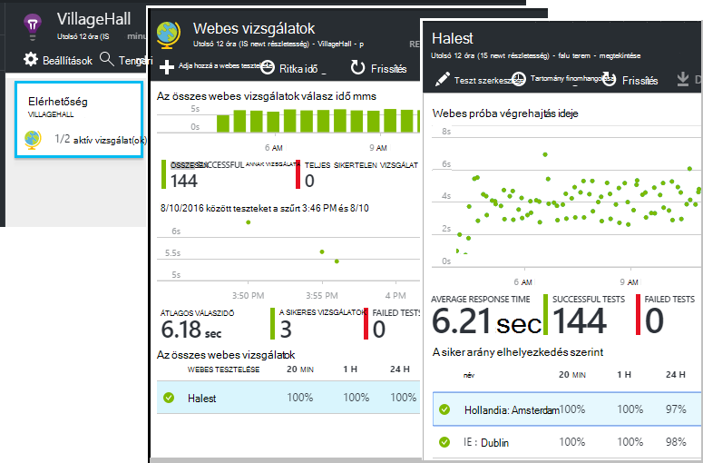

<properties 
    pageTitle="Jobban kihasználhatja az összefüggéseket alkalmazás |} Microsoft Azure" 
    description="Után – első lépések alkalmazás mélyebb, az alábbiakban összefoglaljuk ismerje meg a szolgáltatását." 
    services="application-insights" 
    documentationCenter=".net"
    authors="alancameronwills" 
    manager="douge"/>

<tags 
    ms.service="application-insights" 
    ms.workload="tbd" 
    ms.tgt_pltfrm="ibiza" 
    ms.devlang="na" 
    ms.topic="article" 
    ms.date="10/27/2016" 
    ms.author="awills"/>

# <a name="more-telemetry-from-application-insights"></a>Az alkalmazás az összefüggéseket további telemetriai

Után [alkalmazás az összefüggéseket a ASP.NET-kódot szeretne hozzáadni](app-insights-asp-net.md), nincsenek néhány hasznos dolgot még több telemetriai eléréséhez. 

## <a name="if-your-app-runs-on-your-iis-server-"></a>Ha az alkalmazás az IIS-kiszolgálón fut...

Ha az alkalmazás a vezérlő IIS-kiszolgálókon üzemelteti, telepítse az alkalmazást az összefüggéseket állapot Monitor kiszolgálókon. Ha már telepítve van, akkor nem kell tennie semmit sem.

1. Minden IIS webkiszolgálón rendszergazdai hitelesítő adataival jelentkezzen be.
2. Töltse le, és futtassa az [állapot Monitor telepítőt](http://go.microsoft.com/fwlink/?LinkId=506648).
3. A telepítővarázslóban jelentkezzen be a Microsoft Azure.

Nem kell tennie semmi másra, de győződhet meg, hogy figyelése engedélyezve van az alkalmazás.


(Is használhatja állapot Monitor [futásidőben figyelése engedélyezése](app-insights-monitor-performance-live-website-now.md), még akkor is, ha nem eszköz a Visual Studio-alkalmazások.)

### <a name="what-do-you-get"></a>Mi akkor jelenik meg?

Ha állapot Monitor telepítve van a kiszolgáló gépeken, néhány további telemetriai kattint:

* Függőség telemetriai (SQL-hívások és az alkalmazás többi hívások)-.NET 4.5 alkalmazást. (.NET újabb verzióiban, az állapot Monitor nincs szükség függőség telemetriai.) 
* Kivétel Papírhalom halad több részlet megjelenítése.
* Számláló teljesítményét. Az alkalmazás Hírcsatornájában ezek a számláló a kiszolgálók lap láthatók. 


Több vagy kevesebb számláló, [szerkesztheti a diagramokat](app-insights-metrics-explorer.md)megtekintéséhez. Ha a teljesítmény számláló, amelyet nem érhető el megadása, azt is megteheti, [vegye fel a teljesítmény számláló modul által gyűjtött készletébe](app-insights-performance-counters.md).

## <a name="if-its-an-azure-web-app-"></a>Ha az Azure-webappokban...

Ha az alkalmazás-Azure web App fut, nyissa meg a kívánt alkalmazásba vagy a virtuális Azure Vezérlőpultján, és nyissa meg az alkalmazást az összefüggéseket a lap. 

### <a name="what-do-you-get"></a>Mi akkor jelenik meg?

* Kivétel Papírhalom halad több részlet megjelenítése.
* Függőség telemetriai (SQL-hívások és az alkalmazás többi hívások)-.NET 4.5 alkalmazást. (A .NET újabb verzióiban, a bővítmény nincs szükség függőség telemetriai.) 


(Is használhatja ezt a módszert a [Teljesítmény futásidőben figyelése engedélyezése](app-insights-monitor-performance-live-website-now.md), még akkor is, ha nem eszköz a Visual Studio alkalmazását.)

## <a name="client-side-monitoring"></a>Ügyféloldali figyelése

A SDK csomagjában talál, amelyek telemetriai adatokat küld a kiszolgálóról (vissza vége), az alkalmazás már telepítve van. Most már hozzáadhat ügyféloldali figyelése. Ez a felhasználók, munkamenetek, lap nézetek, és bármelyik kivételek vagy összeomlik a böngészőben előforduló adatokkal teszi lehetővé. Is is írhat a saját kód nyomon követéséhez, a felhasználók működése az alkalmazást, jobb kattintással és a billentyű lenyomásával részletes szintjét le.

Adja hozzá az alkalmazás mélyebb JavaScript kódtöredékének minden lapjához, úgy juthat az ügyfél böngészők telemetriai.

1. Azure nyissa meg az alkalmazást az összefüggéseket erőforrás az alkalmazás.
2. Bevezetés Monitor ügyféloldali megnyitásához, és másolja a kódtöredék.
3. Illessze be, hogy megjelenik az egyes weblap - vezetője általában beillesztése az a diaminta-elrendezés lap is ehhez.


Figyelje meg, hogy a kód, amely azonosítja az alkalmazás erőforrás műszerezettségi kulcsot tartalmazza.

### <a name="what-do-you-get"></a>Mi akkor jelenik meg?

* JavaScript küldése [a weblaprészeket vághat ki egyéni telemetriai](app-insights-api-custom-events-metrics.md), például a nyomon követése gombra kattintással is írhat.
* [Analytics](app-insights-analytics.md)és az adatok `pageViews` AJAX adatok `dependencies`. 
* [Ügyfél teljesítményét és használati adatainak](app-insights-javascript.md) a böngészők lap.


[További tudnivalók az weblapon nyomon követése.](app-insights-web-track-usage.md)


## <a name="track-application-version"></a>Változáskövetési alkalmazás verziója

Győződjön meg arról, hogy `buildinfo.config` a MSBuild folyamat jön létre. A .csproj fájl hozzáadása:  

```XML

    <PropertyGroup>
      <GenerateBuildInfoConfigFile>true</GenerateBuildInfoConfigFile>    <IncludeServerNameInBuildInfo>true</IncludeServerNameInBuildInfo>
    </PropertyGroup> 
```

Az összeállítás információ rendelkezik, az alkalmazás az összefüggéseket webes modul automatikusan hozzáadja **alkalmazás verziója** tulajdonság a telemetriai minden elemre. Amely lehetővé teszi, ha úgy szeretné szűrni verzió [diagnosztikai keresés](app-insights-diagnostic-search.md) végrehajtása során, vagy ha [Mértékek felfedezése](app-insights-metrics-explorer.md). 

Azonban figyelje meg, hogy a build verziószám csak által generált MS Build, nem a Visual Studióban Fejlesztőeszközök összeállítása.


## <a name="availability-web-tests"></a>Elérhetőség webes vizsgálat

Küldje el a web App alkalmazásban a HTTP-kérések a világon a rendszeres időközönként. Azt a figyelmeztet, ha a válasz lassú, vagy a nem megbízható.

Kattintson az alkalmazás az összefüggéseket erőforrás az alkalmazás hozzáadása, szerkesztése és megtekintése a webhely teszteket a elérhetősége csempére.

Több vizsgálatok futtatása több helyen is hozzáadhat.



[tudj meg többet](app-insights-monitor-web-app-availability.md)

## <a name="custom-telemetry-and-logging"></a>Egyéni telemetriai és naplózás

Az alkalmazás az összefüggéseket csomagokat, a kód felvett biztosítanak egy felhívhatja a levelezőprogramból API-t.

* [Jelentés készítése saját események és mértékek](app-insights-api-custom-events-metrics.md), például hogy darab üzleti események vagy a monitor teljesítményét.
* [Rögzítés napló halad](app-insights-asp-net-trace-logs.md) Log4Net, NLog vagy System.Diagnostics.Trace.
* [Szűrés, módosítása és kiegészítheti](app-insights-api-filtering-sampling.md) a szabványos telemetriai az alkalmazás írásával Telemetriai processzorok küldött. 


## <a name="powerful-analysis-and-presentation"></a>Hatékony elemzés és bemutatása

Vannak olyan szabad módszerek az adatok vizsgálatára. Ha az alkalmazás az összefüggéseket a legutóbb elindított, tanulmányozza a következő cikkekben:

||
|---|---
|[**Diagnosztikai keresési, például adatok**](app-insights-visual-studio.md)<br/>Keresésre és szűrésre eseményeket, például kérelmeket, kivételeket, függőség hívásokat, jelentkezzen be a nyomkövetési naplók, és a lap nézetek. A Visual Studióban nyissa meg a kódot a Papírhalom nyomkövetések.|
|[**Mértékek Explorer összesített adatok**](app-insights-metrics-explorer.md)<br/>Fedezze fel, szűrése és a szakasz összesített adatok, például kérelmeket, a hibák és a kivételek; válasz időpontok, a lapok betöltésével.|
|[**Az irányítópultok**](app-insights-dashboards.md#dashboards)<br/>Több különböző forrásból származó adatok egyesítését, és megoszthatja másokkal. Több elem összetevő-alkalmazásokhoz, és folytonos megjeleníteni a szoba remek.  |
|[**Élő mértékek adatfolyam**](app-insights-metrics-explorer.md#live-metrics-stream)<br/>Amikor rendszerbe állítják egy új fejlesztése, nézze meg ezeket közelében-valós idejű teljesítménymutatók győződjön meg arról, hogy minden a várt módon működik.|
|[**Elemző**](app-insights-analytics.md)<br/>Az alkalmazás teljesítményének és látogatottságának a nehéz kérdéseket fogadásához a hatékony lekérdezési nyelvet használ.|
|[**Az automatikus és manuális értesítések**](app-insights-alerts.md)<br/>Ha valami a szokásos minta kívül az alkalmazás normál mintázatok telemetriai és a kiváltó ok mező alkalmazkodik automatikus értesítéseket. Egyéni vagy szabványos mértékek adott szintjéről is állíthat be értesítéseket.|

## <a name="data-management"></a>Adatok kezelése

|||
|---|---|
|[**Folytonos exportálása**](app-insights-export-telemetry.md)<br/>Az összes telemetriai másolja a tárhely, hogy a saját úgy is elemezheti.|
|**Adathozzáférés API**<br/>hamarosan.|
|[**Mintavételnél**](app-insights-sampling.md)<br/>Csökkenti a adatsebesség, és segít, hogy ne lépje túl a árak réteg korlátot.|