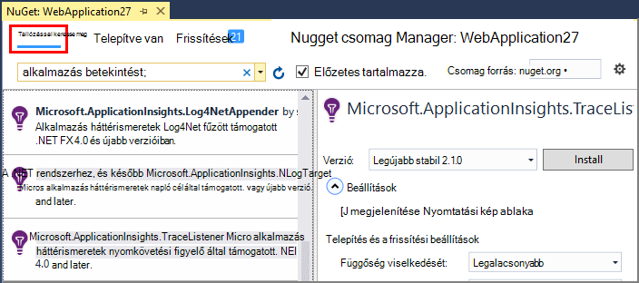
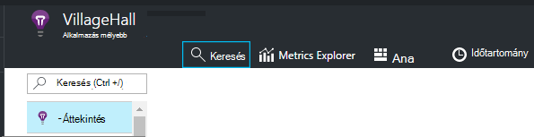
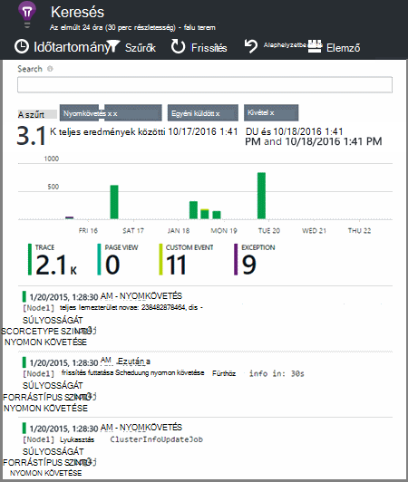

<properties 
    pageTitle="Ismerje meg az alkalmazást az összefüggéseket a .NET nyomkövetési naplók" 
    description="Keresés a nyomkövetési, NLog és Log4Net létrehozott naplók." 
    services="application-insights" 
    documentationCenter=".net"
    authors="alancameronwills" 
    manager="douge"/>

<tags 
    ms.service="application-insights" 
    ms.workload="tbd" 
    ms.tgt_pltfrm="ibiza" 
    ms.devlang="na" 
    ms.topic="article" 
    ms.date="07/21/2016" 
    ms.author="awills"/>
 
# <a name="explore-net-trace-logs-in-application-insights"></a>Ismerje meg az alkalmazást az összefüggéseket a .NET nyomkövetési naplók  

Ha NLog, log4Net vagy System.Diagnostics.Trace a diagnosztikai nyomkövetési az ASP.NET alkalmazásban a [Visual Studio alkalmazás]mélyebb küldött naplók lehet[start], ahol feltárása és keresni. A naplók hozzáfűzi a alkalmazásból lesz, hogy a társított egyes felhasználói kérelem karbantartási halad azonosítása és más események és a kivétel jelentések összehangolására őket az egyéb telemetriai.


> [AZURE.NOTE] Szükség van a napló rögzítési modul? Egy külső 3rd naplózó programok hasznos adaptert, de ha NLog, log4Net vagy System.Diagnostics.Trace már nem használ, vegye figyelembe, csak közvetlenül az [Alkalmazás az összefüggéseket TrackTrace()](app-insights-api-custom-events-metrics.md#track-trace) hívásához.


## <a name="install-logging-on-your-app"></a>Bejelentkezés az alkalmazás telepítése

A kiválasztott naplózás telepíteni a projektben. Ennek eredménye app.config vagy web.config valamelyik bejegyzésével.

Ha System.Diagnostics.Trace használata esetén kell web.config bejegyzés hozzáadása:

```XML

    <configuration>
     <system.diagnostics>
       <trace autoflush="false" indentsize="4">
         <listeners>
           <add name="myListener" 
             type="System.Diagnostics.TextWriterTraceListener" 
             initializeData="TextWriterOutput.log" />
           <remove name="Default" />
         </listeners>
       </trace>
     </system.diagnostics>
   </configuration>
```

## <a name="configure-application-insights-to-collect-logs"></a>Állítsa be az alkalmazás az összefüggéseket a naplógyűjtés

Az **[Alkalmazás az összefüggéseket hozzáadása a projekthez](app-insights-asp-net.md)** , ha még nem meg, amely még. Megjelenik egy lehetőséget a log adatgyűjtő felvenni.

Vagy **Állítsa be az alkalmazás összefüggéseket** kattintson a jobb gombbal a projekt a megoldást Intézőben. Válassza a **Configure nyomkövetési**gyűjteménybe lehetőséget.

*Nincs alkalmazás háttérismeretek menü vagy a napló adatgyűjtő beállítást?* [Hibaelhárítás.](#troubleshooting)


## <a name="manual-installation"></a>Manuális telepítés

Használja ezt a módszert, ha a projekt típusa az alkalmazás az összefüggéseket installer (például a Windows asztali projekt) által nem támogatott. 

1. Ha log4Net vagy NLog szeretne használni, akkor telepítse újra a projektben. 
2. A megoldás Intézőben kattintson a jobb gombbal a projekt, és válassza a **NuGet csomagok kezelése**.
3. "Alkalmazás háttérismeretek" keresése

    

4. Jelölje ki a megfelelő csomag - egyikét:
  + Microsoft.ApplicationInsights.TraceListener (System.Diagnostics.Trace hívások rögzítéséhez)
  + Microsoft.ApplicationInsights.NLogTarget
  + Microsoft.ApplicationInsights.Log4NetAppender

A NuGet csomag telepíti a szükséges szerelvények, és is módosítja a web.config vagy app.config.

## <a name="insert-diagnostic-log-calls"></a>Diagnosztikai naplókban hívások beszúrása

System.Diagnostics.Trace használ, akkor tipikus hívást:

    System.Diagnostics.Trace.TraceWarning("Slow response - database01");

Ha jobban szereti a log4net és NLog:

    logger.Warn("Slow response - database01");


## <a name="using-the-trace-api-directly"></a>A követés API közvetlenül használatával

Az alkalmazás az összefüggéseket nyomkövetési API közvetlenül is felhívhatja. A naplózás kártyák a API-t használja. 

Példa:

    var telemetry = new Microsoft.ApplicationInsights.TelemetryClient();
    telemetry.TrackTrace("Slow response - database01");

TrackTrace az egyik előnye, hogy írható viszonylag hosszú adatok az üzenetet. Például sikerült kódolását van a bejegyzés adatok számára. 

Ezeken kívül szinttel is adhat meg az üzenetet. És más telemetriai, például vegyen fel tulajdonságértékeket segíti a szűrés vagy Keresés a nyomkövetési naplók különböző csoportjaihoz használható. Példa:


    var telemetry = new Microsoft.ApplicationInsights.TelemetryClient();
    telemetry.TrackTrace("Slow database response",
                   SeverityLevel.Warning,
                   new Dictionary<string,string> { {"database", db.ID} });

Ez esetben lehetővé teszi, [Keresés][diagnostic], egyszerűen kiszűrésére egy adott adatbázis kapcsolatos adott szinttel azokat az üzeneteket.

## <a name="explore-your-logs"></a>A naplók feltárása

Futtassa az alkalmazást, vagy hibakeresési módban, vagy élő üzembe.

Az alkalmazás áttekintése lap az [alkalmazás az összefüggéseket portálon]a[portal], válassza a [Keresés][diagnostic].





Akkor is, például:

* Log halad, vagy meghatározott tulajdonságok elemek szűrése
* Nézze meg az adott elem részletesen.
* Keresse meg a másik felhasználó kérésben kapcsolatos telemetriai (Ez azt jelenti, hogy az azonos OperationId együtt) 
* Ezen az oldalon konfigurációjának mentése a Kedvencek közül

> [AZURE.NOTE] **Mintavételnél.** Ha az alkalmazás küld az adatokat, és használja az alkalmazás az összefüggéseket SDK ASP.NET verzió 2.0.0-beta3 vagy újabb, a adaptív mintavételnél funkció működjön és küldése csak a telemetriai százalékában. [További tudnivalók a mintavételnél.](app-insights-sampling.md)

## <a name="next-steps"></a>Következő lépések

[Hibák és a kivételek ASP.NET diagnosztizálása][exceptions]

[További tudnivalók a keresési][diagnostic].


## <a name="troubleshooting"></a>Hibaelhárítás

### <a name="how-do-i-do-this-for-java"></a>Hogyan teendő ez Java?

A [Java napló adaptereken](app-insights-java-trace-logs.md)használja.

### <a name="theres-no-application-insights-option-on-the-project-context-menu"></a>Nincs alkalmazás háttérismeretek lehetőség a project helyi menüjében

* Jelölje be az alkalmazás háttérismeretek eszközök fejlesztési van telepítve. Visual Studio menü eszközök, bővítmények és frissítések keresse meg az alkalmazást az összefüggéseket használatához. Ha a telepített lapon nem, nyissa meg az Online lapon, és telepítse azt.
* Lehet, hogy a project alkalmazás háttérismeretek eszközök által nem támogatott típusú. [Manuális telepítés](#manual-installation)használja.

### <a name="no-log-adapter-option-in-the-configuration-tool"></a>Nincs napló kártya lehetőséget a konfigurációs eszközben

* A naplózás keretrendszer először telepítéséhez szükséges.
* Ha System.Diagnostics.Trace használ, győződjön meg arról, hogy [úgy állította be, a `web.config` ](https://msdn.microsoft.com/library/system.diagnostics.eventlogtracelistener.aspx).
* Van az alkalmazás háttérismeretek eszközök legújabb verzióját használja? Visual Studio **eszközök** menüben válassza a **bővítmények és frissítések**, és nyissa meg a **frissítések** fülre. Ha alkalmazás háttérismeretek eszközök, kattintson a frissítéséhez.


### <a name="emptykey"></a>Hibaüzenet "műszerezettségi kulcs nem lehet üres"

Tűnik telepítve naplózás kártya Nuget háttérismeretek alkalmazás telepítése nélkül.

A megoldás Intézőben kattintson a jobb gombbal `ApplicationInsights.config` , és válassza a **Frissítés alkalmazása az összefüggéseket**. Szerezze be a párbeszédpanelt, amely felajánlja a jelentkezzen be az Azure, és hozza létre az alkalmazás az összefüggéseket erőforrás, vagy újra felhasználhat egy meglévőt. Ez célszerű oldja meg.

### <a name="i-can-see-traces-in-diagnostic-search-but-not-the-other-events"></a>A diagnosztikai keresési, de nem a más események halad ugyanitt láthatók

Előfordul, hogy eltarthat egy ideig, az események és kérelmek a folyamat olvas be.

### <a name="limits"></a>Mennyi adatok megőrződnek?

Legfeljebb 500 események másodpercenként minden alkalmazásból. Események hét napig megőrződnek.

### <a name="im-not-seeing-some-of-the-log-entries-that-i-expect"></a>Nem látható a naplóbejegyzések, amelyet mellőzni szeretne egy része

Ha az alkalmazás küld az adatokat, és használja az alkalmazás az összefüggéseket SDK ASP.NET verzió 2.0.0-beta3 vagy újabb, a adaptív mintavételnél funkció működjön és küldése csak a telemetriai százalékában. [További tudnivalók a mintavételnél.](app-insights-sampling.md)

## <a name="add"></a>Következő lépések

* [Elérhetőség és válaszidő vizsgálatok beállítása][availability]
* [Hibaelhárítás][qna]


<!--Link references-->

[availability]: app-insights-monitor-web-app-availability.md
[diagnostic]: app-insights-diagnostic-search.md
[exceptions]: app-insights-asp-net-exceptions.md
[portal]: https://portal.azure.com/
[qna]: app-insights-troubleshoot-faq.md
[start]: app-insights-overview.md

 
