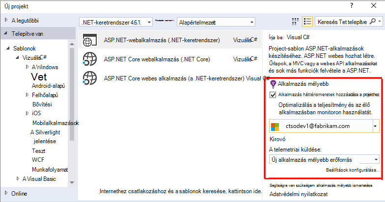
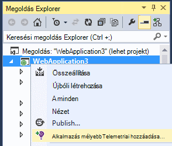
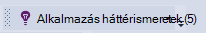
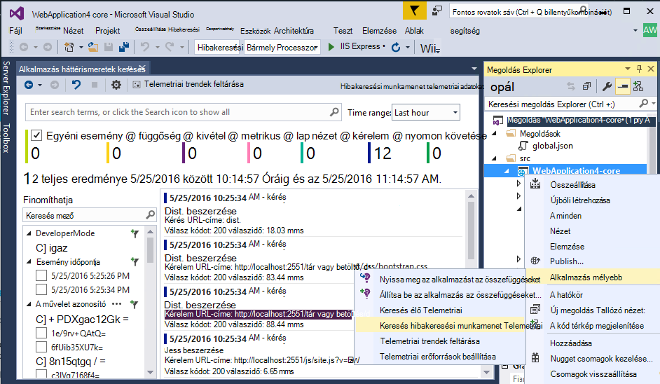
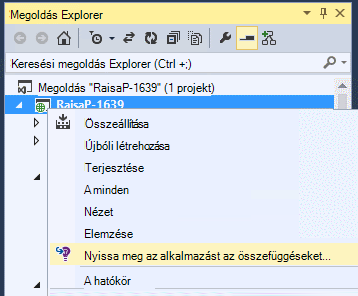
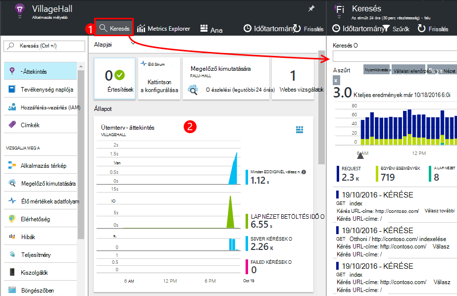
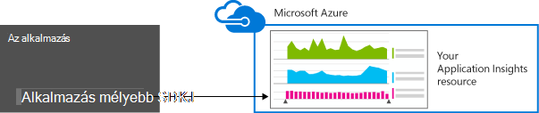
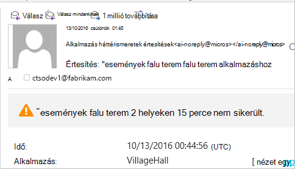
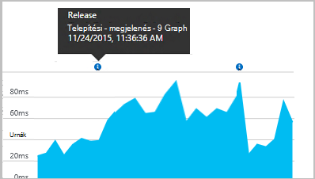
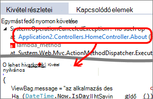

<properties 
    pageTitle="ASP.NET alkalmazás az összefüggéseket a web analytics-alkalmazás beállítása |} Microsoft Azure" 
    description="Állítsa be a teljesítményt, elérhetőségét, és a ASP.NET webhely használati elemzésének helyszíni üzemeltetett vagy Azure-ban." 
    services="application-insights" 
    documentationCenter=".net"
    authors="NumberByColors" 
    manager="douge"/>

<tags 
    ms.service="application-insights" 
    ms.workload="tbd" 
    ms.tgt_pltfrm="ibiza" 
    ms.devlang="na" 
    ms.topic="get-started-article" 
    ms.date="10/13/2016" 
    ms.author="awills"/>


# <a name="set-up-application-insights-for-aspnet"></a>ASP.NET-alkalmazás háttérismeretek beállítása

[Visual Studio alkalmazás háttérismeretek](app-insights-overview.md) az élő alkalmazás segít [észleli és teljesítménnyel kapcsolatos problémák és a kivételek diagnosztizálása](app-insights-detect-triage-diagnose.md), és [megtudhatja, hogyan használható az alkalmazás](app-insights-overview-usage.md)figyelése  Működik-alkalmazások tárolt saját helyszíni IIS-kiszolgálókat vagy a felhőben VMs, valamint az Azure web Apps alkalmazások.


## <a name="before-you-start"></a>Előzetes teendők

szükséged van:

* Visual Studio 2013 frissítés 3 és újabb verziók. Később célszerűbb.
* [Microsoft Azure](http://azure.com)-előfizetést. A csoportwebhelyen vagy a szervezete rendelkezik egy Azure-előfizetésbe lehetőséget, ha a tulajdonos is fel kell vennie Önt, a [Microsoft-fiókjával](http://live.com). 

Nincsenek alternatív cikkek is megtekintheti a érdekli, ha:

* [Egy webalkalmazás leírására futásidőben](app-insights-monitor-performance-live-website-now.md)
* [Azure Cloud services](app-insights-cloudservices.md)

## <a name="ide"></a>1. a alkalmazás háttérismeretek SDK hozzáadása


### <a name="if-its-a-new-project"></a>Ha az új projekt...

Ellenőrizze, hogy az alkalmazás az összefüggéseket be van jelölve a Visual Studio alkalmazásban új projektet hoz létre. 





### <a name="-or-if-its-an-existing-project"></a>..., vagy ha egy meglévő projektből

Kattintson a jobb gombbal a projekt a megoldást Intézőben, és válassza a **Alkalmazás háttérismeretek Telemetriai hozzáadása** vagy **Beállítása alkalmazás az összefüggéseket**.



* ASP.NET Core projektet? - [Kövesse az alábbi néhány kódsorokat javítás utasításokat](https://github.com/Microsoft/ApplicationInsights-aspnetcore/wiki/Getting-Started#add-application-insights-instrumentation-code-to-startupcs). 


## <a name="run"></a>2. a alkalmazás futtatása

Futtassa az alkalmazást az F5 billentyűt, és próbálja ki: Nyissa meg a különböző lapokon néhány telemetriai létrehozásához.

A Visual Studióban lásd: a naplózott események száma. 



## <a name="3-see-your-telemetry"></a>3. a telemetriai látható...

### <a name="-in-visual-studio"></a>a Visual Studióban...

Nyissa meg az alkalmazás mélyebb ablakban a Visual Studio: kattintson az alkalmazás mélyebb gombra, vagy kattintson a jobb gombbal a megoldást Intézőben a projekthez:



Ebben a nézetben látható az alkalmazás kiszolgáló oldalán létrehozott telemetriai. Kísérletezés a szűrőket a, majd kattintson a részletek megtekintéséhez bármelyik eseményre.

[További tudnivalók a Visual Studio alkalmazás háttérismeretek eszközöket](app-insights-visual-studio.md).

<a name="monitor"></a> 
### <a name="-in-the-portal"></a>az portálon...

Kivéve, ha úgy döntött, hogy *Csak a telepítés SDK* az telemetriai a webes alkalmazás Hírcsatornájában portál is megtekintheti. 

A portál több diagramok, analitikus eszközök és irányítópultok, mint a Visual Studio rendelkezik. 


Nyissa meg az alkalmazást az összefüggéseket erőforrás az [Azure-portálon](https://portal.azure.com/).



A telemetriai az alkalmazás nézetének megnyílik a portálon:

* Az első telemetriai [élő mértékek adatfolyam](app-insights-metrics-explorer.md#live-metrics-stream)jelenik meg.
* Egyéni események jelennek meg a **Keresés** (1). Adatok jelennek meg néhány percig is eltarthat. Kattintson bármelyik eseményre tulajdonságainak megjelenítéséhez. 
* A diagramok (2) összesített mértékek jelennek meg. Eltarthat néhány percig is az adatok itt jelennek meg. Kattintson az egyes diagramokra kattintva nyissa meg a lap részletesen.

[További tudnivalók a alkalmazás háttérismeretek az Azure-portálon](app-insights-dashboards.md).

## <a name="4-publish-your-app"></a>4. a alkalmazás közzététele

Tegye közzé az alkalmazást, az IIS-kiszolgáló vagy Azure. Megtekintés az [élő mértékek adatfolyam](app-insights-metrics-explorer.md#live-metrics-stream) , hogy minden zökkenőmentesen működik.

A telemetriai, az alkalmazás mélyebb portálon, ahol figyelheti a mértékek, kereshet a telemetriai és [irányítópultok](app-insights-dashboards.md)beállítása kiépítése talál. Akkor is használhatja a hatékony [Analytics lekérdezési nyelv](app-insights-analytics.md) használatát és a teljesítmény elemzése vagy adott események keresése. 

A telemetriai a [Visual Studióban](app-insights-visual-studio.md) az eszközöket, például a diagnosztikai szöveg.keres és a [trendek](app-insights-visual-studio-trends.md)elemzése is továbbra is.

> [AZURE.NOTE] Ha az alkalmazás elég telemetriai fordulnia [korlátai szabályozásának](app-insights-pricing.md#limits-summary)küld, automatikus [mintavételnél](app-insights-sampling.md) kapcsolókat. Mintavételnél csökkenti az alkalmazás, megőrzése mellett korrelációs adatok diagnosztikai célokra küldött telemetriai mennyiségét.


##<a name="land"></a>Mit jelent hozzáadása alkalmazás összefüggéseket?

Alkalmazás háttérismeretek az alkalmazás telemetriai küld az alkalmazás az összefüggéseket portal (amely a Microsoft Azure üzemelteti):



Ezt a parancsot did háromféleképpen tehet:

1. Az alkalmazás az összefüggéseket webes SDK NuGet csomag hozzáadása a projekthez. A Visual Studióban, akkor kattintson a jobb gombbal a projekt, és válassza a NuGet csomagok kezelése.
2. Hozzon létre egy alkalmazás mélyebb erőforrás az [Azure-portálon](https://portal.azure.com/). Ez a, ahol megjelenik az adatok. Azt veszi a *műszerezettségi kulcsot,* amely azonosítja az erőforrás.
3. Szúrja be a műszerezettségi kulcsot a `ApplicationInsights.config`, hogy a SDK telemetriai a portálon küldhet.

Tetszés szerint végezheti el ezeket a lépéseket manuálisan [ASP.NET-4-es](app-insights-windows-services.md) vagy [ASP.NET Core](https://github.com/Microsoft/ApplicationInsights-aspnetcore/wiki/Getting-Started).

### <a name="to-upgrade-to-future-sdk-versions"></a>A későbbi SDK verzióinak frissítése

Egy [új kiadását az SDK](https://github.com/Microsoft/ApplicationInsights-dotnet-server/releases)frissítéséhez nyissa meg újra NuGet csomag manager és a telepített csomagok szűrő. Jelölje ki a Microsoft.ApplicationInsights.Web, és válassza a frissítés lehetőséget.

Végrehajtott testreszabások ApplicationInsights.config, ha egy példányának mentése, mielőtt frissítése, és ezt követően a módosítások egyesítése az új verzió.

## <a name="add-more-telemetry"></a>További telemetriai hozzáadása

### <a name="web-pages-and-single-page-apps"></a>Weblapok és az egyoldalas elrendezésű oldalakat alkalmazások

1. [A JavaScript kódtöredékének hozzáadása](app-insights-javascript.md) a weblapokhoz a felhasználó és a munkamenet megszámolja az adatok lap nézetek, betöltést, böngésző kivételeket, AJAX-hívás teljesítményét, böngészőben és a használatát rögzítéséhez bekapcsolható.
2. [Kód egyéni események](app-insights-api-custom-events-metrics.md) száma, időt vagy mérték felhasználói műveletek.

### <a name="dependencies-exceptions-and-performance-counters"></a>Függőségek, a kivételek és a teljesítmény számláló

[Állapot Monitor telepítése](app-insights-monitor-performance-live-website-now.md) a kiszolgáló géphez, minden egyes további telemetriai tudni az alkalmazás első. Ez az Ön első:

* [Teljesítményét számláló](app-insights-performance-counters.md) - 
Processzor, a memóriahasználat, a lemez és a többi teljesítményét számláló kapcsolatos az alkalmazás. 
* A [Kivételek](app-insights-asp-net-exceptions.md) – az egyes kivételek részletesebb telemetriai.
* [Függőségek](app-insights-asp-net-dependencies.md) - hívások REST API- vagy SQL-szolgáltatásokhoz. Megtudhatja, hogy külső összetevők lassú válaszok bármelyike okoz teljesítménnyel kapcsolatos problémák az alkalmazást. (Ha az alkalmazás .NET 4.6 fut, erre nincs szükség a telemetriai megszerezni állapot Monitor.)

### <a name="diagnostic-code"></a>Diagnosztikai kódot.

Probléma van? Kód beszúrása az alkalmazás segítségével diagnosztizálása azt szeretné, ha több lehetőség közül választhat:

* [Rögzítés napló halad](app-insights-asp-net-trace-logs.md): már használata Log4N, NLog vagy System.Diagnostics.Trace naplózni nyomkövetési eseményeket, majd a kimenet elküldésének alkalmazás mélyebb, hogy kéréseivel összehangolására, keresni ezt az és elemzés. 
* [Egyéni események és mérőszámok](app-insights-api-custom-events-metrics.md): használata TrackEvent() és TrackMetric() server vagy a webes kódját.
* [Címke telemetriai további tulajdonságok](app-insights-api-filtering-sampling.md#add-properties)

Megkeresése és összehangolására adott események és [Analytics](app-insights-analytics.md) hatékonyabb lekérdezések végrehajtásához használja a [keresőt](app-insights-diagnostic-search.md) .

## <a name="alerts"></a>Értesítések

Ha az alkalmazás hibát talál, hogy először is. (Nem várja meg, amíg a felhasználók mondani,!) 

* [Létrehozás webes vizsgálatok](app-insights-monitor-web-app-availability.md) és a webhely nem látható a weben.
* [Megelőző diagnosztika](app-insights-proactive-diagnostics.md) automatikusan (ha az alkalmazás rendelkezik egy bizonyos minimális forgalom). Nem kell tennie semmit sem szerint teheti meg. Azokat meg, ha az alkalmazás tartalmaz egy sikertelen kérelmek szokatlan mértéke.
* [Metrikus tájékoztató értesítések beállítása](app-insights-alerts.md) arra figyelmeztet, ha egy mérőszám metszéspontja küszöbértéket. Beállíthatja, hogy azok egyéni mérési módja miatt, kódot az alkalmazásba.

Alapértelmezés szerint az Azure előfizetés tulajdonosa értesítések fogadására. 



## <a name="version-and-release-tracking"></a>Verziószám és a kiadási nyomon követése

### <a name="track-application-version"></a>Változáskövetési alkalmazás verziója

Győződjön meg arról, hogy `buildinfo.config` a MSBuild folyamat jön létre. A .csproj fájl hozzáadása:  

```XML

    <PropertyGroup>
      <GenerateBuildInfoConfigFile>true</GenerateBuildInfoConfigFile>    <IncludeServerNameInBuildInfo>true</IncludeServerNameInBuildInfo>
    </PropertyGroup> 
```

Az összeállítás információ rendelkezik, az alkalmazás az összefüggéseket webes modul automatikusan hozzáadja **alkalmazás verziója** tulajdonság telemetriai, minden elemre. Amely lehetővé teszi, ha úgy szeretné szűrni verzió [diagnosztikai keresés](app-insights-diagnostic-search.md) végrehajtása során, vagy ha [Mértékek felfedezése](app-insights-metrics-explorer.md). 

Azonban figyelje meg, hogy a build verziószám csak által generált MS Build, nem a Visual Studióban Fejlesztőeszközök összeállítása.

### <a name="release-annotations"></a>Engedje fel az széljegyzetek

Visual Studio csapat szolgáltatást használ, akkor is, [egy jegyzetet jelölő első](app-insights-annotations.md) hozzáadni a diagramok, amikor felengedi az új verzió.




## <a name="next-steps"></a>Következő lépések

| | 
|---|---
|**[A Visual Studio alkalmazás háttérismeretek használata](app-insights-visual-studio.md)**<br/>A diagnosztikai telemetriai hibakeresési szeretne keresni, feltárása keresztül kódot.|
|**[Az alkalmazás az összefüggéseket portál használata](app-insights-dashboards.md)**<br/>Az irányítópultok, sokoldalú analitikus és a diagnosztikai eszközök, értesítések, az alkalmazás és a telemetriai élő függőség térkép exportálhatja. |
|**[További adatok hozzáadása](app-insights-asp-net-more.md)**<br/>Lync-használatát, elérhetőségét, függőségek, a kivételek. Integráció a naplózás keretek nyomkövetések. Egyéni telemetriai írni. | 


