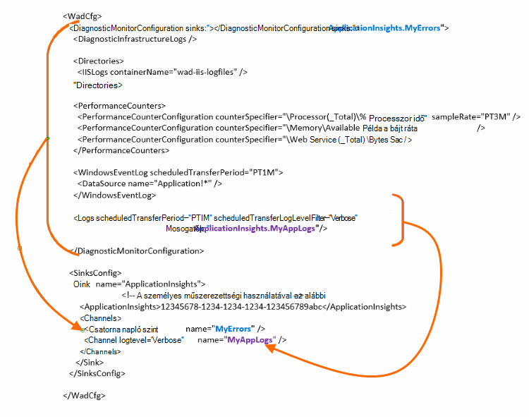

<properties
    pageTitle="Alkalmazás mélyebb Azure diagnosztikai naplók küldése"
    description="Állítsa be az Azure Cloud Services diagnosztikai naplók, az alkalmazás az összefüggéseket portálra küldött részleteit."
    services="application-insights"
    documentationCenter=".net"
    authors="sbtron"
    manager="douge"/>

<tags
    ms.service="application-insights"
    ms.workload="tbd"
    ms.tgt_pltfrm="ibiza"
    ms.devlang="na"
    ms.topic="article"
    ms.date="11/17/2015"
    ms.author="awills"/>

# <a name="configure-azure-diagnostic-logging-to-application-insights"></a>Alkalmazás mélyebb Azure diagnosztikai naplózás

Miután beállította a Cloud Services project vagy a Microsoft Azure [Azure a diagnosztikai naplókban hozhat létre](../vs-azure-tools-diagnostics-for-cloud-services-and-virtual-machines.md)virtuális géphez. A küldött alkalmazás mélyebb, hogy együtt a diagnosztikai és használati telemetriai az alkalmazásból az alkalmazás az összefüggéseket SDK által küldött elemezni is. Az Azure napló eseményeket tartalmazza az alkalmazást, például az útmutató, leállítása, összeomlik, valamint teljesítmény számláló kezelésében. A napló is hívások System.Diagnostics.Trace szeretné az alkalmazásban.

Ez a cikk ismerteti a diagnosztikai rögzítése részletesen konfigurációs.

Azure SDK 2,8 a Visual Studióban telepítve van szüksége.

## <a name="get-an-application-insights-resource"></a>Get-alkalmazás mélyebb erőforrás

A legjobb élmény, [az alkalmazás mélyebb SDK szerepkörön a Cloud Services alkalmazás hozzáadása](app-insights-cloudservices.md)vagy [bármilyen alkalmazásba a virtuális meg fog futni](app-insights-overview.md). Is elküldheti a diagnosztikai adatok elemzendő, és megjelenik az alkalmazás mélyebb ugyanaz az erőforrás.

Azt is megteheti Ha nem szeretné használni a SDK – például ha az alkalmazás már élő - azt is megteheti csak [Hozzon létre egy új alkalmazás háttérismeretek erőforrást](app-insights-create-new-resource.md) az Azure-portálon. Válassza az **Azure diagnosztika** alkalmazás típust.


## <a name="send-azure-diagnostics-to-application-insights"></a>Azure diagnosztika küldése alkalmazás mélyebb

Ha az alkalmazás projekt frissíthetők, a Visual Studióban válasszon minden szerepkör, válassza a tulajdonságok, majd a beállítás lapon jelölje be a **diagnosztika alkalmazás mélyebb küldése**.

Ha az alkalmazás már élő, használatával Visual Studio Server Explorer vagy Cloud Services explorer nyissa meg az alkalmazás tulajdonságait. Jelölje be az **alkalmazás mélyebb diagnosztika küldése**.

Minden esetben meg kell adnia a létrehozott alkalmazás háttérismeretek erőforrás információkat.

[További tudnivalók a alkalmazás az összefüggéseket a Cloud Services alkalmazás beállítása](app-insights-cloudservices.md).

## <a name="configuring-the-azure-diagnostics-adapter"></a>Az Azure diagnosztika adaptert konfigurálása

A csak olvasható meg szeretné-e a napló alkalmazás mélyebb elküldendő részeinek kijelölése. Alapértelmezés szerint minden küldi el, például: Microsoft Azure-események; teljesítményét számláló; a System.Diagnostics.Trace nyomkövetési hívja fel az alkalmazást.

Azure diagnosztika Azure tároló táblák adatait tárolja. Azonban is megtekintheti az összes függőleges vonás vagy alkalmazás mélyebb az adatok részhalmazát konfigurálásával "Mosogatók" és "csatornák" a konfigurációban Azure diagnosztika kiterjesztés 1.5-ös vagy újabb verzió használata esetén.

### <a name="configure-application-insights-as-a-sink"></a>Állítsa be a gyűjtő alkalmazás mélyebb

A szerepkör tulajdonságainak beállítása a "Küldés adatok mélyebb alkalmazás" használatakor az Azure SDK (2,8 vagy újabb) ad egy `<SinksConfig>` a szerepkör a nyilvános [Azure diagnosztika konfigurációs fájl](https://msdn.microsoft.com/library/azure/dn782207.aspx) elemet.

`<SinksConfig>`határozza meg a további gyűjtő, ahol az Azure diagnosztikai adatok elküldésének.  Példa `SinksConfig` néz ki:

```xml

    <SinksConfig>
     <Sink name="ApplicationInsights">
      <ApplicationInsights>{Insert InstrumentationKey}</ApplicationInsights>
      <Channels>
        <Channel logLevel="Error" name="MyTopDiagData"  />
        <Channel logLevel="Verbose" name="MyLogData"  />
      </Channels>
     </Sink>
    </SinksConfig>

```

A `ApplicationInsights` elem megadja a műszerezettségi kulcsot, amely azonosítja az alkalmazás az összefüggéseket erőforrás az Azure diagnosztika adatokat küldi. Ha bejelöli az erőforrás, akkor automatikusan kitölti a rendszer alapján a `APPINSIGHTS_INSTRUMENTATIONKEY` szolgáltatás konfigurációját. (Ha beállítása manuálisan szeretné, letölthető a billentyűt az erőforrás Essentials legördülő.)

`Channels`Adja meg a gyűjtő küld adatokat. A csatorna úgy működik, mint egy szűrőt. A `loglevel` attribútum, amely a csatorna küld a naplózási szintjének megadását teszi lehetővé. A rendelkezésre álló értékei a következők: `{Verbose, Information, Warning, Error, Critical}`.

### <a name="send-data-to-the-sink"></a>Adatok küldése a gyűjtő

Küldje el az alkalmazás mélyebb adatok gyűjtése a DiagnosticMonitorConfiguration csomópont alatt a mosdók attribútum hozzáadásával. A mosdók elem felvétele az egyes csomópontra Itt adhatja meg a csomópontra, és szeretné megkapni, a megadott gyűjtő bármely csomópontját gyűjtött adatokat.

Ha például az Azure SDK által létrehozott alapértelmezés szerint minden Azure diagnosztikai adatok küldése:

```xml

    <DiagnosticMonitorConfiguration overallQuotaInMB="4096" sinks="ApplicationInsights">
```

De ha csak a hibanaplók elküldeni kívánt minősítése a gyűjtő neve a csatorna nevét:

```xml

    <DiagnosticMonitorConfiguration overallQuotaInMB="4096" sinks="ApplicationInsights.MyTopDiagdata">
```

Figyelje meg, hogy programmal mutatjuk be a nevét a gyűjtő definiált, együtt feletti definiált csatorna nevét.

Ha részletes alkalmazás naplók küldése alkalmazás mélyebb csak megy végbe, majd a mosdók attribútum vegyen fel a `Logs` csomópontot.

```xml

    <Logs scheduledTransferPeriod="PT1M" scheduledTransferLogLevelFilter="Verbose" sinks="ApplicationInsights.MyLogData"/>
```

Több mosdók a konfigurációban a hierarchia különféle szintű is tartalmazhatnak. Ebben az esetben a hierarchia legfelső szintjén megadott gyűjtő működik-e a globális és az egyik, például egy adott globális beállítás be az adott elem elem jogszabályok megadott.

Az alábbiakban a nyilvános konfigurációs fájl, amely az összes hibát küld az alkalmazás az összefüggéseket a kész példa (a megadott a `DiagnosticMonitorConfiguration` csomópont) és az alkalmazás naplók naplózza ezeken részletes szint (a megadott a `Logs` csomópont).

```xml

    <WadCfg>
     <DiagnosticMonitorConfiguration overallQuotaInMB="4096"
       sinks="ApplicationInsights.MyTopDiagData"> <!-- All info below sent to this channel -->
      <DiagnosticInfrastructureLogs />
      <PerformanceCounters>
        <PerformanceCounterConfiguration counterSpecifier="\Processor(_Total)\% Processor Time" sampleRate="PT3M" sinks="ApplicationInsights.MyLogData/>
        <PerformanceCounterConfiguration counterSpecifier="\Memory\Available MBytes" sampleRate="PT3M" />
        <PerformanceCounterConfiguration counterSpecifier="\Web Service(_Total)\Bytes Total/Sec" sampleRate="PT3M" />
      </PerformanceCounters>
      <WindowsEventLog scheduledTransferPeriod="PT1M">
        <DataSource name="Application!*" />
      </WindowsEventLog>
      <Logs scheduledTransferPeriod="PT1M" scheduledTransferLogLevelFilter="Verbose"
            sinks="ApplicationInsights.MyLogData"/>
       <!-- This specific info sent to this channel -->
     </DiagnosticMonitorConfiguration>

     <SinksConfig>
      <Sink name="ApplicationInsights">
        <ApplicationInsights>{Insert InstrumentationKey}</ApplicationInsights>
        <Channels>
          <Channel logLevel="Error" name="MyTopDiagData"  />
          <Channel logLevel="Verbose" name="MyLogData"  />
        </Channels>
      </Sink>
     </SinksConfig>
    </WadCfg>
```



Ezekkel a funkciókkal tudatában kell lennie bizonyos korlátozások érvényesek:

* Csatornák csak naplófájl típusa és nem a teljesítmény számláló van kialakítva. Ha egy adott csatornába adja meg a teljesítmény számláló elem figyelmen kívül.
* A naplózási szintjének csatornára nem haladhatja meg a mi Azure diagnosztika gyűjtött a naplózási szintjének. Példa: nem naplók eleme hibák alkalmazás naplózása összegyűjtése és részletes kísérel meg az alkalmazás betekintést szinkronizálás naplók. A scheduledTransferLogLevelFilter attribútum mindig összegyűjtése egyenlő vagy küldhet egy gyűjtő próbálja a naplókat-nél több naplók.
* Nem lehet küldeni blob-adatokról Azure diagnosztika bővítmény által gyűjtött alkalmazás az összefüggéseket. Példa bármi megadott csoportban a könyvtárak csomópontot. Az összeomlást kiírása a tényleges összeomlik kiírása is küld blob-tároló, és csak, hogy történt-e az összeomlást kiírása értesítést küld alkalmazás az összefüggéseket.

## <a name="related-topics"></a>Kapcsolódó témakörök

* [Azure Cloud Services alkalmazás az összefüggéseket a figyelése](app-insights-cloudservices.md)
* [Azure diagnosztika küldeni az alkalmazás az összefüggéseket a PowerShell használatával](app-insights-powershell-azure-diagnostics.md)
* [Azure diagnosztika konfigurációs fájl](https://msdn.microsoft.com/library/azure/dn782207.aspx)
