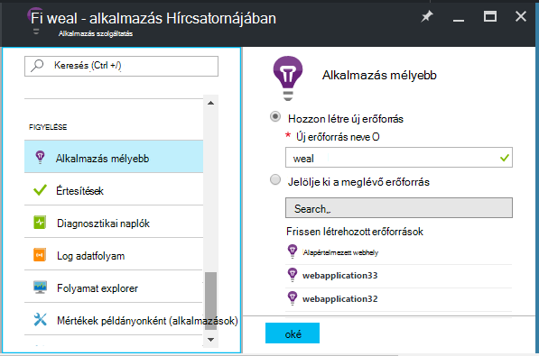
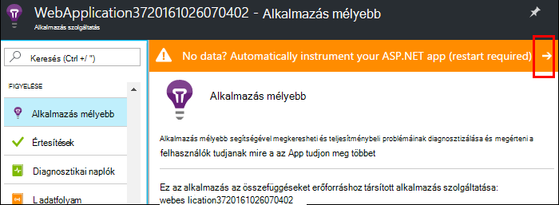
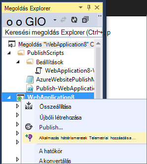
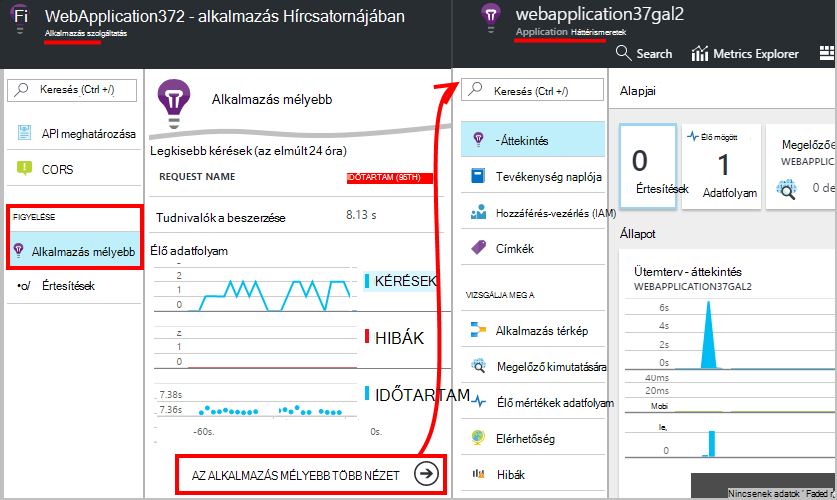
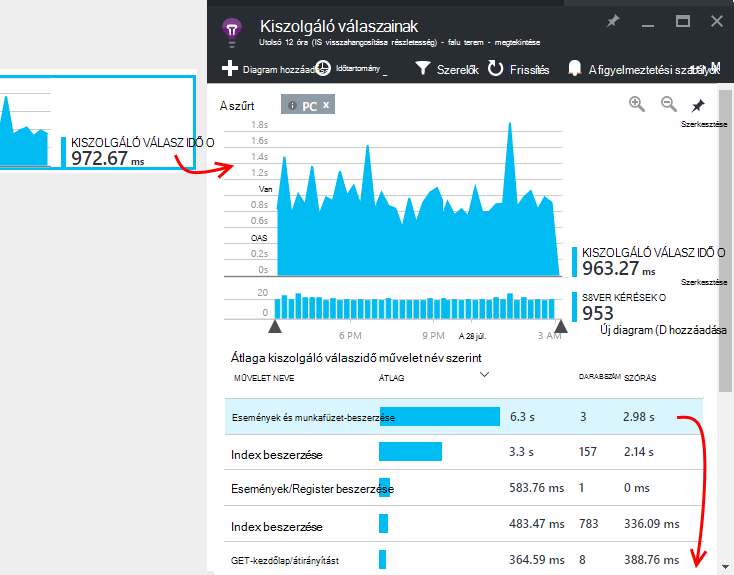
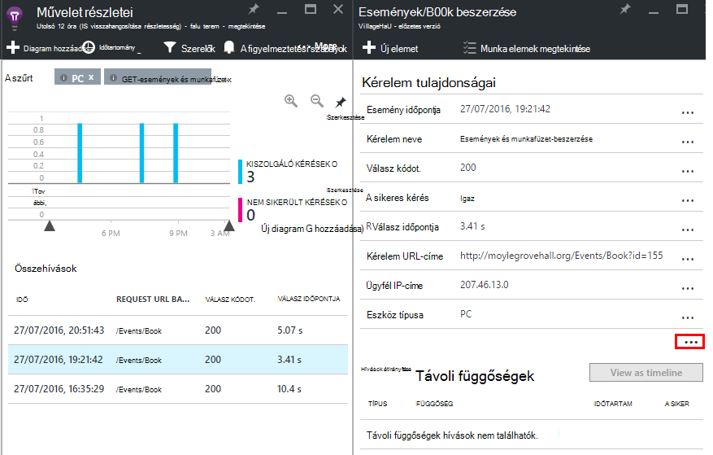

<properties
    pageTitle="Azure web app teljesítmény figyelését |} Microsoft Azure"
    description="Azure web Apps alkalmazások figyelése alkalmazás teljesítményét. Diagram betöltése és a visszajelzések időt, az objektumfüggőségekre vonatkozó információk és e-mail értesítések teljesítményét."
    services="application-insights"
    documentationCenter=".net"
    authors="alancameronwills"
    manager="douge"/>

<tags
    ms.service="azure-portal"
    ms.workload="na"
    ms.tgt_pltfrm="na"
    ms.devlang="na"
    ms.topic="article"
    ms.date="10/24/2016"
    ms.author="awills"/>

# Azure web app teljesítmény figyelését

Az [Azure-portálon](https://portal.azure.com) beállíthatja alkalmazás teljesítményét figyelve az [Azure web Apps alkalmazások](../app-service-web/app-service-web-overview.md). [Visual Studio alkalmazás háttérismeretek](app-insights-overview.md) eszközök a tevékenységekről telemetriai küldeni az alkalmazás az összefüggéseket szolgáltatása, amennyiben tárolt és elemezni az alkalmazást. Itt metrikus diagramok és a keresési eszközök használható problémáinak diagnosztizálása, teljesítményének javítása és mérje fel, hogy a használatát.

## Futási idő vagy a Szerkesztés ideje

Beállíthatja úgy, hogy az alkalmazás két módszer egyikével leírására ellenőrzése:

* **Futási idejű** – választhatja ki a teljesítmény figyelése bővítmény, ha már élő a web App alkalmazásban. Nem szükséges újjáépítése, és telepítse újra az alkalmazást. Kap terjedő csomagok nyomon válaszidő, sikerességéről, kivételeket, függőségek, és így tovább. 
 
* **Idő összeállítása** - csomag telepítheti az alkalmazást egy fejlesztés alatt álló. Ez a beállítás akkor sokoldalúbb. Az azonos szabványos csomagok mellett a telemetriai testreszabása, vagy küldje el saját telemetriai meg is írhat. Adott tevékenység vagy rekord esemény szerint az alkalmazás tartomány szemantikáját naplózható. 

## Futtassa a idő műszerezettségi alkalmazás Hírcsatornájában

Azure-ban már futtat egy web App alkalmazásban, ha már kap néhány figyelése: kérés és hiba. Alkalmazás háttérismeretek többet, például válaszidő hozzáadásához figyelése a hívások átirányítása függőségek, intelligens észlelése, és a hatékony Analytics lekérdezési nyelvet. 

1. **Jelölje be az alkalmazás összefüggéseket** a webalkalmazás az Azure Vezérlőpultján.

    

 * Válassza a hozzon létre egy új erőforrást, kivéve, ha még állította be az alkalmazás az összefüggéseket erőforrás alkalmazással kapcsolatos másik úton.

2. **Eszköz a web app** alkalmazás háttérismeretek telepítése után. 

    

3. **Az alkalmazás figyelése**.  [Az adatok Expore](#explore-the-data).

Később összeállítása és telepítsen újra az alkalmazást, az alkalmazás hírcsatornájában, ha azt szeretné.

*Hogyan távolítsa el az alkalmazást az összefüggéseket, és átválthat másik forráshoz küldése?*

* Azure nyissa meg a web app ellenőrzési lap, és a Fejlesztőeszközök, nyissa meg a **bővítmények**. A háttérismeretek alkalmazás bővítmény törlése. Figyelés, csoportban válassza az alkalmazás az összefüggéseket és hozhat létre, vagy válassza ki a kívánt erőforrást.

## Az alkalmazás az összefüggéseket a alkalmazás összeállítása

Alkalmazás háttérismeretek részletesebb telemetriai biztosíthat egy SDK telepíti az alkalmazásba. Különösen naplógyűjtés nyomkövetési, [egyéni telemetriai írni](../application-insights/app-insights-api-custom-events-metrics.md), és részletesebb kivétel jelentések első.

1. **A Visual Studio** (2013 frissítése 2-es vagy újabb verzió), az alkalmazás az összefüggéseket SDK hozzáadása a projekthez.

    

    Ha megkérdezi, hogy jelentkezzen be, a hitelesítő adatok használata az Azure-fiók.

    A művelet a két effektusokat tartalmazó:

 1. Azure, ahol a telemetriai tárolt, elemezni, és megjelenik az alkalmazás az összefüggéseket erőforrás hoz létre.
 2. Az alkalmazás az összefüggéseket NuGet csomag hozzáadja a kódot, és konfigurálja az Azure erőforrás telemetriai küldhet.

2. **A telemetriai próba** fejlesztési számítógépén (F5) az alkalmazás futtatásával.

3. **Közzététel az alkalmazást** az Azure a szokásos módon. 

*Hogyan válthatok át küldése egy másik alkalmazás háttérismeretek erőforrás?*

* A Visual Studióban, kattintson a jobb gombbal a projektet, válassza a **alkalmazás háttérismeretek > konfigurálása** , és válassza az erőforrás lehetőségre. Hozzon létre egy új erőforrást lehetősége nyílik meg. Újraépítéséhez és telepítsen újra.

## Az adatok feltárása

1. Jelölje ki a a web app Vezérlőpult alkalmazás háttérismeretek lap a látható Live mértékek, amely mutatja az kérések és hibák belül egy második közülük fordul elő. Azt esetén nagyon hasznos megjelenítési, hogy az alkalmazás közzétehető - bármilyen problémát azonnal láthatja.

2. Kattintson a teljes alkalmazás háttérismeretek erőforrásnézethez.

    
    

    Nincs is léphet bármelyik közvetlenül az Azure erőforrás navigációs.

2. Kattintson az egyes diagramokra kattintva részletesebb első keresztül:

    

    Azt is megteheti, hogy [Mértékek pengéit testreszabása](../application-insights/app-insights-metrics-explorer.md).

3. Kattintson a Tovább lásd: az egyes események és tulajdonságaik:

    

    Figyelje meg a (...) kattintva nyissa meg az összes tulajdonság hivatkozás.

    Azt is megteheti, hogy [testreszabása keresésekhez](../application-insights/app-insights-diagnostic-search.md).

Hatékonyabb keresés az telemetriai fölé használja a [Analytics lekérdezési nyelvet](../application-insights/app-insights-analytics-tour.md).

## Következő lépések

* [Azure engedélyezése diagnosztika](app-insights-azure-diagnostics.md) alkalmazás mélyebb küldeni.
* [Monitor szolgáltatás állapota mértékek](../monitoring-and-diagnostics/insights-how-to-customize-monitoring.md) és a szolgáltatás nem érhető el, és válaszol.
* Mértékek vagy [fogadási értesítések](../monitoring-and-diagnostics/insights-receive-alert-notifications.md) működési események fordulhat elő, amikor cross küszöbértéket.
* Úgy juthat az ügyfél telemetriai a kompatibilis böngészők a keresse fel az weblapon [Alkalmazás az összefüggéseket a JavaScript-alkalmazások és a weblapok](app-insights-web-track-usage.md) használata
* Az [Elérhetőség webes tesztek beállítása](app-insights-monitor-web-app-availability.md) értesítést, ha a webhely nem működik.
