<properties
   pageTitle="Az Azure Cloud Services alkalmazás Hírcsatornájában"
   description="A webes és dolgozó szerepkörök hatékony az alkalmazás az összefüggéseket figyelése"
   services="application-insights"
   documentationCenter=""
   authors="soubhagyadash"
   manager="douge"
   editor="alancameronwills"/>

<tags
   ms.service="application-insights"
   ms.devlang="na"
   ms.tgt_pltfrm="ibiza"
   ms.topic="article"
   ms.workload="tbd"
   ms.date="03/02/2016"
   ms.author="sdash"/>

# <a name="application-insights-for-azure-cloud-services"></a>Az Azure Cloud Services alkalmazás Hírcsatornájában


*Alkalmazás háttérismeretek az előzetes verzióban*

[Microsoft Azure felhőalapú szolgáltatás alkalmazások](https://azure.microsoft.com/services/cloud-services/) által [Visual Studio alkalmazás háttérismeretek] figyelhető[ start] elérhetőségét, a teljesítmény, a hibák és a használatát. A visszajelzés, a helyettesítő a teljesítmény és az alkalmazás hatékonyságát kapcsolatos kap az egyes fejlesztési életciklus tájékoztatni választási lehetőségek, a tervezés irányát kapcsolatos teheti ki.

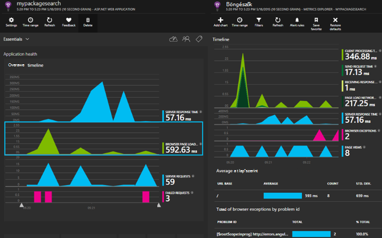

[Microsoft Azure](http://azure.com)-előfizetés kell. Jelentkezzen be Microsoft-fiókkal, amely lehet, hogy a Windows, XBox Live vagy más Microsoft felhőszolgáltatásokhoz. 


#### <a name="sample-application-instrumented-with-application-insights"></a>Az alkalmazás az összefüggéseket rendszereken minta alkalmazás

Nézze meg, amelyben alkalmazás háttérismeretek két dolgozó szerep üzemeltetett Azure-ban felhőszolgáltatásokba hozzáadott [minta alkalmazást](https://github.com/Microsoft/ApplicationInsights-Home/tree/master/Samples/AzureEmailService) . 

Mi a következő ismerheti meg is alkalmassá teheti a saját felhőalapú szolgáltatás project megegyező módon.

## <a name="create-an-application-insights-resource-for-each-role"></a>Hozzon létre egy alkalmazás háttérismeretek erőforrást minden szerepkör

Az alkalmazás az összefüggéseket erőforrás pedig a telemetriai adatokat fog kell elemezni jelenik meg.  

1.  Az [Azure portál][portal], hozzon létre egy új alkalmazás háttérismeretek erőforrást. Az alkalmazás típusa válassza a ASP.NET alkalmazást. 

    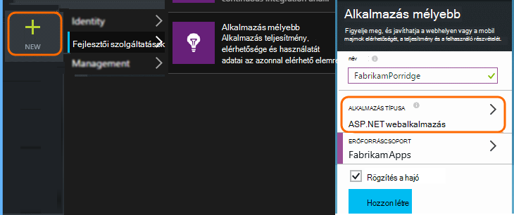

2.  Eltarthat egy példányát a műszerezettségi billentyűt. Ez a SDK konfigurálandó hamarosan szüksége.

    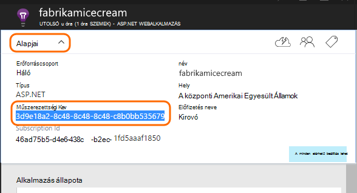


Általában célszerű [Hozzon létre egy külön erőforrást, az adatok minden webes és dolgozó szerepkörből](app-insights-separate-resources.md). 

Alternatívájaként már sikerült adatok küldése a csak egy erőforrás az összes szerepkörből, de [default tulajdonság] beállítása[ apidefaults] , hogy a szűrés vagy a csoport minden szerepkör eredményeit.

## <a name="sdk"></a>Telepítse a SDK csomagjában talál az egyes projektek


1. A Visual Studióban szerkesztheti a cloud app projekt NuGet csomagokat.

    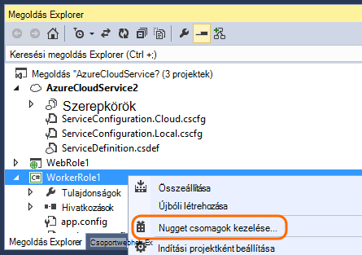


2. Webes szerepkörök adja hozzá a [Webes alkalmazás háttérismeretek](http://www.nuget.org/packages/Microsoft.ApplicationInsights.Web) NuGet csomagot. Ez a verzió SDK veheti fel a kiszolgálói szerepkör például modulokat tartalmazza. Dolgozó szerepkörök használja az [Alkalmazás az összefüggéseket a Windows-kiszolgálók](https://www.nuget.org/packages/Microsoft.ApplicationInsights.WindowsServer/).

    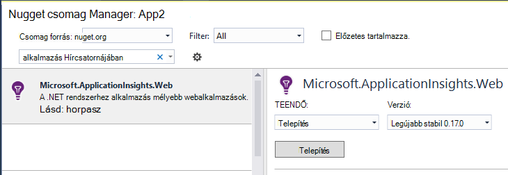


3. Állítsa be az adatokat küldeni az alkalmazás az összefüggéseket erőforrás SDK.

    Műszerezettségi kulcs beállítása a beállítások, a fájlban `ServiceConfiguration.Cloud.cscfg`. ([Példakódot](https://github.com/Microsoft/ApplicationInsights-Home/blob/master/Samples/AzureEmailService/AzureEmailService/ServiceConfiguration.Cloud.cscfg)).
 
    ```XML
     <Role name="WorkerRoleA"> 
      <Setting name="APPINSIGHTS_INSTRUMENTATIONKEY" value="YOUR IKEY" /> 
     </Role>
    ```
 
    A megfelelő indítási függvény a konfigurációs beállításról műszerezettségi kulcs beállítása:

    ```C#
     TelemetryConfiguration.Active.InstrumentationKey = RoleEnvironment.GetConfigurationSettingValue("APPINSIGHTS_INSTRUMENTATIONKEY");
    ```

    Megjegyzés:, ugyanazt a nevet `APPINSIGHTS_INSTRUMENTATIONKEY` a konfiguráció beállítás jelentéskészítés Azure diagnosztika által használt. 


    Ehhez az alkalmazás minden szerepkörhöz. Példák:
 
 * [Webes szerepkör](https://github.com/Microsoft/ApplicationInsights-Home/blob/master/Samples/AzureEmailService/MvcWebRole/Global.asax.cs#L27)
 * [Dolgozó szerepkör](https://github.com/Microsoft/ApplicationInsights-Home/blob/master/Samples/AzureEmailService/WorkerRoleA/WorkerRoleA.cs#L232)
 * [Weblapok](https://github.com/Microsoft/ApplicationInsights-Home/blob/master/Samples/AzureEmailService/MvcWebRole/Views/Shared/_Layout.cshtml#L13)   

4. Állítsa a másolandó mindig a kimeneti könyvtár ApplicationInsights.config-fájlt. 

    (A .config fájlban, látni fogja üzenetek szólít fel van helyezze a műszerezettségi billentyűt. Azonban felhő alkalmazások célszerűbb az .cscfg fájlból adni. Ezzel biztosíthatja, hogy a szerepkör a portálon megfelelő azonosítását.)


#### <a name="run-and-publish-the-app"></a>Futtatása és az alkalmazás közzététele

Futtassa az alkalmazást, és jelentkezzen be az Azure. Nyissa meg az alkalmazást az összefüggéseket erőforrások létrehozott, és megjelenik a [Keresés](app-insights-diagnostic-search.md)tetején látható az egyes adatpontok, és az összesített adatok [Metrikus](app-insights-metrics-explorer.md)Intézőben. 

További telemetriai hozzáadása - tanulmányozza az alábbi - szakaszokat, és tegye közzé a élő diagnosztikai és használati visszajelzés kérése az alkalmazását. 


#### <a name="no-data"></a>Adatok nélkül?

* Nyissa meg a [keresési] [ diagnostic] csempére kattintva megtekintheti az egyes események.
* Használja az alkalmazás, a Megnyitás a különböző lapokon, hogy az egyes telemetriai hoz létre.
* Várjon néhány másodpercig, és kattintson a frissítés gombra.
* Lásd: [Hibaelhárítás][qna].


## <a name="more-telemetry"></a>További telemetriai

Az alábbi szakaszok bemutatják, hogyan úgy juthat az alkalmazás különböző szempontok további telemetriai.


## <a name="track-requests-from-worker-roles"></a>Változáskövetési kérései dolgozó szerepkörök

Webes szerepkörök a kérések modul automatikusan összegyűjti a HTTP-kérések adatait. Lásd: a [minta MVCWebRole](https://github.com/Microsoft/ApplicationInsights-Home/tree/master/Samples/AzureEmailService/MvcWebRole) hogyan felülbírálhatja a webhelycsoport alapértelmezett működés példák. 

A teljesítmény dolgozó szerepkörök hívásainak rögzítheti a ugyanúgy, mint a HTTP-kérések követésével. A kérés telemetriai típusa alkalmazás hírcsatornájában, elnevezett kiszolgáló egymás munka időzítette a is, és önállóan sikeres és sikertelen időegység intézkedéseket. HTTP-kérelmek a program a SDK automatikusan rögzíti, miközben szúrhat be a saját kód kérések dolgozói szerepkörök nyomon követéséhez.

Lásd: a két minta dolgozó szerepkörök jelentés kérelmek rendszereken: [WorkerRoleA](https://github.com/Microsoft/ApplicationInsights-Home/tree/master/Samples/AzureEmailService/WorkerRoleA) és [WorkerRoleB](https://github.com/Microsoft/ApplicationInsights-Home/tree/master/Samples/AzureEmailService/WorkerRoleB)

## <a name="azure-diagnostics"></a>Azure diagnosztika

[Azure diagnosztikai](../vs-azure-tools-diagnostics-for-cloud-services-and-virtual-machines.md) adatok szerepkör kezelése események, a teljesítmény számláló és az alkalmazás naplók tartalmazza. Ezeket az elküldött alkalmazás mélyebb is van, hogy Ön láthatja őket a telemetriai, a többi összegzik egyszerűsítése problémáinak diagnosztizálása.

Azure diagnosztika különösen hasznosak, ha egy szerepkört váratlanul meghiúsul, vagy nem indul el.

1. Kattintson a jobb gombbal a szerepkört (nem a project!) kattintva nyissa meg a tulajdonságait, és válassza a **Diagnosztika engedélyezése**, **küldje el az alkalmazás mélyebb diagnosztika**.

    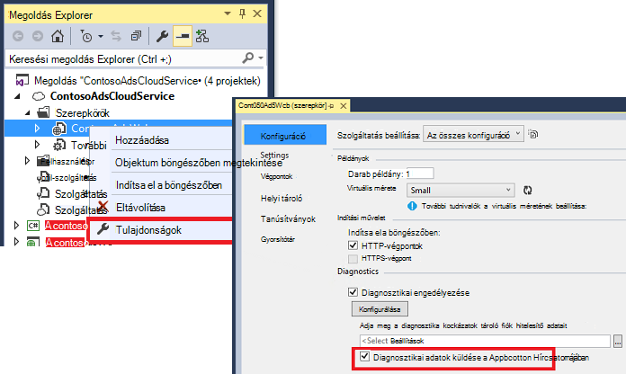

    **Vagy ha az alkalmazás már közzétett és fut**, nyissa meg Server Explorer vagy felhőalapú Explorer kattintson a jobb gombbal az alkalmazást, és jelölje ki a azonos lehetőséget.

3.  Jelölje be a többi telemetriai ugyanaz az erőforrás alkalmazás az összefüggéseket.

    Ha azt szeretné, beállíthatja, hogy egy másik erőforrás másik szolgáltatáscsaládba konfigurációk (felhőben, helyi) szemek fejlesztési adatokat élő adatokat elkülönülnek.

3. Tetszés szerint [néhány az Azure diagnosztika](app-insights-azure-diagnostics.md) alkalmazás mélyebb továbbítani kívánt. Az alapértelmezett érték a szolgáltatás.

### <a name="view-azure-diagnostic-events"></a>Azure diagnosztikai események megtekintése

Hol találhatók a diagnosztika:

* Egyéni mértékek teljesítmény számláló jelennek. 
* Windows-eseménynaplók halad és egyéni események jelennek meg.
* Alkalmazás naplók, esemény-nyomkövetés naplók és bármely diagnosztika infrastruktúra naplók halad jelennek meg.

Teljesítmény számláló és események száma megtekintéséhez nyissa meg a [Mértékek Intézőt](app-insights-metrics-explorer.md) , és új diagram hozzáadása:


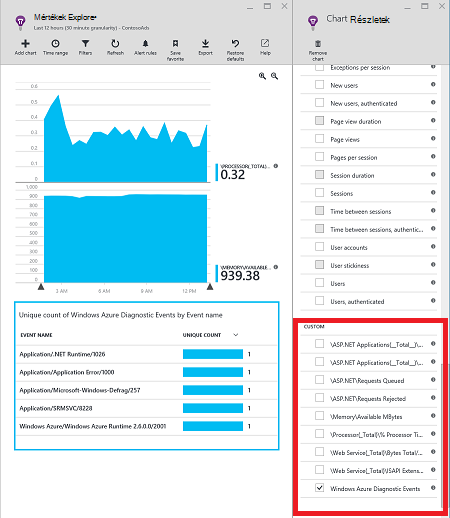

Használja a [keresőt](app-insights-diagnostic-search.md) végig a különböző nyomkövetési naplók Azure diagnosztika által küldött kereséséhez. A példában ha unhanded kivételt egy szerepkört, ami miatt összeomlik és a Lomtár, akkor ezeket az információkat a szerepkör volna jelenik meg a az alkalmazás csatorna a Windows eseménynaplójába. A keresés funkció tekintse meg a Windows eseménynaplójának hiba és a teljes Papírhalom követés az a kivétel, keresse meg a legfelső szintű a probléma okát úgy is használhatja.


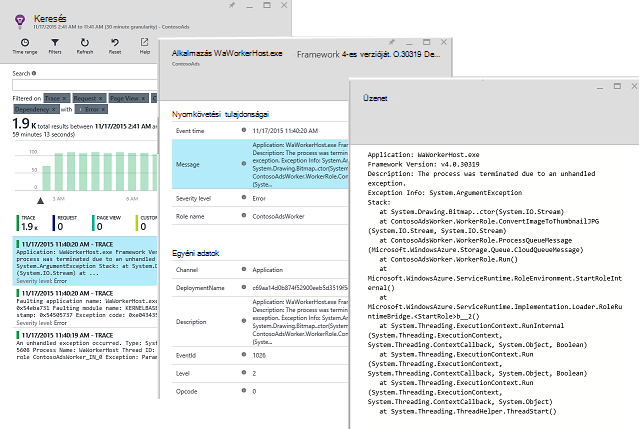

## <a name="app-diagnostics"></a>Alkalmazás diagnosztika

Azure diagnosztika automatikusan tartalmazza az naplóbejegyzések, amely az alkalmazás generál System.Diagnostics.Trace használatával. 

De ha már használja a Log4N vagy NLog keretek, is [rögzítése a naplóban halad][netlogs].

[Egyéni események és mérőszámok nyomon] [ api] az ügyfél és kiszolgáló vagy, ha többet szeretne tudni az alkalmazás teljesítményének és látogatottságának.

## <a name="dependencies"></a>Függőségek

Alkalmazás háttérismeretek SDK jelenthetik, hogy az alkalmazás teszi a külső függőségeket, például a REST API-k és az SQL-kiszolgálók hívásokat. Lehetővé teszi, hogy egy adott típusú függés lassú a válaszok és sikertelen okoz-e.

Ha az alkalmazás a .NET-keretrendszer 4.6-os vagy újabb verzióját használja, nem kell tennie semmi másra. 

Egyéb esetben állítsa be a webes/dolgozói szerepkört [Alkalmazás háttérismeretek ügynök](app-insights-monitor-performance-live-website-now.md) "Állapot Monitor" néven is ismert.

Az alkalmazás az összefüggéseket ügynök használata a webes/dolgozó szerepkörök:

* Hozzáadása a [AppInsightsAgent](https://github.com/Microsoft/ApplicationInsights-Home/tree/master/Samples/AzureEmailService/WorkerRoleA/AppInsightsAgent) mappát, és a két fájl benne a webes/dolgozói szerepkört projektekhez. Ne felejtse el, hogy azok mindig bemásolja a program a kimeneti könyvtár beállítása a build tulajdonságaik. Ezeket a fájlokat a ügynököt a.
* Tevékenység indítási hozzáadása a CSDEF fájlt, a megjelenített [Itt](https://github.com/Microsoft/ApplicationInsights-Home/tree/master/Samples/AzureEmailService/AzureEmailService/ServiceDefinition.csdef#L18).
* Megjegyzés: *Dolgozó szerepkörök* három környezeti változók igényel a megjelenített [Itt](https://github.com/Microsoft/ApplicationInsights-Home/tree/master/Samples/AzureEmailService/AzureEmailService/ServiceDefinition.csdef#L44)olyan. Ez nem webes szerepkör szükséges.

### <a name="dependency-reports"></a>Függőség jelentések

Az alábbiakban látható, az alkalmazás az összefüggéseket portálon:

* Gazdag diagnosztika automatikusan korrelációs kérések és függőségek:

    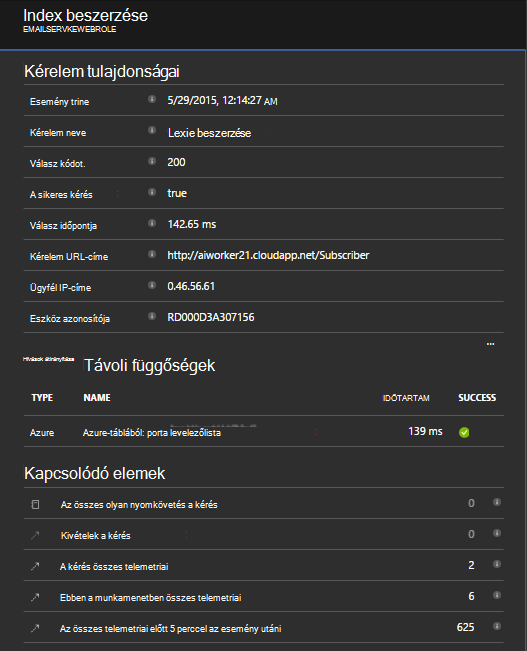

* A webes szerepkör az objektumfüggőségekre vonatkozó információk teljesítmény:

    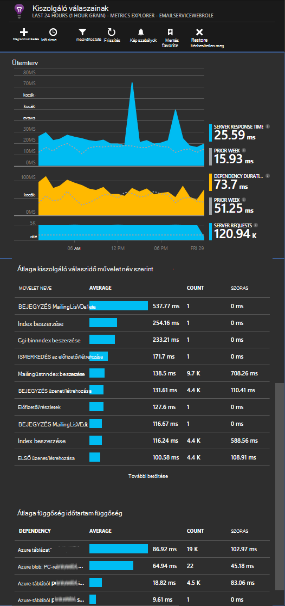

* Képernyőkép a kérések és az adott dolgozó szerepkör az objektumfüggőségekre vonatkozó információk a következő:

    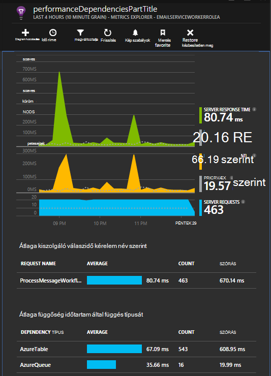

## <a name="exceptions"></a>A kivételek

Lásd: [Az alkalmazás az összefüggéseket a kivételek figyelése](app-insights-asp-net-exceptions.md) hogyan összegyűjtheti esetén nem kezelt kivételek különböző webes alkalmazás típusú információt.

A minta webes szerepkörhöz MVC5 és a webes API-2-vezérlőket. A 2 esetén nem kezelt kivételek rögzítésének a következő:

* [AiHandleErrorAttribute](https://github.com/Microsoft/ApplicationInsights-Home/blob/master/Samples/AzureEmailService/MvcWebRole/Telemetry/AiHandleErrorAttribute.cs) állítsa be az [alábbi](https://github.com/Microsoft/ApplicationInsights-Home/blob/master/Samples/AzureEmailService/MvcWebRole/App_Start/FilterConfig.cs#L12) MVC5-vezérlők
* [AiWebApiExceptionLogger](https://github.com/Microsoft/ApplicationInsights-Home/blob/master/Samples/AzureEmailService/MvcWebRole/Telemetry/AiWebApiExceptionLogger.cs) állítsa be az [alábbi](https://github.com/Microsoft/ApplicationInsights-Home/blob/master/Samples/AzureEmailService/MvcWebRole/App_Start/WebApiConfig.cs#L25) webes API-2-vezérlők

Dolgozói szerepkörök kétféleképpen kivételek nyomon követéséhez.

* TrackException(ex)
* Ha az alkalmazás az összefüggéseket nyomkövetési figyelő NuGet csomag hozzáadta, System.Diagnostics.Trace jelentkezzen be a kivételek is használhatja. [Példa.](https://github.com/Microsoft/ApplicationInsights-Home/blob/master/Samples/AzureEmailService/WorkerRoleA/WorkerRoleA.cs#L107)

## <a name="performance-counters"></a>Teljesítmény számláló

A következő számláló begyűjtési alapértelmezés szerint:

    * \Process(??APP_WIN32_PROC??)\% processzor
    * \Memory\Available bájt
    * \.NETTÓ CLR Exceptions(??APP_CLR_PROC??)\# a kivételek / mp kiváltott
    * \Process (????. APP_WIN32_PROC????) \Private bájt
    * \Process (????. APP_WIN32_PROC????) \IO adatok bájt/sec
    * \Processor(_Total)\% processzor

Ezeken kívül az alábbi is begyűjtési webes szerepkörök:

    * \ASP.NET alkalmazások (????. APP_W3SVC_PROC????) \Requests/sec    
    * \ASP.NET alkalmazások (????. APP_W3SVC_PROC????) \Request végrehajtás ideje
    * \ASP.NET alkalmazások (????. APP_W3SVC_PROC????) Az alkalmazás várólista \Requests

Megadható további egyéni vagy a többi windows teljesítmény számláló megjelenített [Itt](https://github.com/Microsoft/ApplicationInsights-Home/blob/master/Samples/AzureEmailService/WorkerRoleA/ApplicationInsights.config#L14)

  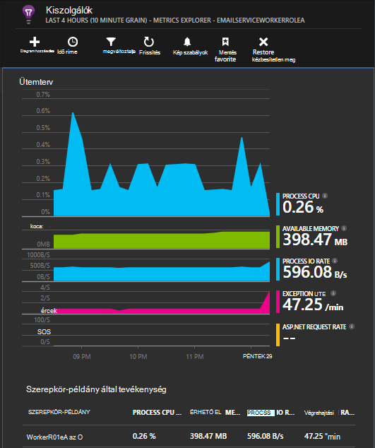

## <a name="correlated-telemetry-for-worker-roles"></a>Korrelációs Telemetriai dolgozói szerepkörök

Azt esetén gazdag diagnosztikai változat, mi vezetett arra a hibás vagy nagy késést láthatja. A webes szerepkörök a SDK automatikusan beállítja korrelációs kapcsolódó telemetriai között. Dolgozó szerepkörök egy egyéni telemetriai inicializálója állítani egy közös Operation.Id helyi attribútumot cél összes telemetriai is használhatja. Ez lehetővé teszi, hogy látható, hogy a a késés/meghibásodása probléma miatt nem függőség vagy a kód egy pillantással miatt! 

Az alábbiakban módját:

* Beállíthatja a korrelációs azonosítót be egy CallContext megjelenített [Itt](https://github.com/Microsoft/ApplicationInsights-Home/blob/master/Samples/AzureEmailService/WorkerRoleA/WorkerRoleA.cs#L36). Ebben az esetben azt használja a kérése azonosító a korrelációs azonosító
* Adja hozzá egy egyéni TelemetryInitializer végrehajtás, amely a fenti correlationId állítja be a Operation.Id. Itt látható: [ItemCorrelationTelemetryInitializer](https://github.com/Microsoft/ApplicationInsights-Home/blob/master/Samples/AzureEmailService/WorkerRoleA/Telemetry/ItemCorrelationTelemetryInitializer.cs#L13)
* Adja meg az egyéni telemetriai inicializálója. Sikerült az ehhez szükséges lépéseket az ApplicationInsights.config fájlban, vagy a kód, a megjelenített [Itt](https://github.com/Microsoft/ApplicationInsights-Home/blob/master/Samples/AzureEmailService/WorkerRoleA/WorkerRoleA.cs#L233)

Az egész! A portál felület már is áttekintése kapcsolódó telemetriai vezetékes be:

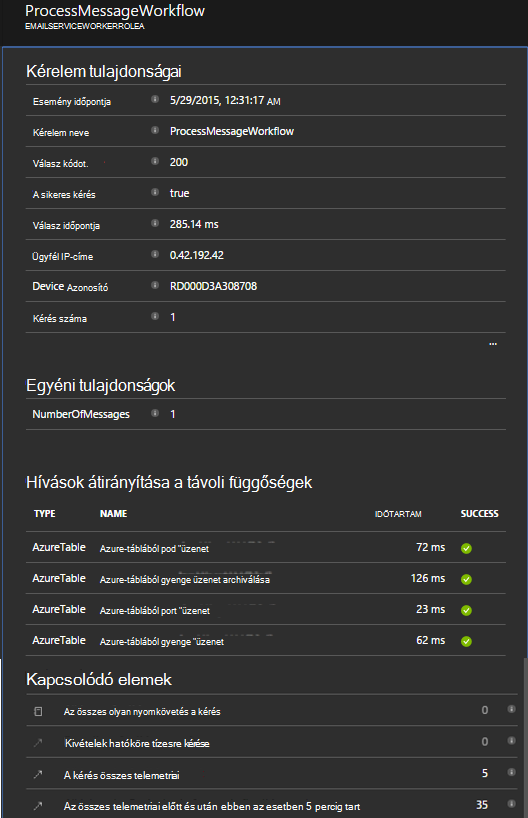


## <a name="client-telemetry"></a>Ügyfél telemetriai

[A JavaScript SDK hozzáadása a weblapokhoz] [ client] böngészőalapú telemetriai például oldalszám megtekintése, lapok betöltésével, parancsfájl kivételeket, és lehetővé teszi, hogy a lap parancsfájlok írása egyéni telemetriai.

## <a name="availability-tests"></a>Elérhetőség vizsgálatok

[Állítsa be a webes vizsgálatok] [ availability] kattintva ellenőrizze, hogy az alkalmazás maradjon, élő és válaszol.


## <a name="example"></a>Példa

[A példa](https://github.com/Microsoft/ApplicationInsights-Home/tree/master/Samples/AzureEmailService) figyeli a szolgáltatás, amely egy webes szerepkört, és két dolgozó szerepkörök.

## <a name="exception-method-not-found-on-running-in-azure-cloud-services"></a>Kivétel "metódus nem található" a az Azure Cloud Services fut.

DID összeállítása a .NET 4.6? 4.6 automatikusan nem támogatott Azure Cloud Services szerepkörök. [A szerepkörökhöz telepítése 4.6](../cloud-services/cloud-services-dotnet-install-dotnet.md) az alkalmazás futtatása előtt.

## <a name="related-topics"></a>Kapcsolódó témakörök

* [Azure diagnosztika küldése alkalmazás mélyebb konfigurálása](app-insights-azure-diagnostics.md)
* [Azure diagnosztika küldeni az alkalmazás az összefüggéseket a PowerShell használatával](app-insights-powershell-azure-diagnostics.md)


[api]: app-insights-api-custom-events-metrics.md
[apidefaults]: app-insights-api-custom-events-metrics.md#default-properties
[apidynamicikey]: app-insights-separate-resources.md#dynamic-ikey
[availability]: app-insights-monitor-web-app-availability.md
[azure]: app-insights-azure.md
[client]: app-insights-javascript.md
[diagnostic]: app-insights-diagnostic-search.md
[netlogs]: app-insights-asp-net-trace-logs.md
[portal]: http://portal.azure.com/
[qna]: app-insights-troubleshoot-faq.md
[redfield]: app-insights-monitor-performance-live-website-now.md
[start]: app-insights-overview.md 
