<properties 
    pageTitle="Forgatókönyv: exportálása telemetriai SQL-adatbázishoz alkalmazás Hírcsatornájában" 
    description="Értékáram-elemzés használata SQL alkalmazás háttérismeretek adatok exportálása folyamatosan." 
    services="application-insights" 
    documentationCenter=""
    authors="noamben" 
    manager="douge"/>

<tags 
    ms.service="application-insights" 
    ms.workload="tbd" 
    ms.tgt_pltfrm="ibiza" 
    ms.devlang="na" 
    ms.topic="article" 
    ms.date="03/06/2015" 
    ms.author="awills"/>
 
# <a name="walkthrough-export-to-sql-from-application-insights-using-stream-analytics"></a>Útmutató: Az SQL exportálása alkalmazás háttérismeretek Értékáram-elemzés használata

Ez a cikk bemutatja az telemetriai adatok áthelyezése a [Visual Studio alkalmazás háttérismeretek] [ start] -Azure SQL-adatbázisba a [Folyamatos exportálása] [ export] és [Azure Értékáram-elemzés](https://azure.microsoft.com/services/stream-analytics/). 

Folytonos exportálás mozgás a telemetriai adatokat Azure tárolóba JSON formátum. Hogy miként elemezni Azure Értékáram-elemzés használata a JSON-objektumokat és sorok létrehozása adatbázis táblázatban.

(Általában folyamatos exportálása módja a végezze el az alkalmazás mélyebb küldése az alkalmazások telemetriai saját elemzését. Akkor is alkalmassá teheti kódot a következő példában az exportált telemetriai, például az adatok összesítése és más dolog.)

Lássuk először feltételezve, hogy már rendelkezik a figyelni kívánt alkalmazást.


Ebben a példában azt fogja használni a nézet lap adatok, de ugyanúgy egyszerűen meghosszabbítható egyéb adattípusokat, például egyéni események és a kivételek gombra. 


## <a name="add-application-insights-to-your-application"></a>Alkalmazás háttérismeretek az alkalmazás hozzáadása


Első lépések:

1. [Állítsa be az alkalmazás az összefüggéseket a weblapokhoz](app-insights-javascript.md). 

    (Ebben a példában azt fogja koncentráljon az ügyfél böngészők lap nézet adatainak feldolgozása, de az [Java](app-insights-java-get-started.md) vagy [ASP.NET](app-insights-asp-net.md) -alkalmazás és a folyamat kérést, függőség és más kiszolgáló telemetriai kiszolgálóoldali az alkalmazás az összefüggéseket is beállíthat.)


5. Közzététel az alkalmazást, és telemetriai adatokat az alkalmazás az összefüggéseket erőforrás megjelenő Megtekintés.


## <a name="create-storage-in-azure"></a>Tárhely létrehozása az Azure-ban

Folytonos exportálás adatokat tároló Azure-fiókjába, mindig exportálja, így a tár először létre kell.

1. Tárterület-fiók létrehozása az [Azure portál]előfizetéséhez[portal].

    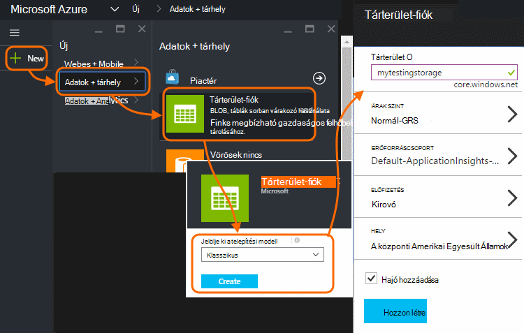

2. A tároló létrehozása

    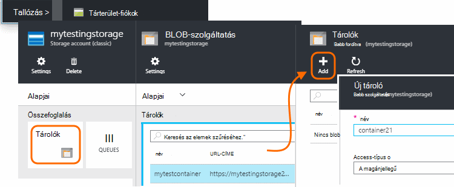

3. Másolja a tárhely hívóbetű

    Hamarosan, hogy állítsa be a bemeneti a adatfolyam analytics szolgáltatás szüksége.

    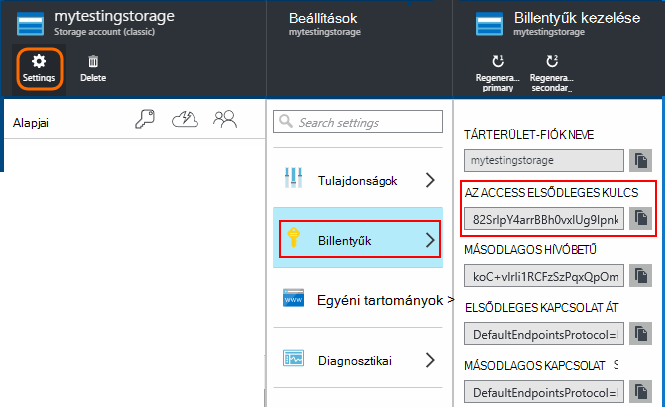

## <a name="start-continuous-export-to-azure-storage"></a>Indítsa el a folyamatos exportálás Azure-tárolóhoz

1. Az Azure-portálon nyissa meg az alkalmazást az összefüggéseket erőforráshoz hoz létre az alkalmazás.

    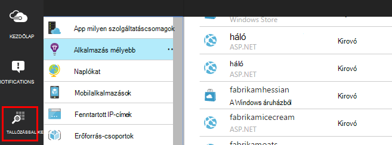

2. Hozzon létre egy folyamatos exportálás.

    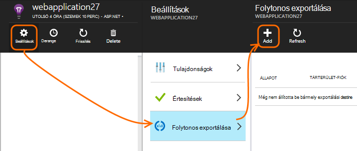


    Jelölje ki a korábban létrehozott tárolás fiók:

    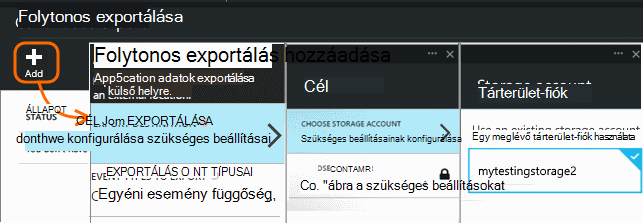
    
    Adja meg a megtekinteni kívánt esemény típusú:

    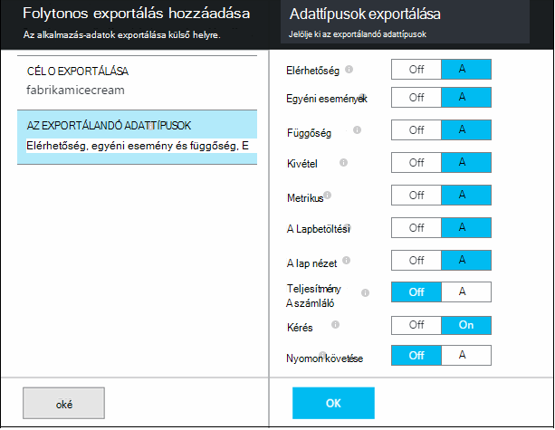


3. Tudathatja gyűjteniük adatokat. Vissza ülnie, és az alkalmazás használja egy ideje mások. Telemetriai érkezzenek, és megjelenik a [metrikus Intézőben](app-insights-metrics-explorer.md) statisztikai diagramok és [diagnosztikai keresési](app-insights-diagnostic-search.md)az egyes események. 

    És is, az adatokat a tárolóhoz exportálja. 

4. Nézze meg az exportált adatokat, vagy az - portálon válassza a **Tallózás gombra**, válassza a tárterület-fiókot, majd a **tárolók** - vagy Visual Studio. A Visual Studióban, válassza a **megtekintése és a felhő Explorer**, és nyissa meg az Azure / tárolás. (Ha menü beállítás nincs, akkor telepítenie kell az Azure SDK: Nyissa meg az új projekt párbeszédpanelt, és nyissa meg a Visual C# / Cloud / a Microsoft Azure SDK beszerzése .NET.)

    

    Jegyezze fel a közös rész az elérési út neve, amely az alkalmazás nevét és műszerezettségi billentyű származik. 

Az események blob-JSON formátumú fájlok kerülnek. Minden fájl tartalmazhat egy vagy több eseményeket. Így azt szeretné olvasni az esemény adatai és a mezők szeretnénk kiszűrése. Megteheti azt is, adatokat tartalmazó dolog, amit az összes típusú, de a ma csomagja Értékáram-elemzés használata az adatok áthelyezése SQL-adatbázishoz. Amely fog könnyítse rengeteg érdekes lekérdezések futtatásához.

## <a name="create-an-azure-sql-database"></a>Azure SQL-adatbázis létrehozása

Az előfizetés az [Azure-portálon]még egyszer kezdve[portal], az adatbázis létrehozása (és egy új kiszolgáló, kivéve, ha korábban már rendelkezik egy) amely meg fog az adatok írásához.

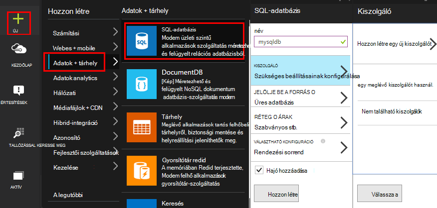


Győződjön meg arról, hogy az adatbázis-kiszolgáló lehetővé teszi, hogy Azure szolgáltatásai:


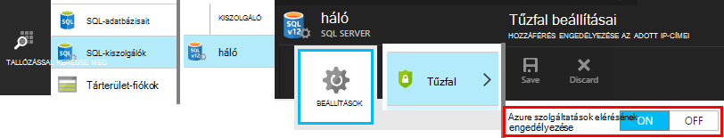

## <a name="create-a-table-in-azure-sql-db"></a>Tábla létrehozása az Azure SQL-adatbázis

Csatlakozás a használni kívánt felügyeleti eszközzel az előző részben létrehozott az adatbázishoz. Az útmutató akkor használja [Az SQL Server-kezelő eszközök](https://msdn.microsoft.com/ms174173.aspx) (SSMS).

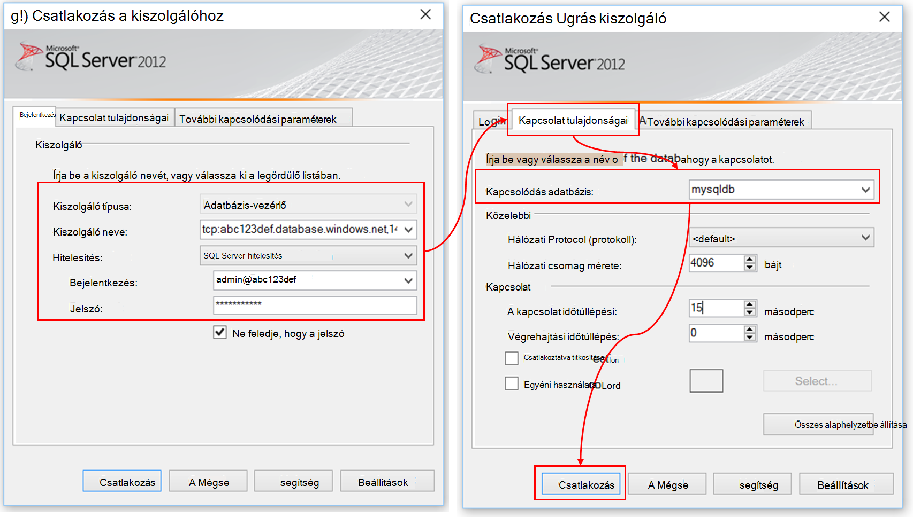

Hozzon létre egy új lekérdezést, és hajtsa végre az alábbi T SQL:

```SQL

CREATE TABLE [dbo].[PageViewsTable](
    [pageName] [nvarchar](max) NOT NULL,
    [viewCount] [int] NOT NULL,
    [url] [nvarchar](max) NULL,
    [urlDataPort] [int] NULL,
    [urlDataprotocol] [nvarchar](50) NULL,
    [urlDataHost] [nvarchar](50) NULL,
    [urlDataBase] [nvarchar](50) NULL,
    [urlDataHashTag] [nvarchar](max) NULL,
    [eventTime] [datetime] NOT NULL,
    [isSynthetic] [nvarchar](50) NULL,
    [deviceId] [nvarchar](50) NULL,
    [deviceType] [nvarchar](50) NULL,
    [os] [nvarchar](50) NULL,
    [osVersion] [nvarchar](50) NULL,
    [locale] [nvarchar](50) NULL,
    [userAgent] [nvarchar](max) NULL,
    [browser] [nvarchar](50) NULL,
    [browserVersion] [nvarchar](50) NULL,
    [screenResolution] [nvarchar](50) NULL,
    [sessionId] [nvarchar](max) NULL,
    [sessionIsFirst] [nvarchar](50) NULL,
    [clientIp] [nvarchar](50) NULL,
    [continent] [nvarchar](50) NULL,
    [country] [nvarchar](50) NULL,
    [province] [nvarchar](50) NULL,
    [city] [nvarchar](50) NULL
)

CREATE CLUSTERED INDEX [pvTblIdx] ON [dbo].[PageViewsTable]
(
    [eventTime] ASC
)WITH (PAD_INDEX = OFF, STATISTICS_NORECOMPUTE = OFF, SORT_IN_TEMPDB = OFF, DROP_EXISTING = OFF, ONLINE = OFF, ALLOW_ROW_LOCKS = ON, ALLOW_PAGE_LOCKS = ON)

```

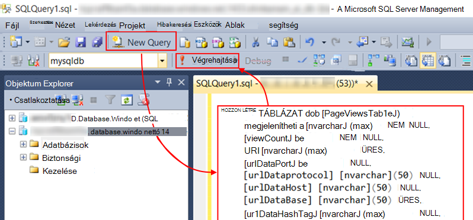

Ebben a példában az adatok lap nézetek használják azt. Ha látni szeretné a rendelkezésre álló adatokat, nézze meg a JSON kimeneti, és lásd: az [adatmodell exportálása](app-insights-export-data-model.md).

## <a name="create-an-azure-stream-analytics-instance"></a>Hozza létre az Azure Értékáram-elemzés

A [Klasszikus Azure-portálon](https://manage.windowsazure.com/)válassza ki a Azure Értékáram-elemzés szolgáltatást, és hozzon létre új feladatot megjelenítő Értékáram-elemzés:


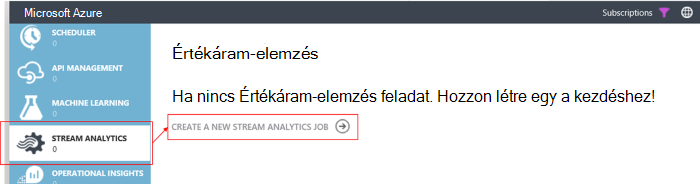


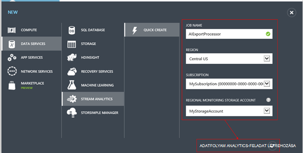

Ha az új feladat jön létre, bontsa ki a részletes adatait:

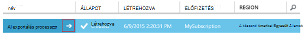

#### <a name="set-blob-location"></a>Blob-hely beállítása

Állítsa be állapotba a folyamatos exportálása blob a bemeneti:

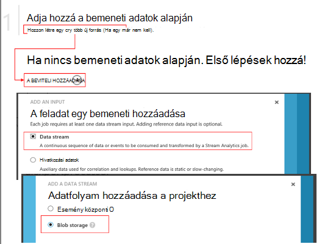

Most már szüksége lesz az elsődleges kulcs az Access a tárhely fiókból, amely a korábban feljegyzett. Ez a tárhely Fiókkulcs értéke.

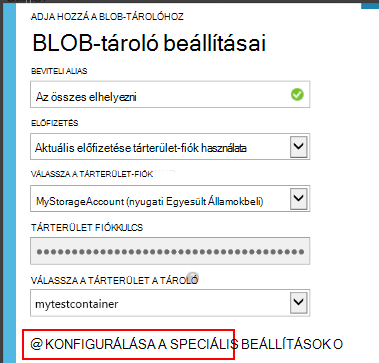

#### <a name="set-path-prefix-pattern"></a>Készlet elérési út előtagot minta 


Győződjön meg arról, a dátumformátum beállításához **YYYY-MM-DD** (a **szaggatott vonal**).

A elérési_út előtag minta Itt adhatja meg, hogyan Értékáram-elemzés megtalálja a bemeneti fájlok tárolására. Kell beállítania, hogy hogyan tárolja az adatokat a folyamatos exportálása felelnek meg. Állítsa be jelennek meg:

    webapplication27_12345678123412341234123456789abcdef0/PageViews/{date}/{time}

Ebben a példában:

* `webapplication27`az **összes, a kisbetű**alkalmazás háttérismeretek erőforrás a név. 
* `1234...`az a műszerezettségi kulcs, az alkalmazás az összefüggéseket erőforrás **a szaggatott vonal eltávolítja**. 
* `PageViews`milyen típusú adatok elemzéséhez szeretnénk van. A rendelkezésre álló típusok attól függenek, hogy a folyamatos exportálása szűrőjét. Vizsgálja meg az exportált adatokat egyéb rendelkezésre álló diagramtípusok megjelenítéséhez, és ellenőrizze a [modell adatainak exportálása](app-insights-export-data-model.md).
* `/{date}/{time}`minta írt szó.

A neve és a iKey az alkalmazás az összefüggéseket erőforrás veheti Essentials megnyitása az Áttekintés oldalon, vagy nyissa meg a beállításokat.

#### <a name="finish-initial-setup"></a>Kezdeti telepítés befejezése

Erősítse meg a szerializálási formátum:

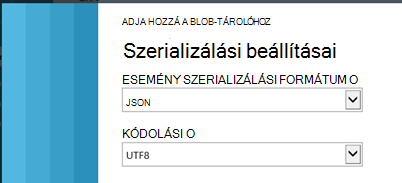

Zárja be a varázslót, és várja meg a telepítés befejezéséhez.

>[AZURE.TIP] A minta funkcióval ellenőrizze, hogy helyesen van beállítva a bemeneti elérési. Ha a sikertelen: Ellenőrizze, hogy van-e adatok a tárterület a kiválasztott minta időtartomány. Beviteli definíciójának szerkesztése, és ellenőrizze a tárterület-fiókot, elérési út előtag beállítása és a helyesen dátum formátumban.

## <a name="set-query"></a>Lekérdezés megadása

Nyissa meg a lekérdezés szakasz:

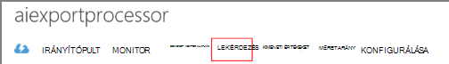

Az alapértelmezett lekérdezés lecserélése:

```SQL

    SELECT flat.ArrayValue.name as pageName
    , flat.ArrayValue.count as viewCount
    , flat.ArrayValue.url as url
    , flat.ArrayValue.urlData.port as urlDataPort
    , flat.ArrayValue.urlData.protocol as urlDataprotocol
    , flat.ArrayValue.urlData.host as urlDataHost
    , flat.ArrayValue.urlData.base as urlDataBase
    , flat.ArrayValue.urlData.hashTag as urlDataHashTag
      ,A.context.data.eventTime as eventTime
      ,A.context.data.isSynthetic as isSynthetic
      ,A.context.device.id as deviceId
      ,A.context.device.type as deviceType
      ,A.context.device.os as os
      ,A.context.device.osVersion as osVersion
      ,A.context.device.locale as locale
      ,A.context.device.userAgent as userAgent
      ,A.context.device.browser as browser
      ,A.context.device.browserVersion as browserVersion
      ,A.context.device.screenResolution.value as screenResolution
      ,A.context.session.id as sessionId
      ,A.context.session.isFirst as sessionIsFirst
      ,A.context.location.clientip as clientIp
      ,A.context.location.continent as continent
      ,A.context.location.country as country
      ,A.context.location.province as province
      ,A.context.location.city as city
    INTO
      AIOutput
    FROM AIinput A
    CROSS APPLY GetElements(A.[view]) as flat


```

Figyelje meg, hogy az első néhány Tulajdonságok lap adatok megjelenítése egyes érhető el. Más telemetriai típusú exportnak különböző tulajdonságokkal fog rendelkezni. Lásd: a [részletes adatok modell hivatkozást a tulajdonság típusok és értékek.](app-insights-export-data-model.md)

## <a name="set-up-output-to-database"></a>Adatbázis kimeneti beállítása

Jelölje be a kimenet SQL.

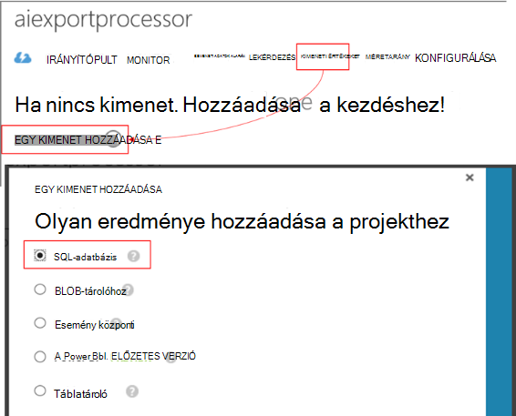

Adja meg az SQL-adatbázis.


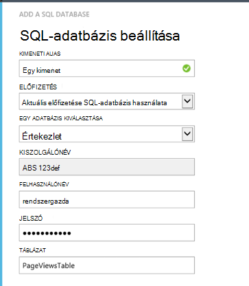

Zárja be a varázslót, és várja meg, hogy be van állítva a kimenet értesítést.

## <a name="start-processing"></a>Indítsa el a feldolgozása

Indítsa el a feladatot a műveletsávon elérhető:

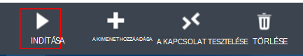

Megadhatja, hogy most vagy induljon korábbi adatok adatfeldolgozás indításához-e. Az utóbbi akkor hasznos, ha folytonos exportálása már fut egy ideig volt.


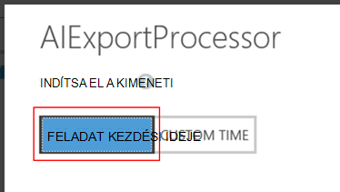

Néhány perc után térjen vissza az SQL Server-kezelő eszközök, és az adatokat a folyó megtekintés. Ha például lekérdezéssel jelennek meg:

    SELECT TOP 100 *
    FROM [dbo].[PageViewsTable]


## <a name="related-articles"></a>Kapcsolódó cikkek

* [SQL-dolgozó szerepkör alapján exportálása](app-insights-code-sample-export-telemetry-sql-database.md)
* [Értékáram-elemzés használata PowerBI exportálása](app-insights-export-power-bi.md)
* [A részletes adatok a tulajdonság típusok és értékek hivatkozása modell.](app-insights-export-data-model.md)
* [Az alkalmazás mélyebb folyamatos exportálása](app-insights-export-telemetry.md)
* [Alkalmazás mélyebb](https://azure.microsoft.com/services/application-insights/)

<!--Link references-->

[diagnostic]: app-insights-diagnostic-search.md
[export]: app-insights-export-telemetry.md
[metrics]: app-insights-metrics-explorer.md
[portal]: http://portal.azure.com/
[start]: app-insights-overview.md

 