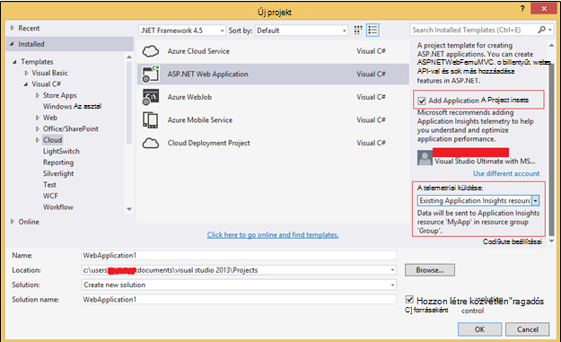

<properties 
    pageTitle="Kód minta: exportált alkalmazása az összefüggéseket adatok elemzése" 
    description="A saját telemetriai az alkalmazás mélyebb elemzéséhez kód folyamatos Exportálás funkcióval. Adatok mentése SQL." 
    services="application-insights" 
    documentationCenter=""
    authors="mazharmicrosoft" 
    manager="douge"/>

<tags 
    ms.service="application-insights" 
    ms.workload="tbd" 
    ms.tgt_pltfrm="ibiza" 
    ms.devlang="na" 
    ms.topic="article" 
    ms.date="01/05/2016" 
    ms.author="awills"/>
 
# Kód minta: exportált alkalmazása az összefüggéseket adatok elemzése

Ez a cikk bemutatja, hogyan exportált alkalmazása az összefüggéseket a JSON adatfeldolgozás. Példaként azt fogja kódírás telemetriai adatok áthelyezése a [Visual Studio alkalmazás háttérismeretek] [ start] -Azure SQL-adatbázisba a [Folyamatos exportálása][export]. (Ez [Értékáram-elemzés használatával](app-insights-code-sample-export-sql-stream-analytics.md)is érhet, de az alábbi célja mutatja, hogy a kód.) 

Folytonos exportálás áthelyezi a telemetriai Azure tároló JSON formátumban, így azt fogja kódírás néhány elemzi a JSON-objektumok, és a sorok létrehozása adatbázis táblázatban.

Általánosságban folyamatos exportálása módja a végezze el az alkalmazás mélyebb küldése az alkalmazások telemetriai saját elemzését. Kód a következő példában kattintva egyéb műveleteket tartalmazó az exportált telemetriai is alkalmassá teheti.

Lássuk először feltételezve, hogy már rendelkezik a figyelni kívánt alkalmazást.

## Alkalmazás háttérismeretek SDK hozzáadása

Lync-a kiegyenlítés, a [hozzáadása egy alkalmazás háttérismeretek SDK] [ start] az alkalmazás. Vannak más SDK és a más platformokon, IDEs és nyelvek segítő eszközök. Figyelheti a weblapok, Java vagy ASP.NET webkiszolgálón és számos típusú mobileszközök lehetőséget. Az összes SDK telemetriai küldése az [alkalmazás mélyebb portál][portal], ahol a hatékony elemzés és a diagnosztikai eszközök, és exportálja az adatokat tároló.

Első lépések:

1. Ismerkedés a [Microsoft Azure-fiók](https://azure.microsoft.com/pricing/).
2. Az [Azure portál][portal], az alkalmazás új alkalmazás mélyebb erőforrás hozzáadása:

    

    (Az alkalmazás típusa és az előfizetés eltérhetnek.)
3. Nyissa meg a rövid útmutató keresése, hogy miként állíthatja be az alkalmazás írja be a SDK.

    

    Ha az alkalmazás-típus nem szerepel a felsorolásban, ajánljuk figyelmébe az [Első lépések] [ start] lapot.

4. Ebben a példában azt esetén figyelése webalkalmazást, így azt az Azure eszközök segítségével a Visual Studióban a SDK telepítése című témakört. Azt, hogy azt az alkalmazást az összefüggéseket erőforrás neve:

    

## Tárhely létrehozása az Azure-ban

Alkalmazás mélyebb adatainak JSON formátumban Azure tároló fiók mindig exportálja. Érdemes a tárhelyről, hogy a kód felirat jelenik meg az adatokat.

1. "Klasszikus" tárterület-fiók létrehozása az [Azure portál]előfizetéséhez[portal].

    

2. A tároló létrehozása

    

## Indítsa el a folyamatos exportálás Azure-tárolóhoz

1. Az Azure-portálon nyissa meg az alkalmazást az összefüggéseket erőforráshoz hoz létre az alkalmazás.

    

2. Hozzon létre egy folyamatos exportálás.

    

    Jelölje ki a korábban létrehozott tárterület-fiókhoz:

    
    
    Adja meg a megtekinteni kívánt esemény típusú:

    

3. Tudathatja gyűjteniük adatokat. Vissza ülnie, és az alkalmazás használja egy ideje mások. Telemetriai érkezzenek, és megjelenik a [metrikus Intézőben](app-insights-metrics-explorer.md) statisztikai diagramok és [diagnosztikai keresés](app-insights-diagnostic-search.md)az egyes események. 

    És is, az adatokat a tárolóhoz exportálja. 

4. Nézze meg az exportált adatokat. A Visual Studióban, válassza a **megtekintése és a felhő Explorer**, és nyissa meg az Azure / tároló. (Ha menü beállítás nincs, akkor telepítenie kell az Azure SDK: Nyissa meg az új projekt párbeszédpanelt, és nyissa meg a Visual C# / Cloud / a Microsoft Azure SDK beszerzése .NET.)

    

    Jegyezze fel a közös rész az elérési út neve, amely az alkalmazás nevét és műszerezettségi billentyű származik. 

Az események blob-JSON formátumú fájlok kerülnek. Minden fájl tartalmazhat egy vagy több eseményeket. Így azt szeretné olvasni az esemény adatai és a mezők szeretnénk kiszűrése. Mindenféle dolgot megteheti azt is, adatokat tartalmazó, de a terv ma, ha bizonyos kódírás az adatok áthelyezése SQL-adatbázishoz. Amely fog könnyítse rengeteg érdekes lekérdezések futtatásához.

## Azure SQL-adatbázis létrehozása

Ez a példa azt fogja kódírás nyomni az adatokat egy adatbázisba.

Az előfizetés az [Azure-portálon]még egyszer kezdve[portal], az adatbázis létrehozása (és egy új kiszolgáló, kivéve, ha korábban már rendelkezik egy) amely meg fog az adatok írásához.

Győződjön meg arról, hogy az adatbázis-kiszolgáló lehetővé teszi, hogy Azure szolgáltatásai:

## Hozzon létre egy dolgozó szerepkört 

Most már utolsó, hogy írja be a [kód](https://sesitai.codeplex.com/) a JSON az exportált BLOB az elemezni, és rekordok létrehozása az adatbázisban. Mivel az Exportálás tároló és az adatbázis mindkét Azure-ban, azt a kódot az Azure dolgozó szerepet futtatásával.

Ez a kód automatikusan az első karaktertől bármilyen tulajdonságok-e a JSON. A tulajdonságok, című témakör ismerteti [exportálása adatmodellt](app-insights-export-data-model.md).

#### Dolgozó szerepkör projekt létrehozása

A Visual Studióban a dolgozók szerep új projekt létrehozása:

#### Csatlakozás a tárterület-fiókhoz

Az Azure-a kapcsolati karakterlánc kinyerése a tárterület-fiók:

A Visual Studióban adja meg a dolgozó szerepkör beállításokat a tárterület-fiók kapcsolattal:

#### Csomagok

A megoldás Intézőben kattintson a jobb gombbal a dolgozók szerepkör projekt, és válassza a NuGet csomagok kezelése.
Keresse meg és telepítse a ezekről a csomagokról: 

 * EntityFramework 6.1.2 vagy később - használjuk ezt a szabványú adatbázisból származó táblázatot séma menet, létrehozásához a JSON a blob a tartalma alapján.
 * JsonFx - használjuk Ez a C# osztály tulajdonságokra a JSON összeolvasztása.

Ezzel az eszközzel ki egyetlen JSON dokumentum C# osztály létrehozásához. Például a JSON-tömbök összeolvasztása be egyetlen C# tulajdonság bekapcsolása egyetlen oszlopban DB táblázatban (ex kisebb módosításokat igényel. urlData_port) 

 * [JSON C# osztályjegyzetfüzet-készítő](http://jsonclassgenerator.codeplex.com/)

## Kód 

Ez a kód írható `WorkerRole.cs`.

#### Import

    using Microsoft.WindowsAzure.Storage;

    using Microsoft.WindowsAzure.Storage.Blob;

#### A tároló kapcsolati karakterlánc beolvasása

    private static string GetConnectionString()
    {
      return Microsoft.WindowsAzure.CloudConfigurationManager.GetSetting("StorageConnectionString");
    }

#### Futtassa a dolgozó rendszeres időközönként

A meglévő futtatása módszer cseréje, és válassza a inkább időtartományt. Legalább egy órával, mert az Exportálás funkció befejezése egy JSON-objektumra a egy óra kell tenni.

    public override void Run()
    {
      Trace.TraceInformation("WorkerRole1 is running");

      while (true)
      {
        Trace.WriteLine("Sleeping", "Information");

        Thread.Sleep(86400000); //86400000=24 hours //1 hour=3600000
                
        Trace.WriteLine("Awake", "Information");

        ImportBlobtoDB();
      }
    }

#### Táblázatsor beszúrása az egyes JSON-objektumok

    public void ImportBlobtoDB()
    {
      try
      {
        CloudStorageAccount account = CloudStorageAccount.Parse(GetConnectionString());

        var blobClient = account.CreateCloudBlobClient();
        var container = blobClient.GetContainerReference(FilterContainer);

        foreach (CloudBlobDirectory directory in container.ListBlobs())//Parent directory
        {
          foreach (CloudBlobDirectory subDirectory in directory.ListBlobs())//PageViewPerformance
          {
            foreach (CloudBlobDirectory dir in subDirectory.ListBlobs())//2015-01-31
            {
              foreach (CloudBlobDirectory subdir in dir.ListBlobs())//22
              {
                foreach (IListBlobItem item in subdir.ListBlobs())//3IAwm6u3-0.blob
                {
                  itemname = item.Uri.ToString();
                  ParseEachBlob(container, item);
                  AuditBlob(container, directory, subDirectory, dir, subdir, item);
                } //item loop
              } //subdir loop
            } //dir loop
          } //subDirectory loop
        } //directory loop
      }
      catch (Exception ex)
      {
        //handle exception
      }
    }

#### Minden egyes blob elemzése

    private void ParseEachBlob(CloudBlobContainer container, IListBlobItem item)
    {
      try
      {
        var blob = container.GetBlockBlobReference(item.Parent.Prefix + item.Uri.Segments.Last());
    
        string json;
    
        using (var memoryStream = new MemoryStream())
        {
          blob.DownloadToStream(memoryStream);
          json = System.Text.Encoding.UTF8.GetString(memoryStream.ToArray());
    
          IEnumerable<string> entities = json.Split('\n').Where(s => !string.IsNullOrWhiteSpace(s));
    
          recCount = entities.Count();
          failureCount = 0; //resetting failure count
    
          foreach (var entity in entities)
          {
            var reader = new JsonFx.Json.JsonReader();
            dynamic output = reader.Read(entity);
    
            Dictionary<string, object> dict = new Dictionary<string, object>();
    
            GenerateDictionary((System.Dynamic.ExpandoObject)output, dict, "");
    
            switch (FilterType)
            {
              case "PageViewPerformance":
    
              if (dict.ContainsKey("clientPerformance"))
                {
                  GenerateDictionary(((System.Dynamic.ExpandoObject[])dict["clientPerformance"])[0], dict, "");
                }
    
              if (dict.ContainsKey("context_custom_dimensions"))
              {
                if (dict["context_custom_dimensions"].GetType() == typeof(System.Dynamic.ExpandoObject[]))
                {
                  GenerateDictionary(((System.Dynamic.ExpandoObject[])dict["context_custom_dimensions"])[0], dict, "");
                }
              }
    
            PageViewPerformance objPageViewPerformance = (PageViewPerformance)GetObject(dict);
    
            try
            {
              using (var db = new TelemetryContext())
              {
                db.PageViewPerformanceContext.Add(objPageViewPerformance);
                db.SaveChanges();
              }
            }
            catch (Exception ex)
            {
              failureCount++;
            }
            break;
    
            default:
            break;
          }
        }
      }
    }
    catch (Exception ex)
    {
      //handle exception 
    }
    }

#### A szótár előkészítése az egyes JSON-dokumentum

    private void GenerateDictionary(System.Dynamic.ExpandoObject output, Dictionary<string, object> dict, string parent)
        {
            try
            {
                foreach (var v in output)
                {
                    string key = parent + v.Key;
                    object o = v.Value;

                    if (o.GetType() == typeof(System.Dynamic.ExpandoObject))
                    {
                        GenerateDictionary((System.Dynamic.ExpandoObject)o, dict, key + "_");
                    }
                    else
                    {
                        if (!dict.ContainsKey(key))
                        {
                            dict.Add(key, o);
                        }
                    }
                }
            }
            catch (Exception ex)
            {
            //handle exception 
            }
        }

#### A JSON-dokumentumot, a C# osztály telemetriai objektum tulajdonságai CAST

     public object GetObject(IDictionary<string, object> d)
        {
            PropertyInfo[] props = null;
            object res = null;

            try
            {
                switch (FilterType)
                {
                    case "PageViewPerformance":

                        props = typeof(PageViewPerformance).GetProperties();
                        res = Activator.CreateInstance<PageViewPerformance>();
                        break;

                    default:
                        break;
                }

                for (int i = 0; i < props.Length; i++)
                {
                    if (props[i].CanWrite && d.ContainsKey(props[i].Name))
                    {
                        props[i].SetValue(res, d[props[i].Name], null);
                    }
                }
            }
            catch (Exception ex)
            {
            //handle exception 
            }

            return res;
        }

#### Ki a dokumentum JSON generált PageViewPerformance osztályfájl

    public class PageViewPerformance
    {
        [DatabaseGenerated(DatabaseGeneratedOption.Identity)]
        public Guid Id { get; set; }

        public string url { get; set; }

        public int urlData_port { get; set; }

        public string urlData_protocol { get; set; }

        public string urlData_host { get; set; }

        public string urlData_base { get; set; }

        public string urlData_hashTag { get; set; }

        public double total_value { get; set; }

        public double networkConnection_value { get; set; }

        public double sendRequest_value { get; set; }

        public double receiveRequest_value { get; set; }

        public double clientProcess_value { get; set; }

        public string name { get; set; }

        public string internal_data_id { get; set; }

        public string internal_data_documentVersion { get; set; }

        public DateTime? context_data_eventTime { get; set; }

        public string context_device_id { get; set; }

        public string context_device_type { get; set; }

        public string context_device_os { get; set; }

        public string context_device_osVersion { get; set; }

        public string context_device_locale { get; set; }

        public string context_device_userAgent { get; set; }

        public string context_device_browser { get; set; }

        public string context_device_browserVersion { get; set; }

        public string context_device_screenResolution_value { get; set; }

        public string context_user_anonId { get; set; }

        public string context_user_anonAcquisitionDate { get; set; }

        public string context_user_authAcquisitionDate { get; set; }

        public string context_user_accountAcquisitionDate { get; set; }

        public string context_session_id { get; set; }

        public bool context_session_isFirst { get; set; }

        public string context_operation_id { get; set; }

        public double context_location_point_lat { get; set; }

        public double context_location_point_lon { get; set; }

        public string context_location_clientip { get; set; }

        public string context_location_continent { get; set; }

        public string context_location_country { get; set; }

        public string context_location_province { get; set; }

        public string context_location_city { get; set; }
    }

#### Az SQL-kapcsolati entitás keretrendszer DBcontext

    public class TelemetryContext : DbContext
    {
        public DbSet<PageViewPerformance> PageViewPerformanceContext { get; set; }
        public TelemetryContext()
            : base("name=TelemetryContext")
        {
        }
    }

Adja hozzá a KCS2 kapcsolati karakterlánc nevű `TelemetryContext` a `app.config`.

## Séma (csak információ)

Ez az a tábla PageView generáló a sémában.

> [AZURE.NOTE] Nem kell futtatni a parancsfájl. A JSON az attribútumok megállapíthatja, hogy a táblázat oszlopainak.

    CREATE TABLE [dbo].[PageViewPerformances](
    [Id] [uniqueidentifier] NOT NULL,
    [url] [nvarchar](max) NULL,
    [urlData_port] [int] NOT NULL,
    [urlData_protocol] [nvarchar](max) NULL,
    [urlData_host] [nvarchar](max) NULL,
    [urlData_base] [nvarchar](max) NULL,
    [urlData_hashTag] [nvarchar](max) NULL,
    [total_value] [float] NOT NULL,
    [networkConnection_value] [float] NOT NULL,
    [sendRequest_value] [float] NOT NULL,
    [receiveRequest_value] [float] NOT NULL,
    [clientProcess_value] [float] NOT NULL,
    [name] [nvarchar](max) NULL,
    [User] [nvarchar](max) NULL,
    [internal_data_id] [nvarchar](max) NULL,
    [internal_data_documentVersion] [nvarchar](max) NULL,
    [context_data_eventTime] [datetime] NULL,
    [context_device_id] [nvarchar](max) NULL,
    [context_device_type] [nvarchar](max) NULL,
    [context_device_os] [nvarchar](max) NULL,
    [context_device_osVersion] [nvarchar](max) NULL,
    [context_device_locale] [nvarchar](max) NULL,
    [context_device_userAgent] [nvarchar](max) NULL,
    [context_device_browser] [nvarchar](max) NULL,
    [context_device_browserVersion] [nvarchar](max) NULL,
    [context_device_screenResolution_value] [nvarchar](max) NULL,
    [context_user_anonId] [nvarchar](max) NULL,
    [context_user_anonAcquisitionDate] [nvarchar](max) NULL,
    [context_user_authAcquisitionDate] [nvarchar](max) NULL,
    [context_user_accountAcquisitionDate] [nvarchar](max) NULL,
    [context_session_id] [nvarchar](max) NULL,
    [context_session_isFirst] [bit] NOT NULL,
    [context_operation_id] [nvarchar](max) NULL,
    [context_location_point_lat] [float] NOT NULL,
    [context_location_point_lon] [float] NOT NULL,
    [context_location_clientip] [nvarchar](max) NULL,
    [context_location_continent] [nvarchar](max) NULL,
    [context_location_country] [nvarchar](max) NULL,
    [context_location_province] [nvarchar](max) NULL,
    [context_location_city] [nvarchar](max) NULL,
    CONSTRAINT [PK_dbo.PageViewPerformances] PRIMARY KEY CLUSTERED 
    (
     [Id] ASC
    )WITH (PAD_INDEX = OFF, STATISTICS_NORECOMPUTE = OFF, IGNORE_DUP_KEY = OFF, ALLOW_ROW_LOCKS = ON, ALLOW_PAGE_LOCKS = ON) ON [PRIMARY]
    ) ON [PRIMARY] TEXTIMAGE_ON [PRIMARY]

    GO

    ALTER TABLE [dbo].[PageViewPerformances] ADD  DEFAULT (newsequentialid()) FOR [Id]
    GO

Lásd az ebben a példában a művelet, [Töltse le](https://sesitai.codeplex.com/) a teljes munkaidő-kódot, módosítsa a `app.config` beállításokat, és tegye közzé a dolgozók szerepkör Azure.

## Kapcsolódó cikkek

* [SQL-dolgozó szerepkör alapján exportálása](app-insights-code-sample-export-telemetry-sql-database.md)
* [Az alkalmazás mélyebb folyamatos exportálása](app-insights-export-telemetry.md)
* [Alkalmazás mélyebb](https://azure.microsoft.com/services/application-insights/)
* [Adatok modell exportálása](app-insights-export-data-model.md)
* [További minták és forgatókönyvek](app-insights-code-samples.md)

<!--Link references-->

[diagnostic]: app-insights-diagnostic-search.md
[export]: app-insights-export-telemetry.md
[metrics]: app-insights-metrics-explorer.md
[portal]: http://portal.azure.com/
[start]: app-insights-overview.md

 
