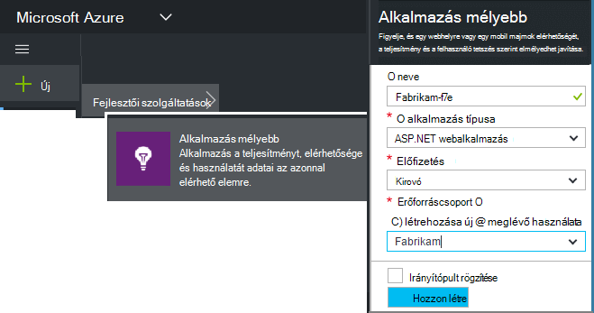
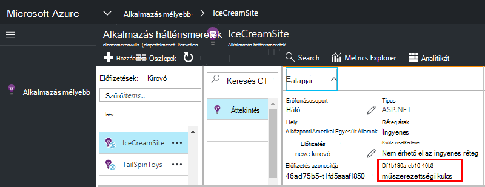

<properties 
    pageTitle="Hozzon létre egy új alkalmazás háttérismeretek erőforrást |} Microsoft Azure" 
    description="Állítsa be egy új élő alkalmazás figyelése alkalmazás az összefüggéseket. Webhely-alapú megközelítés." 
    services="application-insights" 
    documentationCenter=""
    authors="alancameronwills" 
    manager="douge"/>

<tags 
    ms.service="application-insights" 
    ms.workload="tbd" 
    ms.tgt_pltfrm="ibiza" 
    ms.devlang="na" 
    ms.topic="article" 
    ms.date="08/26/2016" 
    ms.author="awills"/>

# Hozzon létre egy alkalmazás háttérismeretek erőforrás

Visual Studio alkalmazás háttérismeretek az alkalmazás adatainak Microsoft Azure *erőforrás*jeleníti meg. Új erőforrás létrehozása része ezért [alkalmazás háttérismeretek új alkalmazás figyelése beállításának][start]. Sok esetben ezt megteheti automatikusan az ide, és az ajánlott módszereket, ahol áll rendelkezésre. De egyes esetekben az erőforrás manuálisan létrehozni.

Az erőforrás létrehozását követően lehet felvenni az annak műszerezettségi billentyűt, és használja, amely a SDK konfigurálása az alkalmazás. A telemetriai küld az erőforrás.

## Jelentkezzen a Microsoft Azure

Ha még nem szerezte be egy [Microsoft fiók létrehozásához most beszerzéséhez](http://live.com). (Ha például az Outlook.com, a onedrive-on, a Windows Phone vagy a XBox Live szolgáltatást használ, akkor már van Microsoft-fiókkal.)

[Microsoft Azure](http://azure.com)-előfizetést is szüksége lesz. A csoportwebhelyen vagy a szervezete rendelkezik egy Azure-előfizetésbe lehetőséget, ha a tulajdonos is fel kell vennie Önt, használja a Windows Live ID azonosítójával.

Vagy hozhat létre új előfizetést. Az ingyenes fiók segítségével próbálja minden Azure-ban. A próbaidőszak lejártakor előfordulhat befizetések előfizetés megfelelő, akkor nem kell fizetnie az ingyenes szolgáltatások. 

Ha tartományhasználati előfizetésbe bejelentkezési alkalmazás mélyebb [http://portal.azure.com](https://portal.azure.com), a hozzáférés és Live ID azonosítóként bejelentkezési szeretne használni.

## Hozzon létre egy alkalmazás háttérismeretek erőforrás
  

A [portal.azure.com](https://portal.azure.com), az alkalmazás az összefüggéseket erőforrás hozzáadása:

* **Alkalmazás típusa** hatással van az Áttekintés lap és a Tulajdonságok érhető el a [metrikus Intézőben]megjelenő[metrics]. Ha nem látja a alkalmazástípust, válassza az ASP.NET.
* **Erőforráscsoport** tulajdonságok kezelésére szolgáló a könnyebb hozzáférés-vezérlés hasonlóan. Ha már létrehozott más erőforrások: Azure, megadhatja az új erőforrás elhelyezése az azonos csoportba.
* **Előfizetés** a Azure fizetési-fiókjába.
* **Ha azt szeretné tartani az adatokat helye.** Jelenleg nem módosítható.
* **Hozzáadás a startboard** egy gyors elérést csempe az erőforrás Azure kezdőlapjának helyezi. Ajánlott.

Az alkalmazás létrehozásakor egy új lap nyílik meg. Ez a hol látni fogja a teljesítmény és a használati adatok megtudni az alkalmazásról. 

Lépjen vissza azt legközelebbi időpont jelentkezzen be az Azure-jelenik meg az alkalmazás rövid csempét a kezdő táblán (a kezdőképernyő közötti különbség). Vagy kattintson a Tallózás gombra, és keresse meg azt.

## Másolja a műszerezettségi billentyűt

A műszerezettségi billentyűt az Ön által létrehozott erőforrás azonosítja. Lesz szüksége a SDK adni.

## A SDK csomagjában talál az alkalmazás telepítése

Az alkalmazás az összefüggéseket SDK telepítse az alkalmazást. Ezt a lépést az alkalmazás típusú erősen függ. 

Állítsa be [a SDK csomagjában talál, amelyek az alkalmazás telepítése]a műszerezettségi billentyűvel[start].

A SDK telemetriai küldése nélkül bármely kódírás modulban tartalmaz. Felhasználói műveletek nyomon követésére és [az API] részletesebben problémáinak diagnosztizálása[ api] küldése saját telemetriai.

## Telemetriai adatokat

Zárja be a rövid útmutató az első lap kattintva térhet vissza az alkalmazás lap az Azure-portálon.

Kattintson a keresés csempére kattintva olvassa el a [Diagnosztikai keresés][diagnostic], ahol az első események jelenik meg. 

Ha több adatot várt, kattintson a frissítés néhány másodperc után.

## Erőforrás automatikus létrehozása

Egy [PowerShell-parancsprogramot,](app-insights-powershell-script-create-resource.md) hozzon létre egy erőforrást automatikusan írhat.

## Következő lépések

* [Irányítópult létrehozása](app-insights-dashboards.md)
* [Diagnosztikai keresés](app-insights-diagnostic-search.md)
* [Mértékek feltárása](app-insights-metrics-explorer.md)
* [Analytics-lekérdezéseket írni](app-insights-analytics.md)

<!--Link references-->

[api]: app-insights-api-custom-events-metrics.md
[diagnostic]: app-insights-diagnostic-search.md
[metrics]: app-insights-metrics-explorer.md
[start]: app-insights-overview.md

 