<properties
    pageTitle="Irányítópultok és az alkalmazás az összefüggéseket portálon navigációs |} Microsoft Azure"
    description="A fő APM diagramok és lekérdezések nézeteket hozhat létre."
    services="application-insights"
    documentationCenter=""
    authors="alancameronwills"
    manager="douge"/>

<tags
    ms.service="application-insights"
    ms.workload="tbd"
    ms.tgt_pltfrm="ibiza"
    ms.devlang="multiple"
    ms.topic="article" 
    ms.date="10/18/2016"
    ms.author="awills"/>

# Navigálás és irányítópultok az alkalmazás az összefüggéseket portálon

Után [állítsa be az alkalmazás az összefüggéseket a projekt](app-insights-overview.md), a project alkalmazás háttérismeretek erőforrás az [Azure portál](https://portal.azure.com)megjelennek az alkalmazás teljesítményének és látogatottságának telemetriai adatokat.

## A telemetriai megkeresése

Jelentkezzen be az [Azure-portálra](https://portal.azure.com) , és keresse meg az alkalmazást az összefüggéseket erőforrás, Ön által létrehozott az alkalmazás.

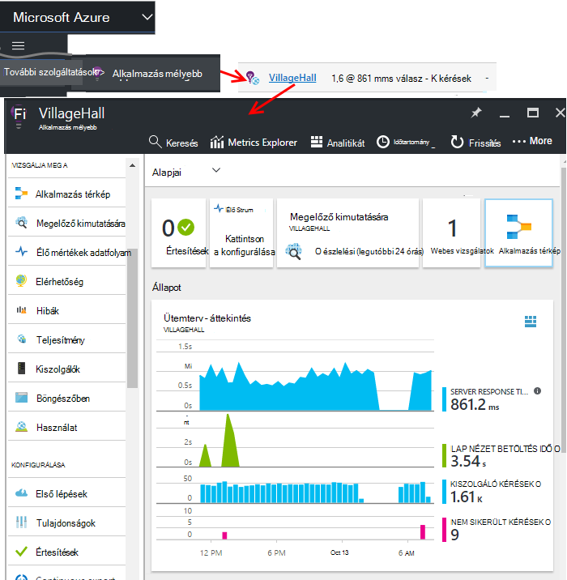

Az alkalmazás áttekintése lap (oldal) jeleníti meg az alkalmazás fő diagnosztikai mértékek összefoglalását, és az egyéb szolgáltatások, a portál átjáró.

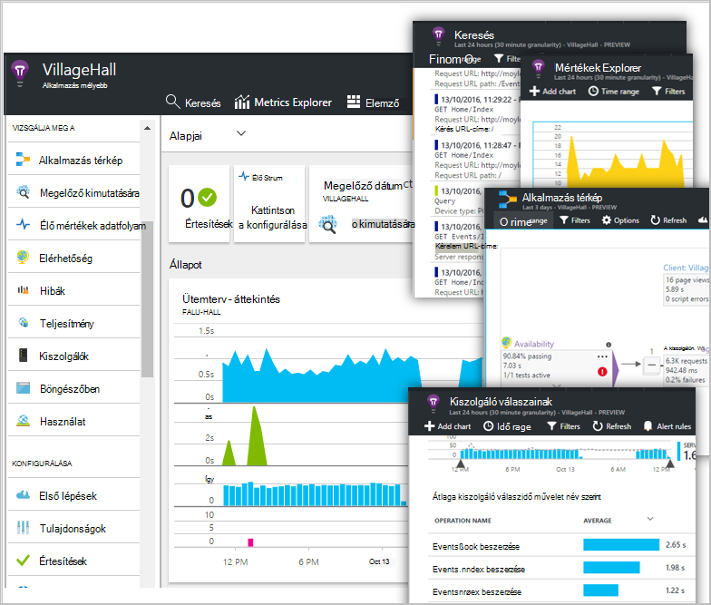

Testreszabása bármely más diagramjaiban, és a rögzítés őket a irányítópult. Úgy, hogy áttelepítheti együtt a fő diagramok más alkalmazásokból.

## Az irányítópultok

Megjelenik a [Microsoft Azure-portálon](https://portal.azure.com) bejelentkezés után először is lesz egy irányítópult. Itt is átvihet együtt a diagramok, amely a legfontosabbak Önnek az Azure erőforrások, például a [Visual Studio alkalmazás háttérismeretek](app-insights-overview.md)telemetriai keresztül.
 

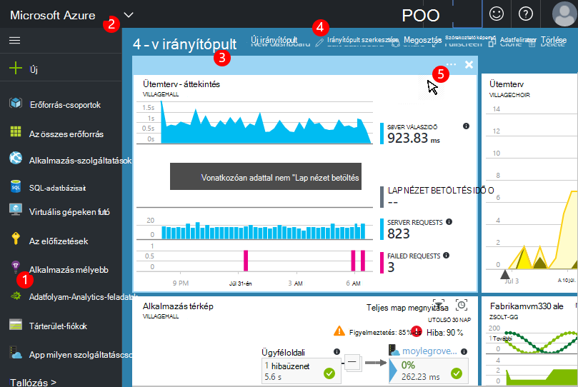

1. **Navigálás az adott erőforrás** , például az alkalmazást, az alkalmazás az összefüggéseket: használja a bal oldali sávban.
2. **Vissza az aktuális Irányítópultjára**, vagy a Váltás a legutóbbi nézetekről: a legördülő menü használatával bal felső részén.
3. **Váltás az irányítópultok**: a legördülő menü az irányítópult-cím használata
4. **Létrehozása, szerkesztése, és a megosztás irányítópultok** irányítópult eszköztár.
5. **Az irányítópult szerkesztése**: mutasson egy csempét, majd a felső sávon áthelyezheti, testreszabása és távolíthatja el.

## Felvétele az irányítópultra

Egy lap vagy a diagramok csoportja, amely különösen érdekesnek keresi meg, amikor egy másolatot az irányítópult is rögzíthet. Látni fogja azt a legközelebb van vissza.

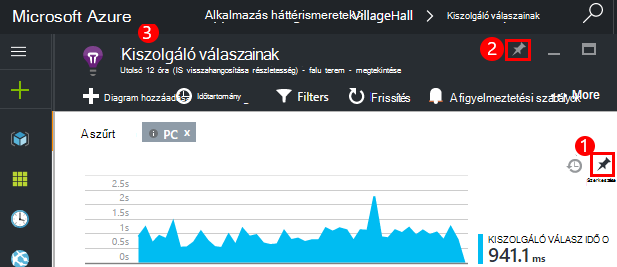

1. Irányítópult diagram PIN-kódot. A diagram másolatának megjelenik az irányítópulton.
2. A teljes lap az irányítópult PIN - az irányítópulton kattinthat végig csempét jelenik meg.
3. Kattintson a gombra kattintva térhet vissza az aktuális irányítópulton a bal felső sarokban. Kattintson a legördülő menü használható az aktuális nézethez való visszatéréshez.

Figyelje meg, hogy a diagramok vannak csoportosítva a csempék: mozaik tartalmazhatnak egynél több diagram. A teljes csempére az irányítópult rögzít.

### Lekérdezés rögzítése a Analytics

[PIN-kód elemző](app-insights-analytics-using.md#pin-to-dashboard) diagramok [megosztott](#share-dashboards-with-your-team) irányítópultra is. Ez lehetővé teszi, hogy a szabványos mérési módja miatt összegzik bármely tetszőleges lekérdezés diagramok hozzáadása. (Nincs ehhez a szolgáltatáshoz díjat.)

## Egy az irányítópulton lévő csempén módosítása

Miután a csempére az irányítópulton, amelyeket módosíthatja.

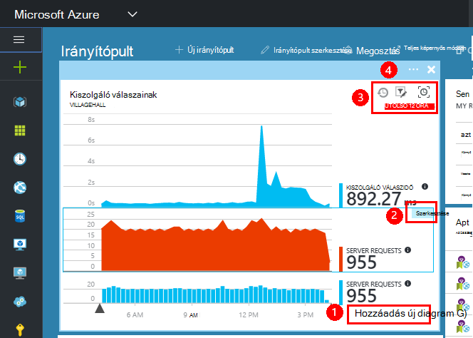

1. Diagram hozzáadása a csempére. 
2. Metrikus, csoportosítási dimenzió és diagram stílusa (táblázat, grafikon) beállítása.
3. Húzza végig a diagram nagyítása; a Visszavonás gombra kattintva állítsa alaphelyzetbe az időszak; szűrő tulajdonságai, hogy a diagramok meg a csempére.
4. Mozaik cím beállítása.

A csempék metrikus explorer pengéit a kiemelt további lapszerkesztési lehetőségek, mint az Áttekintés lap a kiemelt csempék van.

Az eredeti, a kiemelt csempét nem érinti a szerkesztést.

## Váltás az irányítópultok között

Egynél több irányítópult mentheti, és válthat közöttük. Ha rögzít egy diagramot vagy a lap, az aktuális irányítópult felvették őket.

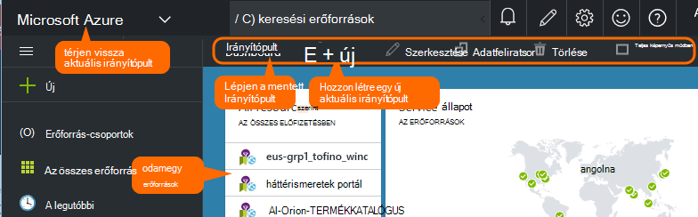

Ha például lehet, hogy a teljes képernyős megjelenítéséhez kattintson a szoba, a másik pedig a fejlesztéshez általános egy irányítópult.

Az Irányítópulton egy lap jelenik meg a csempe: a gombra kattintva nyissa meg a lap. Diagram a diagram eredeti helyén replikálja.

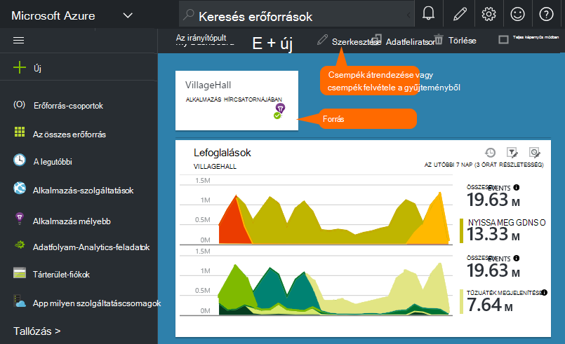

## Az irányítópultok megosztása

Ha létrehozott egy irányítópult, megoszthatja azt másokkal.

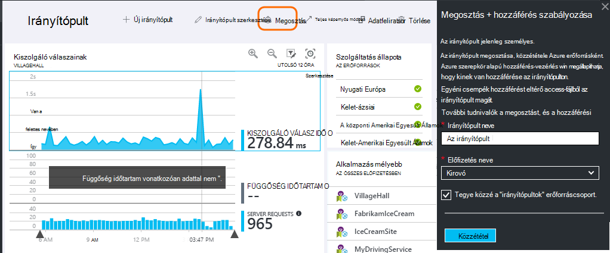

Tudjon meg többet a [szerepkörök és a hozzáférés-vezérlés](app-insights-resources-roles-access-control.md).

## Alkalmazás navigációs

Az Áttekintés lap az alkalmazás további információt az átjárót.

* Kattintson a **diagram vagy a mozaik elrendezés** – csempe vagy diagram részletesebb információkat micsoda megjelenítéséhez.

### Áttekintés lap gomb

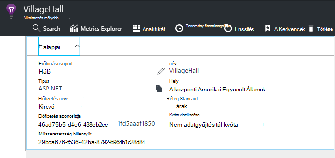

* [**Mértékek Intéző**](app-insights-metrics-explorer.md) - saját teljesítményének és látogatottságának a diagramok létrehozása.
* [**Keresés**](app-insights-diagnostic-search.md) - események kérelmeket, kivételeket, például egyedi előfordulását vizsgálja meg, és jelentkezzen be a nyomkövetési naplók.
* [**Analytics**](app-insights-analytics.md) - hatékony lekérdezések a telemetriai fölé.
* **Időtartomány** - módosítsa a tartomány, kattintson a lap minden diagram által megjelenített.
* **Törlése** – az alkalmazás az összefüggéseket erőforrás alkalmazással kapcsolatos törlése. Használata kell is az alkalmazás az összefüggéseket csomagok eltávolítása az alkalmazás kódot, vagy szerkesztése a [műszerezettségi kulcs](app-insights-create-new-resource.md#copy-the-instrumentation-key) irányítsa át egy másik alkalmazás háttérismeretek erőforráshoz telemetriai a alkalmazásban.

### Alapvető tudnivalók lap

* [Műszerezettségi kulcs](app-insights-create-new-resource.md#copy-the-instrumentation-key) – az alkalmazás erőforrás azonosítja. 
* Árak - ellenőrizze a szolgáltatások elérhető és beállított mennyiségi CAPS LOCK.

### App navigációs sávja

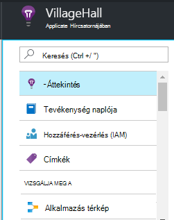

* **Áttekintése** – az alkalmazás áttekintése lap vissza.
* **Tevékenység naplója** - riasztások és Azure felügyeleti események.
* A [**hozzáférés-vezérlés**](app-insights-resources-roles-access-control.md) – csapattagok és másokkal való hozzáférést biztosít.
* [**Címkék**](../resource-group-using-tags.md) - címkék használata a csoportosítása az alkalmazás másokkal.

VIZSGÁLJA MEG A

* [**Alkalmazás map**](app-insights-app-map.md) – az alkalmazás részei megjelenítő aktív térkép származik, az objektumfüggőségekre vonatkozó információk.
* [**Megelőző diagnosztika**](app-insights-proactive-diagnostics.md) - Véleményezés legutóbbi teljesítmény értesítések.
* [**Élő adatfolyam**](app-insights-metrics-explorer.md#live-stream) - A rögzített közelében azonnali mértékek, akkor hasznos, ha telepíti az új építés értékhalmazt vagy hibakeresése során.
* [**Elérhetősége / vizsgálatok webes**](app-insights-monitor-web-app-availability.md) -normál kérést küld a world.* körül a web appban 
* [**Hibák, a teljesítmény**](app-insights-web-monitor-performance.md) - kivételeket, hiba díjak és válaszidő kérések az alkalmazás és az alkalmazás kérelmek [függőségek](app-insights-asp-net-dependencies.md).
* [**Teljesítmény**](app-insights-web-monitor-performance.md) - válaszidő, függőség válaszidő. 
* [Kiszolgálók](app-insights-web-monitor-performance.md) - teljesítmény számláló. Ha elérhető [állapot Monitor telepíthető](app-insights-monitor-performance-live-website-now.md).

* **Böngésző** - lap nézetben, és AJAX teljesítményét. Ha elérhető, az [eszköz a weblapokhoz](app-insights-javascript.md).
* A függvény összeszámolja **használatát** - lap nézetben, a felhasználó és a munkamenetet. Ha elérhető, az [eszköz a weblapokhoz](app-insights-javascript.md).

KONFIGURÁLÁSA

* **Első lépések** – a beágyazott oktatóprogram.
* **Tulajdonságok** - műszerezettségi billentyűt, az előfizetés és erőforrás-azonosító.
* [Értesítések](app-insights-alerts.md) - metrikus beállítást.
* A [folyamatos exportálása](app-insights-export-telemetry.md) - Azure tárolóhoz telemetriai exportálása konfigurálása.
* A webhely szintetikus terhelést beállítása [a teljesítmény tesztelése](app-insights-monitor-web-app-availability.md#performance-tests) .
* [Kvóta és árak](app-insights-pricing.md) és a [Bevitel mintavételnél](app-insights-sampling.md).
* **API Access** - [Széljegyzetek kiadás](app-insights-annotations.md) létrehozása és az adatok Access API.
* [**Elemek működnek**](app-insights-diagnostic-search.md#create-work-item) - csatlakoztatása a munka nyomon követése a rendszer, így a hibák vizsgálata telemetriai közben hozhat létre.

BEÁLLÍTÁSOK

* A [**Zárolás**](..\resource-group-lock-resources.md) - Azure források zárolása
* [**Automatizálási parancsfájl**](app-insights-powershell.md) - exportálja az Azure erőforrás meghatározását, így azok felhasználhatja azt sablonként hozhat létre új erőforrásokat.

TÁMOGATÁS

* **Támogatási kérelem** - szükséges a fizetős verzióra. Lásd még: [Ha segítségre van szüksége](app-insights-get-dev-support.md).

## Mi az következő?

||
|---|---
|[Mértékek explorer](app-insights-metrics-explorer.md) Szűrés és a szakasz mérőszámok|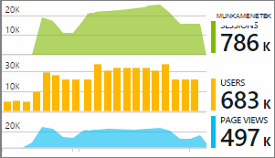
|[Diagnosztikai keresés](app-insights-diagnostic-search.md) Keresse meg és eseményeket, kapcsolódó eseményeket, nézze meg, és hibák létrehozása |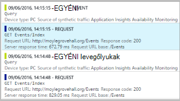
|[Elemző](app-insights-analytics.md) Hatékony lekérdezési nyelv| 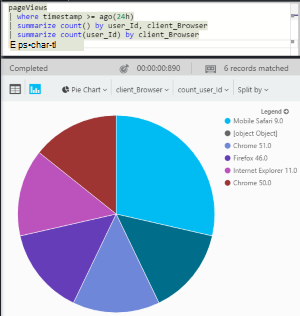

