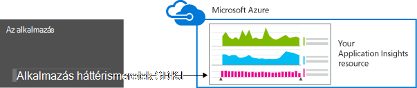
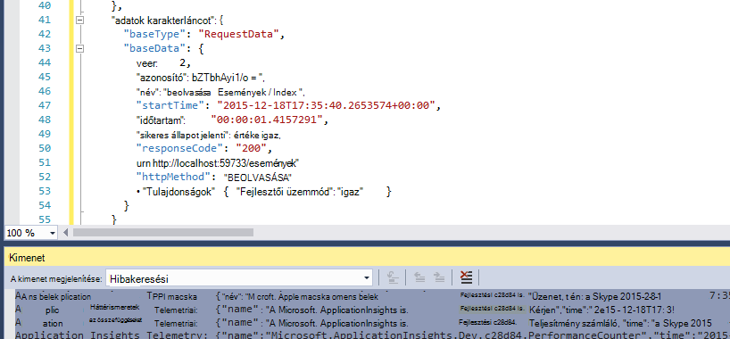
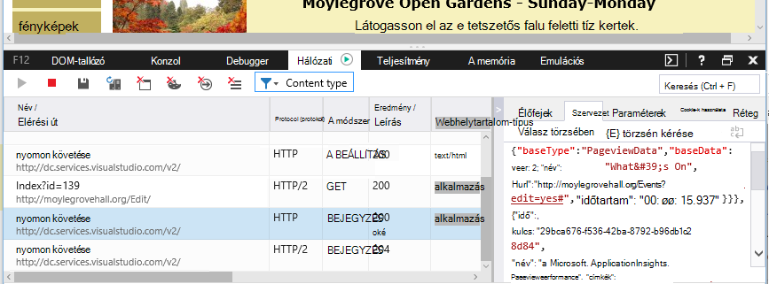

<properties 
    pageTitle="Adatmegőrzés és az alkalmazás mélyebb tárolás" 
    description="Adatmegőrzési és adatvédelmi nyilatkozat" 
    services="application-insights" 
    documentationCenter=""
    authors="alancameronwills" 
    manager="douge"/>

<tags 
    ms.service="application-insights" 
    ms.workload="tbd" 
    ms.tgt_pltfrm="ibiza" 
    ms.devlang="na" 
    ms.topic="article" 
    ms.date="05/17/2016" 
    ms.author="awills"/>

# Adatgyűjtés, adatmegőrzés és alkalmazás az összefüggéseket a tárhely 

*Alkalmazás háttérismeretek az előzetes verzióban.*

Ha telepíti a [Visual Studio alkalmazás háttérismeretek] [ start] SDK csomagjában talál az alkalmazásában, küld telemetriai tudni az alkalmazás a felhőben. Természetesen felelős fejlesztők szeretné, hogy pontosan milyen adatokat küldi el, mi történik az adataival, és hogyan azokat is, hogy a beállítás azt. Különösen sikerült bizalmas adatokat elküldeni, hol található a tárolt, és hogyan biztonságos található ez? 

Első, a válasz röviden:

* A szokásos telemetriai modulok "kívül a mezőben" futó valószínűleg nem bizalmas adatokat küld a szolgáltatást. A telemetriai betöltése, teljesítményének és látogatottságának mértékek, a kivétel jelentések és egyéb diagnosztikai adatok foglalkozik. A fő felhasználói adatok látható a diagnosztikai jelentések URL-címek; de az alkalmazás minden esetben kerülni a Webhelyfiókok helyezze a bizalmas adatokat az egyszerű szöveg az URL-címet.
* Az kódírás küld további egyéni telemetriai segítséget nyújt a diagnosztikai és felügyeleti használatát. (Ez bővítési alkalmazás mélyebb remek szolgáltatása a.) Azt is lehetséges, helyezve, írja be a kódot, hogy a személyes és más bizalmas adatokat tartalmazza. Ha az alkalmazás működik-e a ezeket az adatokat, erős Véleményezés folyamatok vonatkozik, írja be az összes kódot.
* Fejlesztés és az alkalmazás tesztelés során nagyon egyszerűen vizsgálja meg, mi a SDK küldött. Az adatok jelennek meg a IDE, és a böngésző hibakeresési kimeneti ablakát. 
* Az adatokat a [Microsoft Azure](http://azure.com) -kiszolgálók az Amerikai Egyesült Államokban kell tartani. (De az alkalmazás futtatását is lehetővé teszi bárhol.) Azure [erős biztonsági folyamatok és megfelelőségi szabványokat széles köre megfelel](https://azure.microsoft.com/support/trust-center/)tartalmaz. Csak a kijelölt csoport hozzáféréssel rendelkeznek az adatokhoz. A Microsoft oktatói is korlátozta való hozzáférést, csak bizonyos körülmények korlátozott a ismeretekkel. A hálózaton átvitt, azonban nem szerepel a kiszolgáló titkosított.

Ez a cikk a többi teljesebb alapuló, ezek a válaszok. Célja az, hogy önálló, lehet, hogy munkatársai, akik nem azonnali csapata részét szeretné megjeleníteni.

## Mi az alkalmazás az összefüggéseket?

[Visual Studio alkalmazás háttérismeretek] [ start] , amely segít a Microsoft által nyújtott szolgáltatás javíthatja a teljesítményt, és az élő alkalmazás használhatósági. Az alkalmazás a mindig fut, a tesztelés során és után az Ön által közzétett vagy üzembe figyeli. Alkalmazás háttérismeretek hoz létre, diagramok és táblázatok, amely a megjelenítése, például, melyik napon időpontok kap a legtöbb felhasználó, hogyan válaszol az alkalmazás, és mennyire felszolgált minden olyan külső szolgáltatásai, amelytől függ. Ha összeomlik, hibák vagy teljesítményét érintő hibák, kereshet az telemetriai adatokat okának – részletes verzió. És a szolgáltatás elküldi e-mailek változásai rendelkezésre állásának és az alkalmazás teljesítményének esetén.

Ahhoz, hogy ezt a funkciót, telepítse az alkalmazást az összefüggéseket SDK az alkalmazást, a kód részévé válik. Amikor az alkalmazás fut, a SDK figyeli működését, és telemetriai küld az alkalmazás mélyebb szolgáltatásnak. Ez a egy felhőalapú szolgáltatásba, [A Microsoft Azure](http://azure.com)által üzemeltetett. (De alkalmazás háttérismeretek működik az alkalmazások, nem csak azokat, amelyek az Azure-ban tárolt.)

Az alkalmazás az összefüggéseket szolgáltatás tárolja, és elemzi a telemetriai. Az analysis vagy a találatok között a tárolt telemetriai megtekintéséhez jelentkezzen be az Azure-fiókjába, és nyissa meg az alkalmazást az összefüggéseket erőforrás az alkalmazás. Az adatokhoz való hozzáférés csapata más tagjaival, vagy meghatározott Azure előfizetők is megoszthatja.

Beállíthatja, hogy az alkalmazás az összefüggéseket szolgáltatást, például egy adatbázist, vagy külső eszközök exportált adatok. Egyes eszközök biztosítson egy speciális kulcs, fog kapni a szolgáltatásból. A kulcs is vonni, ha szükséges. 

Alkalmazás háttérismeretek SDK alkalmazás típusú tartományra érhetők el: a saját J2EE vagy ASP.NET Servers vagy Azure; a szolgáltatások webes a webes ügyfelek – Ez azt jelenti, hogy a kódot az weblapon, fut. asztali alkalmazások és szolgáltatások; eszköz alkalmazások, többek között a Windows Phone, az iOS és az Android. Az összes küldenek telemetriai, ugyanazt a szolgáltatást.

## Adatok azt gyűjt?

### Hogyan szűrhetem ki az adatokat kell felvenni?

Vannak három adatforrások:

* A SDK csomagjában talál, amelyek integrálnia az alkalmazást [egy fejlesztés alatt álló](app-insights-asp-net.md) vagy a [futásidőben](app-insights-monitor-performance-live-website-now.md). Vannak a különböző típusok különböző SDK. Egy [webhely lapjainak SDK](app-insights-javascript.md), együtt a lapon a végfelhasználó böngészőbe betöltő is van.

 * Minden egyes SDK [modulokat](app-insights-configuration-with-applicationinsights-config.md), amelyek különféle technikákat, amelyekkel gyűjthetők össze az telemetriai különböző típusú számos rendelkezik.
 * Ha telepíti a SDK fejlesztése, annak API segítségével küldje el saját telemetriai szabványos modulokat. A egyéni telemetriai is elhelyezhet a küldeni kívánt adatokat.
* Az egyes webkiszolgálón is, amelyek összegzik az alkalmazás futtatásához, és küldje el a Processzor, a memória és a hálózati használati telemetriai. Ha például Azure VMs, Docker hosts és [J2EE kiszolgálók](app-insights-java-agent.md) beállíthatja, hogy ilyen ügynökök.
* [Elérhetőség vizsgálatok](app-insights-monitor-web-app-availability.md) kérést küld a web app rendszeres időközönként futtassa a Microsoft által folyamatok. Az alkalmazás az összefüggéseket szolgáltatás elküldi az eredményeket.

### Milyen típusú begyűjtési?

A fő kategóriák a következők:

* [Webhely kiszolgálói telemetriai](app-insights-asp-net.md) - HTTP-kérelmeket.  URI-, idő feldolgozása a kérést, a válasz kód, a ügyfél IP-címe. Munkamenet azonosítója.
* Megszámolja a [weblapok](app-insights-javascript.md) - lapon, a felhasználók és a munkamenetet. Lapok betöltésével. Kivételek. AJAX-hívások.
* Teljesítmény számláló - memória Processzor, IO, hálózati használati.
* Ügyfél- és kiszolgálóoldali környezet - OS, a területi beállítások, a eszköz típusa, a böngészőben, a képernyőfelbontás.
* [Kivételek](app-insights-asp-net-exceptions.md) és összeomlik - **Papírhalom kiírja**, összeállítása azonosítója, típusa Processzor. 
* [Függőségek](app-insights-asp-net-dependencies.md) - külső szolgáltatások, például a többi, SQL, AJAX hívásokat. URI vagy a kapcsolati karakterláncot, időtartam, sikeres, parancsot.
* [Elérhetőség vizsgálatok](app-insights-monitor-web-app-availability.md) - próba és a lépéseket, a válaszok időtartamát.
* [A nyomkövetési naplók](app-insights-search-diagnostic-logs.md) és [egyéni telemetriai](app-insights-api-custom-events-metrics.md) - **semmit, a naplók vagy telemetriai kód**.

[További részletek](#data-sent-by-application-insights)elemre.

## Hogyan ellenőrizheti meg, hogy milyen gyűjtenek?

A Visual Studio segítségével alkalmazás fejleszt, futtassa az alkalmazást (F5) hibakeresési módban. A telemetriai megjelenik a kimeneti ablakban. Itt másolja a vágólapra, és formázza esetében könnyű vizsgálat JSON. 

Van még egy olvashatóbbá nézet a diagnosztika ablak.

Weblapok nyissa meg a böngésző hibakeresési ablakot.

### A telemetriai szűrése az elküldés előtt kódot is írhat?

Ez lehet egy [telemetriai processzor beépülő modul](app-insights-api-filtering-sampling.md)írásával.

## Mennyi ideig az adatok legyen? 

Nyers adatpontok (Ez azt jelenti, cikkek, amelyek a diagnosztikai keresés megvizsgálhatja) 7 napig tárolja. Ha szeretné tartani az adatokat, hogy hosszabb van szüksége, [folytonos exportálás](app-insights-export-telemetry.md) másolja a vágólapra a tárterület-fiókjába is használhatja.

Összesített adatok (Ez azt jelenti, hogy száma, átlagokat és egyéb statisztikai adatok metrikus Explorer megjelenő) a 30 nap, és 1 órára vagy legalább 90 napig (attól függően, hogy írjon be egy) 1 nap 1 perc egy szemek megőrződnek.

## Ki férhet hozzá az adatokat?

Az adatok jelenik meg, és ha a szervezeti fiókkal rendelkezik, a csapattagok. 

Rá lehet exportálni, és a csapattagok és sikerült másolható más helyekre, és mások eljussanak.

#### A Microsoft mire szolgál a alkalmazásom alkalmazás mélyebb küld adatokat?

Csak annak érdekében, hogy a szolgáltatás nyújtásához, a Microsoft használja az adatokat.

## Az adatok tárolási helye? 

* Az Amerikai Egyesült Államokban. 

#### Tudja meg máshol kell tárolni, például Európában? 

* Jelenleg nem. 

#### Amely azt jelent szerepeltethetők az Amerikai Egyesült Államokban van az alkalmazás?

* nem. Az alkalmazás futtatását is lehetővé teszi, bárhol a saját helyszíni hosts vagy a felhőben.

## Hogyan biztonságos-e az adatok?  

Alkalmazás háttérismeretek egy Azure szolgáltatás előzetes verzióban. Miközben a képen a házirendek az [Azure biztonság, adatvédelem és megfelelőség tanulmány](http://go.microsoft.com/fwlink/?linkid=392408)ismertetett használati adatok védelméhez dolgozunk.

Microsoft Azure-kiszolgálók vannak tárolva az adatok. Az Azure-portálon fiókok számára az [Azure biztonság, adatvédelem és megfelelőség dokumentum](http://go.microsoft.com/fwlink/?linkid=392408)fiók korlátozásai témakörben olvashat. A Visual Studio Team Services portál fiókjainak a [Visual Studio csapat szolgáltatások adatvédelmi](http://download.microsoft.com/download/8/E/E/8EE6A61C-44C2-4F81-B870-A267F1DF978C/MicrosoftVisualStudioOnlineDataProtection.pdf) dokumentum vonatkozik. 

A Microsofton adatokhoz való hozzáférés korlátozva: Azt elérheti, hogy az adatok csak a engedéllyel rendelkező, és ha szükség az alkalmazás mélyebb támogatására. 

Az ügyfelek számára (például adatsebesség és a nyomkövetési naplók átlagos méretének) összesített adatok használatos javítható az alkalmazás az összefüggéseket.

#### Akadályozhatja másvalaki telemetriai az alkalmazás az összefüggéseket adataimat?

További telemetriai sikerült küldenek a fiókjához, hogy a program a kódot a weblapok a műszerezettségi termékkulcsot használatával. Elég további adatokat a mérőszámok volna nem megfelelően jelenítik meg az alkalmazás teljesítményének és látogatottságának.

Ha más projektekben megosztja kódot, ne felejtse el a műszerezettségi kulcs eltávolítása.

## Az adatok titkosítva van? 

A jelenleg kiszolgálók belül nem.

Az összes adat titkosítva van, Ugrás adatközpontokban között.

#### Az adatok titkosítva vannak a hálózaton átvitt alkalmazás mélyebb kiszolgálókkal az alkalmazásból?

Igen, hogy segítségével https adatok küldése a portálra szinte minden SDK, beleértve a webkiszolgálón, eszközök és HTTPS-weblapok. Az egyetlen kivétel, egyszerű HTTP weblaprészeket vághat ki küldött adatok. 

## Személyes azonosításra

#### Személyes azonosításra alkalmas adatokat Gyűjthet alkalmazás mélyebb lehet küldeni? 

Igen, lehetőség. 

Mint szóló általános útmutatás:

* Közvetlen adat nem része a legtöbb szabványos telemetriai (Ez azt jelenti, hogy telemetriai küldött programozás nélkül). Jó helyen jár esetleg azonosítása személyek által megállapítás események gyűjteményéből.
* Kivétel és a nyomkövetési üzenetek tartalmazó adat
* Egyéni telemetriai – Ez azt jelenti, például kód segítségével a API-val, vagy jelentkezzen halad kézzel írt TrackEvent hívások - kiválaszthatja, hogy adatokat is tartalmazhatnak.

A táblázat a dokumentum végén gyűjtött adatok részletesebb leírását tartalmazza.

#### Vagyok felel törvényi és tekintetében adat szabályok?

igen. A feladata annak érdekében, hogy a webhelycsoport és az adatok felhasználása megfelel törvények és szabályok, valamint a Microsoft Online Services adatokkal.

A vevők megfelelően tájékoztatni az alkalmazás által gyűjtött adatokat, és az adatok használatát.

#### A felhasználók számára kikapcsolhatók alkalmazás összefüggéseket?

Nem közvetlenül. Verziójától eltérően nem kínálja egy kapcsoló, amely a felhasználók is működik, kapcsolja ki az alkalmazást az összefüggéseket.

A funkció azonban segítségével miként állíthat az alkalmazást. Az összes SDK egy API beállítást, azzal kikapcsolja azokat a telemetriai webhelycsoport tartalmazzák. 

#### Az alkalmazás véletlenül gyűjt bizalmas információkat. Is alkalmazás háttérismeretek csúszkákkal ezeket az adatokat, hogy nem tartja meg?

Alkalmazás háttérismeretek nem szűrése vagy az adatok törlése. Érdemes megfelelően kezelése az adatokat, és ne küldjön ezek az adatok mélyebb alkalmazást.

## Az adatok mélyebb alkalmazás által küldött

A SDK platformokon eltérnek, és több összetevők telepítheti. ( [Alkalmazás háttérismeretek – első]lépések a hivatkozott[start].) Minden összetevő különböző adatokat küld.

#### A különböző forgatókönyvekben küldött adatok osztályok

A művelet  | Adatok osztályok gyűjtött (lásd a következő táblázatban)
---|---
[Alkalmazás mélyebb SDK hozzáadása .NET webes projekthez][greenbrown] | Kiszolgálói környezet Következtetett Perf számláló Kérések **A kivételek** Munkamenet felhasználók
[IIS állapot Monitor telepítése][redfield]|Függőségek Kiszolgálói környezet Következtetett Perf számláló
[Java webalkalmazást alkalmazás háttérismeretek SDK hozzáadása][java]|Kiszolgálói környezet Következtetett Kérés Munkamenet felhasználók
[A JavaScript SDK elhelyezése a weblapokon][client]|ClientContext  Következtetett Lap ClientPerf AJAX
[Alapértelmezett tulajdonságainak megadása][apiproperties]|Az összes normál és egyéni események **tulajdonságai**
[Hívás TrackMetric][api]|Numerikus értékek **Tulajdonságok**
[Hívás követése *][api]|Esemény neve **Tulajdonságok**
[Hívás TrackException][api]|**A kivételek** Egymást fedő kiírása **Tulajdonságok**
SDK nem gyűjt adatokat. Példa:   -perf számláló nem érhető el.  -telemetriai inicializálója kivétel | SDK diagnosztika
 

A [más platformokon SDK][platforms], azok a dokumentumok megtekintéséhez.

#### Az osztályok gyűjtött adatok

Gyűjtött adatok osztály | (Nem egy teljes listát) tartalmazza. 
---|---
**Tulajdonságok**|**Bármilyen érték – határozza meg a kód**
DeviceContext |Azonosító, IP, területi beállítástól modell eszköz, hálózati, hálózati típusa, OEM nevét, képernyőfelbontás szerepkör-példányt, a szerepkör neve, az eszköz típusa
ClientContext |Operációs rendszer területi, a nyelv, a hálózati és a felbontás ablak
Munkamenet | munkamenet-azonosító
Kiszolgálói környezet |Számítógépnév, területi beállítástól OS, eszközt, felhasználói munkamenet, felhasználói környezettel, a művelet 
Következtetett |IP-címet, az időbélyegző, a rendszer, böngésző GEO helyről
Mértékek | Metrikus neve és
Események | Esemény neve és
PageViews | URL-CÍMEK és az oldal vagy a képernyő nevét.
Ügyfél perf | URL-cím vagy az oldal nevét, a böngésző Betöltés ideje
AJAX | HTTP hívásait weblap-kiszolgálóra
Kérések |URL-CÍMÉT, időtartam, a válasz-kód
Függőségek|Típus (SQL, HTTP,...), a kapcsolati karakterlánc vagy URI, szinkronizálási/aszinkron, időtartam, sikeres, SQL-utasítást (ha az állapot Monitor)
**A kivételek** | Típus, **üzenet**, hívási, forrás fájl- és vonalstílus száma, azonosítója szál
Összeomlik | Folyamat azonosítója, a szülő folyamat azonosítója, a összeomlik szál azonosító; alkalmazás javítása, azonosítója, összeállítás;  kivételtípus, cím, ezért; kódolt szimbólumok és nyilvántartások, bináris kezdő és záró címek, bináris nevét és elérési útját, processzor típusa
Nyomon követése | **Üzenet** - és súlyosságát szint
Perf számláló | Processzor, rendelkezésre álló memória, kérelem ráta, kivétel ráta, személyes bájt folyamat, IO ráta, kérelem időtartam, várólista hossza kérése
Elérhetőség | Webes próba válasz kód, a időtartama minden próba lépés, próba nevét, időbélyeg, sikeres, válaszidő, próba helye
SDK diagnosztika | Üzenet nyomon követése és a kivétel 

[Váltás szerkesztési ApplicationInsights.config az adatok egy része ki] van lehetősége[config]

## Credits

A termék MaxMind [http://www.maxmind.com](http://www.maxmind.com)elérhető által létrehozott GeoLite2 adatokat tartalmaz.

## Videók

#### – Bevezetés

> [AZURE.VIDEO application-insights-introduction]

#### Első lépések

> [AZURE.VIDEO getting-started-with-application-insights]

<!--Link references-->

[api]: app-insights-api-custom-events-metrics.md
[apiproperties]: app-insights-api-custom-events-metrics.md#properties
[client]: app-insights-javascript.md
[config]: app-insights-configuration-with-applicationinsights-config.md
[greenbrown]: app-insights-asp-net.md
[java]: app-insights-java-get-started.md
[platforms]: app-insights-platforms.md
[pricing]: http://azure.microsoft.com/pricing/details/application-insights/
[redfield]: app-insights-monitor-performance-live-website-now.md
[start]: app-insights-overview.md

 