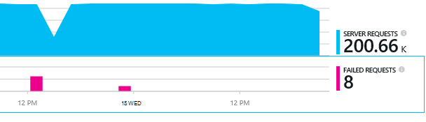

<properties 
    pageTitle="Az alkalmazás az összefüggéseket függőségek problémáinak diagnosztizálása" 
    description="Hibák és függőségek miatt lelassulhat keresése" 
    services="application-insights" 
    documentationCenter=""
    authors="alancameronwills" 
    manager="douge"/>

<tags 
    ms.service="application-insights" 
    ms.workload="tbd" 
    ms.tgt_pltfrm="ibiza" 
    ms.devlang="na" 
    ms.topic="article" 
    ms.date="05/12/2016" 
    ms.author="awills"/>
 
# <a name="diagnosing-issues-with-dependencies-in-application-insights"></a>Az alkalmazás mélyebb függőségek problémáinak diagnosztizálása


*Függőség* egy külső összetevő, amely szerint az alkalmazás neve. Érdemes a szokásos HTTP, vagy egy adatbázis vagy fájlrendszer nevű szolgáltatás. Vagy az weblapon parancsfájl lehet egy AJAX-hívás a kiszolgálóra. Visual Studio alkalmazás Hírcsatornájában akkor egyszerűen láthatja mennyi ideig az alkalmazás vár, függőségek, és milyen gyakran egy függőség hibát jelez.

## <a name="where-you-can-use-it"></a>Ahol használni tudja

Beépített függőség figyelése jelenleg tartozik:

* ASP.NET web Apps alkalmazások és Azure vagy IIS-kiszolgálón futó szolgáltatások
* [Java web Apps alkalmazások](app-insights-java-agent.md)
* [Weblapok](https://azure.microsoft.com/blog/ajax-collection-in-application-insights/)

Más típusú eszköz alkalmazásokat, például a saját a [TrackDependency API](app-insights-api-custom-events-metrics.md#track-dependency)monitor is írhat.

A függőséget ki-be a monitor jelenleg jelentések függőségek ilyen típusú hívásokat:

* ASP.NET
 * SQL-adatbázisait
 * ASP.NET-webhely és a HTTP-alapú kötések használó WCF-szolgáltatások
 * Helyi vagy távoli HTTP hívások
 * Azure DocumentDb, tábla, blob-tárolóhoz és várakozási sora
* Java
 * Hívások [JDBC](http://docs.oracle.com/javase/7/docs/technotes/guides/jdbc/) illesztőprogram, például a MySQL, SQL Server, PostgreSQL vagy SQLite keresztül adatbázishoz.
* Weblapok
 * [AJAX-hívások](app-insights-javascript.md)

Ismét a saját SDK hívásokat más függőségek Lync is írhat.

## <a name="to-set-up-dependency-monitoring"></a>Függőség figyelése beállítása

A kiszolgáló megfelelő ügynököt.

Platform | Telepítés
---|---
IIS-kiszolgáló | Akár [telepíteni a kiszolgálón állapot Monitor](app-insights-monitor-performance-live-website-now.md) vagy [a .NET-keretrendszer 4.6-os vagy újabb alkalmazás frissítése](http://go.microsoft.com/fwlink/?LinkId=528259) és az [Alkalmazás az összefüggéseket SDK](app-insights-asp-net.md) az alkalmazást a telepítés.
Azure Web App alkalmazásban | [Az alkalmazás az összefüggéseket bővítmény](app-insights-azure-web-apps.md)
Java-webkiszolgálón | [Java web Apps alkalmazások](app-insights-java-agent.md)
Weblapok | [A JavaScript monitor](app-insights-javascript.md) (Nem további beállítási túl az weblapon figyelése)
Azure felhőalapú szolgáltatás |  [Használható indítási feladat](app-insights-cloudservices.md#dependencies) vagy [telepítése .NET-keretrendszer 4.6 +](../cloud-services/cloud-services-dotnet-install-dotnet.md)  

Az állapot Monitor az IIS-kiszolgálókat nem szükséges, hogy az alkalmazás az összefüggéseket SDK a forrás projekt újraépítéséhez. 

## <a name="application-map"></a>Alkalmazás térkép

Alkalmazás térkép működik-e egy szemléltetőelemmel, hogy az alkalmazás részei közötti függőségek felfedezése. 


A Leírás mezőbe a megkeresheti vonatkozó függőség és egyéb diagramok.

Kattintson a kis [x] részfa csukhatja össze.

A térkép az [Irányítópult](app-insights-dashboards.md), ahol legyen teljes funkcionalitású PIN kódot.

[Tudjon meg többet](app-insights-app-map.md).

## <a name="diagnosis"></a>Függőség teljesítménnyel kapcsolatos problémák a webkiszolgálón diagnosztizálása

A kiszolgálón kérések teljesítményének felmérése:


Görgessen le a rács kérelmek figyelmébe:


A felső egy túl sokáig tart. Nézzük meg, ha azt láthatja, hogy hol van töltött idő.

Kattintson a sorát különálló kérelem események megtekintéséhez:


Kattintson a hosszabb ideig futó példányokban vizsgálja meg további.

> [AZURE.NOTE] Görgessen lefelé a Válasszon egy példány egy kicsit. A folyamat a késés előfordulhat, hogy jelenti, hogy az adatokat a felső előfordulását hiányos.

Görgessen le a kérelem kapcsolódó távoli függőség hívásokat:


A kérés a hívást kezdeményez egy helyi szolgáltatás töltött idő karbantartási a legtöbb néz. 

Válassza ki, hogy a sor további információk:


A részleteket a probléma diagnosztizálása elegendő információt tartalmaz.


## <a name="failures"></a>Hibák

Ha sikertelen kérelmek, kattintson a diagramra.



Kattintson egy kérés típusa és a kérelem példány használata esetén keresse meg a sikertelen hívást kezdeményez egy távoli függőséget.


## <a name="custom-dependency-tracking"></a>Egyéni függőség nyomon követése

A normál függőség követése modul automatikusan feltárja a külső függőségeket, például az adatbázisok és a REST API-khoz. De érdemes lehet néhány további összetevőit ugyanúgy kell kezelni. 

Kód, amely az objektumfüggőségekre vonatkozó információk, elküldi a azonos [TrackDependency API](app-insights-api-custom-events-metrics.md#track-dependency) a normál modul által használt írhat.

A kód generál egy összeállítás kézzel írt nem saját magának az, ha például sikerült, az összes hívások meg, hogy milyen hozzájárulása, a válasz időpontok van időt. Ahhoz, hogy az adatok jelennek meg az alkalmazást az összefüggéseket a függőség diagramok, küldje el a `TrackDependency`.

```C#

            var success = false;
            var startTime = DateTime.UtcNow;
            var timer = System.Diagnostics.Stopwatch.StartNew();
            try
            {
                success = dependency.Call();
            }
            finally
            {
                timer.Stop();
                telemetry.TrackDependency("myDependency", "myCall", startTime, timer.Elapsed, success);
            }
```

Kapcsolja ki a szokásos függőség a nyomon követés modul szeretné, ha a hivatkozás DependencyTrackingTelemetryModule eltávolítása [ApplicationInsights.config](app-insights-configuration-with-applicationinsights-config.md).


## <a name="ajax"></a>AJAX

Lásd: a [weblapok hivatkozásra](app-insights-javascript.md).


 