<properties
    pageTitle="Észleli, -mailjei, diagnosztizálása"
    description="Elemzésére összeomlik teljesítményét érintő hibák az alkalmazások diagnosztizálása és feltárása"
    authors="alancameronwills"
    services="application-insights"
    documentationCenter=""
    manager="douge"/>

<tags
    ms.service="application-insights"
    ms.workload="tbd"
    ms.tgt_pltfrm="ibiza"
    ms.devlang="na"
    ms.topic="article" 
    ms.date="11/06/2015"
    ms.author="awills"/>

# Észleli, mailjei és az alkalmazás az összefüggéseket diagnosztizálása

*Alkalmazás háttérismeretek az előzetes verzióban.*

Alkalmazás háttérismeretek könnyebben megtalálhatja a hogyan végrehajtásához az alkalmazást, és mikor érdemes élő használja. És ha a probléma lehetővé teszi, hogy azt, akkor mérje fel, hogy milyen következményekkel segít és elemzéssel könnyebben megállapítható, a probléma okát.

Íme egy csoportból, amelyek a webalkalmazások fejleszt fiók:

* *"Nappal korábban pár, azt telepítését a"kisebb"gyorsjavítást. Egy széles próba fázis nem futtatás, de sajnos néhány váratlan módosítása használ a tartalom nem kompatibilis az első és hátsó végű okozó egyesítve. Azonnal kiszolgáló kivételek jelentősen növekedett, az értesítés akkor következik be, és azt a helyzet tudatában végzett. Néhány kattintással az alkalmazás az összefüggéseket portálon a nem vagyok a gépnél, hogy kapott elegendő információt kivétel callstacks szűkítéséhez a problémát. Hogy azonnal visszaállítja, és a sérülések korlátozott. Alkalmazás háttérismeretek hozott létre a Váltás a devops része nagyon egyszerűen és értekezletekre."*

Lássuk, hogyan egy tipikus webes fejlesztőcsapatához segítségével alkalmazás háttérismeretek figyelemmel kísérheti teljesítményét. A csapat a Fabrikam Bank, amelyek az online banki rendszer (OBS) fejleszt követendő azt.

A csapat működik ciklusban jelennek meg:

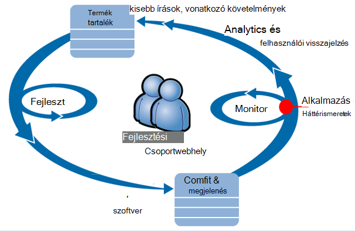

A fejlesztői tartalék (feladatlista)-hírcsatorna követelményeknek. Működnek rövid gyakran előadása munka szoftver - általában formájában fejlesztés és a meglévő alkalmazást bővítmények metodika fázisait. Az élő alkalmazás gyakran frissül olyan új funkciókat. Élő lép, a csapat figyeli a teljesítmény és a hírcsatornájában alkalmazás segítségével használatát. Az elemzés az illető fejlesztési tartalék hírcsatornák.

A csapat figyelheti a élő webalkalmazás szorosan az alkalmazás az összefüggéseket használja:
* Teljesítményét. Ha meg szeretné érteni, hogy hogyan változnak válaszidő kérelem száma; vágynak mennyi Processzor, hálózati, lemez és más erőforrások használnak; és a hol találhatók a a szűk.
* Hibák. Ha létezik a kivételek sikertelen kérelmek, vagy ha egy teljesítményét számláló a kényelmes tartományon kívül eső kerül, a csapatnak meg kell tudnia gyorsan, hogy azok is a művelet végrehajtása, vagy.
* Használatát. A kiadott egy új szolgáltatást, a csapat szeretné, hogy milyen mértékig használt, és hogy a felhasználók az általa kérdése van.

Vegyük kiemelése a ciklus visszajelzés részét:

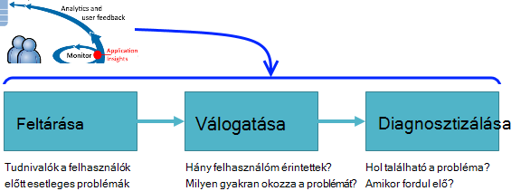

## Gyenge elérhetősége feltárása

Marcela Markova egy vezető fejlesztő a OBS csoport, és megnyitja az érdeklődő a figyelését online teljesítményét. Állítja be a több [webes vizsgálatok][availability]:

* Egy egyetlen-URL tesztcélú az alkalmazást, a fő céloldal http://fabrikambank.com/onlinebanking/. HTTP-kód 200 és a szöveg feltétel "Üdvözlő!" állítja. Ha a teszt sikertelen, valami komolyan probléma van a hálózati kiszolgálókon vagy esetleg a telepítési probléma. (Vagy valaki módosította az Üdvözli a! üzenet anélkül, hogy a saját ismert lapon.)

* Egy mélyebb több lépés vizsgálat jelentkezik be, pedig a folyószámla bejegyzésére, ellenőrzése minden oldalon néhány fontos adatokat tartalmazzák. A teszt ellenőrzi, hogy működik-e a hivatkozást a fiókok adatbázishoz. Noémi használ egy kitalált vevőkód: néhány őket karbantartott tesztelése céljából.

Az alábbi teszteket beállítása benne lesz a csapat gyorsan tudni bármely üzemszünetek Marcela.  

A webes próba diagram piros pontokkal hibák jelenik meg:

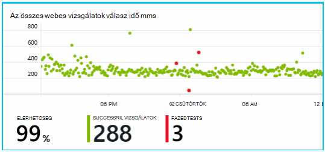

De fontosabb, egy figyelmeztetés kapcsolatos bármilyen hiba lesz küldve a fejlesztői csoport. Úgy, hogy a vevők szinte minden előtt vele tudják.

## Monitor teljesítménymutatók

Alkalmazás háttérismeretek Áttekintés oldalon nincs [kulcs mértékek]számos megjelenítő diagram[perf].

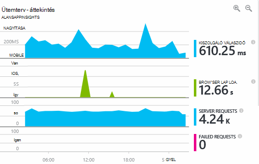

Böngésző lap betöltési idejének közvetlenül a weblapok küldött telemetriai származik. Kiszolgáló válaszidő, a kiszolgáló kérelem darab és a sikertelen kérelem számát adja meg az érintett webkiszolgálóra összes mért és onnan alkalmazás mélyebb küldött.

Marcela kissé foglalkozik, a kiszolgáló válasz grafikon, amely közötti átlagos időt mutatja, amikor a kiszolgáló HTTP felkérés kap, a felhasználó böngészőből, és ha a választ adja vissza. Nem szokatlan változást Ez a diagram, hogy, ahogy a rendszer a betöltés változó. De ebben az esetben úgy tűnik, hogy egy kis emelkedést számának kérelmeket, és a nagy a összefüggés válaszidő nő. Amely jelezheti, hogy a rendszer csak a saját korlátai működik. 

Noémi nyitja meg a kiszolgáló diagramok:

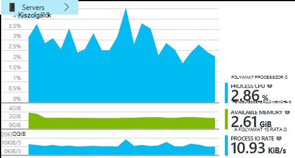

Úgy tűnik, hogy nincs bejelentkezési az erőforrás korlátozás, így például a kiszolgáló válasz diagramok ívek egybeesés csak.

## Értesítések

Ennek ellenére kikkel szeretné figyelemmel válaszidő. Ha túl nagy felkeresik, szeretne tudni az azt közvetlenül.

Az [értesítések]állítja,[metrics], a nagyobb, mint egy tipikus küszöbértéket válaszidő. Ezzel a módszerrel a megbízhatóság, hogy kikkel tudni fogja, vele lassú válaszidő esetén.

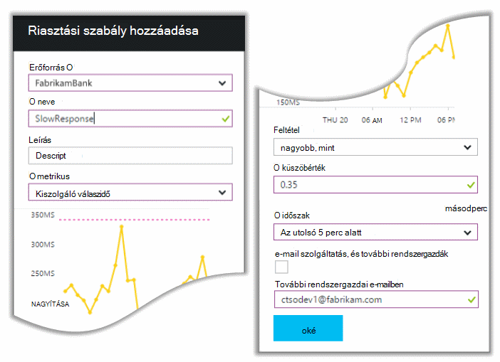

Értesítések beállítható, hogy a számos más mértékek. Ha például e-mailek kap, ha kivétel számának magas válik, vagy a rendelkezésre álló memória kerül alacsony, vagy ha ügyfél kérelmek a csúcs.

## Megelőző diagnosztikai értesítések

Következő napra, figyelmeztető e-mailben érkező alkalmazás az összefüggéseket. De ha éppen nyitja meg, a keresése hivatkozásra a válasz idő figyelmeztetés, amely Noémi a set nem. Ehelyett közli, hogy sikertelen kérelmek – Ez azt jelenti, hogy 500 vagy több hibát kódok visszaküldött összehívások hirtelen növekvő volt.

Sikertelen kérés kerül, ahol felhasználók van láthatók a hiba - általában a következő kivételt be a kódot. Esetleg látják üzenetet kapja: "Sajnos nem tudtuk frissítjük a részletek pillanatban", vagy a abszolút kínos legrosszabb, egy Papírhalom kiírása a felhasználó képernyőn, a webkiszolgáló a.

Ez az értesítés egy jelzés nélküli, mivel Noémi nézett, a legutóbbi hibás kérés számának encouragingly alacsony volt. Egy kis hibák egy foglalt a kiszolgáló nem várható. 

Is volt egy kicsit, egy jelzés nélküli az, hogy mivel őt nem kell az értesítés beállítása. Erre valójában megelőző diagnosztika automatikusan megtalálható a alkalmazás az összefüggéseket. Automatikus igazítása az alkalmazás szokásos hiba mintázatot, és "kap használt" hibák egy adott lapon, vagy nagy terhelés alatt a, illetve más mértékek csatolva. Azt feljebb a riasztást, csak akkor, ha a fenti mire számíthat származik növekvő van.

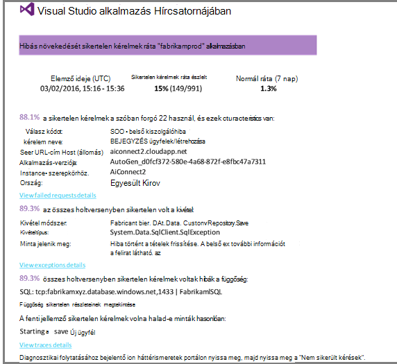

Ez a rendkívül hasznos e-mailben. Csak akkor nem előléptetése egy riasztás; túl ezt nem az hibakezelési és diagnosztikai munkát, sok.

Mutatja, hány ügyfelek érinti, és mely weblapok vagy műveleteket. Marcela eldöntheti, hogy kikkel meg kell kapnia a teljes csoport, mint egy fire részletező megoldásán dolgozik, vagy hogy akkor nyugodtan figyelmen kívül hagyható addig, amíg a jövő héten.

Az e-mailt is látható, hogy egy adott kivétel történt - még több érdekes –, hogy egy adott adatbázis sikertelen hívásainak társítva-e a hibát. Ez ismerteti, hogy miért a hiba váratlanul jelent meg annak ellenére, hogy Marcela a csapat még nincs telepítve az frissítéseiről nemrégiben. 

Az adatbázis csoport vezetője pingelése őt. Igen, azok kiadott egy meleg javítást az elmúlt fél órán; és Oops, esetleg nem lehet, hogy történt kisebb séma módosítás...

A problémát úgy a projektadatok rögzített, még mielőtt naplók vizsgálat alatt, és 15 percet, hogy a felmerülő belül úgy van. Azonban Marcela elemre kattint, a hivatkozásra kattintva nyissa meg az alkalmazást az összefüggéseket. Egyenes alakzatot egy hibás kérés nyílik meg, és azt láthatja, hogy a sikertelen adatbázis hívjuk függőség hívások társított listájában. 

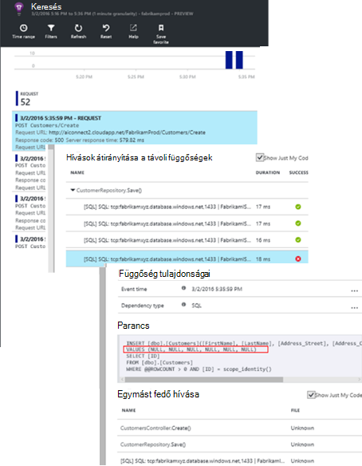

## A kivételek felismerése

A beállítás egy kis a [Kivételek](app-insights-asp-net-exceptions.md) jelentik alkalmazás mélyebb automatikusan. Azok is rögzíthetők explicit módon, [TrackException()](app-insights-api-custom-events-metrics.md#track-exception) hívásainak szúrja be a kódot:  

    var telemetry = new TelemetryClient();
    ...
    try
    { ...
    }
    catch (Exception ex)
    {
       // Set up some properties:
       var properties = new Dictionary <string, string>
         {{"Game", currentGame.Name}};

       var measurements = new Dictionary <string, double>
         {{"Users", currentGame.Users.Count}};

       // Send the exception telemetry:
       telemetry.TrackException(ex, properties, measurements);
    }

A banki Fabrikam csapatának már elért mindig telemetriai üzeneteket küld a kivétel, gyakorlata, kivéve, ha van egy egyértelmű helyreállítási.  

A stratégia valójában még szélesebb verziónál: minden esetben, ha az ügyfélnek bosszantó a mi azok szeretett volna műveleteket szeretne végezni, hogy megfelel a kódot a kivételt-e a telemetriai küldenek. Például ha a külső közötti bank átadás rendszer eredménye "nem sikerül elvégezni a tranzakció" üzenet műveleti valamiért (az ügyfélnek nem hibafa), majd ezek nyomon követheti az esemény.

    var successCode = AttemptTransfer(transferAmount, ...);
    if (successCode < 0)
    {
       var properties = new Dictionary <string, string>
            {{ "Code", returnCode, ... }};
       var measurements = new Dictionary <string, double>
         {{"Value", transferAmount}};
       telemetry.TrackEvent("transfer failed", properties, measurements);
    }

Kivételek jelenteni, mert az objektumhalomban; másolatának küldése TrackException használatos Más események jelentése TrackEvent szolgál. Bármely tulajdonságaik vannak, amelyek akkor lehet hasznos diagnosztikai csatolhat.

A kivételek és események jelenjenek meg a [Diagnosztikai keresési] [ diagnostic] lap. Felhatolás be őket, hogy a további tulajdonságokat utódok egymásra halmozni.

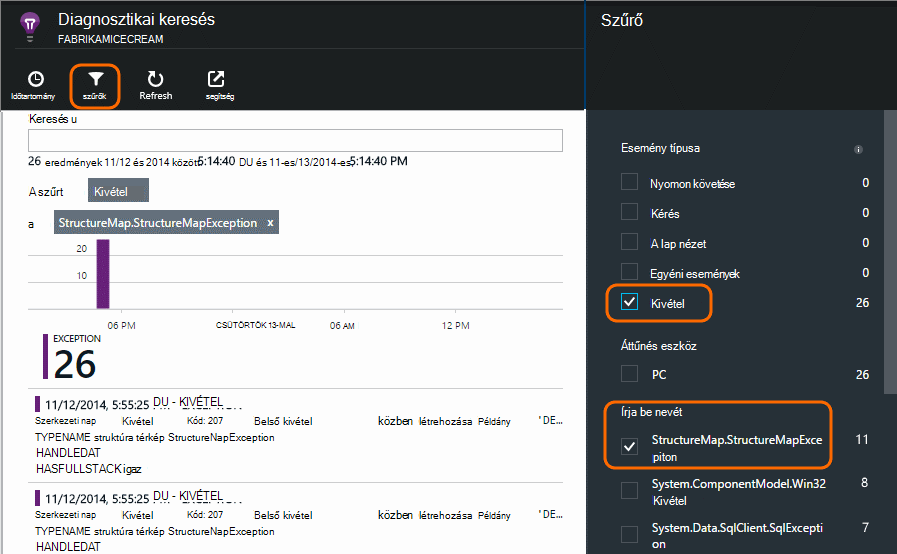

## Felhasználói figyelése

Válasz időpontja rendszeresen kiváló és néhány kivétel, ha a fejlesztői csoport érdemes elképzelnie, hogy a felhasználói élmény fokozása, frissítéséről és a kívánt célok eléréséhez további felhasználók ösztönzésére.

Például a szokásos felhasználói út a webhelyen keresztül törlése "feltérképezése" tartalmaz: vevőknek tekintse meg a különböző típusú kölcsön; mértékének egy részüket töltse ki az ajánlat űrlap; és azok, akik első árajánlat, néhány jóváhagyást és a kölcsön ki állapotba.

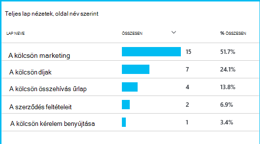

Úgy, hogy hol a vevők legnagyobb számait húzhatja, az üzleti, hogy miként további felhasználók olvas be az feltérképezése alján is dolgozhat. Egyes esetekben előfordulhat, hogy a felhasználói felület (UX) hiba – például a "Tovább" gombra nehéz megtalálni, vagy a képernyőn megjelenő utasításokat nem egyértelmű. Nagyobb valószínűséggel vannak legördülő – másolat jelentősebb üzleti okai: esetleg a kölcsön túl nagy.

A bármilyen okból az adatokat a csapat dolgozza ki, hogy mit tesznek az felhasználók segítséget nyújt. További nyomon követés hívások dolgozhassanak ki részletesebb szúrhatók be. Minden olyan felhasználói műveletek, az egyes gombra kattintással jelentős eredmények fizetésre kölcsön ki például a sűrű részleteit tartalmazó cellákat számlálnia TrackEvent() használható.

Felhasználói tevékenység adatait, amelyek a csoport első használható. Ma amikor csak azok a téma egy új szolgáltatást, működnek meg, hogy hogyan fognak az használatban visszajelzést kapni. A nyomon követés hívások az elejétől funkciójához tervezése őket. A Visszajelzés minden fejlesztési ciklus javítható a szolgáltatás használata.

## Megelőző figyelése  

Marcela csak a Várakozás a riasztások körül nem elhelyezkedik. Minden újratelepítés, azután éppen tart [válaszidő] figyelmébe[ perf] – a teljes ábra és a legkisebb kérelmeket, valamint a kivétel megszámolja a táblázatot.  

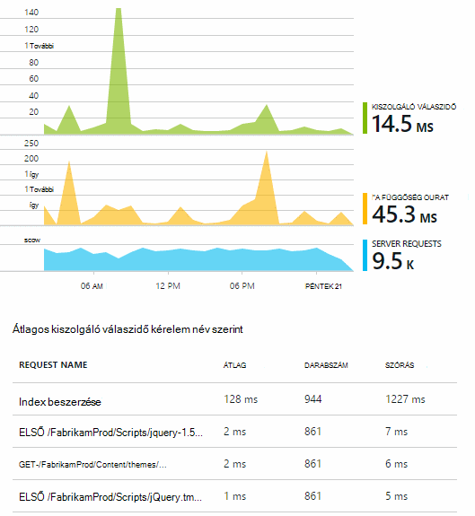

Noémi felmérheti minden példányban teljesítményét hatása a szokásos összehasonlítása az utolsó az egyes hetekben. Ha hirtelen romlik, ő hatványra, hogy a megfelelő a fejlesztők.

## Válogatása

-A súlyosságát és a hiba mértékének felmérése - válogatása észlelési későbbi, mint az első lépés. Érdemes azt telefonszámon a csapat el éjfél? Vagy azt hagyható addig, amíg a tartalék a következő kényelmes távolság? Vannak olyan válogatása a kulcsfontosságú kérdésekre.

Mennyi történik meg? A diagramokat az Áttekintés lap néhány szempont adnak a problémát. Például a Fabrikam alkalmazások által létrehozott négy web próba riasztások egy éjszakai. Megjeleníti a diagram délelőtt, a csapat bemutatásához, hogy valóban néhány vörös pont voltak zöld továbbra is a legtöbb tesztek mintha. Kimutatáshierarchiában való elérhetőségi diagram, világos volt, hogy az összes szakaszos problémákra volt egy próba helyről. Egy hálózati probléma, csak egy útvonal érintő nyilvánvalóan volt, és szeretné valószínűleg törölje magát.  

Ezzel ellentétben a kivétel száma vagy a válasz hányszor grafikon fejthet és állandó növekvő nyilvánvalóan valamit, amit tudni vészhelyzeti.

Egy hasznos válogatása tactic, próbálja meg saját magának. Ha a probléma lép fel, tudni fogja, valós.

A felhasználók milyen tört_nevező érintettek? Egy durva választ juthat a munkamenetek száma a hiba ráta nullával való osztás.

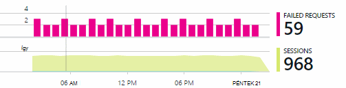

Lassú választ, amíg a táblázat az egyes lapok használatát gyakorisággal legkisebb válaszol kérelmek összehasonlítása

Hogyan fontos a letiltott forgatókönyvet az? Egy adott felhasználói szövegegység blokkolása funkcionális probléma esetén nem számít, hogy mennyi? Ha az ügyfelek nem fizethet a számlák, ez az komoly; Ha nem módosíthatják a képernyő szín beállítása, esetleg azt is várnia. A részleteket az esemény vagy a kivétel, illetve az Identitáskezelés az lassú, oldal közli, hogy hol ügyfelek nem sikerül.

## Diagnosztikai

Diagnosztikai nem igazán azonosak hibakeresése során. Mielőtt megkezdené a kód nyomkövetési, rendelkeznie kell egy durva arról is, hogy miért, ahol és amikor mi a probléma.

**Ha fordul elő?** Az esemény és metrikus diagramok által biztosított korábbi nézet megkönnyíti az effektusok összehangolására a lehetséges okok. Ha a válasz-és időértékek kivétel díjak szakaszos csúcsok, tekintse meg a kérelem száma: Ha azt egy időben csúcsaira, majd lát egy erőforrás probléma. Szükség van további Processzor vagy a memória hozzárendelése? Vagy egy függőség, amely nem tudják kezelni a betöltés?

**Ez us?**  Ha van egy hirtelen legördülő teljesítménye – például ha az ügyfélnek nem felel meg számlakivonat - kérés egy adott típusú fennáll a lehetősége annak, majd a webalkalmazások helyett egy külső alrendszer lehet. A mértékek Intézőben jelölje be a függőség hiba ráta és függőség időtartam díjak, és hasonlítsa össze a az alábbi előzményeinek az elmúlt néhány óra vagy nap a probléma, akkor észlelt fölé. Ha vannak van használatával történik a módosításokat, majd egy külső alrendszer lehet felelős.  

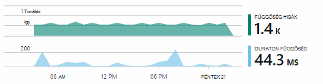

Lassú függőség problémák elhárításához feloldás földrajzi helye problémák. Fabrikam Bank Azure virtuális gépeken futó használ, és, hogy azok volna véletlenül található webkiszolgáló, és a fiók-kiszolgáló különböző országokban talált. Egy látványosabbá fokozása, áttelepítése által indított ezek egyikét.

**Mit jelent azt?** Ha el szeretné helyezni a függőség a probléma nem jelenik meg, és azt nem lett mindig van, akkor valószínűleg a legutóbbi módosítás okozza. A korábbi perspektíva metrikus és esemény diagramok által biztosított egyszerűen összehangolására hirtelen módosításokat a telepítések. A Keresés a problémát, amely leszűkíti.

**mi történik?** Problémák csak ritkán fordul elő, és nehéz lehet nyomon követése, ha teszteli a kapcsolat nélküli módban. Megteheti azt mindössze rögzíteni a hibát, ha egyszer be is következik élő próbál. A kivétel jelentésekben Papírhalom kiírása megvizsgálhatja. Ezeken kívül nyomkövetési hívásokat, írhat be, a kedvenc naplózás keretrendszer vagy TrackTrace() vagy TrackEvent().  

Fabrikam volt a fiók közötti pénzátutalásokhoz, de csak bizonyos fióktípusok szakaszos hibát. Jobb megértéséhez, milyen volt történik, ezek beilleszt a TrackTrace() hívások a kódot a fiók típusa tulajdonság csatolása minden hívás főbb pontjairól. Amely köszönhetően egyszerűen kiszűrése a diagnosztikai keresés csak az adott nyomkövetések. Azok is a hívások nyomon paraméterértékeket tulajdonságainak és mértékek csatolt.

## Azt kezelése

Ha a probléma által vizsgált, felépítési tervének megoldással teheti meg. Esetleg kell visszaállíthatja a legutóbbi módosítás, vagy esetleg mindössze jóváhagyást és javítás. Miután a fix befejeződött, a alkalmazás háttérismeretek megtudhatja, hogy sikeres.  

Fabrikam Bank fejlesztőcsapatához várni kell egy további strukturált megközelítése teljesítményét mérés, mint a segítségükkel mielőtt használni őket az alkalmazás az összefüggéseket.

* Azok tűzte teljesítmény adott mértékek az alkalmazás az összefüggéseket áttekintése lapon.

* Azok a teljesítményét mértékek tervezése a kezdő, például a felhasználói előrehaladását keresztül "tölcsérek." mérésére mérési módja miatt az alkalmazásba  

## Használat

Alkalmazás az összefüggéseket a megtudhatja, mit a felhasználók egy alkalmazással is használható. Miután zökkenőmentesen elindult, a csapat szeretné, hogy mely szolgáltatásokra a leggyakrabban használt, áttekinti felhasználók hasonlóan, és megnehezítheti a, és milyen gyakran azok térjen vissza. Amelyek segítségével a közelgő munkájukat fontossági. És azok is tervezi, hogy egyes szolgáltatások egyik mérésére a fejlesztési ciklus részeként. [További információ][usage].

## Az alkalmazások

Úgy, hogy ez hogyan egy csoportwebhely használata alkalmazás háttérismeretek nem csak egyes problémák megoldása, de azok fejlesztési életciklus javítható. E kívánom meg arról, hogy alkalmazás az összefüggéseket a saját alkalmazások teljesítményének javítása, a hibakereséshez próbálkozzon meghatalmazta.

## A videó

[AZURE.VIDEO performance-monitoring-application-insights]

<!--Link references-->

[api]: app-insights-api-custom-events-metrics.md
[availability]: app-insights-monitor-web-app-availability.md
[diagnostic]: app-insights-diagnostic-search.md
[metrics]: app-insights-metrics-explorer.md
[perf]: app-insights-web-monitor-performance.md
[usage]: app-insights-web-track-usage.md
 
