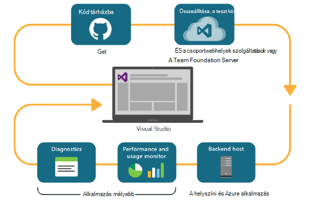
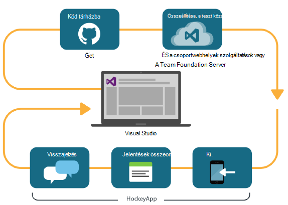

<properties
    pageTitle="Fejlesztőeszközök Analytics"
    description="A Visual Studio, alkalmazás háttérismeretek és HockeyApp DevOps"
    authors="alancameronwills"
    services="application-insights"
    documentationCenter=""
    manager="douge"/>

<tags
    ms.service="application-insights"
    ms.workload="tbd"
    ms.tgt_pltfrm="ibiza"
    ms.devlang="na"
    ms.topic="article" 
    ms.date="05/18/2016"
    ms.author="awills"/>

# Az alkalmazás az összefüggéseket és HockeyApp Fejlesztőeszközök Analytics

*Alkalmazás háttérismeretek az előzetes verzióban.*

Sok projektek verziókövetéssel egy gyors [DevOps](https://en.wikipedia.org/wiki/DevOps) működnek. Azok összeállítása és az alkalmazások terjesztése, hogyan hajt végre, és mit a felhasználók az általa visszajelzés kérése és ismeretek segítségével további fejlesztési ciklus megtervezése. 

Lync-használat és a teljesítmény, fontos, hogy az élő alkalmazásból telemetriai és a felhasználók maguk visszajelzései. 

Számos rendszer kialakításának a több összetevőket: webszolgáltatás, kódmentes processzorok vagy adatokat tárolja és a felhasználó böngészőben vagy a telefon vagy más eszköz alkalmazásként ügyfélszoftver. Az alábbi különféle összetevőket a telemetriai rendelkezik együtt kell venni.

Néhány verziókban korlátozott terjesztési a kijelölt tesztelők webhelyről; is szervezett flighting (új szolgáltatások, amelyeknek a célközönségek korlátozott vizsgálatok), és A |} A B tesztelése (alternatív felhasználói felületének párhuzamos vizsgálatok).

Felosztás kezelése és integrálása felett több ügyfél- és kiszolgálóoldali összetevők figyelése nem trivial tevékenység. Ez a folyamat része alapvető az alkalmazás architektúráját: ilyen jellegű anélkül, hogy egy ismétlődő fejlesztési ciklus és hasznos eszközök figyelése a rendszer nem hozható létre azt.

Ebben a cikkben áttekintjük hogyan fér el a devOps ciklus felügyeleti tulajdonságát be a folyamat más részei. 

Egy adott példa vizsgálata szeretné, ha van [egy érdekes esettanulmány](http://aka.ms/mydrivingdocs) több ügyfél- és kiszolgálóoldali összetevőit tartalmazza.

## Egy DevOps ciklus

Visual Studio és a fejlesztői Analytics eszközök egy integrálhatók devOps felületet kínálják. Íme például egy tipikus ciklus webalkalmazáshoz (amely lehet Java, Node.js vagy ASP.NET):

* A Fejlesztőeszközök ellenőrzi, hogy a kód tárat, illetve a fő ág egyesíti. A tár mely számjegy az ábrán látható, de [Team Foundation verziókövetés](https://www.visualstudio.com/docs/tfvc/overview)egyaránt lehet.
* A módosítások fejlesztése, az Egységár teszten elindítani. Az összeállítás szolgáltatás a [Visual Studio Team Services vagy a helyszíni megfelelőjük a Team Foundation Server](https://www.visualstudio.com/docs/vsts-tfs-overview)lehet. 
* A sikeres összeállítás és egység tesztje is [eseményindító egy automatikus telepítését](https://www.visualstudio.com/docs/release/author-release-definition/more-release-definition). A web app host lehet saját webkiszolgáló vagy a Microsoft Azure. 
* A élő alkalmazásból telemetriai [Alkalmazás Hírcsatornájában](app-insights-overview.md), mind a kiszolgáló és [az ügyfél böngészők](app-insights-javascript.md)küldi. Meg is elemzi az alkalmazás és a használat mintázatok mindkét teljesítményét. Hatékony [Keresés eszközök](app-insights-analytics.md) súgó, diagnosztizálása kapcsolatos problémák megoldásához. [Értesítések](app-insights-alerts.md) győződjön meg arról, hogy probléma, amint azt merül fel. 
* A következő fejlesztési ciklus, az élő telemetriai a elemzésével értesítést kap.

### Eszközről és az asztali alkalmazások

Eszköz és az asztali alkalmazások a terjesztési a ciklus része némileg eltér, mert azt nem csak feltöltése egy vagy két kiszolgálók. Ehelyett a sikeres összeállítás és egység vizsgálat is [eseményindító HockeyApp feltöltése](https://support.hockeyapp.net/kb/third-party-bug-trackers-services-and-webhooks/how-to-use-hockeyapp-with-visual-studio-team-services-vsts-or-team-foundation-server-tfs). HockeyApp felügyeli eloszlás a csoportnak a próba-felhasználók (vagy a nagyközönség, ha jobban szereti). 

HockeyApp a teljesítmény és használati adatainak a formában is összegyűjti:

* Képernyőképek szó felhasználói visszajelzés
* Jelentések összeomlik
* Egyéni telemetriai kódolva.

Még egyszer az devOps ciklus során a jövőbeli fejlesztési tervek, figyelembe véve a visszajelzés szerzett befejeződik.

## Állítsa be a Fejlesztőeszközök Analytics

Az egyes az alkalmazás - mobil összetevője webes vagy az asztal - a lépések megegyeznek alapjában véve. Számos különböző típusú alkalmazás, a Visual Studio automatikusan hajtja végre az alábbi lépéseket.

1. Az alkalmazás hozzáadása a megfelelő SDK csomagjában talál. Az eszköz-alkalmazások HockeyApp, és web Services alkalmazás háttérismeretek. Minden legyen a más platformokhoz készült különböző változatok. (Hogy az is lehetséges vagy SDK használandó asztali alkalmazások, abban az esetben, ha azt javasoljuk, hogy HockeyApp.)
2. Az alkalmazás regisztrálása az alkalmazás az összefüggéseket vagy HockeyApp portálon, attól függően, hogy a használt SDK csomagjában talál. Ez a hol analytics láthatja az élő alkalmazás. Egy műszerezettségi billentyűt vagy ID azonosítója, beállíthatja a alkalmazásba, hogy a SDK tudja, hogy hol szeretné elküldeni a telemetriai kap.
3. Adja hozzá egyéni kódot (ha szükséges) jelentkezzen események vagy a mértékek, segítséget nyújt a diagnosztika vagy teljesítményét vagy használati elemzéséhez. Figyelés beépített, így nem kell ezzel az első ciklus sok van.
3. Az eszköz alkalmazások:
 * Töltse fel a hibakeresési build HockeyApp. Innen a csoportwebhelyre a tesztfelhasználó oszthat meg. Amikor a feltöltött későbbi hoz létre, és értesítést küld a csoport.
 * Beállításakor a folyamatos összeállítása szolgáltatás, létre kell hoznia egy HockeyApp feltölteni a beépülő modul lépés használó megjelenés-definíciót.

### Analitikai és HockeyApp telemetriai az Exportálás

Vizsgálja meg a HockeyApp egyéni, és jelentkezzen be az analitikai és a folyamatos exportálása a funkcióival alkalmazás háttérismeretek [hidat](app-insights-hockeyapp-bridge-app.md)beállításával telemetriai.

## Következő lépések
 
Az alábbiakban a különböző típusú alkalmazás vonatkozó részletes útmutatást:

* [ASP.NET web App alkalmazásban](app-insights-asp-net.md) 
* [Java web App alkalmazásban](app-insights-java-get-started.md)
* [NODE.js web App alkalmazásban](https://github.com/Microsoft/ApplicationInsights-node.js)
* [iOS-alkalmazás](https://support.hockeyapp.net/kb/client-integration-ios-mac-os-x-tvos/hockeyapp-for-ios)
* [Mac OS X alkalmazásban](https://support.hockeyapp.net/kb/client-integration-ios-mac-os-x-tvos/hockeyapp-for-mac-os-x)
* [Android-alkalmazás](https://support.hockeyapp.net/kb/client-integration-android/hockeyapp-for-android-sdk)
* [Univerzális Windows-alkalmazás](https://support.hockeyapp.net/kb/client-integration-windows-and-windows-phone/how-to-create-an-app-for-uwp)
* [Windows Phone 8 vagy 8.1 alkalmazás](https://support.hockeyapp.net/kb/client-integration-windows-and-windows-phone/hockeyapp-for-windows-phone-silverlight-apps-80-and-81)
* [A Windows bemutató Foundation alkalmazás](https://support.hockeyapp.net/kb/client-integration-windows-and-windows-phone/hockeyapp-for-windows-wpf-apps)

