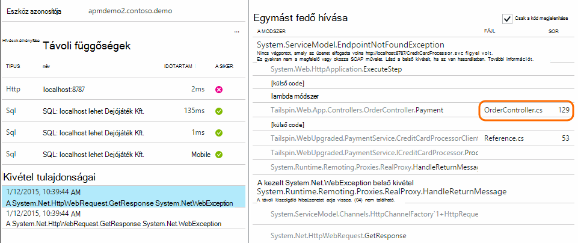

<properties 
    pageTitle="Diagnosztikai keresőfunkcióval |} Microsoft Azure" 
    description="Keresés és szűrheti az egyes események kérelmeket, és jelentkezzen be a nyomkövetési naplók." 
    services="application-insights" 
    documentationCenter=""
    authors="alancameronwills" 
    manager="douge"/>

<tags 
    ms.service="application-insights" 
    ms.workload="tbd" 
    ms.tgt_pltfrm="ibiza" 
    ms.devlang="na" 
    ms.topic="article" 
    ms.date="06/09/2016" 
    ms.author="awills"/>
 
# Az alkalmazás az összefüggéseket a diagnosztikai keresése szolgáltatással

Diagnosztikai keresési jellemzi [Alkalmazás az összefüggéseket] a[ start] keresheti meg és feltárása az egyes telemetriai elemeket, például lap nézetek, a kivétel, és kéréseket webes használható. És a napló halad és eseményeket, akkor van kódolva megtekintése.

## Hol jelennek diagnosztikai keresési?

### Az Azure-portálon

Diagnosztikai keresési explicit módon nyithatja meg:

Néhány diagramok és a rács elemek kattintáskor is megjelenik. Ebben az esetben a szűrőkben előre kiemelése a kijelölt elem típusának beállítása. 

Például ha az alkalmazás webszolgáltatás, a az Áttekintés lap kérések mennyiségének diagram jeleníti meg. Kattintson rá, majd egy listaelem hány kérések esett egyes URL-megjelenítő részletesebb diagramon eléréséhez. Kattintson a sor, és az egyes kérelmek listájának beszerzése, hogy az URL-címe:

Diagnosztikai keresési törzsébe felsoroljuk telemetriai elemek - kiszolgáló kérelmeket, oldal nézetek, egyéni események van kódolva, és így tovább. A lista tetején található összefoglaló áttekintheti, hogy milyen események száma az adott idő alatt.

Események általában megjelennek a diagnosztikai keresési csak akkor jelennek meg a metrikus Intézőben. Bár a lap időközönként frissíti magát, kattinthat frissítés, ha Ön várakozik az egy adott esemény.

### A Visual Studio

Nyissa meg a Keresés ablakot a Visual Studio:

A Keresés ablak ugyanazokat a szolgáltatásokat, mint a webes portál foglalja magában:

## Mintavételnél

Ha az alkalmazás telemetriai sok hoz létre (és használ, akkor a ASP.NET SDK verzió 2.0.0-beta3 vagy újabb), a adaptív mintavételnél modul automatikusan csökkenti a kötet, amely csak a teljes képviselő tört küldésével a rendszer elküldi a portálon. Azonban kapcsolódó eseményeket rögzítő ugyanazon kérésére kijelölt lesz, vagy csoportként kijelöletlen, hogy meg tudja nyitni kapcsolódó eseményeket között. 

[Megtudhatja, hogy mintavételnél](app-insights-sampling.md).

## Nézze meg az egyes elemek

Jelölje be a minden telemetriai elem kulcsát megtekintéséhez és a kapcsolódó elemek. Ha azt szeretné, hogy a skype_for_businesshoz mezők, kattintson a (...) gombra. 

A skype_for_businesshoz mezők megkereséséhez használja a egyszerű karakterláncok (nélkül helyettesítő karaktereket). A rendelkezésre álló mezők telemetriai típusától függ.

## Munka elem létrehozása

Létrehozhat egy hiba a Visual Studio Team Services telemetriai bármelyikére az adatokat. 

Ebben az esetben az első alkalommal rendszer kéri, hogy állítsa be a csapat-szolgáltatási fiók és a project mutató hivatkozást.

(Is elérheti a konfigurációs lap a beállítások > munkatételek.)

## Szűrő esemény típusa

Nyissa meg a szűrő lap, és válassza ki a megtekinteni kívánt eseményt. (Ha később szeretné visszaállítani a szűrőket, amellyel a lap megnyitása, kattintson az Alaphelyzet gombra.)

Az esemény típusa van:

* **Nyomkövetés** - TrackTrace, log4Net, NLog és System.Diagnostic.Trace hívások többek között a diagnosztikai naplók.
* A **kérés** - megkapta a kiszolgáló alkalmazás, beleértve a lapokat, a parancsfájlok, a képek, a stílus fájlokat és a adatok HTTP-kérelmeket. Az események használatával a kérelem és a válasz áttekintése diagramok létrehozása.
* **A lap nézet** – a webes ügyfél által küldött Telemetriai lap jelentések megtekintése létrehozására szolgál. 
* **Egyéni esemény** – Ha TrackEvent() hívásainak sorrendben [használat figyelése]a beszúrt[track], Itt kereshet őket.
* **Kivétel** - nem kivételeket a kiszolgálóra, és azokat, amelyek TrackException() használatával jelentkezik.

## A tulajdonság értékek szűrése

Események tulajdonságaik értékeit szűrheti. A rendelkezésre álló tulajdonságok attól függenek, hogy a választott esemény típusú. 

Például válasszon ki egy adott válasz kóddal kérések.

Válassza a nincs egy adott tulajdonság értékeit nem eredménye ugyanaz, mint az összes érték; kiválasztása Ez a tulajdonság szűrés kikapcsolása – váltás.

### A keresés pontosítása

Figyelje meg, hogy a jobb oldalán a szűrőértékek számlálás megjelenítése hány előfordulások ott vannak aktuális szűrt megadása. 

Ebben a példában azt még törölje a jelet, amely a `Reports/Employees` kérése a 500 hibák többségét eredménye:

Ezenkívül szeretne a Lásd még: milyen más eseményeket a megadott időszakban voltak történik, ha ellenőrizni **felvétele eseményekre meghatározatlan tulajdonságok**.

## Bot és a webes próba-forgalmat eltávolítása

A **valós vagy szintetikus forgalom** szűrővel, és ellenőrizze a **valós**.

**Szintetikus forgalom forrásának**szerint is szűrheti.

## Nézze meg az egyes események

Adja meg, hogy a szűrő neve kérelem beállítása és majd nézze meg az esemény egyedi előfordulását.

Kérés eseményekhez a jelennek meg a kivételek, hogy mikor történt a kérelem feldolgozása közben.

Kattintson a részletek, beleértve a Papírhalom követés kivételt keresztül.

## Az azonos tulajdonság események megkeresése

Keresse meg a tulajdonság azonos értékkel rendelkező összes elem:

## Keresés metrikus érték alapján

Az összes kérések válaszidő > 5s kaphat.  Időpontok osztások jelennek meg: 10 000 osztások = 1 MS.

## Az adatok keresése

A tulajdonság értékek közül az adatokra is kereshet. Ez akkor különösen akkor hasznos, ha [egyéni események] írt[ track] tulajdonság értékű. 

Érdemes lehet olyan időpontra, tartomány, mint rövidebb vonatkozóan keresések gyorsabb beállítása. 

Keresse meg a feltételeket, nem összefűzendő karakterláncokat. Kifejezések alfanumerikus karakterláncok, többek között például bizonyos írásjeleket "." és "_". Példa:

kifejezés|értéke *nem* egyezik|de ezek megegyeznek
---|---|---
HomeController.About|tudnivalók a otthoni|h\*kapcsolatban otthoni\*
IsLocal|helyi van \*helyi|ISL\* islocal i\*l\*
Új késleltetése|w d|új késleltetés n\* és d\*

Az alábbiakban a keresési kifejezések használható:

Példa lekérdezésre | Hatás 
---|---
lassú|Keresse meg a dátumtartományt, amelynek mező tartalmazza a kifejezést az összes eseményének "lassú"
adatbázis????|A találatokat database01, databaseAB... ? nem engedélyezett elején található kifejezést.
adatbázis * |A megfelelő adatbázis, database01, databaseNNNN  * nem engedélyezett elején a keresési kifejezés
Apple és banán|Keresse meg mindkét kifejezés tartalmazó eseményeket. Tőke "és", nem "és".
Apple banán vagy Apple banán.|Keresse meg vagy kifejezést tartalmazó eseményeket. "Vagy", nem "vagy". < /br/ > rövid űrlap.
Apple nem banán az Apple-banán|Egy kifejezés, de a másik tartalmazó események találja. Rövid űrlap.
alkalmazás * és banán-(grape pear)|Logikai operátorok és terület.
"Metrikus": 0-500 "Metrikus": 500 címzett * | Keresse meg az érték a tartományon belül a névvel ellátott mérték tartalmazó események.

## A Keresés mentése

Ha azt szeretné, hogy minden szűrőjének állított be, a keresés mentheti a Kedvencek közül. Ha a szervezeti fiókkal dolgozik, megadhatja, hogy e való megosztásra csapattársaitól.

A Keresés újra, **Nyissa meg az Áttekintés lap** látható, és nyissa meg a Kedvencek:

Ha relatív időtartomány mentette, az ismételt megnyitásakor a lap van a legfrissebb adatokat. Ha már mentette, az abszolút időtartomány, látni ugyanazzal az adattal minden alkalommal.

## Küldje el a további telemetriai alkalmazás mélyebb

Az alkalmazás az összefüggéseket SDK küldte ki-be a telemetriai, mellett a következő műveletek hajthatók végre:

* A kedvenc naplózás [.NET] keretrendszer a napló halad rögzítése[ netlogs] vagy [Java][javalogs]. Ez azt jelenti, a napló nyomkövetési naplók keresni, és lap nézetek, kivétel és más eseményeket összehangolására őket. 
* [Kódírás] [ track] egyéni események, oldal nézetek és kivételek küldhet. 

[Megtudhatja, hogy miként küldje el a naplók és egyéni telemetriai alkalmazás mélyebb][trace].

## A kérdések és válaszok

### Mennyi adatok megőrződnek?

Legfeljebb 500 események másodpercenként minden alkalmazásból. Események hét napig megőrződnek.

### Hogyan láthatok bejegyzés adatok a kiszolgáló-összehívásokban?

Automatikusan azt nem jelentkezik a bejegyzés adatokat, de használható [TrackTrace vagy napló hívások][trace]. Helyezze a bejegyzés adatokat az üzenet paraméter. Az üzenet nem lehet szűrni tulajdonságok ahogyan, de a által hosszabb.

## Következő lépések

* [Küldje el a naplók és egyéni telemetriai alkalmazás mélyebb][trace]
* [Elérhetőség és válaszidő vizsgálatok beállítása][availability]
* [Hibaelhárítás][qna]

<!--Link references-->

[availability]: app-insights-monitor-web-app-availability.md
[javalogs]: app-insights-java-trace-logs.md
[netlogs]: app-insights-asp-net-trace-logs.md
[qna]: app-insights-troubleshoot-faq.md
[start]: app-insights-overview.md
[trace]: app-insights-search-diagnostic-logs.md
[track]: app-insights-api-custom-events-metrics.md

 