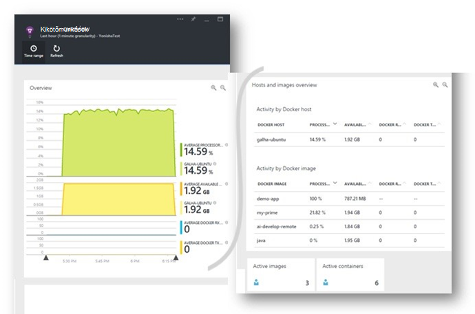
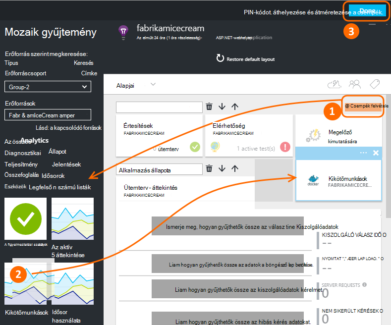
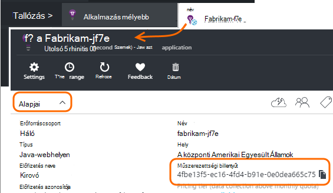
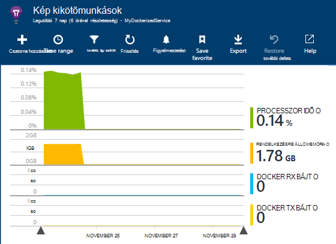
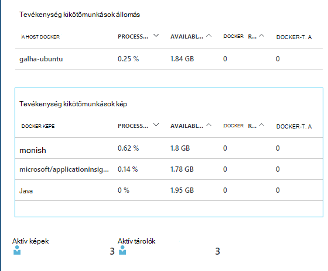
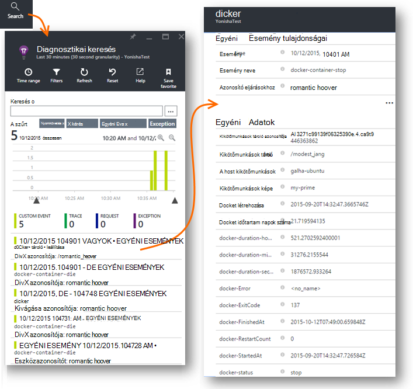
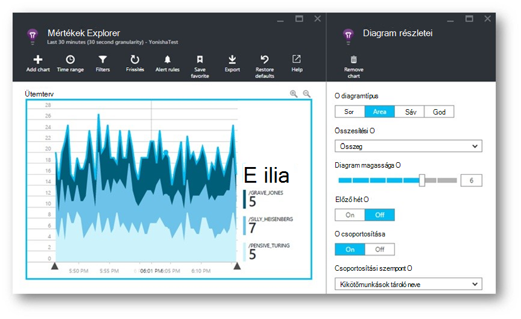
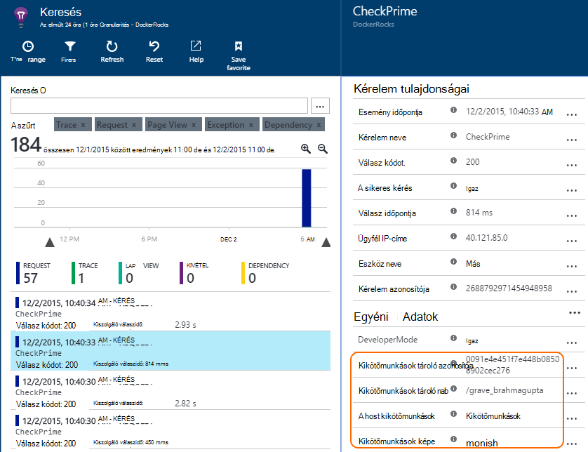
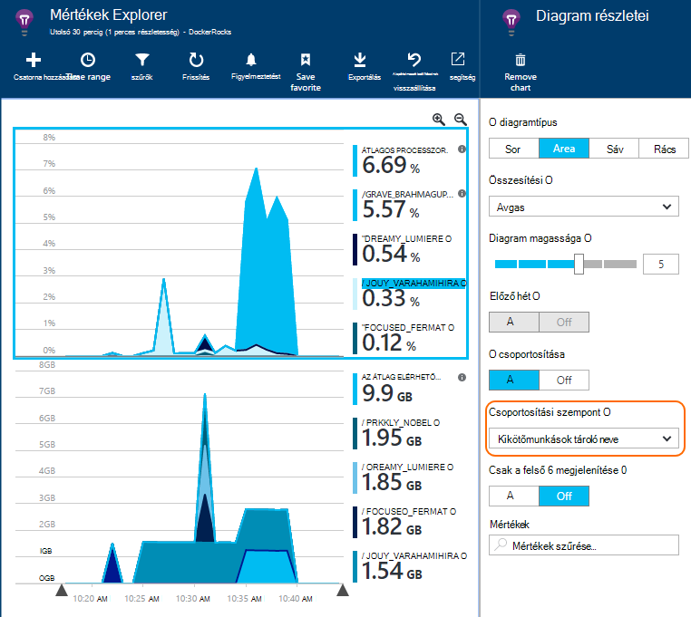

<properties 
    pageTitle="Az alkalmazás az összefüggéseket Docker alkalmazások figyelése" 
    description="Docker perf számláló, események és kivételeket is megjeleníthetők legyenek alkalmazás hírcsatornájában, a telemetriai az indexelése alkalmazásokból együtt." 
    services="application-insights" 
    documentationCenter=""
    authors="alancameronwills" 
    manager="douge"/>

<tags 
    ms.service="application-insights" 
    ms.workload="tbd" 
    ms.tgt_pltfrm="ibiza" 
    ms.devlang="na" 
    ms.topic="article" 
    ms.date="12/01/2015" 
    ms.author="awills"/>
 
# <a name="monitor-docker-applications-in-application-insights"></a>Az alkalmazás az összefüggéseket Docker alkalmazások figyelése

Alkalmazás az összefüggéseket a életciklus események és [Docker](https://www.docker.com/) tárolók származó teljesítménymutatókat is ábrázolt. Az [Alkalmazás az összefüggéseket](app-insights-overview.md) kép telepítse a fogadó tárolóban, és a teljesítményt számláló jeleníti meg a fogadó, valamint a többi képet.

Docker az alkalmazás az összes függőségek tartalmazó könnyű tárolók terjesztése. Bármely olyan Docker motor futó állomásgép futtatásával őket.

Az [alkalmazás mélyebb képe](https://hub.docker.com/r/microsoft/applicationinsights/) a Docker állomáson futtatásakor akkor kap alábbi előnyökkel jár:

* Életciklus telemetriai kapcsolatos operációs rendszert futtató összes tárolók az állomáson - indítása, le, és így tovább.
* Az összes tárolók számláló teljesítményét. Processzor, memóriát, hálózati használatát és az egyéb.
* Ha [telepítve van az alkalmazás az összefüggéseket SDK](app-insights-java-live.md) fut a tárolók, ezeket az alkalmazásokat az összes telemetriai alkalmazások lesz a tároló és host gép azonosító további tulajdonságokat. Így például ha egynél több host futó alkalmazás példányát, egyszerűen is szűrheti az alkalmazás telemetriai állomás.




## <a name="set-up-your-application-insights-resource"></a>Az alkalmazás az összefüggéseket erőforrás beállítása

1. Jelentkezzen be [A Microsoft Azure Portal](https://azure.com) , és nyissa meg az alkalmazást az összefüggéseket erőforrást, az alkalmazás; vagy [Hozzon létre egy újat](app-insights-create-new-resource.md). 

    *Erőforrás-érdemes használnom?* Ha az alkalmazásokat, a szolgáltató futó fejlesztett valaki másnak, majd kell [Hozzon létre egy új alkalmazás háttérismeretek erőforrást](app-insights-create-new-resource.md). Ez a, ahol megtekintheti és elemzése a telemetriai. (Válassza a "Egyéb" alkalmazás típusú.)

    De ha az alkalmazás fejlesztője, majd azt kívánom [alkalmazás Hírcsatornájában SDK hozzáadott](app-insights-java-live.md) mindegyiket. Ha minden valójában összetevői egy egyetlen üzleti alkalmazásban, akkor lehet, hogy állítsa be az összeset telemetriai küldhet egy erőforrás, és ugyanaz az erőforrás kell használni az Docker életciklusa és teljesítményét adatok megjelenítéséhez. 

    Harmadik példa, az alkalmazások többsége kifejlesztett, de az külön erőforrások esetén a telemetriai megjelenítéséhez. Ebben az esetben, akkor valószínűleg is szeretne létrehozni egy külön erőforrást Docker adatokhoz. 

2.  A Docker csempe hozzáadása: válassza a **Csempe hozzáadása**, húzza a Docker csempét a gyűjteményből, akkor kattintson a **kész**gombra. 

    


3. Kattintson a **Essentials** legördülő, és másolja a műszerezettségi billentyűt. Meg kell használni ezt a SDK csomagjában talál, hogy hol szeretné elküldeni a telemetriai.


    

Fontos, hogy a böngészőablakban hasznos, akkor fogja térjen vissza az, hogy leggyorsabban a telemetriai tekintse meg.


## <a name="run-the-application-insights-monitor-on-your-host"></a>Az alkalmazás az összefüggéseket monitor futtassa a szolgáltató
 
Most, hogy a tartományhasználati valahol a telemetriai megjelenítéséhez, beállíthatja a indexelése alkalmazás, amely összegyűjtése és küldje el.

1.  Csatlakozás a Docker szolgáltató. 
2.  Módosítsa a a műszerezettségi kulcsot be ezt a parancsot, és hajtsa végre:
 
    ```

    docker run -v /var/run/docker.sock:/docker.sock -d microsoft/applicationinsights ikey=000000-1111-2222-3333-444444444
    ```

Csak egy alkalmazás mélyebb kép szükség egy Docker host. Ha több Docker állomásokon telepíti az alkalmazásokat, ismételje meg az összes host parancsa.

## <a name="update-your-app"></a>Az alkalmazás frissítése

Ha az alkalmazás és az [Alkalmazás mélyebb SDK Java](app-insights-java-get-started.md)van rendszereken, hozzáadása a következő sort a projektben, a ApplicationInsights.xml fájlba csoportban a `<TelemetryInitializers>` elem:

```xml

    <Add type="com.microsoft.applicationinsights.extensibility.initializer.docker.DockerContextInitializer"/> 
```

Ezzel hozzáadja Docker információt, például a tároló és host azonosító minden küldött az alkalmazás telemetriai elemet.

## <a name="view-your-telemetry"></a>A telemetriai megtekintése

Térjen vissza az alkalmazást az összefüggéseket erőforrás az Azure-portálon.

Kattintson a Docker csempére.

Hamarosan látni fogja a Docker alkalmazásból érkező adatok különösen akkor, ha van más futó a Docker motor tárolók.


Íme néhány elérheti a nézeteket.

### <a name="perf-counters-by-host-activity-by-image"></a>Perf számláló állomás, kép tevékenység








Kattintson egy tetszőleges részletesebb host vagy a kép nevet.


Ha testre szeretné szabni a nézetet, kattintson az egyes diagramokra, a rács a címsor, vagy hozzáadása diagram. 

[További tudnivalók a mértékek explorer](app-insights-metrics-explorer.md).

### <a name="docker-container-events"></a>Docker tároló események




Vizsgálja meg az egyes események, kattintson a [Keresés](app-insights-diagnostic-search.md)gombra. Keresés és a naplózandó események megkeresése szűrő. Kattintson bármelyik eseményre részletesebb eléréséhez.
 
### <a name="exceptions-by-container-name"></a>Kivételek tároló név szerint
 



### <a name="docker-context-added-to-app-telemetry"></a>Alkalmazás telemetriai hozzáadott docker környezetben

Az alkalmazásból rendszereken AI SDK, dúsított Docker környezettel rendelkező küld telemetriai kérelem:



Processzor időt és a rendelkezésre álló memória teljesítmény számláló, dúsított, és Docker tároló név szerint csoportosítva:





## <a name="q--a"></a>A kérdések és válaszok

*Mit jelent az alkalmazás mélyebb engedi, amely nem szerezhető Docker?*

* Részletes kifejtése teljesítmény teljesítménymutatókat tároló és a képet.
* Egy irányítópult tároló és az alkalmazás adatok integrálhatók.
* [Telemetriai exportálása](app-insights-export-telemetry.md) egy adatbázist, a Power BI vagy más irányítópult további elemzés céljából.

*Hogyan szerezhető be telemetriai magát az alkalmazásból?*

* Az alkalmazás az összefüggéseket SDK telepítse az alkalmazást. Megtudhatja, hogyan lehet az: [Java web Apps alkalmazások](app-insights-java-get-started.md), a [Windows web Apps alkalmazások](app-insights-asp-net.md).
