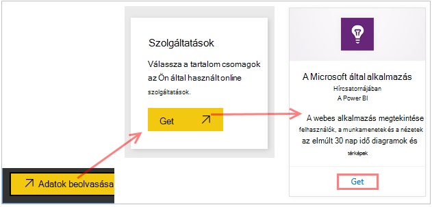
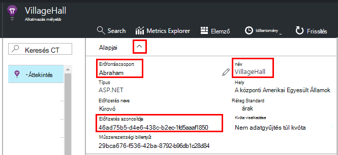
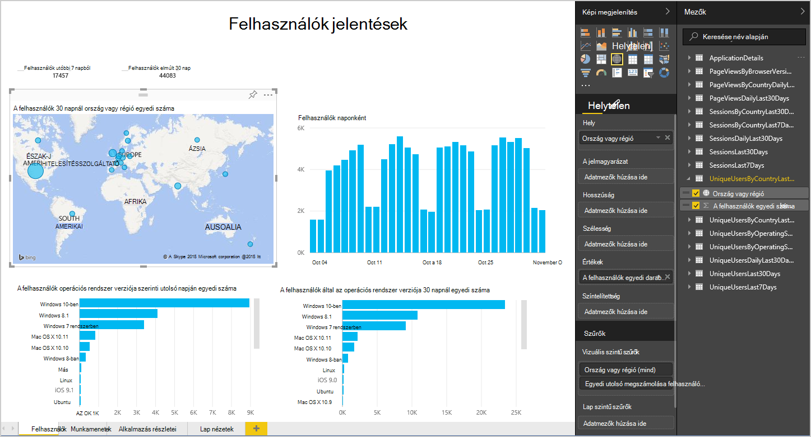
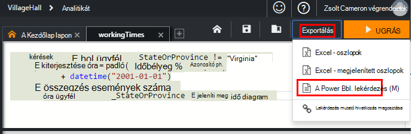
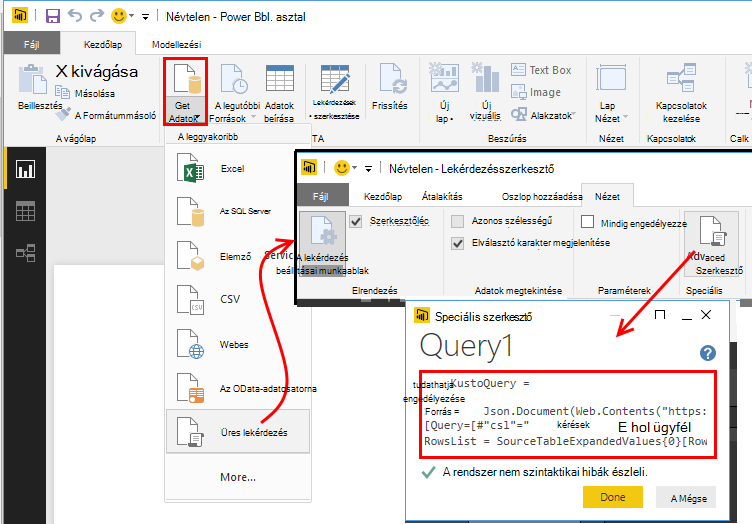
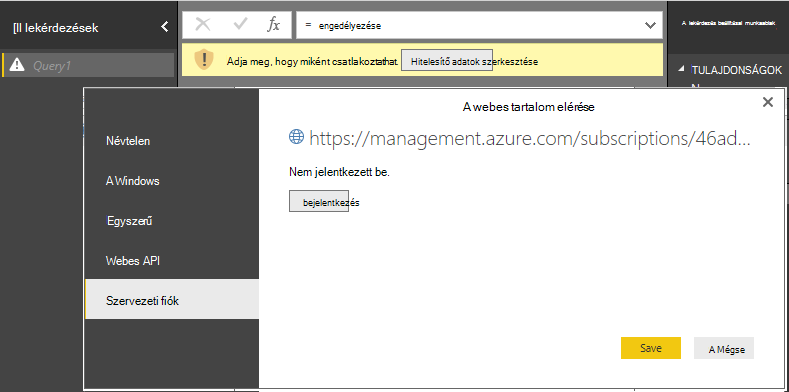
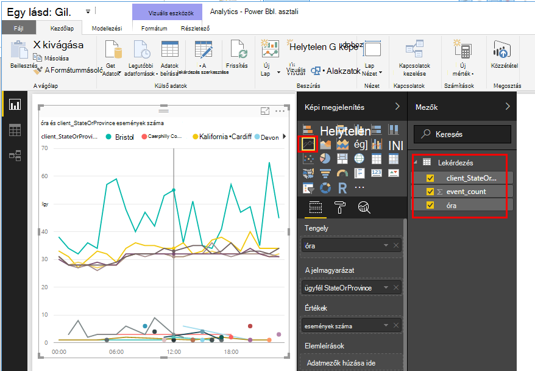
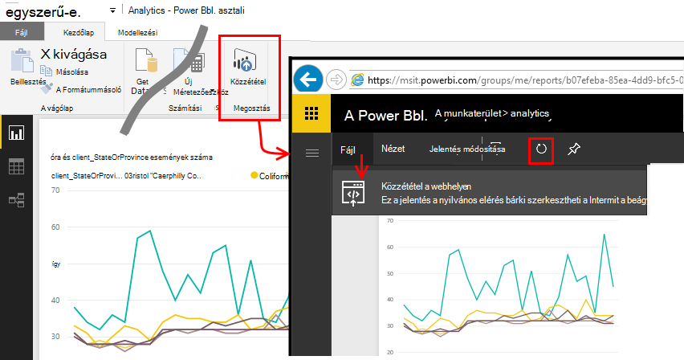

<properties 
    pageTitle="Az alkalmazás az összefüggéseket a Power BI exportálása |} Microsoft Azure" 
    description="Lekérdezések analitikájának megjeleníthetők a Power BI szolgáltatásban." 
    services="application-insights" 
    documentationCenter=""
    authors="noamben" 
    manager="douge"/>

<tags 
    ms.service="application-insights" 
    ms.workload="tbd" 
    ms.tgt_pltfrm="ibiza" 
    ms.devlang="na" 
    ms.topic="article" 
    ms.date="10/18/2016" 
    ms.author="awills"/>

# A Power BI alkalmazás háttérismeretek hírcsatorna

[A Power BI](http://www.powerbi.com/) egy csomagja üzleti elemző eszközök, amelyek segítséget nyújtanak az adatok elemzése és megoszthatja eredményeit. Minden eszközön Rich irányítópultok érhetők el. Az adatok több forrásból, beleértve a [Visual Studio alkalmazásban az összefüggéseket](app-insights-overview.md)a lekérdezések Analitikájának is összevonhatja.

Háromféleképpen ajánlott a Power BI alkalmazás háttérismeretek adatok exportálása. Használhatja őket külön-külön vagy együtt.

* [**A power BI kártya**](#power-pi-adapter) – az alkalmazás beállítása egy teljes telemetriai-irányítópult. A diagramok készlete előre meghatározott, de más forrásból is hozzáadhat a saját lekérdezések.
* [**Lekérdezések exportálása Analitikájának**](#export-analytics-queries) – ír lekérdezés Analitikájának használatával szeretne, majd exportálása a Power BI. A lekérdezés is elhelyezhet egy irányítópulton bármely más adatokkal együtt.
* A [**folyamatos exportálás és Értékáram-elemzés**](app-insights-export-stream-analytics.md) – ez jár, hogy több munkához állíthat be. Ez akkor hasznos, ha meg szeretné tartani az adatokat a hosszú ideig. Más módszerek a használata ajánlott.

## A Power BI kártya

Ez a módszer létrehoz egy teljes telemetriai-irányítópult. A kezdeti adatkészlet előre meghatározott, de további adatokat adhat meg.

### A kártya beszerzése

1. Bejelentkezés a [Power BI](https://app.powerbi.com/).
2. Nyissa meg az **adatok**, a **szolgáltatások**, a **alkalmazás Hírcsatornájában**

    

3. Adja meg az alkalmazást az összefüggéseket erőforrás részleteit.

    

4. Várjon néhány percig is az importálni kívánt adatokat.

    

Az irányítópulton azokat más forrásokból, és az analitikai lekérdezések egyesítése a az alkalmazás az összefüggéseket diagramok szerkesztheti. Van egy képi megjelenítések gyűjtemény hol kaphat további diagramok, és az egyes diagramoknak egy beállíthatja, hogy paramétereket.

Az első importálás után az irányítópulton és a jelentések továbbra is naponta frissítéséhez. Megadhatja, hogy a frissítési ütemezés kapcsolót be az adatkészlet.

## Lekérdezések Analitikájának exportálása

Ez az útvonal lehetővé teszi, hogy bármilyen Analytics lekérdezést, amely tetszik írása és, majd exportálja a Power BI-irányítópult. (Felveheti a kártyát által létrehozott irányítópult.)

### Egyszeri: a Power BI Desktop telepítése

A háttérismeretek alkalmazás lekérdezés importálja, a Power BI asztali verzióját használja. De majd közzéteheti azt az interneten vagy a Power BI felhőbeli munkaterületre. 

[A Power BI Desktop](https://powerbi.microsoft.com/en-us/desktop/)telepítése.

### Egy Analytics lekérdezés exportálása

1. [Megnyitott Analytics, és írja be a lekérdezés](app-insights-analytics-tour.md).
2. Tesztelje és a lekérdezés pontosításához, amíg nem elégedett az eredmények.
3. Az **Exportálás** menüben válassza a **Power BI (M)**. Mentse a szövegfájlt.

    
4. Jelölje ki az **első adatok, üres lekérdezés** a Power BI Desktop és a Lekérdezésszerkesztőben a **Nézet lapon** válassza a **Lekérdezésszerkesztő speciális**.

    Illessze be az exportált nyelvi M parancsfájl be a speciális Lekérdezésszerkesztő.

    

5. Előfordulhat, hogy kell adnia a hitelesítő adatait, és engedélyezze a Power BI Azure eléréséhez. Szervezeti-fiókot használ, hogy jelentkezzen be Microsoft-fiókjával.

    

6. Válassza ki a képi megjelenítés a lekérdezés, és jelölje ki a mezőket az x tengely, y és dimenzió példájaként.

    

7. A jelentés közzététele a Power BI felhőbeli munkaterület. Itt más weblapokba beágyazhat egy szinkronizált verzióját.

    
 
8. A kimutatás frissítése kézzel időközönként, vagy állítsa be a beállítások lapon ütemezett frissítés.

## Tudnivalók a mintavételnél

Ha az alkalmazás küld az adatokat, a adaptív mintavételnél funkció működjön és küldése csak a telemetriai százalékában. Ugyanez igaz, ha állított mintavételnél manuálisan a SDK vagy a bevitel. [További tudnivalók a mintavételnél.](app-insights-sampling.md)
 

## Következő lépések

* [A Power BI – ismerje meg,](http://www.powerbi.com/learning/)
* [Analytics oktatóprogram](app-insights-analytics-tour.md)
