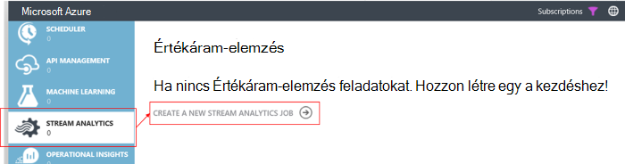

<properties 
    pageTitle="Értékáram-elemzés használata a feldolgozása exportált alkalmazása az összefüggéseket adatok |} Microsoft Azure" 
    description="Értékáram-elemzés folyamatosan átalakítás, szűrheti és az adatok exportálása a alkalmazás háttérismeretek útvonalát." 
    services="application-insights" 
    documentationCenter=""
    authors="noamben" 
    manager="douge"/>

<tags 
    ms.service="application-insights" 
    ms.workload="tbd" 
    ms.tgt_pltfrm="ibiza" 
    ms.devlang="na" 
    ms.topic="article" 
    ms.date="10/18/2016" 
    ms.author="awills"/>

# <a name="use-stream-analytics-to-process-exported-data-from-application-insights"></a>Értékáram-elemzés használata alkalmazás háttérismeretek exportált adatainak feldolgozása

[Értékáram-elemzés Azure](https://azure.microsoft.com/services/stream-analytics/) egy a ideális eszköz feldolgozása adatok [exportált alkalmazása az összefüggéseket](app-insights-export-telemetry.md). Értékáram-elemzés különböző forrásokból származó adatok emelhetők. Azt átalakítás és az adatok szűrése és átirányítása mosdók számos.

Ebben a példában egy adaptert, lekéri az adatokat az alkalmazás hírcsatornájában, átnevezése és folyamatok egyes mezői és pipák azt be a Power BI létrehoznia azt.

> [AZURE.WARNING] Vannak olyan sokkal jobban és könnyebben [módok közül alkalmazás az összefüggéseket a Power BI ajánlott](app-insights-export-power-bi.md). Itt illusztrált elérési útja csak egy példa bemutatják, hogyan lehet feldolgozni exportált adatokat.


## <a name="create-storage-in-azure"></a>Tárhely létrehozása az Azure-ban

Folytonos exportálás adatokat tároló Azure-fiókjába, mindig exportálja, így a tár először létre kell.

1.  "Klasszikus" tárterület-fiók létrehozása az [Azure portál](https://portal.azure.com)előfizetéséhez.

    

2. A tároló létrehozása

    

3. Másolja a tárhely hívóbetű

    Hamarosan, hogy állítsa be a bemeneti a adatfolyam analytics szolgáltatás szüksége.

    

## <a name="start-continuous-export-to-azure-storage"></a>Indítsa el a folyamatos exportálás Azure-tárolóhoz

Adatok [folytonos exportálása](app-insights-export-telemetry.md) lép az alkalmazás az összefüggéseket Azure tárolóba.

1. Az Azure-portálon nyissa meg az alkalmazást az összefüggéseket erőforráshoz hoz létre az alkalmazás.

    

2. Hozzon létre egy folyamatos exportálás.

    


    Jelölje ki a korábban létrehozott tárterület-fiókhoz:

    
    
    Adja meg a megtekinteni kívánt esemény típusú:

    

3. Tudathatja gyűjteniük adatokat. Vissza ülnie, és az alkalmazás használja egy ideje mások. Telemetriai érkezzenek, és megjelenik a [metrikus Intézőben](app-insights-metrics-explorer.md) statisztikai diagramok és [diagnosztikai keresés](app-insights-diagnostic-search.md)az egyes események. 

    És is, az adatokat a tárolóhoz exportálja. 

4. Nézze meg az exportált adatokat. A Visual Studióban, válassza a **megtekintése és a felhő Explorer**, és nyissa meg az Azure / tároló. (Ha menü beállítás nincs, akkor telepítenie kell az Azure SDK: Nyissa meg az új projekt párbeszédpanelt, és nyissa meg a Visual C# / Cloud / a Microsoft Azure SDK beszerzése .NET.)

    

    Jegyezze fel a közös rész az elérési út neve, amely az alkalmazás nevét és műszerezettségi billentyű származik. 

Az események blob-JSON formátumú fájlok kerülnek. Minden fájl tartalmazhat egy vagy több eseményeket. Így azt szeretné olvasni az esemény adatai és a mezők szeretnénk kiszűrése. Mindenféle dolgot megteheti azt is, adatokat tartalmazó, de a ma csomagja Értékáram-elemzés pipe az adatokat a Power bi segítségével.

## <a name="create-an-azure-stream-analytics-instance"></a>Hozza létre az Azure Értékáram-elemzés

A [Klasszikus Azure-portálon](https://manage.windowsazure.com/)válassza ki a Azure Értékáram-elemzés szolgáltatást, és hozzon létre új feladatot megjelenítő Értékáram-elemzés:





Ha az új feladat jön létre, bontsa ki a részletes adatait:


### <a name="set-blob-location"></a>Blob-hely beállítása

Állítsa be állapotba a folyamatos exportálása blob a bemeneti:


Most már szüksége lesz az elsődleges kulcs az Access a tárhely fiókból, amely a korábban feljegyzett. Ez a tárhely Fiókkulcs értéke.


### <a name="set-path-prefix-pattern"></a>Készlet elérési út előtag minta 


**Győződjön meg arról, a dátumformátum beállításához YYYY-MM-DD (a szaggatott vonal).**

Az elérési út előtag mintát Itt adhatja meg, ahol Értékáram-elemzés megkeresi a bemeneti fájlok tárolására. Kell beállítania, hogy hogyan tárolja az adatokat a folyamatos exportálása felelnek meg. Állítsa be jelennek meg:

    webapplication27_12345678123412341234123456789abcdef0/PageViews/{date}/{time}

Ebben a példában:

* `webapplication27`az alkalmazás az összefüggéseket erőforrás **összes kisbetű**a név.
* `1234...`az a műszerezettségi kulcs az alkalmazás az összefüggéseket erőforrás **kimarad a szaggatott vonal menüpontra**. 
* `PageViews`az elemezni kívánt adatok típusát. A rendelkezésre álló típusok attól függenek, hogy a folyamatos exportálása szűrőjét. Vizsgálja meg az exportált adatokat egyéb rendelkezésre álló diagramtípusok megjelenítéséhez, és ellenőrizze a [modell adatainak exportálása](app-insights-export-data-model.md).
* `/{date}/{time}`minta írt szó.

> [AZURE.NOTE] Vizsgálja meg, hogy, az elérési út jobb tárolására.

### <a name="finish-initial-setup"></a>Kezdeti telepítés befejezése

Erősítse meg a szerializálási formátum:


Zárja be a varázslót, és várja meg a telepítés befejezéséhez.

> [AZURE.TIP] A minta paranccsal töltheti le néhány adatot. Szeretné hibakeresése a lekérdezés tesztelése mintaként maradjon is.

## <a name="set-the-output"></a>A kimenet beállítása

Most jelölje ki a feladatot, és a kimeneti beállítása.


Adja meg a **munkahelyi vagy iskolai fiók** engedélyezni adatfolyam Analytics a Power BI erőforrás eléréséhez. Ezután találjon ki a kimenet, valamint a cél Power BI adatkészlet és a tábla nevét.


## <a name="set-the-query"></a>A lekérdezés beállítása

A lekérdezés a fordítás az exportálni kívánt beviteli szabályozza.


A próba funkcióval ellenőrizze, hogy a megfelelő kimeneti kap. A mintaadatok a bemenetben lapról beállításikon kölcsönözhet. 

### <a name="query-to-display-counts-of-events"></a>A lekérdezés megjelenítéséhez események száma

Illessze be ezt a lekérdezést:

```SQL

    SELECT
      flat.ArrayValue.name,
      count(*)
    INTO
      [pbi-output]
    FROM
      [export-input] A
    OUTER APPLY GetElements(A.[event]) as flat
    GROUP BY TumblingWindow(minute, 1), flat.ArrayValue.name
```

* Exportálás-bemeneti érték azt a bemeneti adatfolyam adott alias
* pbi-kimeneti a definiált kimeneti alias
* [Külső alkalmazása GetElements](https://msdn.microsoft.com/library/azure/dn706229.aspx) fogjuk kiszámolni, mert az esemény nevét egy beágyazott JSON arrray. Választja, majd válassza ki az esemény nevét, és az időtartamot az ilyen nevű példányok száma. A [Group By](https://msdn.microsoft.com/library/azure/dn835023.aspx) záradék csoportosítja 1 perc időtartamokat az elemeket.


### <a name="query-to-display-metric-values"></a>Lekérdezés metrikus értékek megjelenítéséhez


```SQL

    SELECT
      A.context.data.eventtime,
      avg(CASE WHEN flat.arrayvalue.myMetric.value IS NULL THEN 0 ELSE  flat.arrayvalue.myMetric.value END) as myValue
    INTO
      [pbi-output]
    FROM
      [export-input] A
    OUTER APPLY GetElements(A.context.custom.metrics) as flat
    GROUP BY TumblingWindow(minute, 1), A.context.data.eventtime

``` 

* A lekérdezés oktatások be a mértékek telemetriai az esemény időpontja és a metrikus értéket. Metrikus értékek belül tömb méreténél, így azt használja a külső alkalmazása GetElements minta kibontásához a sorokat. "myMetric" Ebben az esetben pedig a mérőszám neve. 

### <a name="query-to-include-values-of-dimension-properties"></a>A lekérdezés bevonhatja dimenzió tulajdonságai

```SQL

    WITH flat AS (
    SELECT
      MySource.context.data.eventTime as eventTime,
      InstanceId = MyDimension.ArrayValue.InstanceId.value,
      BusinessUnitId = MyDimension.ArrayValue.BusinessUnitId.value
    FROM MySource
    OUTER APPLY GetArrayElements(MySource.context.custom.dimensions) MyDimension
    )
    SELECT
     eventTime,
     InstanceId,
     BusinessUnitId
    INTO AIOutput
    FROM flat

```

* A lekérdezés attól függően, hogy egy adott dimenzió a rögzített index létrehozása a dimenzió tömb nem nélkül dimenzió tulajdonságok értékeket tartalmaz.

## <a name="run-the-job"></a>A feladat futtatása

A feladat indításához múltbeli is adja meg a dátumot. 


Várja meg, amíg fut a feladat.

## <a name="see-results-in-power-bi"></a>Eredmények a Power BI szolgáltatásban

> [AZURE.WARNING] Vannak olyan mekkora jobb és könnyebben [módok közül alkalmazás az összefüggéseket a Power BI ajánlott](app-insights-export-power-bi.md). Itt illusztrált elérési útja csak egy példa bemutatják, hogyan lehet feldolgozni exportált adatokat.

A Power BI a munkahelyi vagy iskolai fiókjával, és nyissa meg az adatkészlet és a megjelenítő Értékáram-elemzés feladat kimenetként megadott táblázat.


Ezután már használhatja a adatkészlet tartalmazó jelentések és irányítópultok [A Power BI](https://powerbi.microsoft.com)szolgáltatásban.


## <a name="no-data"></a>Adatok nélkül?

* Ellenőrizze, hogy [a dátumformátumot beállítása](#set-path-prefix-pattern) megfelelően YYYY-MM-DD (a szaggatott vonal).


## <a name="video"></a>A videó

Noam Zsolt Zeev szemlélteti, hogyan exportált adatokat megjelenítő Értékáram-elemzés használata feldolgozása.

> [AZURE.VIDEO export-to-power-bi-from-application-insights]

## <a name="next-steps"></a>Következő lépések

* [Folytonos exportálása](app-insights-export-telemetry.md)
* [A részletes adatok a tulajdonság típusok és értékek hivatkozása modell.](app-insights-export-data-model.md)
* [Alkalmazás mélyebb](app-insights-overview.md)
* [További minták és forgatókönyvek](app-insights-code-samples.md)
 
