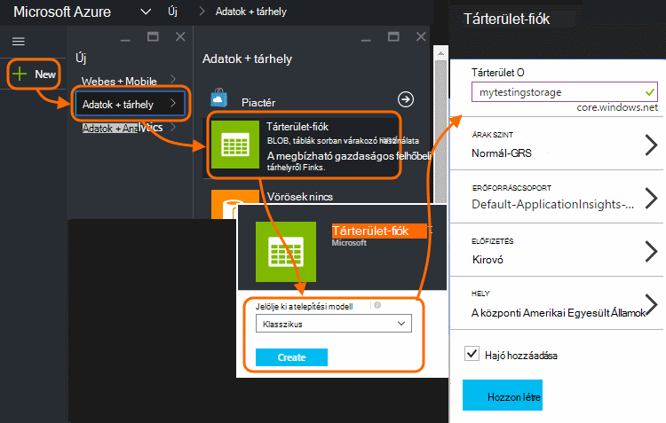
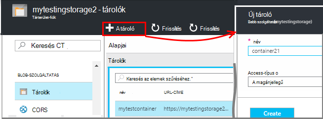
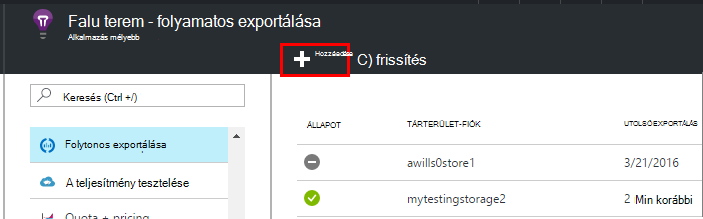
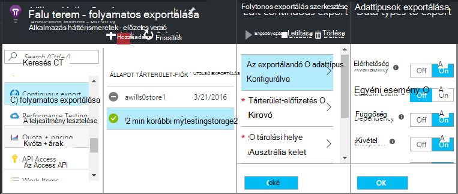
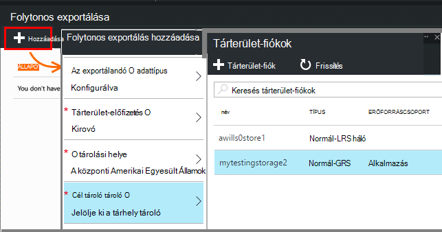
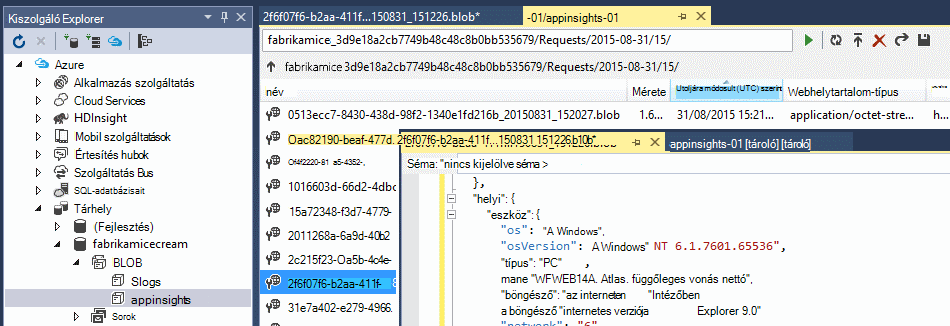
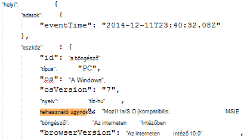
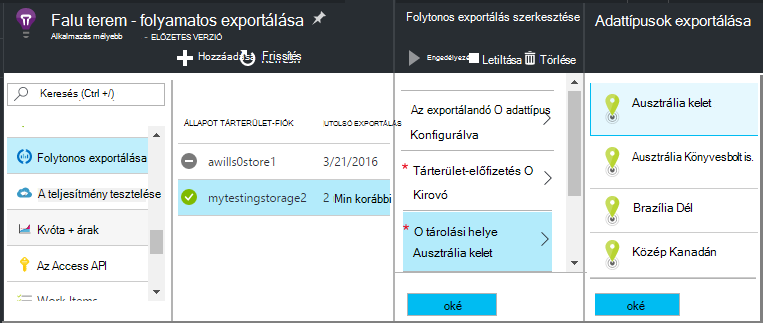

<properties 
    pageTitle="Az alkalmazás az összefüggéseket telemetriai folyamatos exportálása |} Microsoft Azure" 
    description="Diagnosztikai és használati adatainak exportálása tárhely a Microsoft Azure-ban, és töltse le a tárból." 
    services="application-insights" 
    documentationCenter=""
    authors="alancameronwills" 
    manager="douge"/>

<tags 
    ms.service="application-insights" 
    ms.workload="tbd" 
    ms.tgt_pltfrm="ibiza" 
    ms.devlang="na" 
    ms.topic="article" 
    ms.date="10/18/2016" 
    ms.author="awills"/>
 
# Alkalmazás mélyebb telemetriai exportálása

A telemetriai hosszabb, mint a szokásos adatmegőrzési időszak nyomon szeretne? Illetve bizonyos speciális módon dolgozza fel? Folytonos exportálás ideális ez. Az események megjelenik az alkalmazás az összefüggéseket portálon JSON formátumban a Microsoft Azure tárolóhoz lehet exportálni. Innen letöltheti az adatok és bármilyen kódot, akkor írja dolgozza fel kell.  

Folytonos Exportálás az ingyenes próbaverzió időszak és a [Szokásos és árak csomagok prémium](https://azure.microsoft.com/pricing/details/application-insights/)érhető el.

Folytonos exportálás beállítása előtt létezik néhány alternatívája célszerű figyelembe venni:

* [Az Exportálás gombra](app-insights-metrics-explorer.md#export-to-excel) a mértékek vagy a találatok a lap tetején segítségével átviheti a táblázatok, és diagramok az Excel-számolótábla. 
* [Analytics](app-insights-analytics.md) telemetriai egy hatékony lekérdezési nyelv biztosít, és is exportálhatja a találatok.
* Ha meg szeretné találni a [Power BI adatai feltárása](http://blogs.msdn.com/b/powerbi/archive/2015/11/04/explore-your-application-insights-data-with-power-bi.aspx), hajtsa végre, amely folyamatos exportálása használata nélkül.

## Tárterület-fiók létrehozása

Ha még nincs egy "klasszikus" tárterület-fiókkal, hozzon létre egyet.

1. Tárterület-fiók létrehozása az [Azure portál](https://portal.azure.com)előfizetéséhez.

    

2. Hozzon létre egy tároló.

    

## Folytonos exportálása beállítása

Nyissa meg az alkalmazást a áttekintése lap az alkalmazás az összefüggéseket portálon, a folyamatos exportálása: 

Adja hozzá a folyamatos exportálás, és válassza ki a kívánt exportálása esemény:

Válassza ki, vagy a hol tárolja az adatokat szeretne [Azure tárterület-fiók](../storage/storage-introduction.md) létrehozása:

Miután létrehozta az exportálás, most kezdi. (Csak akkor adatokat az Exportálás létrehozása után megérkezik.) 

Egy órába előtt adatainak megjelenítése a blob késleltetést lehet.

Ha meg szeretné változtatni az esemény típusa, később szerkesztése az exportálás:

Az adatfolyamban leállításához Letiltás gombra. Engedélyezés újra gombra kattint, az adatfolyam újraindul új adatokkal. Az adatok, amelyek a portálon érkezett exportálás le van tiltva, amíg nem fog kapni.

Az adatfolyamban véglegesen befejezéséhez az Exportálás törlése Ha így adatot sem töröl a tárhely.

#### Nem lehet hozzáadni vagy módosítani az Exportálás?

* Alkalmazásához vagy módosításához exportnak szüksége tulajdonos, a közös munka vagy az alkalmazás az összefüggéseket a közreműködői engedélyeket. [További tudnivalók a szerepkörökről][roles].

## Milyen események akkor jelenik meg?

Az exportált adatokat a nyers telemetriai azt az alkalmazást, fogadjanak, azzal a különbséggel, hogy a hely adatot, amely azt kiszámítása hozzáadunk ügyfél IP-cím. 

Adatok törölve van [mintavételnél](app-insights-sampling.md) által nem szerepel az exportált adatokat.

Más számított mértékek nem szerepelnek. Például azt nem exportálja az átlagos Processzor kihasználtsági, de azt exportálása a nyers telemetriai, amelyből átlagát számítja ki.

Az adatokat is be van állítva bármely [elérhetősége webes vizsgálatok](app-insights-monitor-web-app-availability.md) eredménye. 

> [AZURE.NOTE] **Mintavételnél.** Ha az alkalmazás küld az adatokat, és használja az alkalmazás az összefüggéseket SDK ASP.NET verzió 2.0.0-beta3 vagy újabb, a adaptív mintavételnél funkció működjön, és küldése csak a telemetriai százalékában. [További tudnivalók a mintavételnél.](app-insights-sampling.md)

## Az adatok vizsgálata

Megvizsgálhatja a tárhely közvetlenül a portálon. Kattintson a **Tallózás gombra**, jelölje ki a tárterület-fiókját, és nyissa meg a **tárolók**.

Nézze meg a Visual Studióban Azure tárhely, nyissa meg a **Nézet**, **Felhőalapú Explorer**. (Ha nincs telepítve az adott menüparancs, akkor telepítenie kell az Azure SDK: Nyissa meg az **Új projekt** párbeszédpanelen, és bontsa ki a képi C# / Cloud, és válassza a **Microsoft Azure SDK a .NET rendszerhez**.)

A blob-tárolóhoz megnyitásakor láthatja a tároló blob-fájlokat. A minden fájl URI származik, az alkalmazás az összefüggéseket erőforrásnév műszerezettségi kulcs, telemetriai-típus és dátum/idő. (Az erőforrás neve kisbetűssé, és a műszerezettségi billentyűt a szaggatott vonal kihagyja.)

A dátum és idő UTC és amikor az telemetriai lett elhelyezni a store - nem hozta létre idejét. Igen, kódírás töltse le az adatokat, ha áthelyezheti azt lineárisan adatai között.

Az alábbiakban az elérési út az űrlap:

    $"{applicationName}_{instrumentationKey}/{type}/{blobDeliveryTimeUtc:yyyy-MM-dd}/{ blobDeliveryTimeUtc:HH}/{blobId}_{blobCreationTimeUtc:yyyyMMdd_HHmmss}.blob"
  
Ha 

-   `blobCreationTimeUtc`van blob létrehozásának ideje a belső átmeneti tárolására
-   `blobDeliveryTimeUtc`az időt, amikor blob másolja az Exportálás cél tárolására

## Adatok formázása

* Minden egyes blob több tartalmazó szövegfájl "\n'-separated sorokat. Az adott időszakban nagyjából fél perc, feldolgozott telemetriai tartalmaz.
* Minden egyes sor egy telemetriai adatpontra, például a kérelmet, vagy a lap nézet jelöli.
* Minden egyes sor egy formázatlan JSON dokumentum. Ha szeretné ülnie, és egyúttal azt stare, nyissa meg a Visual Studióban, és válassza a szerkeszteni, a speciális formátumú fájlt:

Idő időtartamok szerepelnek osztások, ahol a 10 000-re ölések = 1 MS. Például a ezeket az értékeket a kérelmet küldhet a böngészőből, 3ms jussanak, és a lap a böngészőben feldolgozása 1.8s 1 MS idő megjelenítése:

    "sendRequest": {"value": 10000.0},
    "receiveRequest": {"value": 30000.0},
    "clientProcess": {"value": 17970000.0}

[A részletes adatok a tulajdonság típusok és értékek hivatkozása modell.](app-insights-export-data-model.md)

## Az adatok feldolgozása

A kisméretű írhat kód húzza el az adatok, egy táblázatba elolvasni, és így tovább. Példa:

    private IEnumerable<T> DeserializeMany<T>(string folderName)
    {
      var files = Directory.EnumerateFiles(folderName, "*.blob", SearchOption.AllDirectories);
      foreach (var file in files)
      {
         using (var fileReader = File.OpenText(file))
         {
            string fileContent = fileReader.ReadToEnd();
            IEnumerable<string> entities = fileContent.Split('\n').Where(s => !string.IsNullOrWhiteSpace(s));
            foreach (var entity in entities)
            {
                yield return JsonConvert.DeserializeObject<T>(entity);
            }
         }
      }
    }

Nagyobb kód minta című [dolgozó szerepkör alapján][exportasa].

## A régi adatainak törlése
Felhívjuk a figyelmét arra, hogy Ön felelős kezelése a tárolókapacitással rendelkezik, és a régi adatok törlése, ha szükséges. 

## Ha a tárhely használatával követező létrehozásakor...

Ha módosítja a kulcsot a tárhely, folytonos exportálás használhatatlanná válnak. Értesítés az Azure-fiók megjelenik. 

A folyamatos exportálása lap megnyithatja és szerkesztheti a az exportálás. Az Exportálás cél szerkesztheti, de csak a kijelölt azonos tárolására hagyja. Kattintson az OK gombra kattintva erősítse meg.

A folyamatos exportálás újraindul.

## A minták exportálása

* [SQL-dolgozó szerepkör alapján exportálása][exportcode]
* [Értékáram-elemzés használata SQL exportálása][exportasa]
* [Adatfolyam-elemző minta 2](app-insights-export-stream-analytics.md)

A nagyobb méretarányok közül akkor érdemes [HDInsight](https://azure.microsoft.com/services/hdinsight/) - Hadoop fürt a felhőben. HDInsight kezelésére és nagy adatok elemzése technológiák számos tartalmaz.

## A kérdések és válaszok

* *De lehet szüksége a diagram egyszeri letöltését.*  
 
    Igen, azt is megteheti. A lap tetején kattintson az [Adatok exportálása](app-insights-metrics-explorer.md#export-to-excel).

* *Állítható be az exportálási, de nincs adat a saját tárolóban.*

    Alkalmazás Hírcsatornájában kapta bármely telemetriai az alkalmazás beállítása az Exportálás óta? Új adatok csak jelenik meg.

* *E beállítása exportálással próbálta, de hozzáférés megtagadva*

    Ha a fiókkal a szervezet tulajdonában van, akkor a tulajdonosok vagy a munkatársak csoport tagjának kell.

* *Lehet exportálni is közvetlenül a saját helyszíni áruház?* 

    Nem, sajnos. Az Exportálás motor jelenleg csak akkor működik, Azure adathordozós adott időben.  

* *A tár helyezi el adatok mennyiségét korlátozva van?* 

    nem. Azt fog tartani adatok küldése amíg nem törli az exportálás. Azt fogja követni, ha azt a találatok a külső blobtárolóhoz korlátozások, de ez közérthető nagyon nagy. Érdemes, hogy mennyi tárterületet használ szabályozhatja.  

* *Hány BLOB kell látható az a tár?*

 * Minden Ön által megadott exportálása adattípus, az új blob létrejön percenként (ha az adatokat is elérhető). 
 * A nagy forgalmat alkalmazások, ezenkívül további partíciók egységek van rendelve. Ebben az esetben minden egyes egység létrehoz egy blob percenként.

* *E újbóli létrehozása a kulcsot a tárolóhoz, vagy megváltozott a tároló nevét, és most már az exportálás nem működik.*

    Az Exportálás szerkesztheti, és nyissa meg az Exportálás cél lap. Hagyja kijelölve, mielőtt azonos tárolására, és kattintson az OK gombra kattintva erősítse meg. Exportálás újraindul. Ha a változás az elmúlt néhány nap volt, nem vesznek el adatok.

* *Mutasson az exportálás is?*

    igen. Kattintson a letiltás lehetőségre.

## Mintakódok

* [Elemezni az exportált JSON dolgozó szerepkör alapján][exportcode]
* [Adatfolyam-Analytics-minta](app-insights-export-stream-analytics.md)
* [Értékáram-elemzés használata SQL exportálása][exportasa]

* [A részletes adatok a tulajdonság típusok és értékek hivatkozása modell.](app-insights-export-data-model.md)

<!--Link references-->

[exportcode]: app-insights-code-sample-export-telemetry-sql-database.md
[exportasa]: app-insights-code-sample-export-sql-stream-analytics.md
[roles]: app-insights-resources-roles-access-control.md

 
