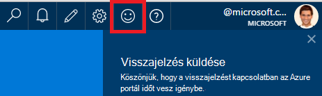
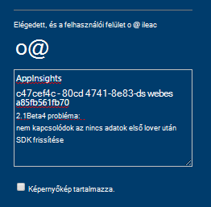
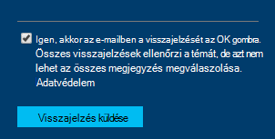

<properties 
    pageTitle="Technikai támogatás kérése az alkalmazás az összefüggéseket fejlesztőcsapatához hogyan |} Microsoft Azure" 
    description="Amikor az alkalmazás mélyebb fejlesztőcsapatához speciális támogatási igénylő eset, ez az hogyan küldhet a technikai támogatás kérése az adatait." 
    services="application-insights" 
    documentationCenter=""
    authors="alexbulankou" 
    manager="douge"/>
 
<tags 
    ms.service="application-insights" 
    ms.workload="tbd" 
    ms.tgt_pltfrm="ibiza" 
    ms.devlang="na" 
    ms.topic="article" 
    ms.date="06/01/2016" 
    ms.author="albulank"/>
    
# <a name="how-to-get-technical-support-from-application-insights-development-team"></a>Technikai támogatás kérése az alkalmazás az összefüggéseket fejlesztőcsapatához módjáról
    
Amikor egy technikai probléma megoldásához a [Visual Studio alkalmazás Hírcsatornájában](app-insights-overview.md), az alábbiakban a Súgó beállításai:

## <a name="1-check-the-documents"></a>1. a dokumentumok keresése

* Hiányzó adatok? Ellenőrzés: [mintavételnél](app-insights-sampling.md) [kvótáinak és szabályozása](app-insights-pricing.md).
* Problémamegoldás: [az ASP.NET](app-insights-troubleshoot-faq.md) | [Java](app-insights-java-troubleshoot.md)

## <a name="2-search-the-forums"></a>2. a Keresés a fórumokon

* [Fórum az MSDN webhelyen](https://social.msdn.microsoft.com/Forums/vstudio/home?forum=ApplicationInsights)
* [StackOverflow](http://stackoverflow.com/questions/tagged/ms-application-insights)

## <a name="3-azure-support-plan"></a>3. a azure támogatási csomagra?

Vannak helyzetek, ahol meg szeretné fejlesztők számára, hogy az adott eset vizsgálja meg. 

Ha van egy [támogatja a Microsoft Azure tervet](https://azure.microsoft.com/support/plans/) azt is megteheti, [Nyissa meg a támogatási jegyek](https://portal.azure.com/?#blade/Microsoft_Azure_Support/HelpAndSupportBlade).

## <a name="4-contact-the-application-insights-team"></a>4. a alkalmazás háttérismeretek csoport munkatársaitól

Ha nincs támogatás csomagra, fejlesztési csapatunk Boldog kínálatát legjobb munkamennyiség támogatási alkalmazás Hírcsatornájában a vevők, ahogy azt az általános elérhetősége mérföldkő előkészítése. Azt is bemutatása **új támogatási lehetőségek**: ismertetik az esetet által Azure portálon visszajelzési űrlap elküldése és a fejlesztők van a biztonsági másolatot a probléma megoldásához alkalmazás Hírcsatornájában csapat partnerre.


1. Az [alkalmazás az összefüggéseket portálon](https://portal.azure.com)kattintson a jobb felső sarokban a mosolygó arc:  

       

2. A Megjegyzés mezőben ellenőrizze, hogy az első sorban adja meg a **AppInsights** , és kattintson a következő információkat tartalmazza:   

    ```

    AppInsights   
    ikey: <instrumentation key>   
    sdk: <SDK that you are using, including name and version>  
    issue: <please describe the problem you are having>

    ```   

       

3. Jelölje be a "Igen, akkor is, e-mailben való ok". 

      

Az alkalmazás mélyebb munkacsoportja egy adatbázismodellbe fog lépni Önnel hamarosan. A szolgáltatás legjobb munkamennyiség alapon azt létrehozásán, nincs hivatalos SLA is kell adni ezen a ponton.


