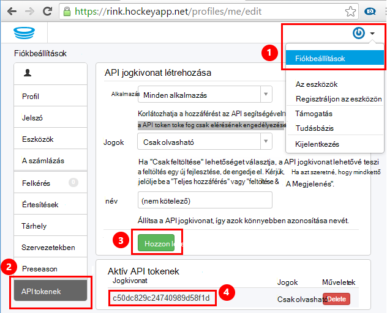
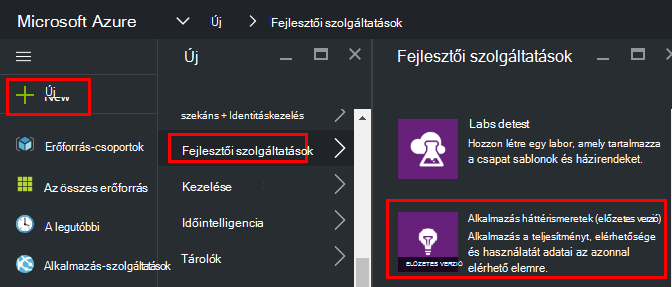
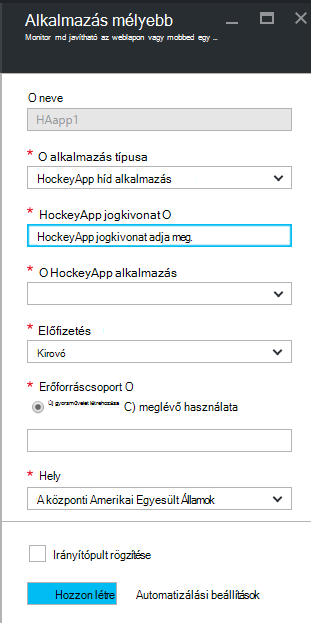
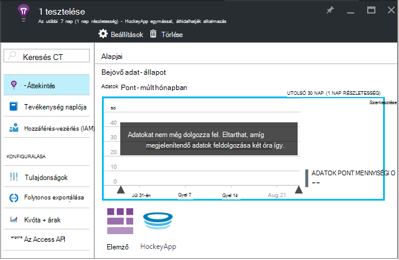
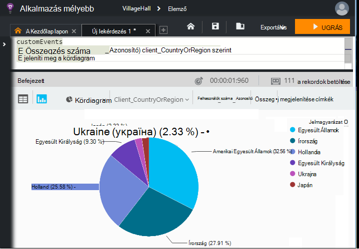

<properties 
    pageTitle="Az alkalmazás mélyebb HockeyApp adatok vizsgálatának |} Microsoft Azure" 
    description="Használati és az Azure alkalmazást, az alkalmazás az összefüggéseket a teljesítmény elemzése." 
    services="application-insights" 
    documentationCenter="windows"
    authors="alancameronwills" 
    manager="douge"/>

<tags 
    ms.service="application-insights" 
    ms.workload="tbd" 
    ms.tgt_pltfrm="ibiza" 
    ms.devlang="na" 
    ms.topic="article" 
    ms.date="08/25/2016" 
    ms.author="awills"/>

#  Az alkalmazás az összefüggéseket HockeyApp adatok feltárása

[HockeyApp](https://azure.microsoft.com/services/hockeyapp/) ajánlott platform az élő asztali és mobil alkalmazások figyelése a rendszer. A HockeyApp egyéni küldhet és nyomon követése telemetriai használat figyelése és segítségnyújtás a diagnosztikai (mellett összeomlik adatok első). A telemetriai követő lekérdezhető, hatékony [Analytics](app-insights-analytics.md) funkcióval a [Visual Studio alkalmazásban az összefüggéseket](app-insights-overview.md). Ezeken kívül azt is megteheti [az egyéni exportálása és nyomon követése telemetriai](app-insights-export-telemetry.md). Ahhoz, hogy ezek a Funkciók, beállíthatja, hogy az alkalmazás az összefüggéseket HockeyApp adatok továbbítja hidat.

## A HockeyApp híd alkalmazás

A HockeyApp híd alkalmazás szüksége folyamatos exportálása funkciók és core szolgáltatás, amely lehetővé teszi, hogy a Analytics keresztül hozzáfér a HockeyApp adatokhoz, az alkalmazás az összefüggéseket. Ezek a funkciók elérhetők a HockeyApp híd-alkalmazás létrehozása után HockeyApp által gyűjtött adatokat. Nézzük meg, hogy miként állíthatja be az alkalmazások híd közül.

Nyissa meg a Fiókbeállítások, [API tokenek](https://rink.hockeyapp.net/manage/auth_tokens)HockeyApp. Hozzon létre egy új jogkivonat, vagy egy már meglévő újrafelhasználása. A minimális jogokat szükséges "írásvédettek". Jogkivonat, hogy az API-t egy példányát.

Nyissa meg a Microsoft Azure-portál és az [alkalmazás mélyebb erőforrás létrehozása](app-insights-create-new-resource.md). "HockeyApp híd alkalmazás" alkalmazás típusa beállítása:

Nem kell beállítania a nevét, – ez a program automatikusan állítja a HockeyApp neve.

A HockeyApp híd mezők jelennek meg. 

Adja meg a korábban feljegyzett HockeyApp jogkivonat. Ez a művelet feltölti a "HockeyApp alkalmazás" legördülő menü az HockeyApp-alkalmazásokkal. Jelölje ki a használni kívánt, és töltse ki a többi mezőjét. 

Nyissa meg az új erőforrás. 

Figyelje meg, hogy az adatokat is eltarthat folyó indításához.

Az egész! Az aktuális ponttól HockeyApp rendszereken alkalmazásban gyűjtött adatokat is már alkalmazás háttérismeretek analitikai és a folyamatos exportálása funkciók érhető el.

Vegyük röviden tekintse át az összes most már elérhető funkciókról.

## Elemző

Analytics adat, amivel diagnosztizálása és elemzése a telemetriai és gyorsan megismerheti a okát és a minták lekérdezése alkalmi hatékony eszköz.

* [További tudnivalók a Analytics](app-insights-analytics-tour.md)
* [Videó – bevezetés](https://channel9.msdn.com/events/Build/2016/T666)
* [Speciális fogalmak videó](https://channel9.msdn.com/Events/Build/2016/P591)

## Folytonos exportálása

Folytonos exportálás lehetővé teszi az adatok exportálása az Azure Blob-tárolóhoz tárolóba. Ez nagyon hasznos, ha módosítani szeretné tartani az adatokat a hosszabb, mint az adatmegőrzési időszak jelenleg nyújtotta alkalmazás az összefüggéseket. Az adatok megtartása blob-tárolóban lévő, dolgozza fel egy SQL-adatbázis vagy az előnyben részesített adattárolási megoldás.

[További tudnivalók a folyamatos exportálása](app-insights-export-telemetry.md)

## Következő lépések

* [Az adatok Analytics alkalmazása](app-insights-analytics-tour.md)

