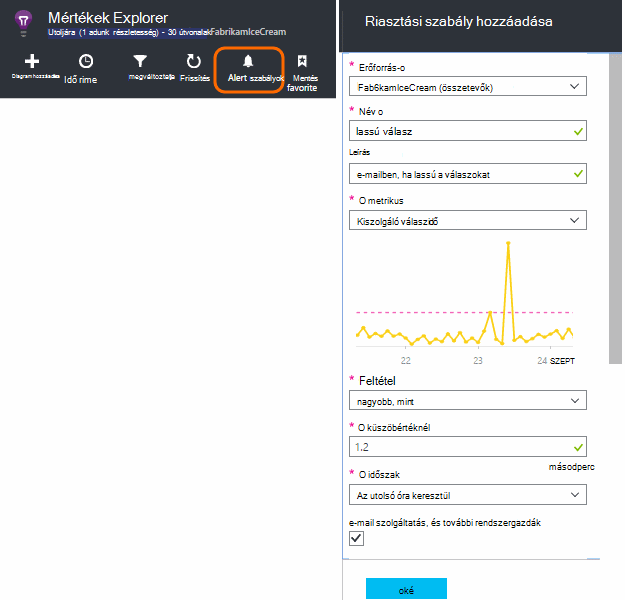
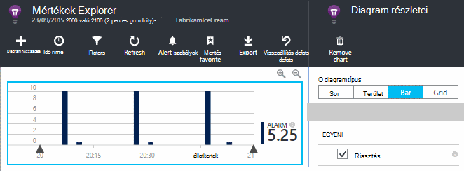
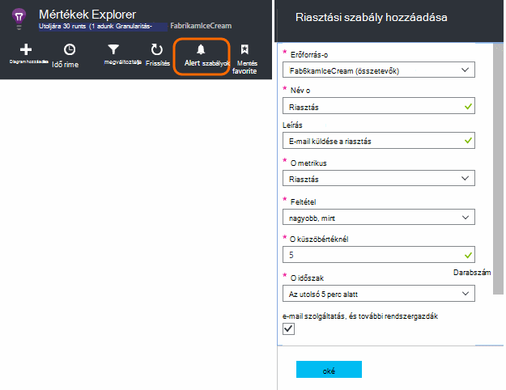
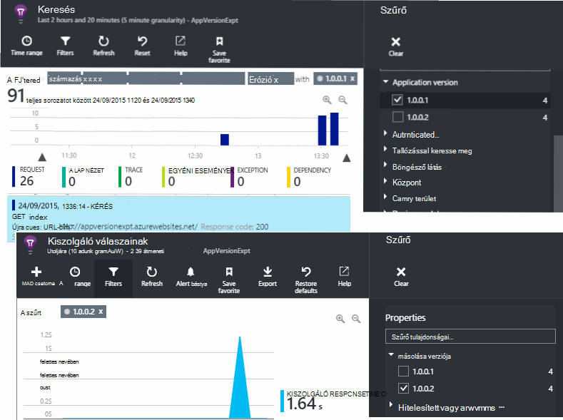
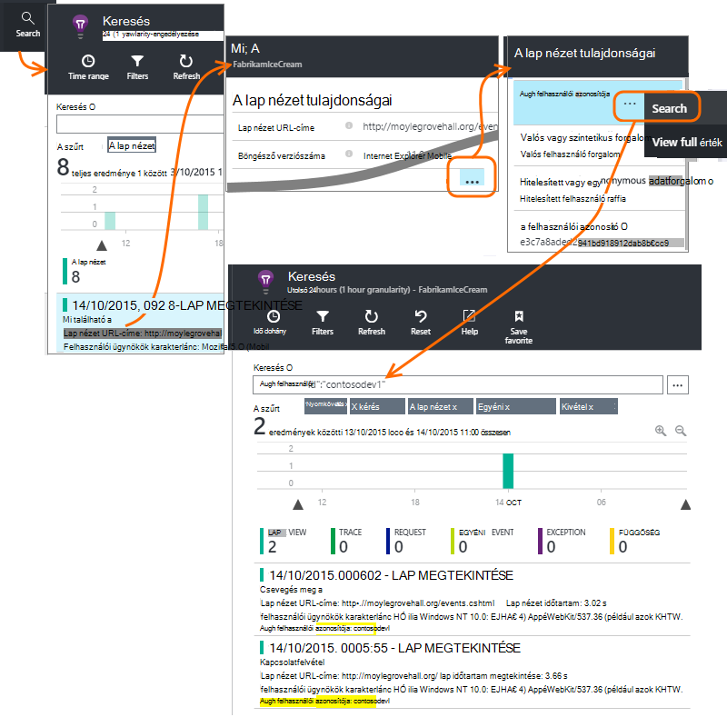
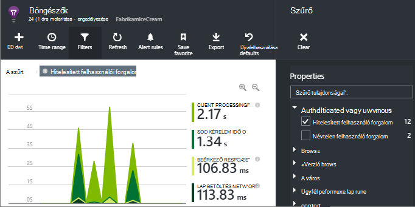
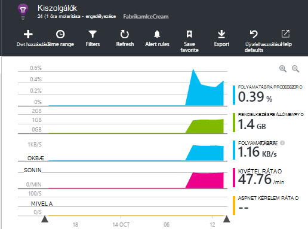

<properties 
    pageTitle="Hogyan tudom... az alkalmazás az összefüggéseket |} Microsoft Azure" 
    description="Gyakori kérdések az alkalmazás az összefüggéseket." 
    services="application-insights" 
    documentationCenter=""
    authors="alancameronwills" 
    manager="douge"/>

<tags 
    ms.service="application-insights" 
    ms.workload="tbd" 
    ms.tgt_pltfrm="ibiza" 
    ms.devlang="na" 
    ms.topic="article" 
    ms.date="02/05/2016" 
    ms.author="awills"/>

# <a name="how-do-i--in-application-insights"></a>Hogyan tudom... az alkalmazás az összefüggéseket?

## <a name="get-an-email-when-"></a>A levelezés Ha...

### <a name="email-if-my-site-goes-down"></a>E-mailben, ha megszakad a saját webhelyen

Állítsa az [Elérhetőség webes tesztelése](app-insights-monitor-web-app-availability.md).

### <a name="email-if-my-site-is-overloaded"></a>Ha a saját hely túl van terhelve e-mailben

[Értesítés](app-insights-alerts.md) beállítása a **kiszolgáló válaszidő**. Egy 1 és 2 másodperc között küszöbérték fog működni.



Az alkalmazás előfordulhat, hogy is megjelenítheti a törzs jelei hibát kódok visszaadása. Értesítés beállítása a **hibás**kérés.

Ha szeretne a **Kivételek**értesítés beállítása, lehet, ha [néhány további beállítási](app-insights-asp-net-exceptions.md) lehetőségek adatok megjelenítéséhez.

### <a name="email-on-exceptions"></a>A kivételek e-mailben

1. [Kivétel figyelése beállítása](app-insights-asp-net-exceptions.md)
2. [Értesítés beállítása](app-insights-alerts.md) a kivétel darab mérőszám


### <a name="email-on-an-event-in-my-app"></a>Az alkalmazásom esemény levelezés

Tegyük fel, hogy e-mailben jelenik meg, ha a megadott esemény szeretne. Alkalmazás háttérismeretek nem ad lehetőséget ezzel a lehetőséggel közvetlenül, de azt is, [Ha egy mérőszám metszéspontja küszöbértéket jelzést küldjön](app-insights-alerts.md). 

Értesítések állítható be [egyéni mértékek](app-insights-api-custom-events-metrics.md#track-metric), bár nem egyéni események. Néhány kódírás növelése egy mérőszám, az esemény esetén:

    telemetry.TrackMetric("Alarm", 10);

vagy:

    var measurements = new Dictionary<string,double>();
    measurements ["Alarm"] = 10;
    telemetry.TrackEvent("status", null, measurements);

Értesítések két állam van, mert küldése alacsony érték, ha, fontolja meg az értesítés, be kell fejezni van:

    telemetry.TrackMetric("Alarm", 0.5);

Diagram létrehozása a [metrikus explorer](app-insights-metrics-explorer.md) , a riasztás láthatja:



Most már az minden olyan esetben, amikor a mérőszám közép érték fölötti rövid ideig értesítés beállítása:




Állítsa a minimális átlagolási időszakhoz. 

E-mailek szerezze be, amikor a mérőszám fölött, mind a küszöbérték alatt.

Néhány tudnivaló:

* Értesítés a két állam ("riasztás" és "megfelelő") tartalmaz. Az állapot kiértékeli csak egy mérőszám érkezésekor.
* E-mailt küldi, csak akkor, amikor állapota megváltozik. Ez az miért kell küldése mindkét magas és mérőszámok alacsony értékű. 
* A kiértékelendő az értesítésre, az átlag kell venni a kapott értéket a megelőző időszakban. Ez akkor fordul elő, minden alkalommal, amikor egy mérőszám érkezik, így e-mailek az időszak beállított gyakrabban el lehet küldeni.
* Mivel az e-mailek fogadására "riasztás" és "megfelelő", érdemes lehet újra a két állam feltételként az egyszeri esemény gondolok figyelembe. Például helyett a "a feladat befejezése" esemény van "folyamatban lévő feladat" feltételt, ahol kap e-mailek kezdő és a feladat végén.

### <a name="set-up-alerts-automatically"></a>Automatikusan állíthat be értesítéseket

[Új értesítések létrehozása a PowerShell használatával](app-insights-alerts.md#set-alerts-by-using-powershell)

## <a name="use-powershell-to-manage-application-insights"></a>Alkalmazás háttérismeretek kezelése a PowerShell használatával

* [Hozzon létre új erőforrások](app-insights-powershell-script-create-resource.md)
* [Új értesítések létrehozása](app-insights-alerts.md#set-alerts-by-using-powershell)

## <a name="application-versions-and-stamps"></a>Alkalmazás verziókat és a bélyegzőket

### <a name="separate-the-results-from-dev-test-and-prod"></a>Az eredmények elválasztja a fejlesztők, tesztelése és termékkatalógus

* A különböző environmnents különböző ikeys beállítása
* A különböző bélyegzőket (fejlesztők, tesztelje, gyártási rendelés) eltérő értékű, a telemetriai nyomon követése

[tudj meg többet](app-insights-separate-resources.md)
 

### <a name="filter-on-build-number"></a>Szűrés build száma

Amikor az alkalmazás új verziója teszi közzé, érdemes engedélyezni szeretné a telemetriai elválasztja különféle buildjeiben.

Alkalmazás verziószámának azt is megadhatja, hogy [metrikus explorer](app-insights-metrics-explorer.md) és a [keresési](app-insights-diagnostic-search.md) eredmények is szűrheti. 




Nincsenek számos különböző módszerek az alkalmazás verziószámának beállítása.

* Adja meg közvetlenül:

    `telemetryClient.Context.Component.Version = typeof(MyProject.MyClass).Assembly.GetName().Version;`

* Tördelése a sor a egy [telemetriai inicializálója](app-insights-api-custom-events-metrics.md#telemetry-initializers) annak érdekében, hogy minden TelemetryClient példány egységes vannak-e beállítva.

* [ASP.NET] A verzió beállítása a `BuildInfo.config`. A webhely modulban fog felveszi a BuildLabel csomópontot a verziójában. A projekt ezt a fájlt tartalmazza, és ne feledje, hogy a tulajdonság másolása mindig a megoldást Intézőben.

    ```XML

    <?xml version="1.0" encoding="utf-8"?>
    <DeploymentEvent xmlns:xsi="http://www.w3.org/2001/XMLSchema-instance" xmlns:xsd="http://www.w3.org/2001/XMLSchema" xmlns="http://schemas.microsoft.com/VisualStudio/DeploymentEvent/2013/06">
      <ProjectName>AppVersionExpt</ProjectName>
      <Build type="MSBuild">
        <MSBuild>
          <BuildLabel kind="label">1.0.0.2</BuildLabel>
        </MSBuild>
      </Build>
    </DeploymentEvent>

    ```
* [ASP.NET] Automatikus létrehozása a BuildInfo.config MSBuild. Ehhez a .csproj fájl néhány sor hozzáadása:

    ```XML

    <PropertyGroup>
      <GenerateBuildInfoConfigFile>true</GenerateBuildInfoConfigFile>    <IncludeServerNameInBuildInfo>true</IncludeServerNameInBuildInfo>
    </PropertyGroup> 
    ```

    Ez a *yourProjectName*nevű fájl hoz létre. BuildInfo.config. A közzétételi folyamat átnevezi BuildInfo.config.

    A Szerkesztés címke tartalmaz a helyőrző (AutoGen_...), a Visual Studio build létrehozásakor. De amikor épülő MSBuild, és a megfelelő verziójú szám töltve.

    MSBuild verziószámai létrehozásához engedélyezéséhez állítsa a verziót, például `1.0.*` a AssemblyReference.cs

## <a name="monitor-backend-servers-and-desktop-apps"></a>Kódmentes kiszolgálók és az asztali alkalmazások figyelése

[A Windows Server SDK modul használatára](app-insights-windows-desktop.md).


## <a name="visualize-data"></a>Adatok ábrázolása

#### <a name="dashboard-with-metrics-from-multiple-apps"></a>Több alkalmazásokból mértékek irányítópult

* Testre szabhatja a diagram [Metrikus Explorer](app-insights-metrics-explorer.md), és mentse a Kedvencek közül. Rögzítés az Azure irányítópult azt.


#### <a name="dashboard-with-data-from-other-sources-and-application-insights"></a>Az adatok más forrásokból, és az alkalmazás az összefüggéseket irányítópult

* A [Power bi telemetriai exportálása](app-insights-export-power-bi.md). 

Vagy

* Az irányítópult adatok megjelenítése a SharePoint-kijelzők használata SharePoint. [Folyamatos exportálás és exportálása az SQL adatfolyam Analytics](app-insights-code-sample-export-sql-stream-analytics.md).  Használja a powerview használata vizsgálja meg az adatbázist, és hozzon létre egy SharePoint-kijelző a powerview használata.


<a name="search-specific-users"></a>
### <a name="filter-out-anonymous-or-authenticated-users"></a>Névtelen vagy hitelesített felhasználó kiszűrése

Ha a felhasználók bejelentkezni, beállíthatja, hogy a [hitelesített felhasználói azonosítójával](app-insights-api-custom-events-metrics.md#authenticated-users). (Nem fordul elő automatikus.) 

Ezután közül választhat:

* Keresse meg bizonyos felhasználói azonosítók



* Névtelen vagy hitelesített felhasználóknak mértékek szűrése



## <a name="modify-property-names-or-values"></a>Tulajdonságok neve vagy az értékek módosítása

Hozzon létre egy [szűrőt](app-insights-api-filtering-sampling.md#filtering). Ezzel a radírral módosítása vagy telemetriai szűrése, az alkalmazás alkalmazás mélyebb elküldése előtt.

## <a name="list-specific-users-and-their-usage"></a>Adott Felhasználólista és azok használata

Ha csak [bizonyos felhasználók keres](#search-specific-users), beállíthatja, hogy a [hitelesített felhasználói azonosítójával](app-insights-api-custom-events-metrics.md#authenticated-users).

Ha azt szeretné, hogy az adatok, például hogy mely lapokon felhasználók listájának megtekintik vagy gyakoriságának jelentkezzen be őket, két lehetőség közül választhat:

* [Beállítása hitelesített felhasználói azonosító](app-insights-api-custom-events-metrics.md#authenticated-users), [exportálása adatbázisba](app-insights-code-sample-export-sql-stream-analytics.md) és használatának megfelelő eszközök van a felhasználói adatok elemzése céljából.
* Ha kisvállalati száma felhasználókat, küldje el az egyéni események vagy a mértékek, a vizsgált adatokat a használják a metrikus érték vagy az esemény nevét, és állítsa a felhasználóazonosító tulajdonság. Az elemzés lap nézetek, cserélje le a szabványos JavaScript trackPageView hívást. Kiszolgálóoldali telemetriai elemzendő egy telemetriai inicializálója felvétele segítségével a felhasználói azonosító összes kiszolgáló telemetriai. Azt is megteheti majd szűrő és a szakasz mértékek és a felhasználóazonosító a keresést.


## <a name="reduce-traffic-from-my-app-to-application-insights"></a>Csökkentse a forgalmat a alkalmazásból alkalmazás mélyebb

* [ApplicationInsights.config](app-insights-configuration-with-applicationinsights-config.md)például a teljesítmény Számláló adatgyűjtő már nincs szükség, modulokat tiltható le.
* A SDK csomagjában talál [példákat talál arra és -szűrés](app-insights-api-filtering-sampling.md) használatát.
* A weblapok a korlátozása minden lap megtekintése jelentett Ajax-hívások. A parancsfájlok kódtöredékének után a `instrumentationKey:...` , beszúrása: `,maxAjaxCallsPerView:3` (vagy a megfelelő számú).
* [TrackMetric](app-insights-api-custom-events-metrics.md#track-metric)használja, ha az eredmény elküldése előtt a metrikus értékek kötegenként összesítés számítja ki. Túlterhelés a TrackMetric() biztosít, amelyek nem.


További tudnivalók a [árak és kvóták](app-insights-pricing.md).

## <a name="disable-telemetry"></a>Telemetriai letiltása

**Dinamikusan leállíthatja, és indítsa el** a webhelycsoport és a kiszolgálóról telemetriai továbbításának:

```

    using  Microsoft.ApplicationInsights.Extensibility;

    TelemetryConfiguration.Active.DisableTelemetry = true;
```


**Tiltsa le a kijelölt szabványos begyűjtők** – például teljesítmény számláló, HTTP-kérések vagy függőségek - törlése vagy ki a megfelelő sorokat a [ApplicationInsights.config](app-insights-api-custom-events-metrics.md)fűzni. Tudta ehhez, például ha el szeretné küldeni a saját TrackRequest adatain.


## <a name="view-system-performance-counters"></a>Nézet rendszer teljesítményét számláló

A mértékek, megjelenítheti a mértékek Intézőben között olyan rendszer teljesítményét számláló. Van egy előre definiált lap **kiszolgálók** őket számos megjelenítő című.



### <a name="if-you-see-no-performance-counter-data"></a>Ha megjelenik a nincs teljesítményadatokat számláló

* **IIS-kiszolgáló** a saját számítógépen vagy egy virtuális. Az [állapot Monitor telepíthető](app-insights-monitor-performance-live-website-now.md). 
* **Azure webhely** – nem támogatott diagramtípusról teljesítmény számláló még. Vannak olyan több mértékek elérheti az Azure webhely Vezérlőpult szabványos részeként.
* **UNIX kiszolgáló** - [collectd telepítése](app-insights-java-collectd.md)

### <a name="to-display-more-performance-counters"></a>További teljesítmény számláló megjelenítéséhez

* Első lépésként [hozzáadása egy új diagrammal](app-insights-metrics-explorer.md) , és látható-e a számláló Basic értéke, amely kínálunk.
* Ha nem, [adja hozzá a számlálót, hogy a teljesítményét számláló modul által gyűjtött megadása](app-insights-performance-counters.md).


