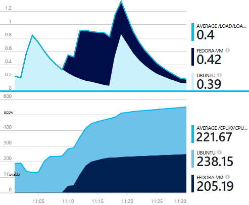
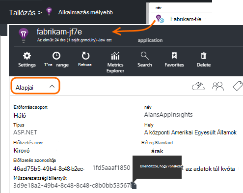
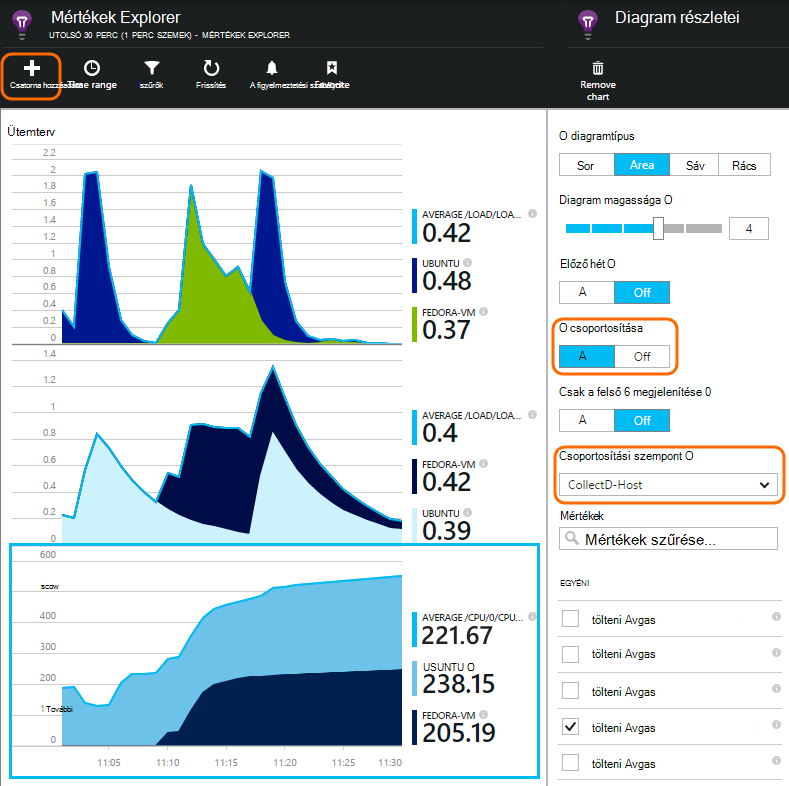

<properties 
    pageTitle="collectd: az alkalmazás mélyebb UNIX Java perf stat" 
    description="Bővített, az alkalmazás az összefüggéseket a beépülő modul CollectD a Java webhely figyelemmel kísérése" 
    services="application-insights" 
    documentationCenter="java"
    authors="alancameronwills" 
    manager="douge"/>

<tags 
    ms.service="application-insights" 
    ms.workload="tbd" 
    ms.tgt_pltfrm="ibiza" 
    ms.devlang="na" 
    ms.topic="article" 
    ms.date="08/24/2016" 
    ms.author="awills"/>
 
# <a name="collectd-unix-performance-metrics-in-application-insights"></a>collectd: az alkalmazás az összefüggéseket a Unix teljesítménymutatók

*Alkalmazás háttérismeretek az előzetes verzióban.*

Unix rendszer teljesítménymutatók [Alkalmazás háttérismeretek](app-insights-overview.md)feltárása, [collectd](http://collectd.org/)együtt az alkalmazás az összefüggéseket a beépülő modul telepítése. A Megnyitás-forrás megoldás gyűjti össze a különféle rendszer és a hálózat statisztikákat.

A szokásos kell használni collectd, ha van már [az alkalmazás az összefüggéseket Java webszolgáltatás rendszereken][java]. Az alkalmazás teljesítményének növeléséhez vagy problémáinak diagnosztizálása segít több adat kínál fel. 



## <a name="get-your-instrumentation-key"></a>Ismerkedés a műszerezettségi használatával

A [Microsoft Azure-portálon](https://portal.azure.com)nyissa meg az [Alkalmazást az összefüggéseket](app-insights-overview.md) erőforrás, amelyre az adatokat meg szeretné jeleníteni. (Vagy [Hozzon létre egy új erőforrást](app-insights-create-new-resource.md).)

Eltarthat egy példányát a műszerezettségi billentyűt, amely azonosítja az erőforrás.




## <a name="install-collectd-and-the-plug-in"></a>Collectd és a beépülő modul telepítése

A Unix kiszolgáló gépen:

1. [Collectd](http://collectd.org/) 5.4.0 verzió telepítése vagy újabb verziójában.
2. Töltse le az [alkalmazás mélyebb collectd író bővítményt](https://aka.ms/aijavasdk). Megjegyzés: a verziószám.
3. A beépülő modul JAR történő másolása `/usr/share/collectd/java`.
3. Szerkesztés `/etc/collectd/collectd.conf`:
 * Győződjön meg arról, hogy [a Java bővítmény](https://collectd.org/wiki/index.php/Plugin:Java) engedélyezve van-e.
 * Frissítse a JVMArg a java.class.path az a következő üveg felvenni. A letöltött egyeznie a verziószámot frissítése:
  * `/usr/share/collectd/java/applicationinsights-collectd-1.0.5.jar`
 * Adja hozzá a kódtöredék a műszerezettségi kulccsal az erőforrás:

```

     LoadPlugin "com.microsoft.applicationinsights.collectd.ApplicationInsightsWriter"
     <Plugin ApplicationInsightsWriter>
        InstrumentationKey "Your key"
     </Plugin>
```

Az alábbiakban a konfigurációs mintafájl részét:

    ...
    # collectd plugins
    LoadPlugin cpu
    LoadPlugin disk
    LoadPlugin load
    ...

    # Enable Java Plugin
    LoadPlugin "java"

    # Configure Java Plugin
    <Plugin "java">
      JVMArg "-verbose:jni"
      JVMArg "-Djava.class.path=/usr/share/collectd/java/applicationinsights-collectd-1.0.5.jar:/usr/share/collectd/java/collectd-api.jar"

      # Enabling Application Insights plugin
      LoadPlugin "com.microsoft.applicationinsights.collectd.ApplicationInsightsWriter"
                
      # Configuring Application Insights plugin
      <Plugin ApplicationInsightsWriter>
        InstrumentationKey "12345678-1234-1234-1234-123456781234"
      </Plugin>

      # Other plugin configurations ...
      ...
    </Plugin>
.   ...

Állítsa be a többi [collectd bővítmények](https://collectd.org/wiki/index.php/Table_of_Plugins), amelyek különböző forrásokból származó adatok különböző összegyűjtheti.

Indítsa újra a [kézzel](https://collectd.org/wiki/index.php/First_steps)megfelelően collectd.

## <a name="view-the-data-in-application-insights"></a>Alkalmazás háttérismeretek adatainak megtekintése

Nyissa meg az alkalmazást az összefüggéseket erőforrás [Mértékek Explorer és diagramok hozzáadása][metrics], jelölje ki a mértékek meg szeretné jeleníteni az egyéni kategóriából.



Alapértelmezés szerint a mértékek vannak összesíti, amelyhez a mértékek gyűjtése host gépeken futó keresztül. Szeretné megtekinteni a diagram a Részletek lap per host, a mértékek, kapcsolja be a csoportosítás, és válassza ki a Host CollectD csoportosítandó.


## <a name="to-exclude-upload-of-specific-statistics"></a>Feltöltés adott statisztikák kizárása

Alapértelmezés szerint az alkalmazás az összefüggéseket beépülő modul átirányítása összes "olvassa el" bővítmények engedélyezett collectd által gyűjtött adatok. 

Adatok kizárni bizonyos, bővítmények vagy adatforrásokból:

* A beállítási fájl szerkesztése. 
* A `<Plugin ApplicationInsightsWriter>`, irányelv vonalakkal jelennek meg:

Irányelv | Hatás
---|---
`Exclude disk` | Kizárja az összes által gyűjtött adatokat a `disk` beépülő modul
`Exclude disk:read,write` | A források nevű kizárni `read` és `write` a a `disk` bővítményt.

A Sortörés az irányelvekben.


## <a name="problems"></a>Problémákat?

*Nem látható a portálon adatok*

* Nyissa meg a [keresési] [ diagnostic] tekintheti meg, ha a nyers események érkeztek. Előfordul, hogy azok lassabban mértékek Intézőben jelennek meg.
* Szükség lehet [kimenő adatok tűzfal kivételek megadása](app-insights-ip-addresses.md)
* Nyomkövetés az alkalmazás mélyebb beépülő moduljának engedélyezése. Ebben a sorban belül hozzáadása `<Plugin ApplicationInsightsWriter>`:
 *  `SDKLogger true`
* Nyissa meg a terminált, és indítsa el a collectd részletes módban, kapcsolatos problémák megoldásához jelez megtekintéséhez:
 * `sudo collectd -f`


<!--Link references-->

[api]: app-insights-api-custom-events-metrics.md
[apiexceptions]: app-insights-api-custom-events-metrics.md#track-exception
[availability]: app-insights-monitor-web-app-availability.md
[diagnostic]: app-insights-diagnostic-search.md
[eclipse]: app-insights-java-eclipse.md
[java]: app-insights-java-get-started.md
[javalogs]: app-insights-java-trace-logs.md
[metrics]: app-insights-metrics-explorer.md
[usage]: app-insights-web-track-usage.md

 
