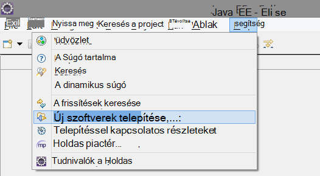
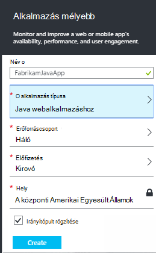
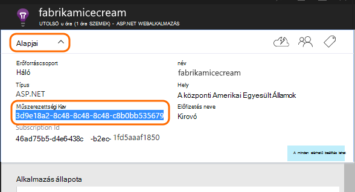

<properties 
    pageTitle="Alkalmazás mélyebb Java Holdas az első lépések" 
    description="A beépülő modul Holdas használata a teljesítmény és a használat felügyeletet igényel, hogy az alkalmazás az összefüggéseket a Java-webhely hozzáadása" 
    services="application-insights" 
    documentationCenter="java"
    authors="alancameronwills" 
    manager="douge"/>

<tags 
    ms.service="application-insights" 
    ms.workload="tbd" 
    ms.tgt_pltfrm="ibiza" 
    ms.devlang="na" 
    ms.topic="article" 
    ms.date="03/02/2016" 
    ms.author="awills"/>
 
# Első lépések az alkalmazás az összefüggéseket a Holdas Java

Az alkalmazás az összefüggéseket SDK, hogy használatát és a teljesítmény elemezheti küld a Java webalkalmazás telemetriai. A beépülő modul alkalmazás háttérismeretek Holdas így kívül a mezőben telemetriai, valamint egy API-t használó egyéni telemetriai írása automatikusan telepíti a SDK csomagjában talál a projektben.   

## Előfeltételek

Jelenleg a beépülő modul használható maven tesztelése és Holdas a dinamikus webhely-projektek. ([Alkalmazás háttérismeretek hozzáadása a Java projekt más típusú][java].)

Lesz szüksége:

* Az Oracle JRE 1,6 vagy újabb verzió
* [Microsoft Azure](https://azure.microsoft.com/)-előfizetést. (Lehet kezdi az [ingyenes próbaverziót](https://azure.microsoft.com/pricing/free-trial/).)
* [Java EE fejlesztők számára Holdas IDE](http://www.eclipse.org/downloads/), Indigo vagy újabb verziója.
* Windows 7 vagy újabb, vagy a Windows Server 2008 vagy újabb verzió

## A SDK telepítése Holdas (egy idő)

Csak akkor végezze el ezt egyszer per gépi. Ebben a lépésben a telepítést a eszközkészlet, amelyek minden dinamikus webes projekthez hozzáadhatja a SDK csomagjában talál.

1. Holdas kattintson a súgó új szoftver telepítése.

    

2. A SDK http://dl.windowsazure.com/eclipse Azure eszközkészlet alatt található. 
3. Törölje a jelet **az összes frissítése webhelyek... Forduljon**

    

Kövesse a hátralévő lépéseket minden Java projekt.

## Hozzon létre egy alkalmazás háttérismeretek erőforrás Azure-ban

1. Jelentkezzen be az [Azure-portálon](https://portal.azure.com).
2. Hozzon létre egy új alkalmazás háttérismeretek erőforrás.  

      
3. Állítsa az alkalmazás típusa Java webalkalmazást.  

      
4. Keresse meg az új erőforrás a műszerezettségi billentyűt. Illessze be ezt a kód projekt hamarosan kell.  

      

## Alkalmazás háttérismeretek hozzáadása a projekthez

1. A helyi menüből a Java webes projekt alkalmazás mélyebb hozzáadása

    

2. Illessze be a műszerezettségi billentyűt az Azure portál kapott.

    

A kulcs minden elemet a telemetriai együtt küldi el, és ez az alkalmazás az összefüggéseket jelenjen meg az erőforrás.

## Futtassa az alkalmazást, és mérőszámok lásd:

Az alkalmazásnak a futtatására.

Térjen vissza az alkalmazást az összefüggéseket erőforrás a Microsoft Azure-ban.

Az Áttekintés lap HTTP kérések adatokat fog megjelenni. (Ha nem létezik, várjon néhány másodpercig, és kattintson a frissítés gombra.)

 

Kattintson az egyes diagramokra kattintva tekintse részletesebb mértékek keresztül. 

[További tudnivalók a mértékek.][metrics]

 

És a tulajdonságok egy kérelem megtekintése, láthatja a telemetriai eseményeket, például kérelmek és a kivételek társítva.
 

## Ügyféloldali telemetriai

Kattintson a quickstart útmutató lap figyelése a weblapok Get-kódot: 

A HTML-fájlok vezetője a kódtöredék beszúrása.

#### Ügyféloldali adatainak megtekintése

Nyissa meg a frissített webhely lapjainak és használhatja őket. Várjon egy perc vagy két, ezután térjen vissza az alkalmazást az összefüggéseket, és nyissa meg a használat lap. (Az Áttekintés lap görgessen lefelé, és kattintson a használat elemre.)

Kattintson a használat lap Lap nézetben, a felhasználó és a munkamenet mértékek jelennek meg:

[További tudnivalók az ügyféloldali telemetriai beállítását.][usage]

## Az alkalmazás közzététele

Az alkalmazás letöltése közzététele a kiszolgálón, és megtekintés a telemetriai jelenik meg a portálon küldő személyeket használatát.

* Ügyeljen arra, hogy a tűzfal lehetővé teszi, hogy az alkalmazás telemetriai küldeni az alábbi portokat:

 * DC.Services.visualstudio.com:443
 * DC.Services.visualstudio.com:80
 * F5.Services.visualstudio.com:443
 * F5.Services.visualstudio.com:80

* Telepítse a Windows-kiszolgálók:

 * [Microsoft Visual C++ terjeszthető változata](http://www.microsoft.com/download/details.aspx?id=40784)

    (Ez lehetővé teszi a teljesítmény számláló.)

## Kivételek és kérelem hibák

Automatikusan begyűjtési esetén nem kezelt kivételeket:

Más kivételek összegyűjtheti az adatokat, két lehetőség van:

* [Hívások átirányítása a kódban TrackException beszúrása](app-insights-api-custom-events-metrics.md#track-exception). 
* [Java ügynököt a kiszolgálón](app-insights-java-agent.md). Adhatja meg a megtekinteni kívánt módszereket.

## Módszer hívások és a külső függőségeket figyelése

[A Java ügynököt a](app-insights-java-agent.md) bejelentkezési megadott belső módszerek és hívások keresztül JDBC, időzítés adatokkal.

## Teljesítmény számláló

Az Áttekintés lap a görgessen le, és kattintson a **kiszolgálók** csempére. Látni fogja a teljesítmény számláló cellatartományban.

### Teljesítményét számláló webhelycsoport testreszabása

Le szeretné tiltani a teljesítmény számláló szabványos készlete gyűjteménye, adja hozzá a legfelső szintű csomópont ApplicationInsights.xml fájl csoportban a következő kódot:

    <PerformanceCounters>
       <UseBuiltIn>False</UseBuiltIn>
    </PerformanceCounters>

### További teljesítmény számláló összegyűjtése

További teljesítmény számláló gyűjtendő is megadhat.

#### JMX számláló (a Java virtuális gép által elérhetővé tett)

    <PerformanceCounters>
      <Jmx>
        <Add objectName="java.lang:type=ClassLoading" attribute="TotalLoadedClassCount" displayName="Loaded Class Count"/>
        <Add objectName="java.lang:type=Memory" attribute="HeapMemoryUsage.used" displayName="Heap Memory Usage-used" type="composite"/>
      </Jmx>
    </PerformanceCounters>

*   `displayName`– Neve megjelenik az alkalmazás mélyebb portálon.
*   `objectName`– JMX objektum neve.
*   `attribute`– Attribútumának JMX objektumnév-ból
*   `type`(nem kötelező) – a JMX objektum attribútum típusát:
 *  Alapértelmezés: egyszerű típus például int vagy hosszú.
 *  `composite`: "Attribute.Data" formátumban van a teljesítményszámláló adatait
 *  `tabular`: a teljesítményszámláló adatait a táblázatsor formátumban van.

#### A Windows teljesítmény számláló

Az egyes [Windows teljesítmény számláló](https://msdn.microsoft.com/library/windows/desktop/aa373083.aspx) tagja kategória (ugyanúgy mező egyik tagja). A kategóriák lehet globális, vagy olyan számozott vagy példányok nevű.

    <PerformanceCounters>
      <Windows>
        <Add displayName="Process User Time" categoryName="Process" counterName="%User Time" instanceName="__SELF__" />
        <Add displayName="Bytes Printed per Second" categoryName="Print Queue" counterName="Bytes Printed/sec" instanceName="Fax" />
      </Windows>
    </PerformanceCounters>

*   displayName – az alkalmazás az összefüggéseket portálon megjelenített név.
*   Kategórianév – a teljesítményét számláló kategória (teljesítményét objektum), amelyhez a teljesítményét számláló társítva.
*   counterName – a teljesítmény számláló nevére.
*   Példánynév – a teljesítmény számláló kategória példány vagy üres karakterláncot (""), ha a kategória tartalmaz egy példányát. Ha a kategórianév folyamat, és az aktuális JVM eljárásból van a teljesítményét számláló szeretne gyűjteni, amely az alkalmazás fut, adja meg `"__SELF__"`.

A teljesítmény számláló láthatók a [Mértékek Intézőben]egyéni mértékek[metrics].

### UNIX teljesítmény számláló

* [Collectd és az alkalmazás az összefüggéseket beépülő modul telepítése](app-insights-java-collectd.md) számos különböző típusú rendszer és a hálózati adatok eléréséhez.

## Elérhetőség webes vizsgálatok

Alkalmazás az összefüggéseket a webhely rendszeres időközönként, ellenőrizze, hogy be, és jól válaszol tesztelheti. [Állíthat be][availability], görgessen le a kattintson az elérhetőség elemre.

Diagramok válaszidő, valamint az értesítő e-mailek, ha megszakad a webhely vissza.

[További tudnivalók az elérhetőség webes vizsgálatok.][availability] 

## A diagnosztikai naplók

Ha Logback vagy Log4J használata esetén (1.2-es verzió vagy 2.0-s verziója)-nyomkövetés, akkor a nyomkövetési naplók küldött automatikusan alkalmazás mélyebb, ahol Fedezze fel, és keresse meg őket.

[További tudnivalók a diagnosztikai naplók][javalogs]

## Egyéni telemetriai 

Néhány kódsorokat beszúrása a Java webalkalmazás megtudhatja, hogy milyen felhasználók mivel foglalkoznak vele, vagy diagnosztizálását. 

Az weblapon JavaScript- és kiszolgálóoldali Java beszúrhat kódot.

[Egyéni telemetriai ismertetése][track]

## Következő lépések

#### Észleli és problémáinak diagnosztizálása

* [Adja hozzá a webes ügyfelek telemetriai] [ usage] teljesítmény telemetriai megszerezni a webes ügyfélprogramból.
* [Állítsa be a webes vizsgálatok] [ availability] kattintva ellenőrizze, hogy az alkalmazás maradjon, élő és válaszol.
* [Keresés események és naplók] [ diagnostic] számára diagnosztizálását.
* [Rögzítés Log4J vagy Logback halad][javalogs]

#### Használatának nyomon követése

* [Adja hozzá a webes ügyfelek telemetriai] [ usage] monitor lap nézetek és a felhasználó egyszerű mértékek.
* [Egyéni események és mérőszámok nyomon] [ track] Ha többet szeretne tudni az alkalmazás felhasználásáról, mind az ügyfélen és a kiszolgálón.

<!--Link references-->

[availability]: app-insights-monitor-web-app-availability.md
[diagnostic]: app-insights-diagnostic-search.md
[java]: app-insights-java-get-started.md
[javalogs]: app-insights-java-trace-logs.md
[metrics]: app-insights-metrics-explorer.md
[track]: app-insights-api-custom-events-metrics.md
[usage]: app-insights-web-track-usage.md

 