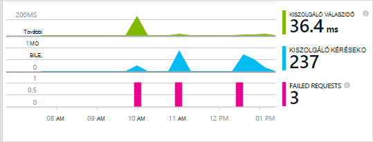
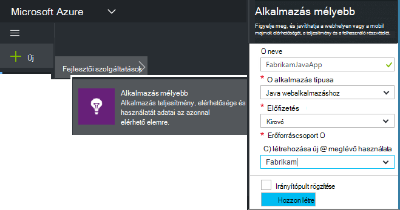
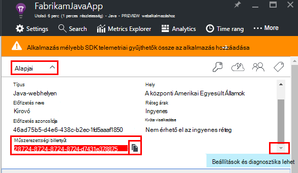
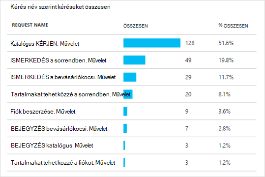
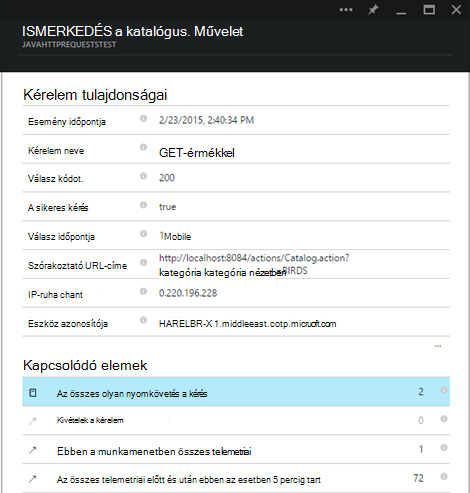
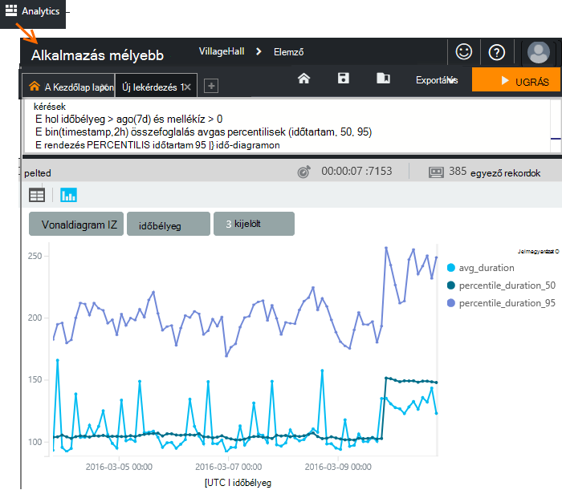
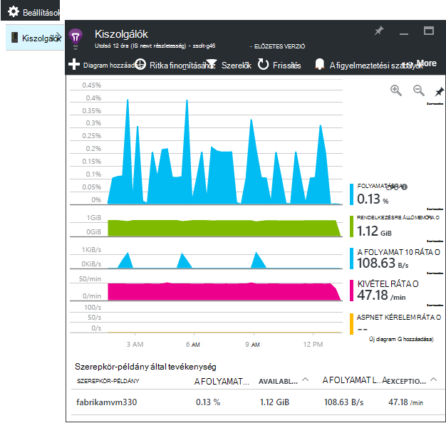
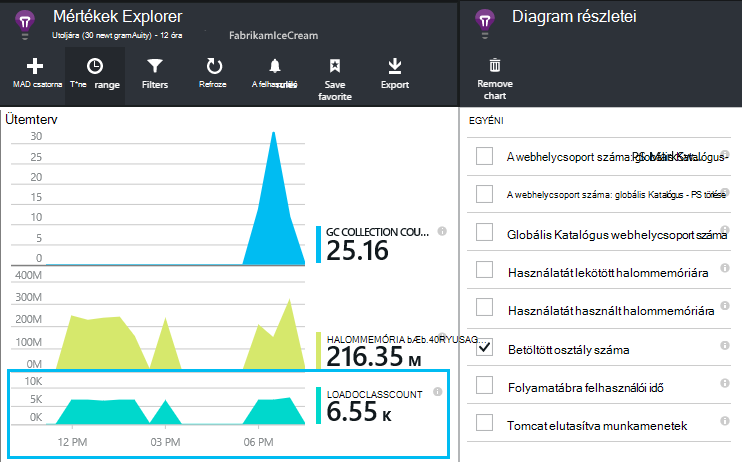
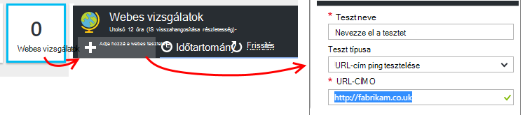
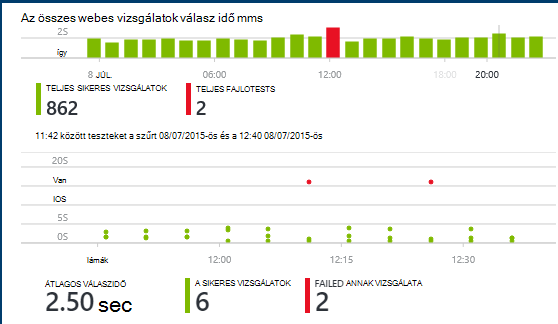

<properties
    pageTitle="Java web Analytics-alapú alkalmazás az alkalmazás az összefüggéseket |} Microsoft Azure"
    description="Figyelje meg a teljesítmény és az alkalmazás az összefüggéseket a Java webhely használatát. "
    services="application-insights"
    documentationCenter="java"
    authors="alancameronwills"
    manager="douge"/>

<tags
    ms.service="application-insights"
    ms.workload="tbd"
    ms.tgt_pltfrm="ibiza"
    ms.devlang="na"
    ms.topic="get-started-article"
    ms.date="08/17/2016"
    ms.author="awills"/>

# Első lépések az alkalmazás háttérismeretek az Java webes projekt

*Alkalmazás háttérismeretek az előzetes verzióban.*

[AZURE.INCLUDE [app-insights-selector-get-started](../../includes/app-insights-selector-get-started.md)]

[Alkalmazás háttérismeretek](https://azure.microsoft.com/services/application-insights/) egy bővíthető analytics-szolgáltatás, amely segít megérteni a teljesítmény és az élő alkalmazás használatát. Annak segítségével [észleli és teljesítménnyel kapcsolatos problémák és a kivételek diagnosztizálása](app-insights-detect-triage-diagnose.md)és [kódírás] [ api] nyomon követéséhez, mit a felhasználók az alkalmazást.

Alkalmazás háttérismeretek Linux rendszerhez, a Unix vagy a Windows rendszeren futó Java-alkalmazásokat támogatja.

szükséged van:

* Az Oracle JRE 1,6 vagy újabb, illetve Zulu JRE 1,6 vagy újabb verzió
* [Microsoft Azure](https://azure.microsoft.com/)-előfizetést. (Lehet kezdi az [ingyenes próbaverziót](https://azure.microsoft.com/pricing/free-trial/).)

*Ha már élő webalkalmazást, [a webkiszolgálón futásidőben a SDK](app-insights-java-live.md)hozzáadása sikerült kövesse a alternatív az eljárást. A helyettesítő elkerülhetők a kód Újraépítés, de nem jelenik meg a vezérlőt, amellyel kódírás felhasználói tevékenység nyomon követéséhez.*

## 1. a alkalmazás háttérismeretek műszerezettségi kulcs beszerzése

1. Jelentkezzen be a [Microsoft Azure-portálon](https://portal.azure.com).
2. Hozzon létre egy alkalmazás háttérismeretek erőforrás. Állítsa az alkalmazás típusa Java webalkalmazást.

    
4. Keresse meg az új erőforrás a műszerezettségi billentyűt. Illessze be a kulcsot a kód projekt hamarosan kell.

    

## 2. a Java alkalmazás háttérismeretek SDK hozzáadása a projekthez

*Válassza ki a megfelelő módon beállítása a projekthez.*

#### Használata Holdas maven tesztelése vagy a dinamikus webhely projekt létrehozása...

Az [Alkalmazás az összefüggéseket SDK Java beépülő modul]használata[eclipse].

#### Ha használni szeretné a maven tesztelése...

Ha build maven tesztelése használni a projekt már be van állítva, a következő kódot a pom.xml fájlhoz egyesítése

Ezután frissítése a project függőségek, a bináris letöltött fájlok eléréséhez.

    <repositories>
       <repository>
          <id>central</id>
          <name>Central</name>
          <url>http://repo1.maven.org/maven2</url>
       </repository>
    </repositories>

    <dependencies>
      <dependency>
        <groupId>com.microsoft.azure</groupId>
        <artifactId>applicationinsights-web</artifactId>
        <!-- or applicationinsights-core for bare API -->
        <version>[1.0,)</version>
      </dependency>
    </dependencies>

* *Szerkesztés vagy ellenőrző érvényesítési hibákat?* Próbálkozzon verziójával adott, például: `<version>1.0.n</version>`. A legújabb verzióra [SDK kibocsátási megjegyzések](https://github.com/Microsoft/ApplicationInsights-Java#release-notes) vagy a [maven tesztelése eltérések](http://search.maven.org/#search%7Cga%7C1%7Capplicationinsights)találhatók.
* *Egy új SDK frissítenie kell?* A projekt függőségek frissítése.

#### Ha használni szeretné a Gradle...

Ha build Gradle használni a projekt már be van állítva, a következő kódot a build.gradle fájlhoz egyesítése

Majd frissítse a projekt függőségeket a bináris letöltött fájlok eléréséhez.

    repositories {
      mavenCentral()
    }

    dependencies {
      compile group: 'com.microsoft.azure', name: 'applicationinsights-web', version: '1.+'
      // or applicationinsights-core for bare API
    }

* *Build vagy ellenőrző érvényesítési hibákat? Próbálkozzon verziójával adott, például:* `version:'1.0.n'`. *A [SDK kibocsátási megjegyzések](https://github.com/Microsoft/ApplicationInsights-Java#release-notes)megtalálhatja a legújabb verzióra.*
* *Egy új SDK frissítése*
 * A projekt függőségek frissítése.

#### Egyéb esetben...

Manuális felvétele a SDK csomagjában talál:

1. Töltse le az [alkalmazás az összefüggéseket SDK Java](https://aka.ms/aijavasdk).
2. A bináris kinyerése a zip-fájl, és hozzáadása a projekthez.

### Kérdések...

* *Mi az a közötti kapcsolatot a `-core` és `-web` a zip-összetevők?*

 * `applicationinsights-core`lehetővé teszi a bA API-t. Meg kell, hogy az összetevőt.
 * `applicationinsights-web`HTTP kérelem száma és a válasz időpontok nyomon mértékek ad. Ha nem szeretné, hogy a automatikusan gyűjtött telemetriai összetevő elhagyható. Ha például szeretné írni a saját.

* *A SDK frissítése, amikor a módosítások közzétételére azt*
 * Töltse le a legújabb [Java háttérismeretek SDK alkalmazást](https://aka.ms/qqkaq6) , és cserélje le a régi azokat.
 * Módosítások [SDK kibocsátási megjegyzések](https://github.com/Microsoft/ApplicationInsights-Java#release-notes)témakörben olvashat.

## 3. a alkalmazás háttérismeretek .xml fájl hozzáadása

ApplicationInsights.xml hozzáadása a projekthez az erőforrások mappára, vagy ellenőrizze, hogy nem adja hozzá a projekthez telepítési osztályjegyzetfüzet elérési útját. A következő XML másolja azt.

A műszerezettségi vonal, az Azure portál kapott le.

    <?xml version="1.0" encoding="utf-8"?>
    <ApplicationInsights xmlns="http://schemas.microsoft.com/ApplicationInsights/2013/Settings" schemaVersion="2014-05-30">

      <!-- The key from the portal: -->

      <InstrumentationKey>** Your instrumentation key **</InstrumentationKey>

      <!-- HTTP request component (not required for bare API) -->

      <TelemetryModules>
        <Add type="com.microsoft.applicationinsights.web.extensibility.modules.WebRequestTrackingTelemetryModule"/>
        <Add type="com.microsoft.applicationinsights.web.extensibility.modules.WebSessionTrackingTelemetryModule"/>
        <Add type="com.microsoft.applicationinsights.web.extensibility.modules.WebUserTrackingTelemetryModule"/>
      </TelemetryModules>

      <!-- Events correlation (not required for bare API) -->
      <!-- These initializers add context data to each event -->

      <TelemetryInitializers>
        <Add   type="com.microsoft.applicationinsights.web.extensibility.initializers.WebOperationIdTelemetryInitializer"/>
        <Add type="com.microsoft.applicationinsights.web.extensibility.initializers.WebOperationNameTelemetryInitializer"/>
        <Add type="com.microsoft.applicationinsights.web.extensibility.initializers.WebSessionTelemetryInitializer"/>
        <Add type="com.microsoft.applicationinsights.web.extensibility.initializers.WebUserTelemetryInitializer"/>
        <Add type="com.microsoft.applicationinsights.web.extensibility.initializers.WebUserAgentTelemetryInitializer"/>

      </TelemetryInitializers>
    </ApplicationInsights>

* A műszerezettségi billentyűt minden elemet a telemetriai együtt küldi el, és ez az alkalmazás az összefüggéseket jelenjen meg az erőforrás.
* A HTTP-kérés összetevő nem kötelező. A portálra kérések és válasz időpontok telemetriai automatikusan küld.
* Események korrelációs a HTTP-kérés összetevő kiegészítésének. Az azonosító rendel a kiszolgáló által fogadott lekérése, és hozzáadja az azonosító tulajdonság minden elemet a telemetriai "Operation.Id" tulajdonságként. Lehetővé teszi, hogy a [diagnosztikai]keresés szűrő megadásával minden kérés társított telemetriai összehangolására[diagnostic].
* Az alkalmazás az összefüggéseket kulcs dinamikusan rendszer tulajdonság az Azure portálról továbbíthatók (-DAPPLICATION_INSIGHTS_IKEY = your_ikey). Ha nincs definiált tulajdonság, környezeti változó (APPLICATION_INSIGHTS_IKEY) az Azure alkalmazás beállításainak keres. Ha mindkét tulajdonságai definiálva, az alapértelmezett InstrumentationKey használják a ApplicationInsights.xml. A sorozat segít a különböző környezetekben a különböző InstrumentationKeys dinamikusan kezelni.

### Alternatív módszer az műszerezettségi kulcs beállítása

Alkalmazás háttérismeretek SDK formátumban, az a billentyűt a következő sorrendben:

1. Rendszer tulajdonság:-DAPPLICATION_INSIGHTS_IKEY = your_ikey
2. Környezeti: APPLICATION_INSIGHTS_IKEY
3. Konfigurációs fájl: ApplicationInsights.xml

Is [állítsa be a kódot](app-insights-api-custom-events-metrics.md#ikey):

    telemetryClient.InstrumentationKey = "...";

## 4. a HTTP-szűrő hozzáadása

Az utolsó lépésben konfigurációs lehetővé teszi, hogy a HTTP-komponens jelentkezzen be az egyes webes kérelem. (Nem kötelező, ha csak a bA API.)

Keresse meg és nyissa meg a projekt a web.xml fájlt, és egyesítése a webalkalmazás csomópontot, ahol az alkalmazás szűrőit csoportban a következő kódot.

A legpontosabb az eredmény érhető el, hogy a szűrő összes szűrőt előtt kell megfeleltetni.

    <filter>
      <filter-name>ApplicationInsightsWebFilter</filter-name>
      <filter-class>
        com.microsoft.applicationinsights.web.internal.WebRequestTrackingFilter
      </filter-class>
    </filter>
    <filter-mapping>
       <filter-name>ApplicationInsightsWebFilter</filter-name>
       <url-pattern>/*</url-pattern>
    </filter-mapping>

#### Tavaszi webes MVC 3.1 vagy újabb verzió használata

Ezeket az elemeket, amelyet fel szeretne venni az alkalmazást az összefüggéseket csomag szerkesztése:

    <context:component-scan base-package=" com.springapp.mvc, com.microsoft.applicationinsights.web.spring"/>

    <mvc:interceptors>
        <mvc:interceptor>
            <mvc:mapping path="/**"/>
            <bean class="com.microsoft.applicationinsights.web.spring.RequestNameHandlerInterceptorAdapter" />
        </mvc:interceptor>
    </mvc:interceptors>

#### Struts 2 használata

Ez az elem hozzáadása a merevítőket konfigurációs fájl (általában struts.xml vagy merevítőket-default.xml neve):

     <interceptors>
       <interceptor name="ApplicationInsightsRequestNameInterceptor" class="com.microsoft.applicationinsights.web.struts.RequestNameInterceptor" />
     </interceptors>
     <default-interceptor-ref name="ApplicationInsightsRequestNameInterceptor" />

(Ha az alapértelmezett Papírhalom definiált interceptors, az elfogó egyszerűen bővíthető sorba.)

## 5. Indítsa el az alkalmazás

Futtathatja hibakeresési módban fejlesztési számítógépén, vagy közzététele a kiszolgálón.

## 6. megtekintése az alkalmazás az összefüggéseket a telemetriai

Térjen vissza az alkalmazást az összefüggéseket erőforrás [Microsoft Azure](https://portal.azure.com)-portálon.

Az Áttekintés lap HTTP kérések adatok jelennek meg. (Ha nem létezik, várjon néhány másodpercig, és kattintson a frissítés gombra.)

[További tudnivalók a mértékek.][metrics]

Kattintson az egyes diagramokra kattintva tekintse részletesebb összesített mértékek keresztül.

> Alkalmazás háttérismeretek azt feltételezi, hogy a formátum a HTTP-kérések MVC alkalmazások: `VERB controller/action`. Ha például `GET Home/Product/f9anuh81`, `GET Home/Product/2dffwrf5` és `GET Home/Product/sdf96vws` vannak csoportosítva `GET Home/Product`. A csoportosítás lehetővé teszi, hogy értelmes összesítések megkeresések, például a kérések és kérések átlagos végrehajtási ideje.

### Példány adatok 

Kattintson egy adott kérelem típus lásd: az egyes példányok keresztül. 

Két típusú adatok jelennek meg az alkalmazás az összefüggéseket: adatait összesíti, tárolása és átlagokat száma és összegek; megjelenített és adat - HTTP kérelmeket, kivételeket, lap nézetek vagy egyéni események egyéni jelentések példány.

A tulajdonságok egy kérelem megtekintése, láthatja a telemetriai eseményeket, például kérelmek és a kivételek társítva.

### Analytics: Hatékony lekérdezésnyelv

Több adat, gyűjteniük, mint lekérdezések mind az összesített adatok keresése az egyes példányok futtathatja. [Analytics]() mindkét ismertetése teljesítményének és látogatottságának és diagnosztikai célokra hatékony eszköz.

## 7. az alkalmazás telepítése a kiszolgálón

Az alkalmazás letöltése közzététele a kiszolgálón, és megtekintés a telemetriai jelenik meg a portálon küldő személyeket használatát.

* Ügyeljen arra, hogy a tűzfal lehetővé teszi, hogy az alkalmazás telemetriai küldeni az alábbi portokat:

 * DC.Services.visualstudio.com:443
 * F5.Services.visualstudio.com:443

* Telepítse a Windows-kiszolgálók:

 * [Microsoft Visual C++ terjeszthető változata](http://www.microsoft.com/download/details.aspx?id=40784)

    (Ez az összetevő lehetővé teszi, hogy teljesítményét számláló.)

## Kivételek és kérelem hibák

Automatikusan begyűjtési esetén nem kezelt kivételeket:

Más kivételek összegyűjtheti az adatokat, két lehetőség van:

* [A kód beszúrása trackException() hívásainak][apiexceptions]. 
* [Java ügynököt a kiszolgálón](app-insights-java-agent.md). Adhatja meg a megtekinteni kívánt módszereket.

## Módszer hívások és a külső függőségeket figyelése

[A Java ügynököt a](app-insights-java-agent.md) bejelentkezési megadott belső módszerek és hívások keresztül JDBC, időzítés adatokkal.

## Teljesítményét számláló

Nyissa meg a **beállításokat**, **kiszolgálók**, teljesítményt számláló cellatartományban.

### Teljesítmény számláló adatgyűjtési testreszabása

Le szeretné tiltani a teljesítmény számláló szabványos készlete gyűjteménye, adja hozzá a legfelső szintű csomópont ApplicationInsights.xml fájl csoportban a következő kódot:

    <PerformanceCounters>
       <UseBuiltIn>False</UseBuiltIn>
    </PerformanceCounters>

### További teljesítmény számláló összegyűjtése

További teljesítmény számláló gyűjtendő is megadhat.

#### JMX számláló (a Java virtuális gép által elérhetővé tett)

    <PerformanceCounters>
      <Jmx>
        <Add objectName="java.lang:type=ClassLoading" attribute="TotalLoadedClassCount" displayName="Loaded Class Count"/>
        <Add objectName="java.lang:type=Memory" attribute="HeapMemoryUsage.used" displayName="Heap Memory Usage-used" type="composite"/>
      </Jmx>
    </PerformanceCounters>

*   `displayName`– Neve megjelenik az alkalmazás az összefüggéseket portálon.
*   `objectName`– JMX objektum neve.
*   `attribute`– Attribútumának JMX objektumnév-ból
*   `type`(nem kötelező) – a JMX objektum attribútum típusát:
 *  Alapértelmezés: egyszerű típus például int vagy hosszú.
 *  `composite`: "Attribute.Data" formátumban van a teljesítményszámláló adatait
 *  `tabular`: a teljesítményszámláló adatait a táblázatsor formátumban van.

#### A Windows teljesítmény számláló

Az egyes [Windows teljesítményét számláló](https://msdn.microsoft.com/library/windows/desktop/aa373083.aspx) tagja kategória (ugyanúgy mező egyik tagja). A kategóriák lehet globális, vagy olyan számozott vagy példányok nevű.

    <PerformanceCounters>
      <Windows>
        <Add displayName="Process User Time" categoryName="Process" counterName="%User Time" instanceName="__SELF__" />
        <Add displayName="Bytes Printed per Second" categoryName="Print Queue" counterName="Bytes Printed/sec" instanceName="Fax" />
      </Windows>
    </PerformanceCounters>

*   displayName – az alkalmazás az összefüggéseket portálon megjelenített név.
*   Kategórianév – a teljesítményét számláló kategória (teljesítményét objektum), amelyhez a teljesítményét számláló társítva.
*   counterName – a teljesítményét számláló nevére.
*   Példánynév – a teljesítmény számláló kategória példány vagy üres karakterláncot (""), ha a kategória tartalmaz egy példányát. Ha a kategórianév folyamat, és a teljesítmény számláló szeretne gyűjteni szerepel az aktuális JVM eljárásból, amely az alkalmazás fut, adja meg `"__SELF__"`.

A teljesítmény számláló láthatók a [Mértékek Intézőben]egyéni mértékek[metrics].

### UNIX teljesítmény számláló

* [Collectd és az alkalmazás az összefüggéseket beépülő modul telepítése](app-insights-java-collectd.md) számos különböző típusú rendszer és a hálózati adatok eléréséhez.

## Felhasználó és a munkamenet adatok beolvasása

Az OK gombra a webkiszolgáló telemetriai is küld. Most már az alkalmazás 360 fokos áttekintést kaphat, is adhat hozzá további ellenőrzése:

* [Telemetriai hozzáadása a weblapokhoz] [ usage] monitor lap nézetek és a felhasználó mértékek.
* [Állítsa be a webes vizsgálatok] [ availability] kattintva ellenőrizze, hogy az alkalmazás maradjon, élő és válaszol.

## Log halad rögzítése

Alkalmazás háttérismeretek Log4J, Logback vagy más naplózás keretek használhatja szeletet és dobókocka naplók. A naplók a HTTP-kérések és más telemetriai is összehangolására. [Megtudhatja, hogyan][javalogs].

## A saját telemetriai küldése

Most, hogy telepítette a SDK csomagjában talál, az API segítségével küldje el saját telemetriai.

* [Egyéni események és mérőszámok nyomon] [ api] megtudhatja, hogy az alkalmazás mivel foglalkoznak.
* [Keresés események és naplók] [ diagnostic] számára diagnosztizálását.

## Elérhetőség webes vizsgálatok

Alkalmazás az összefüggéseket a webhely rendszeres időközönként, ellenőrizze, hogy be, és jól válaszol tesztelheti. [Állíthat be][availability], kattintson a webhely vizsgálatok.

Diagramok válaszidő, valamint az értesítő e-mailek, ha megszakad a webhely vissza.

[További tudnivalók az elérhetőség webes vizsgálatok.][availability] 

## Kérdések? Problémákat?

[Java – hibaelhárítás](app-insights-java-troubleshoot.md)

## Következő lépések

További tudnivalókért lásd: a [Java Developer Center](/develop/java/).

<!--Link references-->

[api]: app-insights-api-custom-events-metrics.md
[apiexceptions]: app-insights-api-custom-events-metrics.md#track-exception
[availability]: app-insights-monitor-web-app-availability.md
[diagnostic]: app-insights-diagnostic-search.md
[eclipse]: app-insights-java-eclipse.md
[javalogs]: app-insights-java-trace-logs.md
[metrics]: app-insights-metrics-explorer.md
[usage]: app-insights-web-track-usage.md
