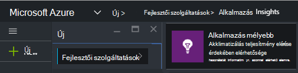
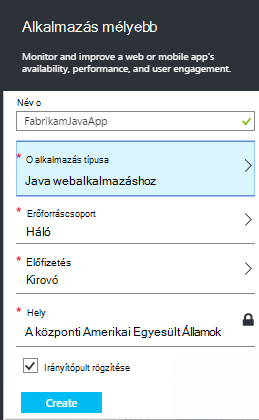
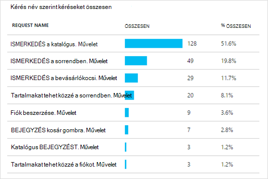

<properties 
    pageTitle="Java web Apps alkalmazások már az alkalmazás összefüggéseket live" 
    description="A kiszolgálón futó webalkalmazás figyelése" 
    services="application-insights" 
    documentationCenter="java"
    authors="alancameronwills" 
    manager="douge"/>

<tags 
    ms.service="application-insights" 
    ms.workload="tbd" 
    ms.tgt_pltfrm="ibiza" 
    ms.devlang="na" 
    ms.topic="article" 
    ms.date="08/24/2016" 
    ms.author="awills"/>
 
# Java web Apps alkalmazások már az alkalmazás összefüggéseket live

*Alkalmazás háttérismeretek az előzetes verzióban.*

Ha a J2EE kiszolgálón futó webalkalmazás, indítsa el figyelése [Alkalmazás az összefüggéseket](app-insights-overview.md) a kód módosítására, és a projekt fordítani nélkül. Ezt a beállítást választja akkor kapcsolatos tájékozódáshoz HTTP-összehívások a kiszolgáló, a kezelt kivételek és a teljesítmény számláló a.

[Microsoft Azure](https://azure.com)-előfizetést kell.

> [AZURE.NOTE] Ezen a lapon az eljárás ad a web app futásidőben a SDK csomagjában talál. A futási idejű műszerezettségi akkor hasznos, ha nem szeretné frissíteni, vagy a forráskód újjáépítése. De ha lehetséges, javasoljuk, hogy [a SDK forráskódot szeretne hozzáadni](app-insights-java-get-started.md) helyette. Amely több lehetőséget biztosít kódírás például felhasználói tevékenység nyomon követéséhez.

## 1. a alkalmazás háttérismeretek műszerezettségi kulcs beszerzése

1. Jelentkezzen be a [Microsoft Azure-portál](https://portal.azure.com)
2. Hozzon létre egy új alkalmazás háttérismeretek erőforrást

    
3. Állítsa az alkalmazás típusa Java webalkalmazást.

    
4. Keresse meg az új erőforrás a műszerezettségi billentyűt. Illessze be a kulcsot a kód projekt hamarosan kell.

    

## 2. a SDK letöltése

1. Töltse le az [alkalmazás az összefüggéseket SDK Java](https://aka.ms/aijavasdk). 
2. A kiszolgálón a címtárhoz, amelyből töltődnek be a projekt bináris SDK tartalmát kiolvasó. Tomcat használja, ha ezt a címtárat állna csoportban`webapps\<your_app_name>\WEB-INF\lib`

## 3. a alkalmazás háttérismeretek xml fájl hozzáadása

A mappát, amelyben a SDK felvett ApplicationInsights.xml létrehozása Írja be a következő XML.

A műszerezettségi vonal, az Azure portál kapott le.

    <?xml version="1.0" encoding="utf-8"?>
    <ApplicationInsights xmlns="http://schemas.microsoft.com/ApplicationInsights/2013/Settings" schemaVersion="2014-05-30">

      <!-- The key from the portal: -->

      <InstrumentationKey>** Your instrumentation key **</InstrumentationKey>

      <!-- HTTP request component (not required for bare API) -->

      <TelemetryModules>
        <Add type="com.microsoft.applicationinsights.web.extensibility.modules.WebRequestTrackingTelemetryModule"/>
        <Add type="com.microsoft.applicationinsights.web.extensibility.modules.WebSessionTrackingTelemetryModule"/>
        <Add type="com.microsoft.applicationinsights.web.extensibility.modules.WebUserTrackingTelemetryModule"/>
      </TelemetryModules>

      <!-- Events correlation (not required for bare API) -->
      <!-- These initializers add context data to each event -->

      <TelemetryInitializers>
        <Add   type="com.microsoft.applicationinsights.web.extensibility.initializers.WebOperationIdTelemetryInitializer"/>
        <Add type="com.microsoft.applicationinsights.web.extensibility.initializers.WebOperationNameTelemetryInitializer"/>
        <Add type="com.microsoft.applicationinsights.web.extensibility.initializers.WebSessionTelemetryInitializer"/>
        <Add type="com.microsoft.applicationinsights.web.extensibility.initializers.WebUserTelemetryInitializer"/>
        <Add type="com.microsoft.applicationinsights.web.extensibility.initializers.WebUserAgentTelemetryInitializer"/>

      </TelemetryInitializers>
    </ApplicationInsights>

* A műszerezettségi billentyűt minden elemet a telemetriai együtt küldi el, és ez az alkalmazás az összefüggéseket jelenjen meg az erőforrás.
* A HTTP-kérés összetevő nem kötelező. A portálra kérések és válasz időpontok telemetriai automatikusan küld.
* Események korrelációs a HTTP-kérés összetevő kiegészítésének. Az azonosító rendel a kiszolgáló által fogadott lekérése, és hozzáadja az azonosító tulajdonság minden elemet a telemetriai "Operation.Id" tulajdonságként. Lehetővé teszi a [diagnosztikai](app-insights-diagnostic-search.md)keresés szűrő megadásával minden kérés társított telemetriai összehangolására.

## 4. a HTTP-szűrő hozzáadása

Keresse meg és nyissa meg a web.xml fájlt a projekt, és a következő kódtöredékének kód csoportban a webalkalmazás csomópontot, ahol az alkalmazás szűrőit egyesítése.

A legpontosabb az eredmény érhető el, hogy a szűrő összes szűrőt előtt kell megfeleltetni.

    <filter>
      <filter-name>ApplicationInsightsWebFilter</filter-name>
      <filter-class>
        com.microsoft.applicationinsights.web.internal.WebRequestTrackingFilter
      </filter-class>
    </filter>
    <filter-mapping>
       <filter-name>ApplicationInsightsWebFilter</filter-name>
       <url-pattern>/*</url-pattern>
    </filter-mapping>

## 5. tűzfal ellenőrzése

Előfordulhat, hogy kell [beállítania a kivételek kimenő adatokat küldeni](app-insights-ip-addresses.md).

## 6. Indítsa újra a web App alkalmazásban

## 7. megtekintése az alkalmazás az összefüggéseket a telemetriai

Térjen vissza az alkalmazást az összefüggéseket erőforrás [Microsoft Azure](https://portal.azure.com)-portálon.

Tudnivalók a HTTP-kérések telemetriai megjelenik az Áttekintés lap. (Ha nem létezik, várjon néhány másodpercig, és kattintson a frissítés gombra.)

 

Kattintson az egyes diagramokra kattintva tekintse részletesebb mértékek keresztül. 

 

És a tulajdonságok egy kérelem megtekintése, láthatja az telemetriai eseményeket, például kérelmek és a kivételek társítva.
 

[További tudnivalók a mértékek.](app-insights-metrics-explorer.md)

## Következő lépések

* [A weblapok hozzáadása telemetriai](app-insights-web-track-usage.md) monitor lap nézetek és a felhasználó mértékek.
* A [webes tesztek beállítása](app-insights-monitor-web-app-availability.md) ellenőrizze, hogy az alkalmazás maradjon, élő és válaszol.
* [Log halad rögzítése](app-insights-java-trace-logs.md)
* A [keresési események és a naplókat](app-insights-diagnostic-search.md) diagnosztizálását.

 
