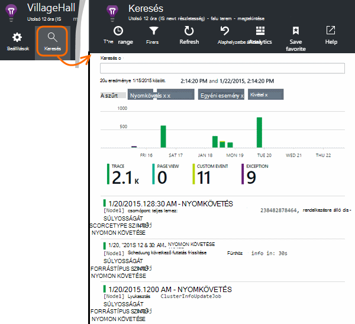

<properties 
    pageTitle="Ismerje meg az alkalmazást az összefüggéseket a nyomkövetési naplók Java" 
    description="Az alkalmazás az összefüggéseket a keresési Log4J vagy Logback halad" 
    services="application-insights" 
    documentationCenter="java"
    authors="alancameronwills" 
    manager="douge"/>

<tags 
    ms.service="application-insights" 
    ms.workload="tbd" 
    ms.tgt_pltfrm="ibiza" 
    ms.devlang="na" 
    ms.topic="article" 
    ms.date="07/12/2016" 
    ms.author="awills"/>

# Ismerje meg az alkalmazást az összefüggéseket a nyomkövetési naplók Java

Ha Logback vagy Log4J használata esetén (1.2-es verzió vagy 2.0-s verziója)-nyomkövetés, akkor a nyomkövetési naplók küldött automatikusan alkalmazás mélyebb, ahol Fedezze fel, és keresse meg őket.

[Java háttérismeretek SDK alkalmazás]telepítése[java], ha még nem tette meg, hogy.

## Naplózás tárak hozzáadása a projekthez

*Válassza ki a megfelelő módon beállítása a projekthez.*

#### Ha használni szeretné a maven tesztelése...

Build maven tesztelése használni a projekt már be van állítva, ha egyesítheti a következő kódrészletek kód egyik pom.xml fájljait.

Majd frissítse a project a függőségek, a bináris letöltött fájlok eléréséhez.

*Logback*

    <dependencies>
       <dependency>
          <groupId>com.microsoft.azure</groupId>
          <artifactId>applicationinsights-logging-logback</artifactId>
          <version>[1.0,)</version>
       </dependency>
    </dependencies>

*Log4J 2.0-s verzió*

    <dependencies>
       <dependency>
          <groupId>com.microsoft.azure</groupId>
          <artifactId>applicationinsights-logging-log4j2</artifactId>
          <version>[1.0,)</version>
       </dependency>
    </dependencies>

*Log4J 1.2-es verzió*

    <dependencies>
       <dependency>
          <groupId>com.microsoft.azure</groupId>
          <artifactId>applicationinsights-logging-log4j1_2</artifactId>
          <version>[1.0,)</version>
       </dependency>
    </dependencies>

#### Ha használni szeretné a Gradle...

Szerkesztés Gradle használni a projekt már be van állítva, hozzáadása a következő sorok közül a `dependencies` csoport a build.gradle fájl:

Majd frissítse a project a függőségek, a bináris letöltött fájlok eléréséhez.

**Logback**

    compile group: 'com.microsoft.azure', name: 'applicationinsights-logging-logback', version: '1.0.+'

**Log4J 2.0-s verzió**

    compile group: 'com.microsoft.azure', name: 'applicationinsights-logging-log4j2', version: '1.0.+'

**Log4J 1.2-es verzió**

    compile group: 'com.microsoft.azure', name: 'applicationinsights-logging-log4j1_2', version: '1.0.+'

#### Egyéb esetben...

Töltse le és bontsa ki a megfelelő appender, majd a megfelelő tár hozzáadása a projekthez:

Naplózó | Letöltés | Dokumentumtár
----|----|----
Logback|[A Logback appender SDK](https://aka.ms/xt62a4)|applicationinsights-naplózás-logback
Log4J 2.0-s verzió|[A Log4J v2 appender SDK](https://aka.ms/qypznq)|applicationinsights-naplózás-log4j2 
Log4j 1.2-es verzió|[A Log4J 1.2-es verzió appender SDK](https://aka.ms/ky9cbo)|applicationinsights-naplózás-log4j1_2 

## A naplózás keretrendszer a appender hozzáadása

Szeretné kezdeni a nyomkövetési naplók első, a megfelelő kódtöredékének a Log4J vagy Logback konfigurációs fájl kód egyesítése: 

*Logback*

    <appender name="aiAppender" 
      class="com.microsoft.applicationinsights.logback.ApplicationInsightsAppender">
    </appender>
    <root level="trace">
      <appender-ref ref="aiAppender" />
    </root>

*Log4J 2.0-s verzió*

    <Configuration packages="com.microsoft.applicationinsights.Log4j">
      <Appenders>
        <ApplicationInsightsAppender name="aiAppender" />
      </Appenders>
      <Loggers>
        <Root level="trace">
          <AppenderRef ref="aiAppender"/>
        </Root>
      </Loggers>
    </Configuration>

*Log4J 1.2-es verzió*

    <appender name="aiAppender" 
         class="com.microsoft.applicationinsights.log4j.v1_2.ApplicationInsightsAppender">
    </appender>
    <root>
      <priority value ="trace" />
      <appender-ref ref="aiAppender" />
    </root>

Az alkalmazás mélyebb appenders hivatkozhat bármely konfigurált naplózó, és nem feltétlenül a legfelső szintű naplózó (ahogy a fenti mintakódok).

## Ismerje meg a nyomkövetési naplók az alkalmazás mélyebb portálon

Most, hogy a projekt nyomkövetési naplók küldése alkalmazás mélyebb beállította, megtekintheti és a nyomkövetési naplók keresése az alkalmazás mélyebb portálon a [keresési] [ diagnostic] lap.

## Következő lépések

[Diagnosztikai keresés][diagnostic]

<!--Link references-->

[diagnostic]: app-insights-diagnostic-search.md
[java]: app-insights-java-get-started.md

 
