<properties
    pageTitle="A webes alkalmazás háttérismeretek JavaScript-alkalmazások |} Microsoft Azure"
    description="Első oldal megtekintése és a munkamenet száma, webes ügyfél adatait, és szokásai nyomon. Kivételek és teljesítménnyel kapcsolatos problémák észleli a JavaScript-weblapokon."
    services="application-insights"
    documentationCenter=""
    authors="alancameronwills"
    manager="douge"/>

<tags
    ms.service="application-insights"
    ms.workload="tbd"
    ms.tgt_pltfrm="ibiza"
    ms.devlang="na"
    ms.topic="get-started-article"
    ms.date="08/15/2016"
    ms.author="awills"/>

# Weblapok alkalmazás Hírcsatornájában

[AZURE.INCLUDE [app-insights-selector-get-started-dotnet](../../includes/app-insights-selector-get-started-dotnet.md)]

Ismerkedjen meg a teljesítmény és az weblapon vagy alkalmazás használatát. Ha a lap script Visual Studio alkalmazás háttérismeretek vesz fel, betöltését és AJAX hívásokat, száma és adatainak megjelenítése a böngésző kivételek és a AJAX-hibák, valamint a felhasználók és a munkamenet megszámolja az időzítés kapja. Mind is szegmentált, oldal, ügyfél operációs rendszer és böngésző verziószáma, geo helyét és más dimenziók. Értesítések beállítása a hiba száma vagy oldalbetöltéseket lassú is.

Alkalmazás háttérismeretek használata bármely weblap – rövid valamilyen JavaScript közvetlenül hozzáadása. Ha a webszolgáltatás [Java](app-insights-java-get-started.md) vagy [ASP.NET](app-insights-asp-net.md), integrálhatja a kiszolgálóról, és az ügyfelek telemetriai.

Szüksége van [Microsoft Azure](https://azure.com)-előfizetést. Ha a csapat egy szervezeti előfizetése van, kérdezze meg a Microsoft Account hozzáadása a tulajdonos. Van egy ingyenes árak réteg, így fejlesztés és kisüzemi használata semmi nem költség.

## Az weblapon alkalmazás háttérismeretek beállítása

Első lépésként van szüksége az összefüggéseket alkalmazás hozzáadása a weblapokhoz? Előfordulhat, hogy már még meg. Ha azt választotta, hogy az alkalmazás háttérismeretek hozzáadása a web App alkalmazásban a Visual Studio alkalmazásban új projektet párbeszédpanelen, majd a parancsfájl lett hozzáadva. Ebben az esetben nem kell tennie a többet.

Egyéb esetben szeretne adni egy kódtöredékének-kódot a weblapokhoz az alábbi képlettel történik.

### Nyissa meg az alkalmazást az összefüggéseket erőforrás

Az alkalmazás az összefüggéseket erőforrás, hol jelenjen meg az oldal teljesítményének és látogatottságának adatait. 

Jelentkezzen be az [Azure-portálon](https://portal.azure.com).

Ha már beállított az alkalmazás a kiszolgálóoldali megfigyelés, akkor már van egy erőforrás:

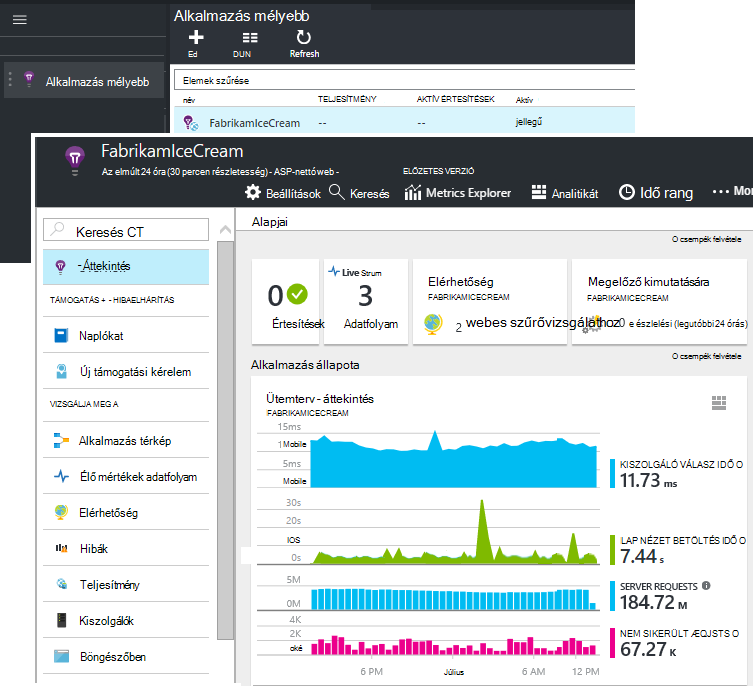

Ha nincs telepítve egyik hozza létre:

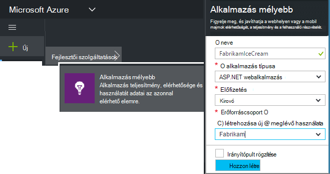

*Már kérdések?* [További információ az erőforrás létrehozása](app-insights-create-new-resource.md).

### Adja meg a SDK parancsfájlt az alkalmazás és a weblapok

Első lépések a parancsfájl beszerzése a weblapok:

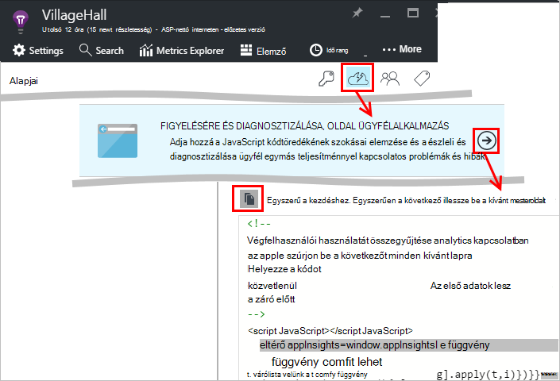

Csak előtt beillesztése a parancsprogram a `</head>` minden oldalon, amelyeket nyomon szeretne követni a címkét. Ha a webhely mesterlap van, van elhelyezheti a parancsfájl. Példa:

* ASP.NET MVC projektben szeretne helyezi azt`View\Shared\_Layout.cshtml`
* Nyissa meg a SharePoint-webhelyen kattintson a Vezérlőpult [webhelybeállítások / mesterlap](app-insights-sharepoint.md).

A parancsfájlt, amely arra utasítja az adatokat az alkalmazás az összefüggéseket erőforrás műszerezettségi kulcsot tartalmazza. 

([a parancsfájlt mélyebb magyarázata](http://apmtips.com/blog/2015/03/18/javascript-snippet-explained/))

*(A jól ismert weblap keretrendszer használata, keressen alkalmazás háttérismeretek adapterek. For example, akkor [egy AngularJS modul](http://ngmodules.org/modules/angular-appinsights).)*

## Részletes konfigurálása

Nincsenek több [Paraméterek](https://github.com/Microsoft/ApplicationInsights-JS/blob/master/API-reference.md#config) beállíthatja, hogy, azonban a legtöbb esetben nem kell. Például tiltsa le vagy a jelentett DB / oldal megtekintése (csökkentheti a forgalom) Ajax-hívások korlátozása. Vagy beállíthatja, hogy gyorsan Lépkedés a folyamat anélkül, hogy éppen kötegelt telemetriai hibakeresési módot.

Ezek a paraméterek beállítása, ebben a sorban kattintson a kódtöredék keres, és adjon hozzá további vesszővel tagolt elemek azt követően:

    })({
      instrumentationKey: "..."
      // Insert here
    });

A [rendelkezésre álló paraméterek](https://github.com/Microsoft/ApplicationInsights-JS/blob/master/API-reference.md#config) a következők:

    // Send telemetry immediately without batching.
    // Remember to remove this when no longer required, as it
    // can affect browser performance.
    enableDebug: boolean,

    // Don't log browser exceptions.
    disableExceptionTracking: boolean,

    // Don't log ajax calls.
    disableAjaxTracking: boolean,

    // Limit number of Ajax calls logged, to reduce traffic.
    maxAjaxCallsPerView: 10, // default is 500

    // Time page load up to execution of first trackPageView().
    overridePageViewDuration: boolean,

    // Set these dynamically for an authenticated user.
    appUserId: string,
    accountId: string,

## Az alkalmazás futtatása

A web app futtatásával, vele telemetriai készítése és várjon néhány másodpercet igénybe. Indítsa el az **F5** billentyűt segítségével a fejlesztői számítógépen, vagy tegye közzé, és engedélyezheti a felhasználóknak az általa lejátszása.

A küldő webalkalmazást alkalmazás mélyebb telemetriai ellenőrizni szeretné, ha használja a böngésző hibakeresési eszközök (**F12** sok böngészőkben). Adatok dc.services.visualstudio.com küldi.

## A böngésző teljesítmény adatok feltárása

Nyissa meg a böngészők lap felhasználói böngészők összesített teljesítmény adatainak megjelenítéséhez.

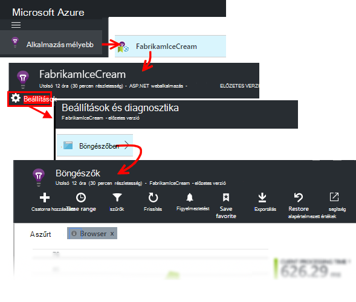

*Még nincsenek adatok? Kattintson a * *frissítése* * a lap tetején. Továbbra is semmi? Lásd: [Hibaelhárítás](app-insights-troubleshoot-faq.md).*

A böngészőben a lap egy [Mértékek Explorer lap](app-insights-metrics-explorer.md) előre definiált szűrők és a diagram beállításokat. Ha szeretne, majd az eredmény mentése a Kedvencek közül szerkesztheti a időtartomány, szűrők és diagram konfigurációs. Kattintson a kattintva térjen vissza a lap eredeti konfiguráció **Alapértékek visszaállítása** gombra.

## Lap betöltés teljesítményét

A képernyő tetején, a lapok betöltésével a szegmentált diagram. A diagram összes magasságát betöltése és jelenítheti meg az alkalmazás felhasználói böngészőkben átlagos idő jelöli. Az idő befejezésétől, amikor a böngésző az eredeti HTTP kérelem küld addig, amíg az összes szinkronizált betöltés események feldolgozása, beleértve az elrendezés és parancsfájlok futtatása. Azt nem tartalmazza a aszinkron feladatokat, például a kijelzők tölthet le AJAX-hívások.

A diagram szegmensek a teljes lap betöltés idejének be a [W3C által meghatározott szabványos időzítését](http://www.w3.org/TR/navigation-timing/#processing-model). 

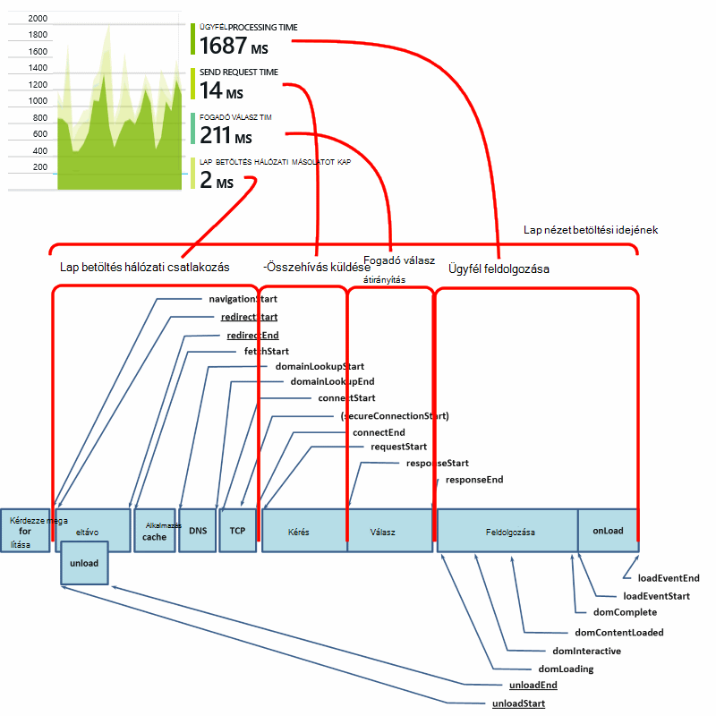

Ne feledje, hogy a *hálózati csatlakozás* idő gyakran kisebb, mint azt valószínűleg gondolná, mivel az átlagra érkező kérések a böngészőben a kiszolgálón keresztül. Sok egyes kérelem 0 csatlakozás időt igénybe, mivel már van egy aktív kapcsolat a kiszolgálóval.

### Lassú betöltésének?

Lassú betöltését fő forrást kapcsolatos, a felhasználók számára is. A diagram azt jelzi, hogy lassú betöltését, érdemes egyszerűen diagnosztikai nézzen.

A diagramot az alkalmazás az összes betöltését átlagát jeleníti meg. Látható, ha a probléma adott lapok korlátozódik, tekintse meg további lejjebb a lap, ahol a lap URL-cím által szegmentált a rács:

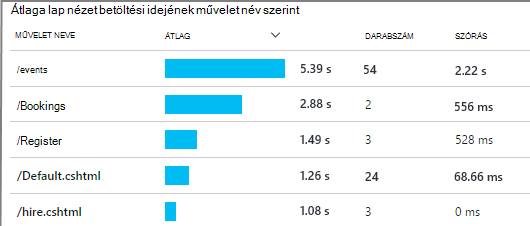

Figyelje meg a teljes oldalszám nézet és a szórás. Ha a teljes oldalszám nagyon kicsi, majd a probléma nem érintő felhasználók sokkal. Magas a szórás (hasonlóak az átlag magát) azt jelzi, hogy egyes mérések eltérése sok.

**Egy URL-címet és egy oldalnyit nagyíthatja.** Kattintson a minden lap neve a böngésző diagramok csak a megadott URL; szűrve a lap megjelenítéséhez majd a lap nézet egy példánya.

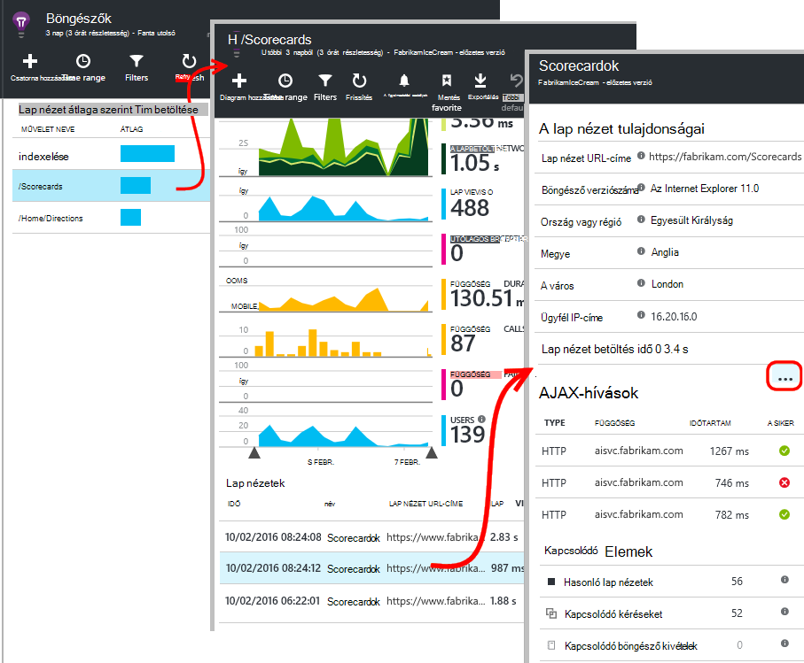

Kattintson a `...` teljes listáját, hogy az esemény tulajdonságai, vagy nézze meg a Ajax-hívások és a kapcsolódó eseményeit. Lassú Ajax-hívások befolyásolja a teljes lap betöltés szinkron hagyják. Kapcsolódó eseményeket kéréseket (ha az alkalmazás az összefüggéseket be van állítva, a webkiszolgáló) azonos URL-CÍMÉT tartalmazza.

**Időbeli lap teljesítményét.** Vissza a lap a böngészőben, a következő oldal megtekintése betöltés időosztására átalakítása annak ellenőrzéséhez, hogy az adott időpontban volt-csúcsok vonaldiagram:

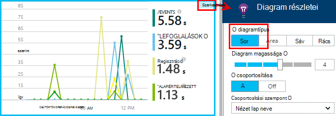

**Más méretek szerint oszthatja fel.** A lapok esetleg lassabban betölteni egy adott böngésző, OS ügyfél vagy egy felhasználói településen? Új diagram hozzáadása és a **Group by** dimenzió kísérletezhet.

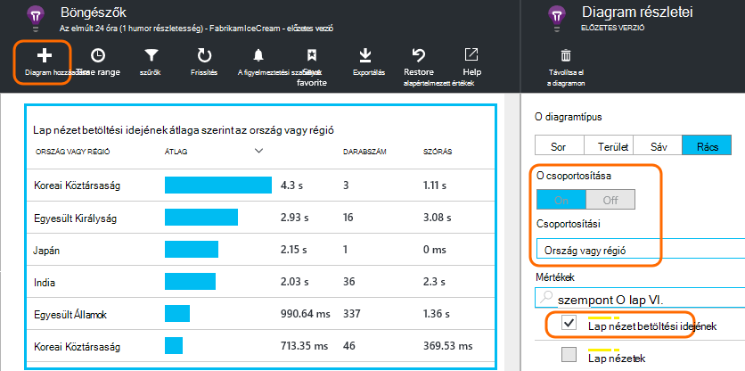

## AJAX-teljesítmény

Ellenőrizze, hogy bármely AJAX-hívások a weblapokon is hajt végre. A lap részeire aszinkron kitöltéséhez ezeket gyakran használják. Bár haladéktalanul töltődik be az Általános lapon, a felhasználók sikerült kell további javulás is meghiúsult staring üres kijelzők, a Várakozás a jeleníti meg azokat az adatokat.

AJAX-hívások az weblapon a függőségek, jelennek meg a böngészők lap.

Létezik a lap felső részén összefoglaló diagramok:

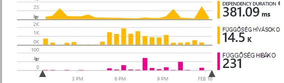

és részletes rács alsó le:

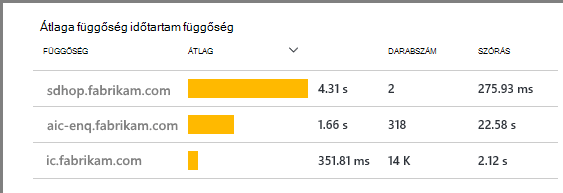

Kattintson a minden sor részleteket.

> [AZURE.NOTE] Ha törli a böngészők szűrőt, kattintson a lap, a kiszolgáló és a AJAX függőségek szerepelnek a fenti diagramokról. A szűrő dolgozóját, hogy alapértékek visszaállítása gombra.

**Nem sikerült Ajax-hívások feltárás** görgessen le a függőség hibák rács, és kattintson a sor meghatározott példányok megtekintéséhez.

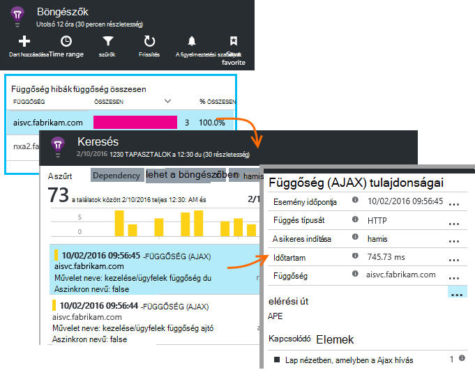

Kattintson a `...` esetében a teljes telemetriai Ajax-híváshoz.

### Ajax-hívások nem jelentve?

AJAX-hívások az weblapon forgatókönyv bármely HTTP hívások tartalmazzák. Őket a jelentett nem látható, ha ellenőrizze, hogy a kódrészletet nem beállítása a `disableAjaxTracking` vagy `maxAjaxCallsPerView` [paramétereket](https://github.com/Microsoft/ApplicationInsights-JS/blob/master/API-reference.md#config).

## Kivételek a böngészőben

A böngésző lap van egy kivételek összesítő diagram és a rács típusú kivétel további lejjebb a lap.

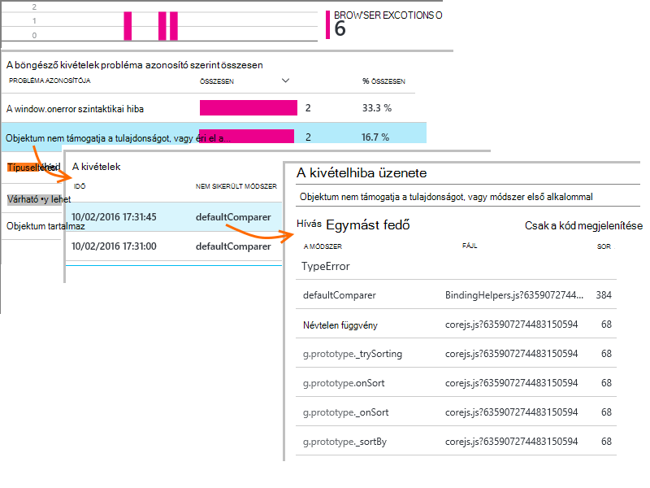

Ha jelentett böngészőt kivételek nem látható, jelölje be, hogy a kódtöredék nem beállítása a `disableExceptionTracking` [paraméter](https://github.com/Microsoft/ApplicationInsights-JS/blob/master/API-reference.md#config).

## Nézze meg az egyes lap események megtekintése

Általában lap nézet telemetriai alkalmazás háttérismeretek az elemezni, és csak összesítő jelentéseket, fölé összes felhasználó átlagolni látható. De hibakeresés céljából, is megnézheti egyéni lapra események megtekintése.

A diagnosztikai keresés, a lap szűréséhez oldalas nézetre.

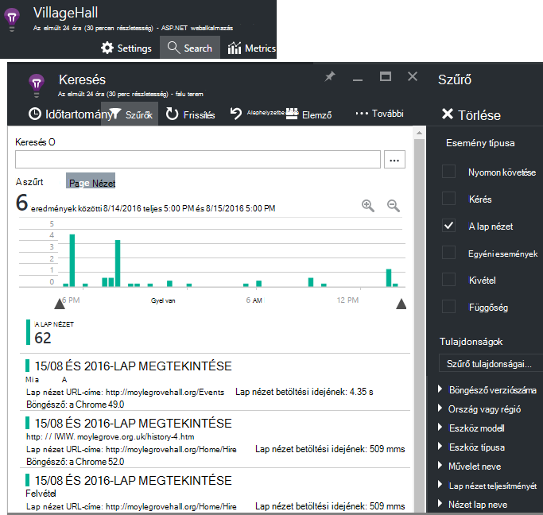

Jelölje ki bármelyik eseményre részletek megtekintéséhez. A részletek lapon kattintson a (...), még több részlet megjelenítéséhez.

> [AZURE.NOTE] [Keresés](app-insights-diagnostic-search.md)használata esetén figyelje meg, hogy van-e a megfelelő egész szavak: "Abou" és "névjegye" nem egyeznek meg "A".

Akkor is használhatja a hatékony [Analytics lekérdezési nyelv](app-insights-analytics-tour.md) lap nézetek kereséséhez.

### Lap nézet tulajdonságai

* **Lap nézet időtartam** 

 * Alapértelmezés szerint ideig tart a betöltés, ügyfélprogramból kérheti teljes terhelés (beleértve a kiegészítő fájlok, de kivételével aszinkron feladatokat, például Ajax-hívások). 
 * Ha a `overridePageViewDuration` [lap konfigurációs](#detailed-configuration), az ügyfél közötti időtartamot kérése végrehajtása során az első `trackPageView`. Ha trackPageView szokásos helyzetét után a inicializálni parancsfájl helyez át, azt egy másik érték tükrözni fogja.
 * Ha `overridePageViewDuration` beállítása és argumentum hiányzik az időtartamot a `trackPageView()` felhívni, majd az argumentum értékét használja helyette. 

## Az egyéni száma

Alapértelmezés szerint a teljes oldalszám minden alkalommal, amikor egy új oldal betölti az ügyfél böngészőbe fordul elő.  De lehet, hogy szeretné számolni a további nézetek. Például lap a lapok jeleníthet meg a tartalmát, és szeretné számolni lap, amikor a felhasználó lapok vált. Vagy a lapon a JavaScript-kód töltődik be új tartalom a böngészőben URL-cím módosítása nélkül.

Az ügyfél-kódot a megfelelő pontján szúrja be a JavaScript hívás jelennek meg:

    appInsights.trackPageView(myPageName);

A lap nevét is tartalmazhat ugyanazokat a karaktereket URL-címként, de bármilyen fájlok után "#" vagy "?" figyelmen kívül hagyja.

## Követés használatát

Megtudhatja, hogy a felhasználók mire az alkalmazást szeretne?

* [Tudnivalók a követés használatát](app-insights-web-track-usage.md)
* [Megtudhatja, hogy egyéni események és mérőszámok API-val](app-insights-api-custom-events-metrics.md).

#### Videó: A követés használatát

> [AZURE.VIDEO tracking-usage-with-application-insights]

## Következő lépések

* [Használatának nyomon követése](app-insights-web-track-usage.md)
* [Egyéni események és mérőszámok](app-insights-api-custom-events-metrics.md)
* [Szerkesztés mérték tudnivalók](app-insights-overview-usage.md)

