<properties 
    pageTitle="Az alkalmazás az összefüggéseket mértékek felfedezése |} Microsoft Azure" 
    description="Diagramok a metrikus explorer értelmezéséhez, és metrikus explorer pengéit testreszabása." 
    services="application-insights" 
    documentationCenter=""
    authors="alancameronwills" 
    manager="douge"/>

<tags 
    ms.service="application-insights" 
    ms.workload="tbd" 
    ms.tgt_pltfrm="ibiza" 
    ms.devlang="na" 
    ms.topic="article" 
    ms.date="10/15/2016" 
    ms.author="awills"/>
 
# Az alkalmazás az összefüggéseket mértékek felfedezése

Az [Alkalmazás az összefüggéseket] mértékek[ start] mért értékek és a levelezőprogramból telemetriai küldött események száma. Megkeresheti a teljesítménnyel kapcsolatos problémákat, és az alkalmazás használatának trendek megtekintés segítik. A szokásos mértékek széles köre, és szükség esetén létrehozhatja saját egyéni mértékek és eseményeket.

Mértékek és események száma összesített értékek, például összegek, átlagok vagy megszámolja diagramok jelenik meg.

A következő példa diagram:

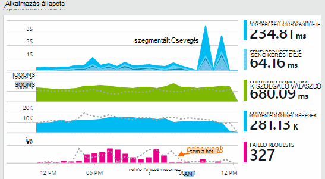

Néhány diagramok vannak szegmentált: a teljes a diagram bármely pontján magassága jelenik meg a mértékek összegét. A jelmagyarázat alapértelmezés szerint a legnagyobb mennyiségek jeleníti meg.

Pontozott vonalak megjelenítése a mérőszám az érték korábban egy hét.

## Időtartomány

A diagramok és rácsok a minden lap hatálya időtartomány módosítása

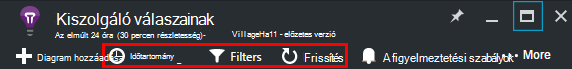

Ha még nem jelent meg, hogy bizonyos adatok esetén várt, kattintson a frissítés gombra. Diagramok frissítése maguk időközönként, de a intervallumok hosszabb ideig nagyobb idő tartományait. Megjelenés módban eltarthat egy ideig az adatokat, így az elemzés folyamat alakzatot diagram keresztül.

A diagram részének nagyítása, húzással jelölje azt:

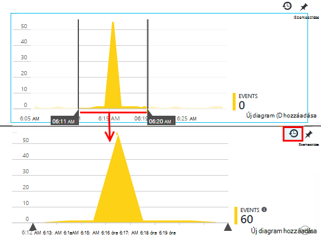

Kattintson a visszaállítani a visszavonás Nagyítás gombra.

## Beállítási lehetőséget és pont értékek

Mutasson az egérrel a diagram ekkor megjeleníti a mértékek értékét.

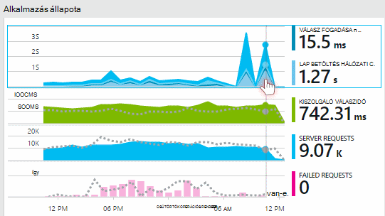

Az érték egy adott pontján mérőszám program összesíti az előző mintavételnél intervallum fölé. 

A mintavételnél időköz vagy a "Granularitás" a lap tetején jelenik meg. 

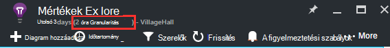

Beállíthatja, hogy az az idő a tartomány lap granularitása:

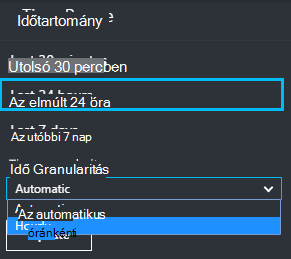

A rendelkezésre álló részletességek attól függenek, hogy a időtartomány választja. A közvetlen részletességek időtartomány az "automatikus" granularitása alternatívák állnak. 

## Mértékek Explorer

Kattintson a minden diagram az Áttekintés lap a kapcsolódó diagramok és rácsok részletesebb beállítási. Módosíthatja a diagramok és rácsok kiemelése a részletek, amely érdekli.

Vagy lehet egyszerűen kattintson az Áttekintés lap vezetője a mértékek Explorer gombra.

Kattintson például a web app sikertelen kérelmek diagram keresztül:

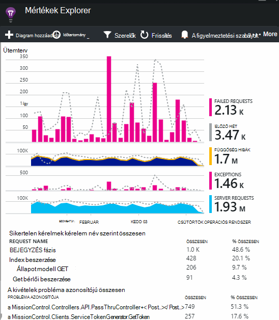

## Mit jelentenek a számok?

Alapértelmezés szerint a oldalán a jelmagyarázatot a diagram időszakban általában az összesített értéket jeleníti meg. A diagram mutat, ha azt mutatja az érték adott időpontban.

Minden egyes adatpont, a diagramon az előző mintavételnél időköz vagy a "Granularitás" kapott adatérték összesített. A beállítási lehetőséget a lap tetején látható, és a diagram általános időskála változik.

Mértékek többféleképpen is összesíteni: 

 * **SZUM** összeadja az értékeket a mintavételnél időköz vagy a diagram az időszak kapott adatpontok.
 * **Átlagos** elosztja a SZUM keresztül az intervallum fogadott adatpontok számát.
 * **Egyedi** megszámolja segítségével a felhasználók és számát. A mintavételnél intervallum keresztül, vagy a diagram időszak alatt az ábrán látható abban az időpontban a különböző felhasználók számát.

Az összesítés módot megváltoztathatja:

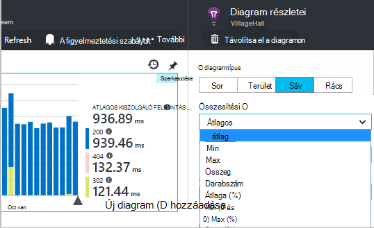

Az alapértelmezett módszer minden mérőszám amikor hoz létre új diagramot, vagy ha minden mérőszám kijelöletlen is látható:

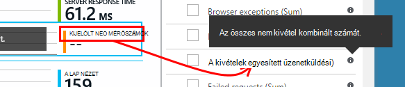

## Diagramok és táblázatok szerkesztése

Új diagram hozzáadása a lap:

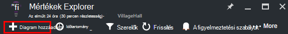

Válassza a **Szerkesztés** egy meglévő vagy új diagram szerkesztéséhez, akkor jeleníti meg:

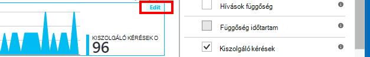

Korlátozás, amely megjeleníthető közös kombinációval kapcsolatban, hogy a diagramon is megjeleníthet egynél több metrikus. Amint egy mérőszám lehetőséget választja, a többi részét le vannak tiltva. 

Ha Ön kódolt [egyéni mértékek] [ track] a alkalmazásba (hívások TrackMetric és TrackEvent) ezeket itt látható.

## Az adatok szegmens

Szétoszthatja egy mérőszám tulajdonságban – például összehasonlítása lap nézetek ügyfélalkalmazásokon operációs rendszerrel. 

Jelölje ki a diagramon vagy táblázatban, váltson a csoportosításhoz, és válasszon egy tulajdonságot a csoportba:

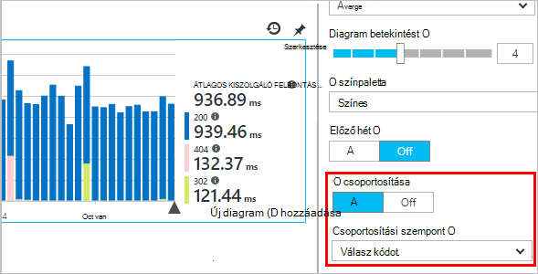

> [AZURE.NOTE] Csoportosítás használata esetén a terület és sávdiagram típusú segítségével halmozott megjeleníthetők. Ez a megfelelő hol található az összesítés módszer a SZUM. De ha összesítési típusa átlag, válassza ki a vonal vagy a rács megjelenítése. 

Ha Ön kódolt [egyéni mértékek] [ track] be az alkalmazás és a tulajdonság értékeit tartalmazzák, is a listában jelölje be a tulajdonság.

A diagram az túl kicsi a szegmentált adatok? Magasságának módosítása:

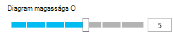

## Az adatok szűrése

Csak a kijelölt értékhalmaz tulajdonság mértékek megtekintése:

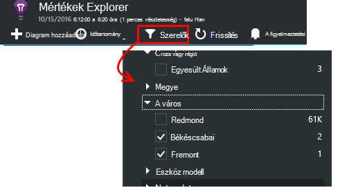

Ha minden értéket az egy adott tulajdonság nem jelöli ki, megegyezik a Mindet kijelöli: Ez a tulajdonság nincs szűrő van.

Figyelje meg az egyes tulajdonságérték összegzik események számát. Amikor kijelöl egy tulajdonság értékeit, az száma mellett más tulajdonságértékeket módosulnak.

Szűrők alkalmazása egy lap a minden diagram. Ha azt szeretné, különböző más diagramokat, alkalmazott szűrők létrehozása és mentése más mértékek pengéit. Ha azt szeretné, diagramok létrehozása különböző pengéit az irányítópult, így láthatja őket egymás mellett is rögzíthet.

### Bot és a webes próba-forgalmat eltávolítása

A **valós vagy szintetikus forgalom** szűrővel, és ellenőrizze a **valós**.

**Forrás szintetikus forgalom**szerint is szűrheti.

### Tulajdonságok hozzáadása a szűrők listájában

Szeretné szűrni a saját kiválasztása a kategória telemetriai? Ha például esetleg feloszthatja a felhasználók, méghozzá annyit, és tetszés szerint ezekben a kategóriákban oszthatja fel az adatok.

[A saját tulajdonság létrehozása](app-insights-api-custom-events-metrics.md#properties). Beállíthatja, hogy az összes telemetriai – például a szokásos telemetriai különböző SDK modulok által küldött jelennek meg, hogy egy [Telemetriai inicializálója](app-insights-api-custom-events-metrics.md#telemetry-initializers) .

## A diagram típusának módosítása

Figyelje meg, hogy válthat rácsok és diagramok között:

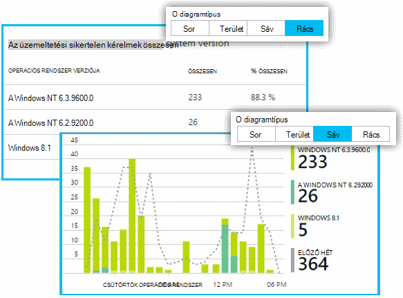

## A mértékek lap mentése

Ha létrehozta néhány diagramok, mentse őket a Kedvencek közül. Akkor is válassza ki, hogy ossza meg a többi csapattagok egy szervezeti fiók használatakor.

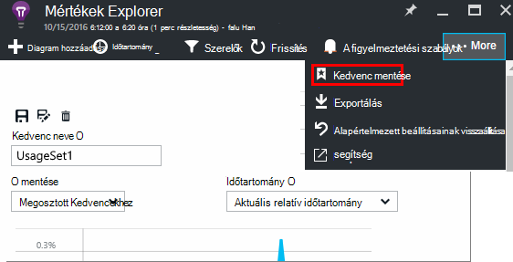

A lap ismét, **Nyissa meg az Áttekintés lap** látható, és nyissa meg a Kedvencek:

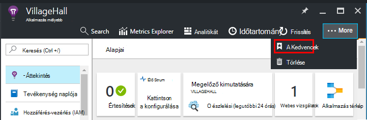

Mentett relatív időtartomány választotta, a lap fognak frissülni a legújabb mérési módja miatt. Ha úgy döntött, abszolút időtartomány, azt minden alkalommal jeleníti meg ugyanazokat az adatokat.

## A lap visszaállítása

Ha egy lap szerkesztésekor, de majd szeretné, hogy térjen vissza az eredeti beállítása mentett, csak kattintson az Alaphelyzet gombra.

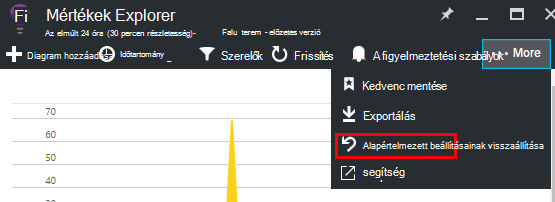

## Élő mértékek adatfolyam: azonnali mértékek az szoros felügyeletet igényel

Élő mértékek adatfolyam jeleníti meg, az alkalmazás mértékek jobbra Ez nagyon szorzatmomentum, akkor 1 közeli valós idejű válaszidejű. Az rendkívül hasznos, ha éppen felszabadítása egy új fejlesztése, és gondoskodni szeretne arról, hogy minden adat meg a várt módon működik, vagy a valós idejű esemény vizsgálja.

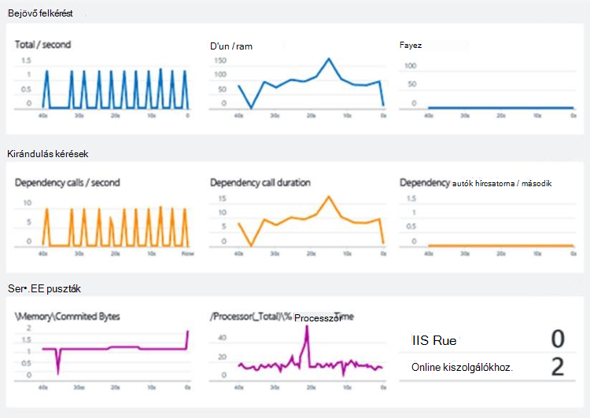

Mértékek Explorerben eltérően élő mértékek adatfolyam mértékek meghatározott jeleníti meg. Csak az adatokat is fennáll, mindaddig, amíg be van kapcsolva a diagramot, és kattintson a program törli. 

Élő mértékek adatfolyam érhető el az alkalmazást az összefüggéseket SDK ASP.NET, verzió 2.1.0 vagy újabb verziójában.

## Értesítések beállítása

Ha értesítést szeretne kapni minden olyan mérőszám szokatlan értékek mailben, értesítés hozzáadása Megadhatja, vagy az e-mailt küldeni, a fiók rendszergazdái, vagy meghatározott e-mail címét.

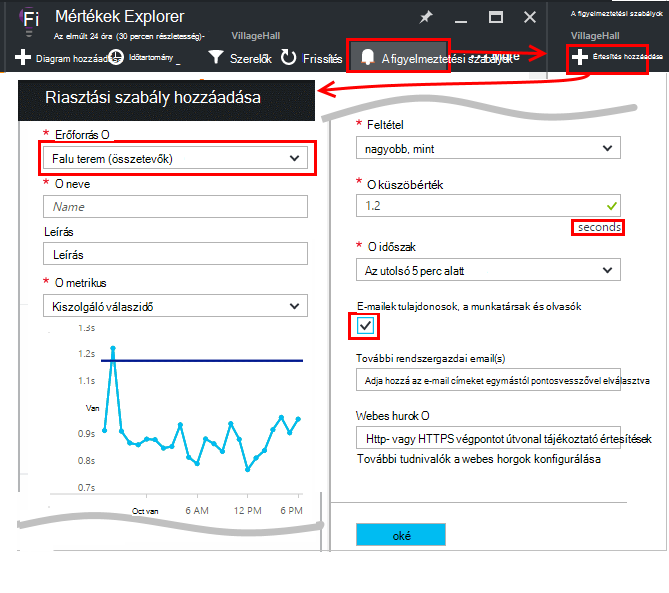

[További tudnivalók a riasztások][alerts].

## Exportálása Excelbe

Excel-fájl metrikus Explorer megjelenítendő metrikus adatok exportálhatók. Az exportált adatokat minden diagramok és táblázatok a portálon naplójában adatait tartalmazza. 

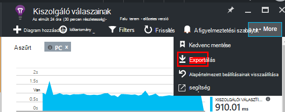

Minden diagram vagy táblázat adatait az Excel-fájlban külön lapon exportálja.

Megjelenő exportált elemek. Ha meg szeretné változtatni az exportált adattartomány időtartomány vagy szűrők módosítása. Táblázatok esetében a **betöltése több** parancs látható, ha kattinthat, mielőtt exportált több adatot az Exportálás gombra.

*Exportálhatja a works csak az Internet Explorer és a Chrome jelenleg. Dolgozunk a más böngészők támogatása hozzáadásával kapcsolatos probléma.*

## Folytonos exportálása

Ha azt szeretné, hogy folyamatosan exportált, hogy a külső felekkel folyamat adatok, akkor fontolja meg [folyamatos exportálása](app-insights-export-telemetry.md).

### A Power BI

Ha azt szeretné, hogy az adatok még sokoldalúbb nézetek, [exportálása a Power BI](http://blogs.msdn.com/b/powerbi/archive/2015/11/04/explore-your-application-insights-data-with-power-bi.aspx)is.

## Elemző

[Analytics](app-insights-analytics.md) sokoldalúbb módja a hatékony lekérdezési nyelvet használ telemetriai elemzéséhez. Használnia, ha szeretne egyesíteni mérőszámok eredménye kiszámítania vagy végezze el az alkalmazás legutóbbi teljesítményszintjét egy a deph adatfeltáró. Mértékek Explorerben kézzel, használja, ha azt szeretné automatikus frissítést, diagramok irányítópult gombjára, és értesítések.

## Hibaelhárítás

*Adatokat nem látható a diagramról.*

* Szűrők alkalmazása a lap összes a diagramokat. Győződjön meg arról, hogy, miközben meg van egy diagramon összpontosul, nem beállíthatja, hogy kizárja az adatokat egy másik szűrő. 

    Ha szeretne másik szűréséhez más diagramokat, különböző pengéit hozza létre őket, mentheti őket az külön Kedvencek. Ha azt szeretné, akkor rögzítheti őket az irányítópult, hogy egymás mellett láthatja őket.

* Ha a diagram csoportosítás egy tulajdonság, amely a mérőszám a nincs megadva, majd lesz semmi sem a diagramon. Próbálkozzon szerinti csoportosítás törlésével, vagy válasszon egy másik csoportosítási tulajdonság.
* A teljesítményadatok (Processzor, IO ráta, és így tovább) Java webszolgáltatásokhoz, a Windows asztali alkalmazások lapot, [az IIS webes alkalmazások és -szolgáltatások, ha telepíti az állapot monitor](app-insights-monitor-performance-live-website-now.md)és [Azure Cloud Services](app-insights-azure.md)érhető el. Nem érhető el a Azure webhelyeket.

## Következő lépések

* [Az alkalmazás az összefüggéseket használat figyelése](app-insights-overview-usage.md)
* [Diagnosztikai keresése szolgáltatással](app-insights-diagnostic-search.md)

<!--Link references-->

[alerts]: app-insights-alerts.md
[start]: app-insights-overview.md
[track]: app-insights-api-custom-events-metrics.md

 