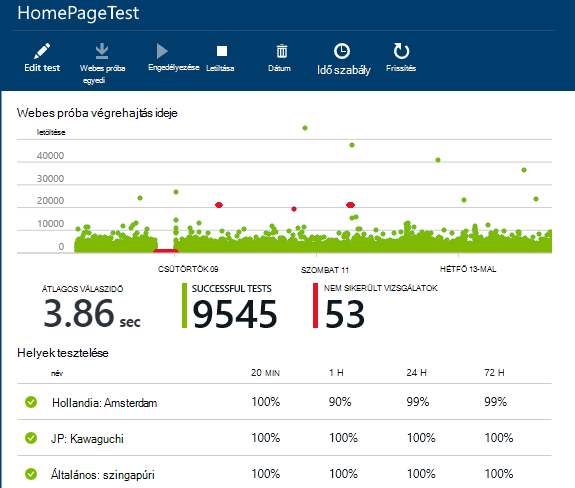
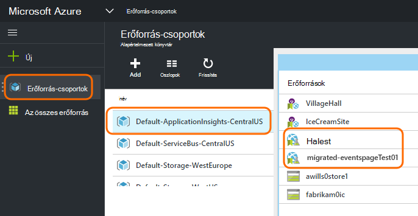
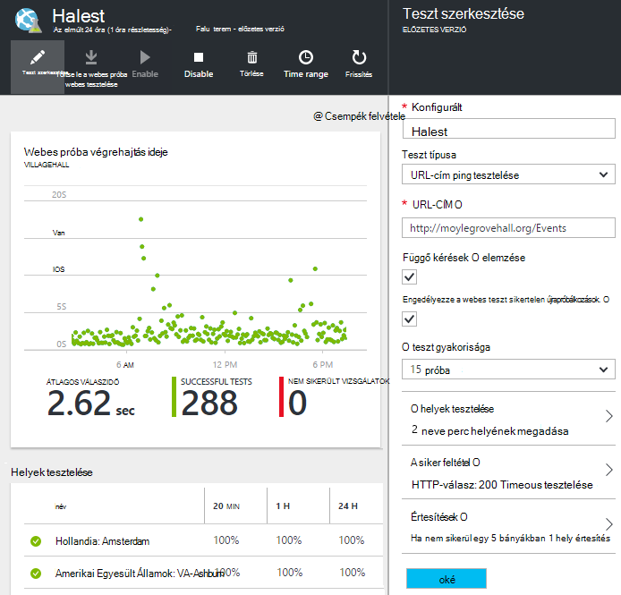

<properties 
    pageTitle="Azure végpont áttelepítése az alkalmazás az összefüggéseket elérhetősége vizsgálatok" 
    description="Klasszikus Azure végpont figyelése vizsgálatok áttelepítése az alkalmazás az összefüggéseket elérhetősége teszteli a 2016 október 31."
    services="application-insights" 
    documentationCenter=""
    authors="soubhagyadash" 
    manager="douge"/>

<tags 
    ms.service="application-insights" 
    ms.workload="tbd" 
    ms.tgt_pltfrm="ibiza" 
    ms.devlang="na" 
    ms.topic="article" 
    ms.date="07/25/2016" 
    ms.author="awills"/>
 
# Áttérés a Azure végpont felügyeletet igényel, hogy az alkalmazás az összefüggéseket elérhetősége vizsgálatok

Végezze el [végpont figyelése](https://blogs.msdn.microsoft.com/mast/2013/03/03/windows-azure-portal-update-configure-web-endpoint-status-monitoring-preview/) -et az Azure-alkalmazások? *2016 október 31-én*, amelyet azt fogja vegye fel helyettük új és hatékonyabbá [elérhetősége vizsgálatok](app-insights-monitor-web-app-availability.md). Azt már létrehozott egy új tesztek, bár azok 2016 október 31-ig van tiltva. 

Az új vizsgálatok szerkesztése, és végezze el a Váltás a saját maga tetszés. Megtalálhatja őket [Azure portál](https://portal.azure.com) az alapértelmezett-ApplicationInsights-CentralUS erőforráscsoport.

## Mik azok a elérhetősége vizsgálatok?

Elérhetőség tesztelése jellemzi a Azure, amely folyamatosan annak vizsgálata, hogy minden olyan webhely vagy a szolgáltatás be- és futtatása a HTTP-kérések azt küld (egyetlen ping tesztek vagy Visual Studio web vizsgálatok) legfeljebb 16 helyekről világszerte. 

A [Klasszikus Azure portál](https://manage.windowsazure.com)alábbi teszteket hívták végpont figyelése. Ezek azok korlátozottabb hatókörét. A új rendelkezésre állás-vizsgálat jelentős javítása:

* Legfeljebb 10 Visual Studio web vizsgálatok vagy a ping tesztek / erőforrás alkalmazás az összefüggéseket. 
* Legfeljebb 16 helyek sávba való vizsgálat kérést küld a web App alkalmazásban. Jobban kézben próba sikeres feltételeket. 
* Tesztelje a webhelyekre és szolgáltatás – csak Azure web Apps alkalmazások.
* Újrapróbálkozások tesztelése: hamis pozitív riasztások tranziens hálózati hibák miatt csökkentése. 
* Webhooks az értesítések HTTP POST értesítéseket is.

További információt [Itt elérhetősége vizsgálatok](app-insights-monitor-web-app-availability.md).

Elérhetőség vizsgálatok részei [Visual Studio alkalmazás Hírcsatornájában](app-insights-overview.md), vagyis egy bővíthető analytics szolgáltatás bármely webes alkalmazáshoz.

## Hogy mi történik a saját végpont tesztek?

* Azt a végpontot, az új alkalmazás háttérismeretek elérhetősége vizsgálatok tesztek figyelése átmásolása.
* Az új elérhetősége vizsgálatok jelenleg le vannak tiltva, és a régi végpont vizsgálatok még futnak.
* A riasztási szabályok *nem* áttelepíteni. Új tesztek kezdetben be van állítva egy alapértelmezett szabállyal:
 * Eseményindítók, amikor az 1-nél több helyre hibákat jelzi az 5 perc.
 * Az előfizetés rendszergazdák küldése e-mailt.

Az [Azure portál](https://portal.azure.com)az "Alapértelmezett ApplicationInsights, CentralUS" erőforráscsoport áttelepített tesztek találhat. A próba nevét elé "Migrated-". 

## Mit kell tegye?

* Valami kihagyott áttelepítése a azt vizsgálja, új elérhetősége tesztek is [egyszerűen állíthatja be](app-insights-monitor-web-app-availability.md).

### Lehetőséget, végezze el a A: semmi sem. Kilépés a nekünk.

**Október 31-én, 2016-ban, a** következő történik:

* Tiltsa le a régi végpont vizsgálatok.
* Engedélyezze az áttelepített elérhetősége vizsgálatok.

### A beállítás B:, kezelése és/vagy új tesztek engedélyezése.

* Megtekintése és szerkesztése az új [Azure portál](https://portal.azure.com)új elérhetősége tesztek. 
 * Tekintse át a kiváltó ok mező feltétel
 * Tekintse át az e-mailek címzettjeinek
* Az új vizsgálat engedélyezése
* A régi végpont 2016 október 31-én vizsgálatok figyelése letiltjuk 

### C: a beállítás Funkcióról meg

Ha nem szeretné elérhetősége azt vizsgálja, az [Azure-portálon](https://portal.azure.com)törölheti őket. Is található egy leiratkozási hivatkozás, az értesítő e-mailek alján.

Azt is törli a régi végpont vizsgálatok 2016 október 31. 

## Hogyan szerkeszthetők a új vizsgálat?

Jelentkezzen be az [Azure-portálra](https://portal.azure.com) , és keresse meg a "Migrated-" webes vizsgálat: 

Szerkesztés és/vagy a vizsgálat engedélyezése:

## Miért oka?

Jobb szolgáltatás. A régi végpont szolgáltatás nem sokkal szűkebb. Egyszerű ping tesztek 3 geo helyekről Azure virtuális vagy a webes alkalmazás a két URL-címeit is biztosít. Az új vizsgálatok futtatását is lehetővé teszi a több elem lépés webes vizsgálatok legfeljebb 16 helyekre, és megadhatja, hogy egy alkalmazás legfeljebb 10 vizsgálatok. Ellenőrizheti, hogy minden olyan URL-cím – nincsenek kell egy Azure-webhelyre.

Az új teszteket a web App alkalmazásban, illetve a virtuális, amely esetén a tesztelés külön-külön vannak beállítva. 

Azt is áttelepítését a vizsgálatok annak érdekében, hogy továbbra is rendelkeznek hozzáféréssel őket az új portál használata közben. 

## Mi az alkalmazás az összefüggéseket?

Az új elérhetősége vizsgálatok [Visual Studio alkalmazás háttérismeretek](app-insights-overview.md)részét képezik. Az alábbiakban a [2 perces videó](http://go.microsoft.com/fwlink/?LinkID=733921).

## E fizet tapasztalok a új tesztek?

Az áttelepített vizsgálatok állíthatók be egy alkalmazást az összefüggéseket erőforrás az alapértelmezett ingyenes csomagban. Ebben a csoportban adhatja legfeljebb 5 millió adatpontok gyűjteménye. Amely egyszerűen bemutatja az adatok mennyiségi a vizsgálatok jelenleg fogja használni. 

Természetesen Ha például az alkalmazás az összefüggéseket és létrehozása az elérhetőségét teszteket, vagy fogadja el a további teljesítményét figyelve és diagnosztikai szolgáltatások, majd fogja létre több adatpontok.  Jó helyen jár az eredmény csak akkor, hogy a szabad terv kvótája előfordulhat, hogy gombra kattint. A számla nem kap, kivéve, ha a normál vagy prémium csomag kiválaszthatják. 

[Tudjon meg többet az alkalmazás az összefüggéseket árak, és a figyeléshez kvóta](app-insights-pricing.md). 

## Mi az, és nem kerül át?

A régi végpont teszteket a megmaradnak:

* Végpont URL-címe vizsgálni.
* Kijelölt helyek GEO, amelyhez a összehívásokat.
* Teszt gyakorisága az 5 perc marad.
* Próba-időtúllépés 30 másodperces marad. 

Nem kerül át:

* Riasztási eseményindító szabály. A szabály azt indítók be van állítva, ha 1 hely hibákat jelzi az 5 perc.
* Értesítés a címzettek. Értesítő e-maileket küld az előfizetés tulajdonosok és közös tulajdonosok. 

## Hogyan találhatom meg a új vizsgálatok?

Bármelyiket szerkesztheti új tesztek most tetszés. Jelentkezzen be az [Azure-portálra](https://portal.azure.com), és nyissa meg **Az erőforrás csoportok** **Alapértelmezett-ApplicationInsights-CentralUS**. Adott csoportjában az új webhely-vizsgálatok találhatók. [Megtudhatja, hogy az új elérhetősége vizsgálatok](app-insights-monitor-web-app-availability.md).

Ne feledje, hogy az új értesítés e-maileket küld ez címből: alkalmazás háttérismeretek értesítések(ai-noreply@microsoft.com)

## Mi történik, ha a teendő, semmi?

A beállítás érvényesek lesznek. Azt az áttelepített vizsgálatok engedélyezi, és állítsa be az alapértelmezett riasztási szabályokat, fent említett. Be kell minden egyéni figyelmeztető szabályok, fent említett címzettek felvétele. A régi végpont vizsgálatok figyelése letiltjuk. 

## Hol tudom visszajelzést küldhet ezt meg? 

Nagyra értékeljük a visszajelzését. Tájékoztassa a [kapcsolatfelvételi e-mail](mailto:vsai@microsoft.com). 

