<properties
    pageTitle="Egy olyan webhelyre, futó IIS teljesítménybeli problémáinak diagnosztizálása |} Microsoft Azure"
    description="Egy webhely teljesítmény figyelését újra üzembe helyezés nélkül. Különálló használja, vagy az alkalmazás az összefüggéseket SDK függőség telemetriai eléréséhez."
    services="application-insights"
    documentationCenter=".net"
    authors="alancameronwills"
    manager="douge"/>

<tags
    ms.service="application-insights"
    ms.workload="tbd"
    ms.tgt_pltfrm="ibiza"
    ms.devlang="na"
    ms.topic="get-started-article"
    ms.date="10/24/2016"
    ms.author="awills"/>

# Az alkalmazás az összefüggéseket futásidőben eszköz web Apps alkalmazások

*Alkalmazás háttérismeretek az előzetes verzióban.*

Visual Studio alkalmazás hírcsatornájában, az élő webalkalmazást módosítása és telepítsen újra a kód nélkül is eszköz. Az alkalmazások az irányítópultokkal egy helyszíni IIS-kiszolgáló által állapot Monitor; telepítése vagy Azure web Apps alkalmazások esetén, vagy futtassa az Azure virtuális telepítheti az alkalmazást az összefüggéseket kiterjesztést. (Is [J2EE web Apps alkalmazások live](app-insights-java-live.md) és [Azure Cloud Services](app-insights-cloudservices.md)leírására külön cikkeinket.)

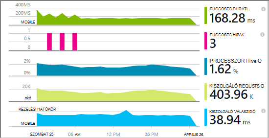

Választhat három útvonalak alkalmazás háttérismeretek alkalmazni a .NET webalkalmazások:

* **Idő összeállítása:** [Az alkalmazás az összefüggéseket SDK hozzáadása] [greenbrown] kell a web app kódot. 
* **Futtatásakor:** A web App alkalmazásban a kiszolgálón eszköz, ahogy az alábbi Újraépítés és újbóli a kód nélkül.
* **Mindkét:** A SDK összeállítása a web app kód be, és a futási idejű bővítmények is alkalmazhat. Ismerkedés a legjobb mindkettőt. 

Az alábbiakban összefoglaljuk az egyes úton kap:

||Idő összeállítása|Futási idő|
|---|---|---|
|Kérések és válaszok kivételek|igen|igen|
|[Részletesebb kivételek](app-insights-asp-net-exceptions.md)||igen|
|[Függőség diagnosztika](app-insights-asp-net-dependencies.md)|A .NET 4.6 +|igen|
|[Rendszer teljesítményét számláló](app-insights-performance-counters.md)||IIS vagy Azure felhőalapú szolgáltatás, nem Azure web App alkalmazásban|
|[Az egyéni telemetriai API][api]|igen||
|[Integráció a nyomkövetési napló](app-insights-asp-net-trace-logs.md)|igen||
|[Lap nézet és a felhasználói adatok](app-insights-javascript.md)|igen||
|Nincs szükség újraépítéséhez kódot.|nem||

## A web app eszköz futásidőben

A [Microsoft Azure](http://azure.com) -előfizetése van szüksége.

### Ha az alkalmazás Azure webalkalmazás vagy felhőalapú szolgáltatás

* Válassza az alkalmazás háttérismeretek az alkalmazás Vezérlőpult Azure-ban. 

    [Tudjon meg többet](app-insights-azure.md).

### Ha az alkalmazás helyezkedik el az IIS-kiszolgálóra

1. A IIS webkiszolgálón rendszergazdai hitelesítő adataival jelentkezzen be.
2. Töltse le, és futtassa az [állapot Monitor telepítőt](http://go.microsoft.com/fwlink/?LinkId=506648).
4. A telepítővarázslóban jelentkezzen be a Microsoft Azure.

    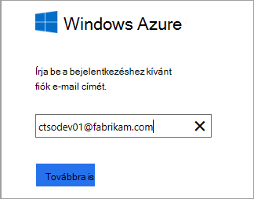

    *Internetkapcsolat hibáinak? Lásd: a [Hibaelhárítás](#troubleshooting).*

5. Válassza ki a telepített webalkalmazás vagy a figyelni kívánt webhelyet, majd állítsa be az erőforrás, amelyben meg szeretné tekinteni az eredményeket az alkalmazás az összefüggéseket portálon.

    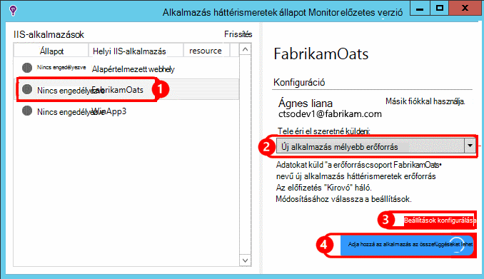

    A szokásos módon, úgy dönt, hogy egy új erőforrás és [erőforráscsoport]konfigurálása[roles].

    Ha már állította be a [webes azt vizsgálja,] ellenkező esetben használata a meglévő erőforrás[ availability] a webhely vagy a [webes ügyfelek figyelése][client].

6. Indítani az IIS Alkalmazást.

    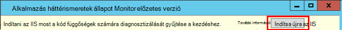

    A webszolgáltatás egy rövid ideig megszakad.

6. Figyelje meg, hogy a figyelni kívánt web Apps alkalmazások ApplicationInsights.config beszúrta.

    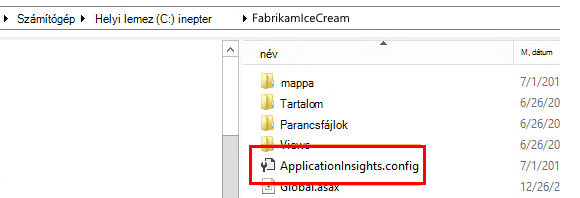

   Is web.config megváltozott.

#### Konfigurálandó (ismételt) később?

A varázsló elvégzése után újra beállíthatja a agent bármikor. Akkor is is használja, ha a agent telepítette, de néhány tapasztal a kezdeti beállítás volt.

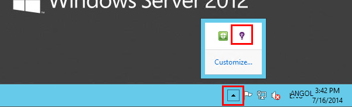

## Nézet teljesítmény telemetriai

Jelentkezzen be [az Azure-portálra](https://portal.azure.com), tallózással keresse meg az alkalmazást az összefüggéseket, és nyissa meg az Ön által létrehozott erőforrás.

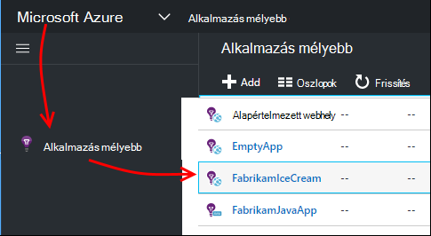

Nyissa meg a teljesítményét lap kérést, válaszidő, függőség és egyéb adatok megjelenítéséhez.

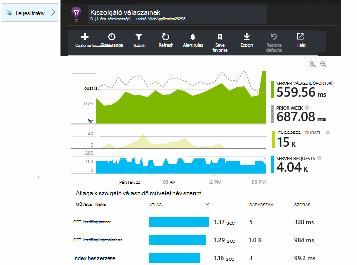

Kattintson az egyes diagramokra kattintva nyissa meg a részletesebb nézetet.

Akkor [szerkesztése, átrendezéséhez mentése](app-insights-metrics-explorer.md), és rögzítenie diagramok és a teljes lap [Irányítópult](app-insights-dashboards.md).

## Függőségek

A függőséget időtartam diagramot az alkalmazás hívásait, mint az adatbázisok, REST API-k és Azure blob-tárolóhoz külső összetevők szükséges idő jeleníti meg.

A különböző függőségek hívásainak szerint oszthatja fel a diagram: szerkeszteni a diagramot, csoportosítás be- és csoportosítási függőség, a függés típusát vagy függőség teljesítményét.

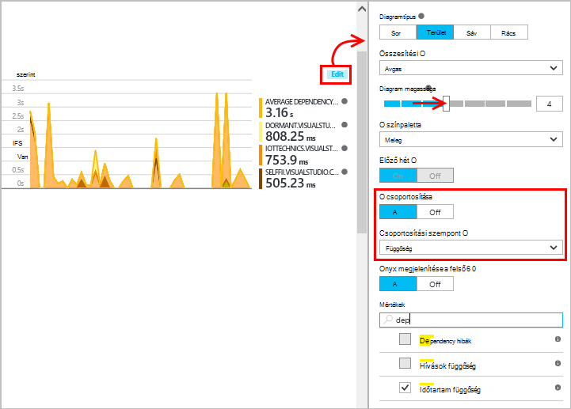

## Teljesítmény számláló 

(Nem az Azure-webalkalmazások.) Kattintson a Servers a áttekintése lap diagramok kiszolgáló teljesítmény teljesítménymutatókat, például a használati és a memória processzorhasználata tekintheti meg.

Ha több server-példányok, érdemes lehet a diagramok szerinti szerepkör-példány szerkesztése.

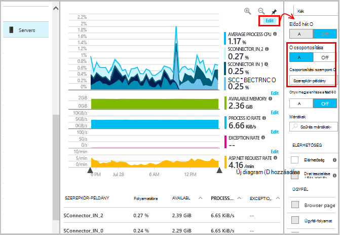

Is [módosítható a teljesítmény számláló, amely szerint az SDK jelentik](app-insights-configuration-with-applicationinsights-config.md#nuget-package-3). 

## A kivételek

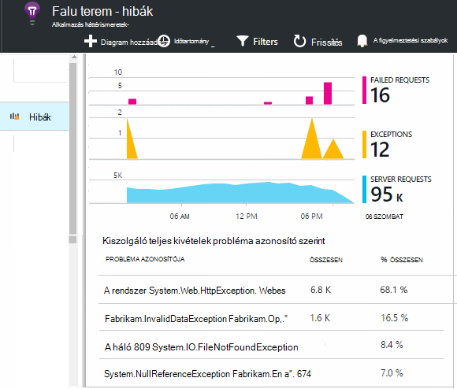

Lehatolás ide egyedi kivételek (az utóbbi hét napban), és Papírhalom halad és a helyi adatok.

## Mintavételnél

Ha az alkalmazás küld az adatokat, és használja az alkalmazás az összefüggéseket SDK ASP.NET verzió 2.0.0-beta3 vagy újabb, a adaptív mintavételnél funkció működjön és küldése csak a telemetriai százalékában. [További tudnivalók a mintavételnél.](app-insights-sampling.md)

## Hibaelhárítás

### Csatlakozási hibák

Nyissa meg a kiszolgáló tűzfalat, hogy engedélyezze az állapot Monitor működéséhez [Néhány kimenő portokat](app-insights-ip-addresses.md#outgoing-ports) szüksége.

### Nincs telemetriai?

  * Használja a webhely létrehozásához néhány adatot.
  * Várjon néhány percet, hogy az adatokat kapják meg üzeneteiket, majd kattintson a **frissítés**parancsra.
  * Nyissa meg az egyes események megtekintéséhez diagnosztikai keresés (a keresés csempét). Események láthatók gyakran diagnosztikai keresés előtt összesített adatok megjelenik a diagramon.
  * Nyissa meg az állapot Monitor, és jelölje ki azt az alkalmazást, a bal oldali ablaktáblában. Ellenőrizze, hogy vannak-e bármilyen diagnosztika üzenetek ehhez az alkalmazáshoz "Konfigurációs értesítések" szakaszban:

  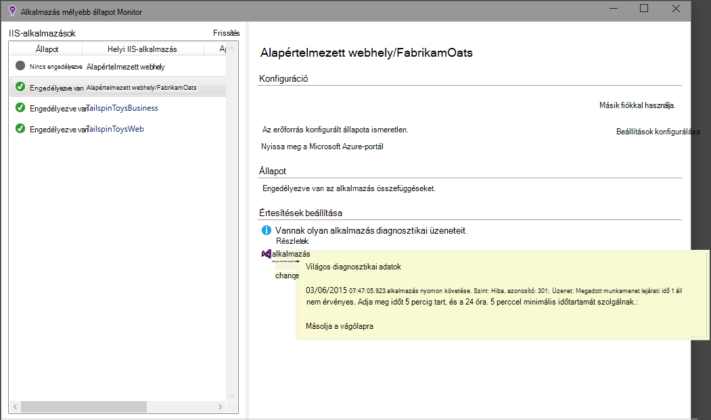

  * Győződjön meg arról, hogy a kiszolgáló tűzfal lehetővé teszi, hogy a fenti portokon kimenő forgalmának.
  * A kiszolgálón Ha "engedélyekkel" vonatkozó üzenet jelenik meg, próbálkozzon az alábbiakkal:
    * Az IIS-kezelőben válassza ki a alkalmazáskészlet, nyissa meg a **Speciális beállítások**és a **Process Model** vegye figyelembe az identitás.
    * A számítógép management control panel lapján a teljesítmény Monitor felhasználók csoportba vegye fel az identitás.
  * Ha MMA/SCOM telepítve a kiszolgálóra, az egyes verzióiban ütközhetnek. Távolítsa el a SCOM, és az állapot Monitor, és újra kell telepítenie a legújabb verziója.
  * Lásd: [Hibaelhárítás][qna].

## Rendszerkövetelmények

Alkalmazás háttérismeretek állapot Monitor kiszolgálón OS támogatása:

- A Windows Server 2008
- A Windows Server 2008 R2 rendszerben
- A Windows Server 2012
- A Windows server 2012 R2

legújabb SP és a .NET-keretrendszer 4.0 és 4.5.

Windows 7, 8 és 8.1, ügyféloldalon ismét a .NET keretrendszer 4.0-s és 4.5

IIS támogatása: IIS 7 7.5, 8, 8.5 (az IIS szükség)

## Automatizálási szolgáltatást a PowerShell használatával

Indítsa el, és leállítja a PowerShell használatával az IIS-kiszolgálóra figyelése.

Először importálja az alkalmazás az összefüggéseket a modul:

`Import-Module 'C:\Program Files\Microsoft Application Insights\Status Monitor\PowerShell\Microsoft.Diagnostics.Agent.StatusMonitor.PowerShell.dll'`

Keresse meg, hogy mely alkalmazások vannak figyelni:

`Get-ApplicationInsightsMonitoringStatus [-Name appName]`

* `-Name`(Nem kötelező) A webes alkalmazás nevére.
* Az egyes web app (vagy a névvel ellátott alkalmazás) állapot ellenőrzése alkalmazás az összefüggéseket a IIS-kiszolgáló jeleníti meg.

* Eredménye `ApplicationInsightsApplication` minden alkalmazás:
 * `SdkState==EnabledAfterDeployment`: Alkalmazás figyelésére és futásidőben rendszereken volt, az állapot Monitor eszközzel, vagy történő `Start-ApplicationInsightsMonitoring`.
 * `SdkState==Disabled`: Ez az alkalmazás nem rendszereken, az alkalmazás az összefüggéseket. Soha ne rendszereken volt, vagy futási idejű figyelése le van tiltva, az állapot Monitor eszközzel vagy `Stop-ApplicationInsightsMonitoring`.
 * `SdkState==EnabledByCodeInstrumentation`: Ez az alkalmazás a SDK felveszi a forráskód lett rendszereken. A SDK nem frissíthető, és leállt.
 * `SdkVersion`használható az alkalmazás figyelése a verzióját jeleníti meg.
 * `LatestAvailableSdkVersion`jelenleg elérhető verzióját jelzi a NuGet listában. Ez a verzió az alkalmazás frissítéséhez használata `Update-ApplicationInsightsMonitoring`.

`Start-ApplicationInsightsMonitoring -Name appName -InstrumentationKey 00000000-000-000-000-0000000`

* `-Name`Az alkalmazás az IIS neve
* `-InstrumentationKey`Az alkalmazás az összefüggéseket erőforrás, amelyre kattintva jeleníthető meg az eredmények ikey.

* Ezzel a parancsmaggal csak érinti alkalmazások, amelyek nem már rendszereken – Ez azt jelenti, hogy SdkState == NotInstrumented.

    A parancsmaggal nem befolyásolja az alkalmazás, amely már rendszereken, a Szerkesztés ideje a SDK csomagjában talál a kód hozzáadásával vagy futásidőben egy előző Ezen parancsmag használatával.

    A használt eszköz az alkalmazás SDK verzió áll a legutóbb letöltött ennek a kiszolgálónak.

    Töltse le a legújabb, használja a frissítés-ApplicationInsightsVersion.

* Eredménye `ApplicationInsightsApplication` siker. Ha nem sikerül, ezzel naplózza a nyomkövetési.

    
          Name                      : Default Web Site/WebApp1
          InstrumentationKey        : 00000000-0000-0000-0000-000000000000
          ProfilerState             : ApplicationInsights
          SdkState                  : EnabledAfterDeployment
          SdkVersion                : 1.2.1
          LatestAvailableSdkVersion : 1.2.3

`Stop-ApplicationInsightsMonitoring [-Name appName | -All]`

* `-Name`IIS-alkalmazás nevét
* `-All`A IIS-kiszolgálót az összes alkalmazás figyelése, amelynek végpontok`SdkState==EnabledAfterDeployment`

* A megadott alkalmazások figyelése leállítja, és műszerezettségi eltávolítja. Ez csak akkor működik, például van már rendszereken a eszközzel állapotának ellenőrzése vagy a kezdés-ApplicationInsightsApplication futásidőben. (`SdkState==EnabledAfterDeployment`)

* ApplicationInsightsApplication lekérdezése

`Update-ApplicationInsightsMonitoring -Name appName [-InstrumentationKey "0000000-0000-000-000-0000"`]

* `-Name`: Neve az IIS webalkalmazást.
* `-InstrumentationKey`(Nem kötelező.) Ezzel az erőforrás, amelyhez küldi el az alkalmazás telemetriai módosítása.
* Ezzel a parancsmaggal:
 * Frissítések elnevezett letöltve az alkalmazás a SDK verziójára legutóbb ezen a számítógépen. (Csak akkor működik, ha `SdkState==EnabledAfterDeployment`)
 * Ha megad egy műszerezettségi billentyűt, a program az erőforrás adott kulccsal telemetriai küldeni újrakonfigurálni az elnevezett alkalmazást. (Akkor működik, ha `SdkState != Disabled`)

`Update-ApplicationInsightsVersion`

* Az alkalmazás legújabb háttérismeretek SDK letölti a kiszolgálóra.

## Következő lépések

* [Webes vizsgálatok létrehozása] [ availability] , hogy a tárterületkorlátok élő.
* [Keresés események és naplók] [ diagnostic] számára diagnosztizálását.
* [Adja hozzá a webes ügyfelek telemetriai] [ usage] lásd: az weblapon kód alóli kivételek, és lehetővé teszi, hogy hívások nyomon beszúrása.
* [Alkalmazás háttérismeretek SDK hozzáadása a webes szolgáltatáskód] [ greenbrown] , hogy a nyomkövetési jeleníthet meg és napló felhívja a kiszolgáló kódot.

<!--Link references-->

[api]: app-insights-api-custom-events-metrics.md
[availability]: app-insights-monitor-web-app-availability.md
[client]: app-insights-javascript.md
[diagnostic]: app-insights-diagnostic-search.md
[greenbrown]: app-insights-asp-net.md
[qna]: app-insights-troubleshoot-faq.md
[roles]: app-insights-resources-roles-access-control.md
[usage]: app-insights-web-track-usage.md
