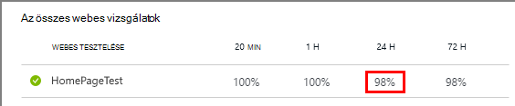
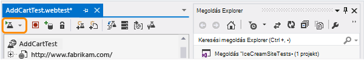

<properties
    pageTitle="Elérhetőség és webhelyekre növeléséhez figyelése |} Microsoft Azure"
    description="Állítsa be a webes vizsgálatok az alkalmazás az összefüggéseket. Ha webhelye nem érhető el, vagy lelassul értesítéseket kapjon."
    services="application-insights"
    documentationCenter=""
    authors="alancameronwills"
    manager="douge"/>

<tags
    ms.service="application-insights"
    ms.workload="tbd"
    ms.tgt_pltfrm="ibiza"
    ms.devlang="na"
    ms.topic="get-started-article"
    ms.date="09/07/2016"
    ms.author="awills"/>

# Elérhetőség és webhelyekre növeléséhez figyelése

Után már telepítette a web App alkalmazást vagy a webhely tetszőleges kiszolgálóra, állíthat be webes vizsgálatok Lync-elérhetőségét, és a növeléséhez. [Visual Studio alkalmazás háttérismeretek](app-insights-overview.md) webes kérést küld a világon pontokból a rendszeres időközönként az alkalmazás. Riasztást jelenít meg, ha az alkalmazás nem válaszol, vagy lelassul.

Beállíthatja a http- vagy HTTPS végpontot, elérhető nyilvános internetes webes vizsgálatok.

Webes próba két típusa van:

* [URL-cím ping tesztelése](#create): egy egyszerű teszt hozható létre az Azure-portálon.
* [Több elem lépés webes tesztelése](#multi-step-web-tests): mely létrehozása a Visual Studio Ultimate és a Visual Studio Enterprise, és a portálon feltöltése.

Legfeljebb 10 web vizsgálatok / alkalmazás erőforrás hozhat létre.

## 1. a próba-jelentéseket az erőforrás létrehozása

Hagyja ki ezt a lépést, ha a végezte el már [állíthat be egy alkalmazást az összefüggéseket erőforrás] [ start] esetében az alkalmazást, és szeretné, hogy az elérhetőség jelentéseket ugyanazon a helyen.

Iratkozzon fel [A Microsoft Azure](http://azure.com), az [Azure-portálra](https://portal.azure.com), és hozzon létre egy alkalmazás háttérismeretek erőforrást.

Kattintson az **összes erőforrás** kattintva nyissa meg az Áttekintés lap az új erőforrás parancsra.

## 2. Hozzon létre egy URL-cím ping tesztelése

Az alkalmazás az összefüggéseket erőforrás keresse meg a elérhetősége csempére. A gombra kattintva nyissa meg az alkalmazás a webes teszteket a lap, és egy webes tesztcélú hozzá.

- **URL-cím** látható nyilvános internetes kell lennie. A lekérdezési karakterlánc & #151 is tartalmazhat, Igen, például akkor is gyakorolják az adatbázis kissé. Átirányítások oldja fel az URL-címet, ha azt azt követő legfeljebb 10 átirányítások.
- **Függő kérések elemezni**: képek, parancsfájlok, stílus fájlokat és más erőforrások: az oldal szükséges, a próba keretében, és a rögzített válaszidő tartalmaz a következő alkalommal. A teszt sikertelen, ha ezek az erőforrások nem sikerült tölthető le az idő, a teljes vizsgálathoz.
- **Újrapróbálkozások engedélyezése**: a teszt sikertelen, amikor egy rövid időtartam után újból. A hiba csak akkor, ha három kísérletek sikertelenek jelenteni. Későbbi vizsgálatok majd megy végbe a szokásos teszt gyakorisága. Ismét ideiglenes addig, amíg a következő sikeres fel van függesztve. Ez a szabály egymástól függetlenül minden próba helyén érvényes. (Javasolt: ezt a beállítást. Átlag, a hibák körülbelül 80 %-át eltűnik az Ismét gombra.)
- **Teszt gyakorisága**: állítja be, hogy milyen gyakran a vizsgálat minden olyan helyen, próba lebonyolítása. Öt perc és öt próba helyek gyakorisággal a webhely vizsgálata átlagosan percenként.
- **Teszt** helyei a helyek, ahol kiszolgálóiról webes kérést küld a URL-CÍMÉT a. Válassza a több, hogy különböztethetjük meg problémákat a webhely a hálózati hibák. Legfeljebb 16 helyek is választhat.

- **A siker feltétel**:

    **Próba-időtúllépése**: Ez az érték lassú válaszok értesítést csökkentése. A próba számít hibát, ha a válaszokat a webhelyről nem kapott e időszakon belül Ha a kijelölt **függő kérések elemezni**, majd az összes a képek, a stílus fájlok, parancsfájlok és más erőforrások: függő kell érkezett adott időszakon belüli.

    **HTTP-válasz**: A visszaadott állapotkódot, amely a siker számítanak. 200 a kódot, amely jelzi, hogy az weblapon normál eredmény már.

    **Tartalma egyezik**: karakterlánc, például "Üdvözlő!" Azt tesztelése, hogy minden válasza történik. Egy egyszerű karakterlánc helyettesítő karakterek nélkül kell lennie. Ne feledje, hogy ha a lap tartalmak változásairól lehet, hogy frissíti.

- **Értesítések** , alapértelmezés szerint ki legyenek, ha vannak olyan hibák három helyen öt percnél küldött. A hiba több helyen valószínűleg egy hálózati probléma, és nem lépett fel a webhelyen. De módosíthatja a küszöbértékét kell több vagy kevesebb bizalmas, és módosíthatja is ki kell-e-mailt küldeni.

    Beállíthatja, amely akkor következik be, egy figyelmeztetés Link [webhook](../monitoring-and-diagnostics/insights-webhooks-alerts.md) . (Ne feledje azonban, hogy jelenleg lekérdezés nem átadott paraméter keresztül tulajdonságként.)

### További URL-címek tesztelése

Adja hozzá a további vizsgálat. A példa, valamint teszteli a Kezdőlap lap biztos lehet benne, az adatbázis fut, ha teszteli a Keresés URL-CÍMÉT.

## 3. a webes vizsgálati eredmények látható

1-2 perc múlva eredményei megjelennek a webes próba lap.

Kattintson a összefoglaló időszak további részletes adatok megjelenítése diagramon valamelyik sávra.

A fenti diagramokról összevonhatja az alkalmazás az összes webhely vizsgálat eredményeit.

## Ha megjelenik a hibák

Kattintson a vörös pont.

Vagy görgessen lefelé, és kattintson a 100 %-os sikeres-nél kisebb próba, ahol látható.

Nyissa meg a vizsgálat eredményeit.

A próba számos helyen és #151 lebonyolítása, válasszon egyet, ahol az eredményt adnak 100 %-nál kisebb.

Görgessen le a **vizsgálatok nem sikerült** , és válasszon egy eredményt.

Kattintson az eredmény felmérése a a portál és miért nem sikerült.

Azt is megteheti az eredmény fájl letöltése, és nézze meg ezt a Visual Studióban.

*Néz ki az OK gombra, de a készként a hiba?* Jelölje be az összes kép, parancsfájlok, stíluslapok és egyéb fájlokat a lap által betöltött. Bármelyiküket sikertelen, ha a teszt készként való nem sikerült, akkor is, ha a fő HTML-lap betölti az OK gombra.

## Több elem lépés webes vizsgálatok

Példa, amely magában foglalja az URL-címek sorozata figyelheti meg. Például ha értékesítési webhelye figyelni, ellenőrizheti, hogy a vásárlás adhatók hozzá elemek megfelelően bevásárlókocsiba lehetőségre működik.

A több elem lépést vizsgálati létrehozásához az alkalmazási példát rögzítése a Visual Studio segítségével, és töltse be a felvétel alkalmazás mélyebb. Alkalmazás háttérismeretek az alkalmazási példát replays időközönként, és a válaszokat ellenőrzi.

Megjegyzés: nem használhatja a teszteket a függvények kódolt: a forgatókönyv lépéseket tartalmaznia kell a .webtest fájlban parancsfájl.

#### 1. a példa rögzítése

Visual Studio Enterprise vagy Ultimate használata a webes munkamenet rögzítése.

1. Webes teljesítmény próba projektet létrehozni.

    

2. Nyissa meg a .webtest fájlt, és indítsa el a rögzítést.

    

3. Hajtsa végre a kívánt hasonlóan a próba felhasználói műveletek: Nyissa meg a webhelyet, termékeket adhat hozzá a kosárhoz, és így tovább. A próba majd leállítása

    

    Ne történjenek hosszú példa. Nincs a korlát 100 lépést, és a 2 percig tart.

4. A próba szerkesztése:
 - Adja hozzá a kapott szöveg és a válasz kódok ellenőrzése ellenőrzések.
 - Távolítsa el minden felesleges találja. Képek vagy az Active Directory és nyomon követése a webhelyek függő kérések is eltávolítható.

    Ne feledje, hogy csak akkor szerkeszthető a próba parancsfájl - nem adja hozzá egyéni kódot vagy más webes vizsgálatok hívja. A próba hurkok nem beszúrása. A bővítmények próba szabványos webes is használhatja.

5. Futtassa a tesztet a Visual Studióban, hogy működik.

    A webes próba runner egy webböngészőben megnyílik, és a rögzített műveletek ismételt. Győződjön meg arról, hogy a várt módon működik.

    

#### 2. a webes vizsgálat feltöltése alkalmazás mélyebb

1. Az alkalmazás az összefüggéseket portálon hozzon létre egy új webes próba.

    

2. Jelölje be a több elem lépést vizsgálati, és töltse fel a .webtest fájlt.

    

    Teszt helyekre, gyakoriság és riasztási paraméterek beállítása az adott dokumentumkészletből ugyanúgy, mint a ping tesztek.

Az adott dokumentumkészletből ugyanúgy, mint egyetlen-url teszteket a vizsgálati eredmények és a hibák megtekintése

A közös hiba oka az, hogy túl sokáig fut-e a tesztet. Két percnél hosszabb ideig nem futtatni.

Ne feledje, hogy a lap összes erőforrás kell tölteni a megfelelően a teszt sikertelen, beleértve a parancsfájlok, stíluslapok, képek és így tovább.

Figyelje meg, hogy a webes vizsgálat teljesen tartalmaznia kell a .webtest fájlt: a vizsgálat kódolt funkciók nem használhatók.

### A több elem lépést vizsgálati be és a munkaidő és a véletlen számok csatlakoztatni

Tegyük fel, hogy egy eszközt, idő-függő adatokat, például készletek kap egy külső hírcsatorna esetén tesztelése. A webes próba rögzítésekor kell használnia, adott időpontok, de a vizsgálat paraméterként kezdő időpont és a Befejezés időpontja beállítás helye.

A vizsgálat futtatásakor szeretné, hogy mindig a bemutató, amikor a Befejezés időpontja, és a kezdő időpont 15 perce kell lennie.

Webes próba-bővítmények lehetővé teszik az időpontok paraméterezni.

1. Adja hozzá a kívánt minden változó paraméter beépülő modul web próba. A web próba eszköztáron válassza a **Webhely tesztelése bővítmény hozzáadása**.

    

    Ebben a példában a dátum-idő beépülő modul két példánya használjuk. "15 perce" szolgál egyik példány és egy másikat a "most."

2. Nyissa meg a beépülő modul minden tulajdonságait. Adja meg egy nevet, és állítsa be az aktuális idő használata. Az egyik őket, állítsa be hozzáadása perc = -15.

    

3. A webhely tesztelje a paramétereket, akkor használja a {{beépülő modul neve}} a beépülő modul neve hivatkozni szeretne.

    

A próba most töltse fel a portálon. A dinamikus értékek minden futtatásakor a vizsgálat azt használja.

## Bejelentkezés kezelése

A felhasználók bejelentkezés az alkalmazásba, ha bejelentkezés megtekintheti, hogy tesztelheti, oldal mögött bejelentkezési a különféle lehetőségek állnak rendelkezésre. A megoldás használhatja az alkalmazás által biztosított biztonsági típusától függ.

Minden esetben az alkalmazás csak a tesztelés céljából hozzunk létre egy fiókot. Ha lehetséges, a: az engedélyek korlátozása a próba-fiók, hogy nincs lehetőség a webes vizsgálatok valós felhasználókat érintő.

### Egyszerű felhasználónév és jelszó

Egy webhely próba rögzítse a szokásos módon. Először törölje a cookie-k.

### SAML-hitelesítés

A webes vizsgálatok elérhető SAML beépülő modul használja.

### Ügyfél titkos kulcs

Ha az alkalmazás bejelentkezési útvonal, amely magában foglalja a ügyfél titkos kulcs van, használja az útvonal. Azure Active Directory (AAD) példája egy szolgáltatás, ahol az ügyfelek titkos bejelentkezés. A AAD az ügyfél titkos az alkalmazás billentyűt.

Az alábbiakban az Azure web app-alkalmazás kulccsal minta webes vizsgálata:

1. Letölthető jogkivonat AAD ügyfél titkos (AppKey) segítségével.
2. Bearer jogkivonathoz kinyerése választ.
3. Hívja fel az API bearer jogkivonathoz használata a engedélyezési fejléc.

Győződjön meg arról, hogy a webes vizsgálat egy tényleges ügyfél – Ez azt jelenti, hogy rendelkezik saját alkalmazás AAD –, és használja a clientId + appkey. A szolgáltatás vizsgálandó van a saját alkalmazás is a AAD: Ez az alkalmazás URI-appID tükröződik a webes vizsgálat "erőforrásmező".

### Nyissa meg a hitelesítés

Nyissa meg a hitelesítési példa van a Microsoft vagy a Google-fiókkal jelentkezik be. Sok alkalmazások által használt OAuth adja meg az ügyfél titkos ahelyett, hogy az első tactic úgy kell, hogy vizsgálja meg ezt a lehetőséget.

Ha a vizsgálat OAuth segítségével kell bejelentkezni, az általános megközelítés van:

 * Például Fiddler eszköz használatával vizsgálja meg a forgalmat a webböngésző, a hitelesítési webhelyre és az alkalmazás között.
 * Végezze el a két vagy több bejelentkezési bővítmények a különböző számítógépeken vagy a böngészőben, vagy időközönként hosszú (tokenekre lejár engedélyezése).
 * Különböző munkamenetek összehasonlításával azonosítsa a token vissza a webhelyről hitelesítő, majd átadott az alkalmazás-kiszolgálóhoz bejelentkezés után kapott.
 * Rekord egy webes próba Visual Studio segítségével.
 * Paraméterezni a tokenek beállítása a paraméter, amikor a token visszaadott a hitelesítő, és használja azt a webhelyet a lekérdezésben.
 (A visual Studio megkísérli a vizsgálat paraméterezni azonban nem megfelelően paraméterezni a tokenek.)

## Szerkesztése vagy a vizsgálat letiltása

Nyissa meg az egyes próba szerkesztheti, és tiltsa le azt.

Érdemes lehet webes vizsgálatok letiltása, miközben a szolgáltatást a karbantartás hajt végre.

## Teljesítmény vizsgálatok

A betöltés próba futtatását is lehetővé teszi a webhelyen. Az elérhetőség teszt, például elküldheti egyszerű kéréseket vagy a több elem lépés kérelmek a pontokból a világon. Az elérhetőség próba ellentétben sok összehívásokat, amelyek több egyidejű felhasználó.

Az Áttekintés lap nyissa meg a **Beállítások** **Vizsgálatok teljesítményét**. A próba létrehozásakor, amelyre meghívták csatlakozni, vagy hozzon létre egy Visual Studio Team Services fiókot.

Amikor befejeződött a vizsgálat, akkor jelennek meg válaszidő és sikerességéről.

## Automatizálási

* [Állíthat be egy webes próba használható használata PowerShell-parancsprogramok](https://azure.microsoft.com/blog/creating-a-web-test-alert-programmatically-with-application-insights/) automatikusan.
* Állítsa be, amely akkor következik be, egy figyelmeztetés Link [webhook](../monitoring-and-diagnostics/insights-webhooks-alerts.md) .

## Kérdések? Problémákat?

* *Is kód is felhívhatja a webes vizsgálat?*

    nem. A próba a lépéseket a .webtest fájl kell lennie. És nem lehet hívás más webes vizsgálatok vagy hurkok használja. De van néhány bővítmények, amely hasznos.

* *Támogatott HTTPS?*

    Támogatjuk TLS 1.1-es és a TLS 1.2-es.

* *Van-e különbség "webes vizsgálatok" és "elérhetősége vizsgálatok" között?*

    A két kifejezés szót azonos értelemben használjuk.

* *E szeretné használni az elérhetőség teszteket a belső kiszolgálón futó tűzfal mögött.*

    A tűzfalbeállításokat kérések engedélyezi az [IP-címek webhely tesztelése ügynökök](app-insights-ip-addresses.md#availability).

* *Több elem lépés webes teszten feltöltése nem sikerült*

    Nincs mérete legfeljebb 300 K.

    Melyek a nem támogatott.

    Más webes vizsgálatok mutató hivatkozások nem támogatottak.

    Adatforrásokhoz nem támogatott.

* *A több elem lépést vizsgálati nem befejezése*

    Legfeljebb 100 kérelmek, egy próba van.

    Ha két percnél hosszabb ideig futtatja a vizsgálat leállt.

* *Hogyan lehet fut ügyfél tanúsítványokkal teszten?*

    Nem támogatjuk, hogy Sajnáljuk.

## A videó

> [AZURE.VIDEO monitoring-availability-with-application-insights]

## Következő lépések

[Keresés a diagnosztikai naplók][diagnostic]

[Hibaelhárítás][qna]

[Webes próba ügynökök IP-címei](app-insights-ip-addresses.md)

<!--Link references-->

[azure-availability]: ../insights-create-web-tests.md
[diagnostic]: app-insights-diagnostic-search.md
[qna]: app-insights-troubleshoot-faq.md
[start]: app-insights-overview.md
