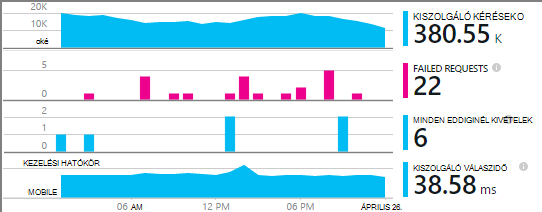

<properties
    pageTitle="Adja hozzá az alkalmazás az összefüggéseket SDK Node.js alkalmazás figyelése |} Microsoft Azure"
    description="Elemzése használatát, elérhetőségét, és a helyszíni vagy a Microsoft Azure webalkalmazás alkalmazás Hírcsatornájában teljesítményét."
    services="application-insights"
    documentationCenter=""
    authors="alancameronwills"
    manager="douge"/>

<tags
    ms.service="application-insights"
    ms.workload="tbd"
    ms.tgt_pltfrm="ibiza"
    ms.devlang="na"
    ms.topic="get-started-article"
    ms.date="08/30/2016"
    ms.author="awills"/>


# <a name="add-application-insights-sdk-to-monitor-your-nodejs-app"></a>Alkalmazás háttérismeretek SDK figyelni a Node.js alkalmazás hozzáadása

*Alkalmazás háttérismeretek az előzetes verzióban.*

[Visual Studio alkalmazás háttérismeretek](app-insights-overview.md) az élő alkalmazás segít [észleli és teljesítménnyel kapcsolatos problémák és a kivételek diagnosztizálása](app-insights-detect-triage-diagnose.md), és [megtudhatja, hogyan használható az alkalmazás](app-insights-overview-usage.md)figyelése A saját helyszíni IIS-kiszolgálókat vagy Azure VMs a telepített alkalmazások, valamint Azure web Apps alkalmazások működik.


A SDK biztosít a bejövő HTTP kérelem arányok és a válaszokat, a teljesítmény számláló (Processzor, memória, RPS) és a kezelt kivételek automatikus gyűjteménye. Ezeken kívül az egyéni hívások függőségek, mértékek vagy más események nyomon követéséhez is hozzáadhat.




#### <a name="before-you-start"></a>Előzetes teendők

szükséged van:

* Visual Studio 2013-at vagy újabb verziója. Később célszerűbb.
* [Microsoft Azure](http://azure.com)-előfizetést. A csoportwebhelyen vagy a szervezete rendelkezik egy Azure-előfizetésbe lehetőséget, ha a tulajdonos is fel kell vennie Önt, a [Microsoft-fiókjával](http://live.com).

## <a name="add"></a>Hozzon létre egy alkalmazás mélyebb erőforrás

Jelentkezzen be az [Azure portál][portal], és hozzon létre egy új alkalmazás mélyebb erőforrást. [Erőforrás] [ roles] az Azure szolgáltatás egy példánya van. Ez az erőforrás pedig az alkalmazás telemetriai fog kell elemezni jelenik meg.


Válassza az egyéb alkalmazás típust. Választható alkalmazás típusát állítja be az alapértelmezett tartalom erőforrás rögzítéséhez és a tulajdonságok láthatók a [Mértékek Explorer][metrics].

#### <a name="copy-the-instrumentation-key"></a>Másolja a műszerezettségi billentyűt

A kulcs az erőforrás azonosítására és az hamarosan fogja a SDK irányítsa át az adatokat az erőforráshoz telepítését.


## <a name="sdk"></a>A SDK csomagjában talál az alkalmazás telepítése

```
npm install applicationinsights --save
```

## <a name="usage"></a>Használat

Ezzel engedélyezi a kérelem figyelése esetén nem kezelt kivétel nyomon követése és figyelése (Processzor/memória/RPS), a rendszer teljesítményét.

```javascript

var appInsights = require("applicationinsights");
appInsights.setup("<instrumentation_key>").start();
```

A műszerezettségi billentyűt is beállítható, hogy a környezeti változóban APPINSIGHTS_INSTRUMENTATIONKEY. Ez történik, ha nincs argumentum szükséges hívásakor `appInsights.setup()` vagy `appInsights.getClient()`.

A SDK megpróbálhatja telemetriai küldés nélkül: műszerezettségi kulcs beállítása a nem üres karakterlánc.


## <a name="run"></a>A projekt futtatása

Futtassa az alkalmazást, és próbálja ki: Nyissa meg a különböző lapokon néhány telemetriai létrehozásához.


## <a name="monitor"></a>A telemetriai megtekintése

Térjen vissza az [Azure-portálra](https://portal.azure.com) , és keresse meg az alkalmazást az összefüggéseket erőforrás.


Keresse meg az Áttekintés lapon lévő adatok. Az első egyszerűen csak megjelenik egy vagy két pontját. Példa:


Kattintson az egyes diagramokra kattintva tekintse részletesebb mértékek keresztül. [További tudnivalók a mértékek.][perf]

#### <a name="no-data"></a>Adatok nélkül?

* Használja az alkalmazás, a Megnyitás a különböző lapokon, hogy az egyes telemetriai hoz létre.
* Nyissa meg a [keresési](app-insights-diagnostic-search.md) csempére kattintva megtekintheti az egyes események. Előfordul, hogy tart események kissé közben hosszabb a mértékek folyamat olvas be.
* Várjon néhány másodpercig, és kattintson a **frissítés**parancsra. Diagramok rendszeres időközönként frissítse maguk, de frissítheti manuálisan, ha bizonyos adatok megjelennek az Ön várakozik.
* Lásd: [Hibaelhárítás][qna].

## <a name="publish-your-app"></a>Az alkalmazás közzététele

Most már az alkalmazás terjesztése az IIS vagy Azure, és az adatok gyűjteniük megtekintés.


#### <a name="no-data-after-you-publish-to-your-server"></a>Nincsenek adatok közzététele a kiszolgálón után?

Nyissa meg a kiszolgáló tűzfalában ezeket a kimenő forgalmához portokat:

+ `dc.services.visualstudio.com:443`
+ `f5.services.visualstudio.com:443`


#### <a name="trouble-on-your-build-server"></a>Problémái vannak az összeállítás kiszolgálóra?

Tanulmányozza [a hibaelhárítás elemre](app-insights-asp-net-troubleshoot-no-data.md#NuGetBuild).


## <a name="customized-usage"></a>Testre szabott használatát 

### <a name="disabling-auto-collection"></a>A webhelycsoport automatikus letiltása

```javascript
import appInsights = require("applicationinsights");
appInsights.setup("<instrumentation_key>")
    .setAutoCollectRequests(false)
    .setAutoCollectPerformance(false)
    .setAutoCollectExceptions(false)
    // no telemetry will be sent until .start() is called
    .start();
```

### <a name="custom-monitoring"></a>Egyéni figyelése

```javascript
import appInsights = require("applicationinsights");
var client = appInsights.getClient();

client.trackEvent("custom event", {customProperty: "custom property value"});
client.trackException(new Error("handled exceptions can be logged with this method"));
client.trackMetric("custom metric", 3);
client.trackTrace("trace message");
```

[További tudnivalók a telemetriai API-val](app-insights-api-custom-events-metrics.md).

### <a name="using-multiple-instrumentation-keys"></a>Több műszerezettségi kulcs használatával

```javascript
import appInsights = require("applicationinsights");

// configure auto-collection with one instrumentation key
appInsights.setup("<instrumentation_key>").start();

// get a client for another instrumentation key
var otherClient = appInsights.getClient("<other_instrumentation_key>");
otherClient.trackEvent("custom event");
```

## <a name="examples"></a>Példák

### <a name="tracking-dependency"></a>A nyomon követés függőség

```javascript
import appInsights = require("applicationinsights");
var client = appInsights.getClient();

var startTime = Date.now();
// execute dependency call
var endTime = Date.now();

var elapsedTime = endTime - startTime;
var success = true;
client.trackDependency("dependency name", "command name", elapsedTime, success);
```


### <a name="manual-request-tracking-of-all-get-requests"></a>Az összes "Beolvasása" kérelmek a kézi kérelem nyomon követése

```javascript
var http = require("http");
var appInsights = require("applicationinsights");
appInsights.setup("<instrumentation_key>")
    .setAutoCollectRequests(false) // disable auto-collection of requests for this example
    .start();

// assign common properties to all telemetry sent from the default client
appInsights.client.commonProperties = {
    environment: process.env.SOME_ENV_VARIABLE
};

// track a system startup event
appInsights.client.trackEvent("server start");

// create server
var port = process.env.port || 1337
var server = http.createServer(function (req, res) {
    // track all "GET" requests
    if(req.method === "GET") {
        appInsights.client.trackRequest(req, res);
    }

    res.writeHead(200, { "Content-Type": "text/plain" });
    res.end("Hello World\n");
}).listen(port);

// track startup time of the server as a custom metric
var start = +new Date;
server.on("listening", () => {
    var end = +new Date;
    var duration = end - start;
    appInsights.client.trackMetric("StartupTime", duration);
});
```

## <a name="next-steps"></a>Következő lépések

* [A telemetriai a portálon figyelése](app-insights-dashboards.md)
* [A telemetriai fölé Analytics-lekérdezéseket írni](app-insights-analytics-tour.md)


<!--Link references-->

[knowUsers]: app-insights-overview-usage.md
[metrics]: app-insights-metrics-explorer.md
[perf]: app-insights-web-monitor-performance.md
[portal]: http://portal.azure.com/
[qna]: app-insights-troubleshoot-faq.md
[roles]: app-insights-resources-roles-access-control.md
