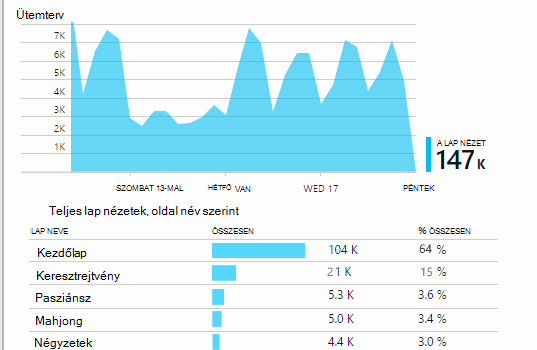
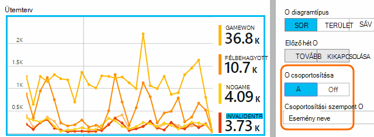

<properties
    pageTitle="Az alkalmazás az összefüggéseket használatát elemzése"
    description="Az alkalmazás az összefüggéseket a használati analitikát áttekintése"
    services="application-insights"
    documentationCenter=""
    authors="alancameronwills"
    manager="douge"/>

<tags
    ms.service="application-insights"
    ms.workload="tbd"
    ms.tgt_pltfrm="ibiza"
    ms.devlang="multiple"
    ms.topic="article" 
    ms.date="04/08/2016"
    ms.author="awills"/>

# Az alkalmazás az összefüggéseket használatát elemzése

Arra, hogy miképpen használják a alkalmazás lehetővé teszi a fejlesztés munka koncentráljon az jelenik meg, hogy a legfontosabbak őket, és szerezhet be, hogy könnyebben vagy nehezebben eléréséhez megtalálják a célok az összefüggéseket.

Alkalmazás háttérismeretek adja meg az alkalmazás használatát, láthassa, ezzel megkönnyítve a felhasználói élmény fokozása, és az üzleti céloknak.

Alkalmazás háttérismeretek működik, mindkét önálló alkalmazása (iOS, Androidon és Windows), és web Apps alkalmazások (.NET vagy J2EE is). 

## Alkalmazás háttérismeretek hozzáadása a projekthez

Első lépésként a [Microsoft Azure](https://azure.com)ingyenes-fiók beszerzése. (A próbaidőszak letelte után továbbra is a szabad réteg a szolgáltatás a.)

Az [Azure portál](https://portal.azure.com)alkalmazás háttérismeretek erőforrás létrehozása. Ez a, ahol megjelenik az adatok használatát és a teljesítmény megtudni az alkalmazásról.

**Ha az alkalmazás egy eszköz alkalmazást,** az alkalmazás az összefüggéseket SDK hozzáadása a projekthez. A pontos eljárás attól függően, hogy a [IDE, és a platform](app-insights-platforms.md)változik. A Windows-alkalmazásokat csak kattintson a jobb gombbal a projekt a Visual Studio és válassza a "Hozzáadás alkalmazás az összefüggéseket."

**-E a megfelelő web App alkalmazásban** nyissa meg az első lépések lap és a kódtöredék hozzáadása a weblapokhoz első. Az e kódtöredékének ismét közzéteheti őket.

A [ASP.NET](app-insights-asp-net.md) vagy [J2EE](app-insights-java-get-started.md) server kód annak érdekében, hogy az ügyfél- és telemetriai kombinálása is felveheti alkalmazás az összefüggéseket.

### A projekt futtatása és első eredmények

Futtassa a projekt hibakeresési módban néhány percig, és az [Azure-portálra](https://portal.azure.com) , és tallózással keresse meg a project erőforrás az alkalmazás az összefüggéseket.

Közzététel az alkalmazást, és szeretné jobban további telemetriai meg, hogy mi a felhasználók mivel foglalkoznak az alkalmazást.

## Beépített Analytics

Kattintson a lap nézetek csempére használatát részletek megtekintéséhez.

Állítsa az egérmutatót fölé megjelenítéséhez a száma, egy adott pontján diagram feletti üres részére. Ellenkező esetben a számok megjelenítése az időszak alatt az időszak során, például az átlagos, a teljes vagy a különböző felhasználók számának összesített értéket.

A webalkalmazások cookie-kat, a felhasználók számítanak ki. A személy, aki a különböző böngészők, cookie-k törlése, vagy használja az adatvédelmi funkció többször lesznek megszámlálva.

Webes munkamenet 30 perc inaktivitás után számít. A telefon vagy más eszköz a munkamenet számít, amikor fel van függesztve az alkalmazás több, mint egy pár másodpercre.

Kattintson az egyes diagramokra kattintva tekintse meg részletesen keresztül. Példa:

(Ez a példa a webhelyről, de a diagramok megjelenése hasonlít az alkalmazások eszközökön futtatott.)

Az előző hét megjelenítéséhez, ha a módosítandó dolog, amit összehasonlítása:

Hasonlítsa össze a két mértékek, például a felhasználók és az új felhasználók számára:

Csoport (a szakasz) adatok egy tulajdonság, például a böngészőben, az operációs rendszer vagy a város szerint:

## Lap használata

Kattintson a lap nézetek eléréséhez csempe egy részletezzük, hogy a leggyakrabban használt lapok:

A fenti példa játékok webhelyről van. Azt is azonnal láthatja:

* Használatát nem javítani a múlt héten. Esetleg azt érdemes megfontolni a keresőprogram-optimalizálás?
* Sokan kevesebb mint a Kezdőlap lap lásd: a játékok oldalakat. Miért nem a Kezdőlap lap vonzhat webhelyére mások is lejátszhatják játékok?
* "Keresztrejtvény" a leggyakrabban használt játék. Azt meg kell adnia prioritás új ötleteket, és ott javítása.

## Egyéni nyomon követése

Tegyük fel, hogy, hogy minden játék végrehajtása az weblapon külön, hanem úgy dönt, hogy a legtöbb szolgáltatását az weblapon mint Javascript kódolt összes alkalmazásba a ugyanazt az egyoldalas elrendezésű oldalakat, refactor őket. A felhasználó gyors váltás egyik mérkőzés szavakat, és egy másik, vagy akár több játékok egy oldalra.

De továbbra is szeretné alkalmazás háttérismeretek hányszor bejelentkezni minden mérkőzés szavakat az nyitja meg, pontosan megegyező módon voltak külön weblapokon. Ez az egyszerű: csak a JavaScript, ahová a rekord, amely új "lap" meg van nyitva a hívást kezdeményez, a telemetriai modul beillesztése:

    telemetryClient.trackPageView(game.Name);

## Egyéni események

Telemetriai megérthető, az alkalmazás használatának többféle módon is használhatja. De nem mindig szeretné az üzenetek keverje lap nézetek. Egyéni események kell használni. Küldhet nekik eszköz alkalmazások, a weblapok vagy webkiszolgálóra:

(A JavaScript)

    telemetryClient.trackEvent("GameEnd");

(C#)

    var tc = new Microsoft.ApplicationInsights.TelemetryClient();
    tc.TrackEvent("GameEnd");

(VISUAL BASIC)

    Dim tc = New Microsoft.ApplicationInsights.TelemetryClient()
    tc.TrackEvent("GameEnd")

A leggyakoribb egyéni események megjelennek az Áttekintés lap.

Kattintson a teljes szám a teljes táblázatot vezetője. A diagram a különböző attribútumokat, például az esemény nevét úgy is szegmens:

Az ütemtervek különösen hasznos funkció a, hogy összefüggésbe hozhatja módosítások más mértékek és eseményeket. Például időnként, ha több játékok azért, akkor az elvárt, valamint a félbehagyott játékok növekvő. De félbehagyott játékok növekedését aránytalan, célszerű megtudhatja, hogy a nagy terhelés, hogy a felhasználók találnak fogadható el problémákat okoz.

## Adott események lehatolhatnak

Úgy juthat, hogyan egy tipikus munkamenet Ugrás jobban ismertetése, érdemes lehet egy adott munkamenetben, amely tartalmazza az egy bizonyos típusú esemény kiemelése.

Ebben a példában egy egyéni esemény "NoGame", ha a felhasználó bejelentkezik anélkül, hogy valójában egy játék meghívott kódolt azt. Miért kellene felhasználó van, amely? Esetleg néhány adott előfordulás lehatolhatnak azt, ha azt vissza egy clue.

Az egyéni események kapott az alkalmazást az Áttekintés lap a név szerint jelennek meg:

Kattintson az esemény érdeklődésre számot tartó keresztül, és jelölje ki a legutóbbi adott előfordulás:

Nézzük meg az összes telemetriai a munkamenet adott NoGame esemény lépett fel.

Kivételek, hiba történt, így a felhasználó nem lett akadályozni lejátszásával valamilyen hiba.

Azt is szűrheti telemetriai lap nézetek kivételével az összes típusú meg ebben a munkamenetben:

És most is láthatja, hogy a felhasználó bejelentkezve egyszerűen jelölje be a legújabb eredmények. Esetleg azt vegye figyelembe, amely megkönnyíti, hogy egy felhasználó történet kidolgozása. (És azt végre kell hajtania a jelentés egy egyéni esemény Ez a cikk bekövetkezésekor.)

## Szűrés, keresés és oszthatja fel az adatok tulajdonságok
Események tetszőleges címkék és numerikus értékek csatolhat.

JavaScript-ügyfél

    appInsights.trackEvent("WinGame",
        // String properties:
        {Game: currentGame.name, Difficulty: currentGame.difficulty},
        // Numeric measurements:
        {Score: currentGame.score, Opponents: currentGame.opponentCount}
    );

C# kiszolgálón

    // Set up some properties:
    var properties = new Dictionary <string, string>
        {{"game", currentGame.Name}, {"difficulty", currentGame.Difficulty}};
    var measurements = new Dictionary <string, double>
        {{"Score", currentGame.Score}, {"Opponents", currentGame.OpponentCount}};

    // Send the event:
    telemetry.TrackEvent("WinGame", properties, measurements);

Visual Basic kiszolgálón

    ' Set up some properties:
    Dim properties = New Dictionary (Of String, String)
    properties.Add("game", currentGame.Name)
    properties.Add("difficulty", currentGame.Difficulty)

    Dim measurements = New Dictionary (Of String, Double)
    measurements.Add("Score", currentGame.Score)
    measurements.Add("Opponents", currentGame.OpponentCount)

    ' Send the event:
    telemetry.TrackEvent("WinGame", properties, measurements)

Tulajdonságok csatolása lap nézetek hasonló módon:

JavaScript-ügyfél

    appInsights.trackPageView("Win",
        {Game: currentGame.Name},
        {Score: currentGame.Score});

A diagnosztikai keresés tulajdonságainak megtekintése esemény egy egyedi előfordulását keresztül gombra kattintva.

A Keresés mező segítségével lásd: az esemény előfordulások az egy adott tulajdonság értékét.

## A |} B tesztelése

Ha nem tudja, hogy mely variant funkció sikeresebb lesz, engedje fel őket, így minden elérhető különböző felhasználók mindkét. A sikeres az egyes mérje, és helyezze át egy egyesített verzióját.

Ennek a módszernek az alkalmazás minden verziója által küldött összes telemetriai egyedi címkék csatolása meg. Végezheti el, hogy az az aktív TelemetryContext tulajdonságok megadásával. Alapértelmezett tulajdonságokból telemetriai üzenetek, amely a kérelem küld - nem csak az egyéni üzenetek, de a szabványos telemetriai ad hozzá.

Az alkalmazás az összefüggéseket portálon majd is a szűrés és csoportosítás (szakasz) az adatok, a címkék annak érdekében, hogy a különböző verziójának összehasonlítása című témakört.

C# kiszolgálón

    using Microsoft.ApplicationInsights.DataContracts;

    var context = new TelemetryContext();
    context.Properties["Game"] = currentGame.Name;
    var telemetry = new TelemetryClient(context);
    // Now all telemetry will automatically be sent with the context property:
    telemetry.TrackEvent("WinGame");

Visual Basic kiszolgálón

    Dim context = New TelemetryContext
    context.Properties("Game") = currentGame.Name
    Dim telemetry = New TelemetryClient(context)
    ' Now all telemetry will automatically be sent with the context property:
    telemetry.TrackEvent("WinGame")

Egyes telemetriai felülbírálhatják az alapértelmezett értékeket.

Egy univerzális inicializálója beállíthatja, hogy az összes új TelemetryClients automatikusan használja a környezetben.

    // Telemetry initializer class
    public class MyTelemetryInitializer : ITelemetryInitializer
    {
        public void Initialize (ITelemetry telemetry)
        {
            telemetry.Properties["AppVersion"] = "v2.1";
        }
    }

Kattintson az alkalmazás inicializálója Global.asax.cs például:

    protected void Application_Start()
    {
        // ...
        TelemetryConfiguration.Active.TelemetryInitializers
        .Add(new MyTelemetryInitializer());
    }

## Ismerje meg, - mérték - összeállítás

Analytics használatakor úgy gondolja, hogy körülbelül kapcsolatos problémák megoldásához szerves része a fejlesztési ciklus - valami nem csak lesz. Az alábbiakban néhány tippet:

* Határozza meg a fő mérőszám az alkalmazás. Kíváncsi, annyi felhasználók lehető, vagy inkább Boldog nagyon kicsi meg? Szeretne tartománynevére vagy értékesítési maximalizálása?
* Tervezze meg minden szövegegység mérésére. Ha meg egy új felhasználói szövegegység vázlatot, vagy funkcióval vagy a terv egy meglévő frissítése, mindig megfontolni hogyan módosítása egyik fog mérjük. Mielőtt kódolás elindul, kérje meg a "milyen hatással ez lesz a mérési módja miatt, ha működik? Érdemes azt a nyomon követés minden új események?"
És természetesen, ha a szolgáltatás élő, győződjön meg arról, tekintse meg a analytics, és az eredmények működésbe lépnek.
* A fő mérőszám más mértékek vonatkoznak. Például ad hozzá egy "Kedvencek" szolgáltatást, ha szeretné, hogy milyen gyakran felhasználók felvétele a Kedvencek között. De akár több segítségével tudja, milyen gyakran azok térjen vissza a Kedvencek közé. És a legfontosabb, végezze el a Kedvencek használók végül vásárlása több terméket?
* Tesztelés Kanári. Állítsa be a szolgáltatás kapcsoló, amely lehetővé teszi, hogy egy új szolgáltatást láthatóvá szeretné tenni a csak néhány felhasználó. Háttérismeretek alkalmazás segítségével látható, hogy az új szolgáltatás, a tervezett módon van használatban. Módosításokat, majd engedje el szélesebb közönségnek.
* A-felhasználóval beszélgetni! Analytics nem elég a saját, de kiegészítő jó ügyfélkapcsolat fenntartására.

## tudj meg többet

* [Észleli, mailjei és diagnosztizálása összeomlik, és az alkalmazás a teljesítménnyel kapcsolatos problémák](app-insights-detect-triage-diagnose.md)
* [Sok platformon futó alkalmazás háttérismeretek használatába](app-insights-detect-triage-diagnose.md)

## A videó

> [AZURE.VIDEO usage-monitoring-application-insights]

 
