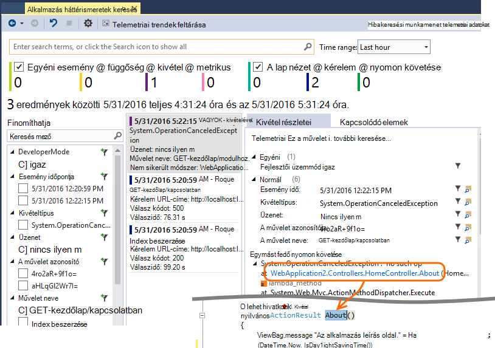

<properties 
    pageTitle="Alkalmazás háttérismeretek oktatóprogram |} Microsoft Azure" 
    description="Használatát és az élő webalkalmazás teljesítményének nyomon követése  Észleli, mailjei és a problémák. Folyamatosan figyelje, és javíthatja a felhasználók sikeres." 
    services="application-insights" 
    documentationCenter=""
    authors="alancameronwills" 
    manager="douge"/>

<tags 
    ms.service="application-insights" 
    ms.workload="tbd" 
    ms.tgt_pltfrm="ibiza" 
    ms.devlang="na" 
    ms.topic="article" 
    ms.date="10/15/2016" 
    ms.author="awills"/>
 
# Alkalmazás háttérismeretek – bevezetés

Visual Studio alkalmazás háttérismeretek egy bővíthető analytics-szolgáltatás, az élő webalkalmazás figyeli. Az általa észleli és teljesítménybeli problémáinak diagnosztizálása, és megértette a ténylegesen mit a felhasználók az alkalmazást. Segít folyamatosan a teljesítmény és használhatóság javítása a fejlesztők számára készült. Az alkalmazások működik .NET, Node.js és J2EE platformokon számos különböző, a helyszíni üzemeltetett vagy a felhőben. 

[Nézze meg a bevezetés animációt](https://www.youtube.com/watch?v=fX2NtGrh-Y0).

## Hogyan működik?

Kis műszerezettségi csomag telepítéséhez az alkalmazásban, és állítsa be az alkalmazás az összefüggéseket erőforrás a Microsoft Azure-portálon. A műszerezettségi figyeli az alkalmazást, és telemetriai adatokat küld a portálon. A portál statisztikai diagramok, illetve nyújt segítséget nyújtanak az esetleges problémákat diagnosztizálása hatékony keresés eszközöket.

Alkalmazás háttérismeretek például kérelem válaszidő, kivétel és függőség hívások telemetriai különböző típusú összegyűjtése több [szabványos műszerezettségi modulok](app-insights-configuration-with-applicationinsights-config.md) tartalmaz. Is [küldhet egyéni telemetriai kódírás](app-insights-api-custom-events-metrics.md) a portálon.

### Mi az a terhelést?

Az alkalmazás teljesítményre gyakorolt hatása nagyon kicsi. A nyomon követés hívások nem blokkoló, amelyek kötegelt és egy külön szál küldött. 

## Mire szolgál ez?

Alkalmazás mélyebb célja a fejlesztőcsapatához útmutatóból megtudhatja, hogyan végrehajtásához az alkalmazást, és hogyan van használatban. Nyújtja:

Telemetriai típusok:

* HTTP kérelem mértékek, a válasz időpontot, a sikerességéről.
* Függőség (HTTP és SQL) hívja fel a mértékek, a válasz időpontot, a sikerességéről.
* Kivétel halad kiszolgáló és az ügyfél.
* Diagnosztikai naplókban nyomkövetések.
* A lap nézet is számolja a felhasználó és a munkamenet száma, a böngésző betöltést, a kivételek.
* AJAX-hívás díjak, válaszidő és sikerességéről.
* Kiszolgáló teljesítmény számláló.
* Egyéni ügyfél- és kiszolgálóoldali telemetriai.
* Ügyfél helyét, böngésző verziószáma, operációs rendszer, server-példányt, egyéni méretekre és további szegmens.
* Elérhetőség vizsgálatok

Diagnosztikai és analitikus eszközök:

* Intelligens és manuális értesítések hiba arányok és a többi mértékek, és elérhetőségét.
* Diagramok az összesített mértékek idővel.
* Diagnosztikai keresési példányok kérések, a kivételek, egyéni események napló halad, lap nézetek, függőség és AJAX-hívások. 
* Analytics - egy hatékony lekérdezési nyelv a telemetriai keresztül
* Irányítópult - írása a diagramok kell figyelni az alkalmazás minden összetevő.

## Hogyan kell használni?

### Monitor

Alkalmazás háttérismeretek telepítése a webalkalmazásban elérhetősége webes tesztek, beállítása és:

* Állítsa be a szoba történő betöltése, válaszidő és a teljesítmény a függőségek, betöltését és AJAX-hívások figyelemmel az irányítópult. 
* Fedezze fel, amelyek a legkisebb és a legtöbb hibás kérések.
* Megtekintés az élő adatfolyam, amikor egy új kiadásának azonnal tudni bármely csökkenés rendszerbe.

### Diagnosztizálása

Ha értesítést kapni, vagy probléma felfedezése:

* Hibák összehangolására kivételekkel, függőség hívások és nyomkövetések.
* Egymást fedő kiírása és a nyomkövetési naplók vizsgálja meg.

### Mérje fel, hogy

Mérje le a rendszerbe új szolgáltatások hatékonyságát.

* Tervezze meg felmérni, hogy hogyan használja az ügyfelek a új UX vagy funkciókat.
* Egyéni telemetriai írja be a kód használatát bejelentkezni.
* Minden egyes fejlesztési ciklus alapuló telemetriai a merevlemez bizonyítékokra.

## Első lépések

Alkalmazás háttérismeretek belül a Microsoft Azure is sok szolgáltatások közül, és telemetriai küldi el ott elemzési és a bemutató. Így tesz, semmi másra szüksége lesz [A Microsoft Azure](http://azure.com)-előfizetést. Regisztráljon az ingyenes, és megadhatja, hogy az ingyenes [réteg árak](https://azure.microsoft.com/pricing/details/application-insights/) alkalmazás az összefüggéseket. Ha szervezetének már van előfizetésem, azok is hozzáadni a Microsoft-fiókjával. 

Első lépések többféle módon lehet. Amelyik a legjobban, kezdeni. A többi a később hozzáadhatja.

* **At futtatásakor: eszköz a web App alkalmazásban a kiszolgálón.** Bármely frissítése a kód elkerülhető. Rendszergazdai hozzáféréssel kell rendelkeznie a kiszolgálóra.
 * [**IIS a helyszíni, vagy egy virtuális a**](app-insights-monitor-performance-live-website-now.md)
 * [**Azure web App alkalmazást vagy a virtuális**](app-insights-monitor-performance-live-website-now.md#if-your-app-runs-as-an-azure-web-app)
 * [**J2EE**](app-insights-java-live.md)
* **Fejlesztési időben: alkalmazás háttérismeretek hozzáadása a kódot.** Lehetővé teszi, hogy az egyéni telemetriai írása és eszköz háttéradatbázis és az asztali alkalmazások lapot.
 * [Visual Studio](app-insights-asp-net.md) 2013 frissítése, 2-es vagy újabb verziója.
 * Java [Holdas](app-insights-java-eclipse.md) vagy [egyéb eszközök](app-insights-java-get-started.md)
 * [NODE.js](app-insights-nodejs.md)
 * [Más platformokhoz készült Worddel](app-insights-platforms.md)
* Az **[eszköz a weblapokhoz](app-insights-javascript.md)** lap nézetben, AJAX és más ügyféloldali telemetriai.
* **[Elérhetőség vizsgálatok](app-insights-monitor-web-app-availability.md)** - ping a webhely rendszeresen a kiszolgálóról.

> [AZURE.NOTE]  Ezen a ponton esetleg csak szeretne felvenni, és kísérletezzen. De ha szeretné, hogy mit tehet az alkalmazás mélyebb, olvasson tovább...

## Mértékek feltárása

Az alkalmazás - vagy a fejlesztés számítógépen vagy kiszolgálón helyezésével hibakeresési üzemmódban - futtatni, és egy ideig használni. Jelentkezzen be az [Azure-portálon](https://portal.azure.com).

Nyissa meg az alkalmazás alkalmazás mélyebb áttekintése lap:

Az Áttekintés lehetővé teszi, hogy hogyan végrehajtásához az alkalmazás azonnal láthatják. Összehasonlíthatja terhelés (értelmez kérelmek ráta) az időpontot is az alkalmazását a kérelmekre válaszolni. Ha aránytalan növekvő válaszidő, amikor a betöltés mutat-e be, érdemes lehet az alkalmazás további erőforrásokat. Ha további sikertelen válaszok jobbra után telepítette egy új build mutat, majd érdemes lehet visszaállítani.

#### Részletesebb beszerzése

Kattintson az egyes diagramokra kattintva kaphat részletes diagramok keresztül. A kiszolgáló válaszidő-diagram például diagramok kérelem díjak, válaszidő és válasz időpontok, függőségek (Ez azt jelenti, hogy szolgáltatások, amelyek az alkalmazás felhívja) hö vezet.  

A függőségeket diagram akkor lehet hasznos, mert azt az elemzéssel tisztábban látható, hogy az adatbázisok és a REST API-khoz az alkalmazást használó jól válaszol, vagy okozzák késések.

#### A diagram testreszabása

A fenti diagramokról egyik szerkeszteni próbálja. Például a web app futtat, a kiszolgálói példány gyűjteménye, ha összehasonlíthatja az eltérő server-példányok válasz időpontokat:

1. Mutasson arra a diagramra, és kattintson a Szerkesztés gombra.
2. Válasszon egy mérőszám. Több mértékek jeleníthető meg egy diagramot, de csak az egyes kombinációk: lehet, hogy egy mérőszám kijelölésének megszüntetése, mielőtt a lehetőségek közül választhat.
3. Csoportosítási szempont segítségével oszthatja fel egy mérőszám tulajdonság alapján. Ebben a példában az eltérő válasz időpontok azt megjelenítése külön sorokban. 

    Ne feledje, hogy be kell jelölnie a mérőszám érvényes tulajdonság, vagy a diagramon nem jelennek meg az adatokat.
4. Jelöljön ki egy diagramtípust. Terület és sávdiagramok megjelenítése a halmozott megjelenítő megfelelő aggregáció típusa "Összeg".

[További információ: Ismerkedés a mértékek](app-insights-metrics-explorer.md).

## Példány adatkeresés

Vizsgálja meg a problémát, célszerű adott esemény példányok találni.

Kattintson a diagram metrikus kereséséhez példány adatai között a megfelelő szűrők és időtartomány. Ha például kattintva kiszolgáló kérelem megszámolja egyes kérelem jelentések megtekintéséhez. 

Vagy is közvetlenül az adatok példány kereséséből származó az Áttekintés oldalon:

Szűrők használata bizonyos típusú eseményt, valamint a választott értékű, a fókusz:

Kattintson a (...), a tulajdonságok teljes listájának megjelenítéséhez, vagy nyissa meg a más eseményeket a kérésben társított. Ebben a példában a hibás kérés egy társított kivétel jelentést tartalmaz:

Nyissa meg az esemény - ebben a példában a kapcsolódó kivételt - és teljesítendő hozhat létre, (Ha a feladatok nyomon követése a Visual Studio Team Services segítségével). 
 

## Elemző

[Analytics](app-insights-analytics.md) fiókfunkció még hatékonyabb keresés és elemzési, amelyben az SQL-szerű lekérdezések fölé a telemetriai adatokat vagy specifikus problémák keres vagy írhat összeállításához statisztikai adatokat.

Nyissa meg az oktatóprogram ablakot és az adatok felett a példák a lekérdezések futtatása című témakörben, vagy olvassa el a hosszabb [oktatóanyag forgatókönyv](app-insights-analytics-tour.md). Az IntelliSense jelenít meg a lekérdezéseket, amelyek segítségével használhatja, és a [teljes nyelvi hivatkozás](app-insights-analytics-reference.md). 

Lekérdezések általában a nevét, például kérelmeket, kivételek vagy függőségek telemetriai adatfolyam kezdeni. POP nyissa meg a séma sáv bal szélén lévő elérhető telemetriai adatfolyam listájának megtekintéséhez. A lekérdezés nem egy folyamat [lekérdezési](app-insights-analytics-reference.md#queries-and-operators) műveletek, például: `where` - logikai szűrő - vagy `project` -amely kiszámítja az új tulajdonságokat. `summarize`[összesítések példányok](app-insights-analytics-tour.md#aggregate-groups-of-rows)funkciók definiálása csoportokba rendezheti, és ezután alkalmazása összesítő függvények a csoportosított adatok fölé.

Eredmények lehet [a táblák vagy a különböző típusú diagram megjelenítését](app-insights-analytics-tour.md#charting-the-results).

## Egyéni telemetriai

A beépített telemetriai, amely csak az alkalmazás az összefüggéseket telepítésével el segítségével elemezheti száma, sikerességéről, és választ kattintson kétszer mind a webes kérelmek a alkalmazást, és függőségek – Ez azt jelenti, hogy a hívások az alkalmazás SQL, REST API-khoz. Akkor is kivétel halad, és (ha az állapot Monitor a kiszolgálón) számláló a rendszer teljesítményét. Az ügyfél kódtöredékének hozzáadása a weblapokhoz, oldalszám nézet kap, és a betöltést ügyfél kivételek és AJAX hívása sikeres és válasz. 

Ez a telemetriai elemzése meg tudja mondani sokkal tudni az alkalmazás teljesítményének és látogatottságának. De néha, amely elég nem. Érdemes lehet figyelni a várólista hosszát úgy, hogy is optimalizálhatja a teljesítmény; vagy számolni a forgalmi és oszthatja fel őket; elhelyezkedés szerint vagy ügyféloldali, itt megtudhatja, hogyan gyakran felhasználóknak, hogy akkor is optimalizálhatja a felhasználói felület egy bizonyos gombra kattintva.

A [Háttérismeretek API Application](app-insights-api-custom-events-metrics.md) biztosít a hívások `TrackEvent(name)` és `TrackMetric(name, value)` , hogy a saját egyéni események és mérőszámok küldhet. Vannak olyan az ügyféloldali egyenértékű hívásokat.

Például ha az weblapon egy egyoldalas játék alkalmazást, akkor előfordulhat, hogy egy sorok beszúrása bejelentkezni, amikor a felhasználó wins vagy játék elveszíti a megfelelő helyeken:

    
    appInsights.trackEvent("WinGame");
    ...
    appInsights.trackEvent("LoseGame");

Ezután azt is diagram egyéni események száma, esemény név szerint példájaként őket:

### Log halad

Diagnosztikai célokra nincs egyéni esemény `TrackTrace(message)` , amelyek segítségével használhatja az adatvégrehajtás nyomkövetések. A Keresés és az elemzést funkciók meg az üzenetet, amely lehet, hogy hosszabb-esemény neve tartalmát is kereshet. 

Ha már használja a naplózás keretrendszer, például Log4Net, NLog, Log4J vagy System.Diagnostic.Trace, majd ezek hívások nyomon által alkalmazás háttérismeretek rögzíthetők, és a többi telemetriai mellett megjelenik a. A Visual Studio eszközök automatikusan hozzáadhatja a megfelelő SDK modulra.

## Az irányítópultok

Egy vagy több processzort befejezése vissza és számos alkalmazás állnak, több összetevőjét, például egy webszolgáltatásból. Minden összetevő felügyeli külön alkalmazás háttérismeretek erőforrás. Ha a rendszer Azure fut, akkor használhatja -, majd - szolgáltatások, például az esemény hubok és gépi tanulási, valamint figyelése. 

Lync-a teljes rendszerhez, jelölje be a legérdekesebbek diagramok más alkalmazásokból, és rögzít őket az Azure [Irányítópult](app-insights-dashboards.md)lehetővé teszi, hogy figyelemmel az egész rendszer folyamatosan. 

Erre valójában hozhat létre több irányítópultok – például a csapat szoba irányítópultok általános rendszerállapot; figyelemmel kísérésére a tervezés-irányítópult, szolgáltatásaival kapcsolatos formázását a különböző szolgáltatások; egy külön Irányítópult-összetevők vizsgálandó; és így tovább.  

Erőforrások, például az irányítópultok megosztható a csapattagok között.

## A Visual Studióban fejlesztési

Ha Visual Studio fejlesztése, az alkalmazás használata esetén számos alkalmazás mélyebb eszköz beépített találhatók. 

### Diagnosztikai keresés

A Keresés ablak naplózott események jeleníti meg. (Ha bejelentkezik Azure alkalmazás háttérismeretek beállításakor, is kereshet az azonos események a portálon.)

Az események mezőinek működnek a szabad szöveges keresés. Például az oldal; az URL-cím keresése a visszaadott érték egy tulajdonság, például az ügyfél várost; vagy nyomkövetési napló adott szavakat tartalmaz.

Kattintson bármelyik eseményre kattintva megtekintheti annak részletes tulajdonságait.

A kapcsolódó elemek lap sikertelen kérelmek vagy kivételeket diagnosztizálása segítségével is megnyithatja.

### Diagnosztikai központi

A diagnosztikai hubon (a Visual Studio 2015 vagy újabb) látható az alkalmazás az összefüggéseket kiszolgáló telemetriai jön létre. Ez a módszer akkor is, ha azt választotta csak a SDK csomagjában talál, telepítése, ha egy erőforrás az Azure-portálon való csatlakozás nélkül.

### A kivételek

Ha [kivétel figyelése beállítása](app-insights-asp-net-exceptions.md), kivétel jelentések jelennek meg a Keresés ablakban. 

Kattintson a kivétel a Papírhalom nyomkövetési napló létrehozására. Ha az alkalmazás a kód nyissa meg a Visual Studióban, kattinthat végig a Papírhalom megrajzolt a megfelelő sorban, a kód.

Ezenkívül a kód Lens sorában mindegyik módszernek fölött, megjelenik az alkalmazás az összefüggéseket a az elmúlt 24 óra bejelentkezve kivételek számának.

### Helyi figyelése

(A Visual Studio 2015 Update 2) Ha még nem konfigurálta a SDK telemetriai küldeni az alkalmazás az összefüggéseket portal (, hogy nincs műszerezettségi kulcs a ApplicationInsights.config) a diagnosztika ablak megjelenítése a legújabb hibakeresési munkamenetből telemetriai. 

Ez akkor célszerű, ha már közzétett az alkalmazás egy korábbi verzióját. Nem szeretné, hogy az telemetriai a hibakeresési munkamenetek arról, hogy kell vegyesen az telemetriai az alkalmazás az összefüggéseket a portálon a közzétett alkalmazásból származó.

Érdemes emellett hasznos, ha van néhány [egyéni telemetriai](app-insights-api-custom-events-metrics.md) szeretné hibakeresése, mielőtt elküldené telemetriai a portálon.

* *Kezdetben e teljesen konfigurálva a telemetriai küldeni a portál alkalmazást az összefüggéseket. De most szeretném a csak a Visual Studio telemetriai megjelenítéséhez.*

 * A Keresés ablak beállításai a rendszer felajánlja helyi diagnosztika keresni, akkor is, ha az alkalmazás telemetriai küld a portálon.
 * A portál küldött telemetriai leállításához megjegyzést, a sor `<instrumentationkey>...` a ApplicationInsights.config. Amikor készen áll a telemetriai ismét elküldeni a portálra, rész megjegyzésének törlése.

## Trendek

Trendek az alkalmazás működése az idő megjelenítése a Visual Studio eszközben nem. 

Válasszon **Telemetriai trendek feltárása** az alkalmazás az összefüggéseket eszköztárgomb vagy alkalmazás háttérismeretek keresőablak. Válasszon egyet az öt általános lekérdezések kezdéshez. Elemezheti, hogy más adatkészleteket alapján telemetriai típusú, az idő tartományait és az egyéb tulajdonságokat. 

Az adatok rendellenességeinek megkereséséhez válassza a a rendellenességet beállítások területen az "Nézet típusa" legördülő menü. Az ablak alján a szűrési lehetőségek megkönnyítik az adott részhalmazának a telemetriai a hone.

## Egy új build feloldása

### Élő mértékek adatfolyam

Élő mértékek adatfolyam jeleníti meg, az alkalmazás mértékek jobbra Ez nagyon szorzatmomentum, akkor 1 közeli valós idejű válaszidejű. Az rendkívül hasznos, ha éppen felszabadítása egy új fejlesztése, és gondoskodni szeretne arról, hogy minden adat meg a várt módon működik, vagy a valós idejű esemény vizsgálja.

Mértékek Explorerben eltérően élő mértékek adatfolyam mértékek meghatározott jeleníti meg. Csak az adatokat is fennáll, mindaddig, amíg be van kapcsolva a diagramot, és kattintson a program törli. 

### A széljegyzetek

[Megjelenés széljegyzetek](app-insights-annotations.md) mértékek diagramok megjelenítése, ahol telepítette egy új build. Azok megkönnyítik az látható, hogy a módosítások volt az alkalmazás teljesítményének hatással. Azok automatikusan létrehozhat a [Visual Studio Team Services rendszer generál](https://www.visualstudio.com/en-us/get-started/build/build-your-app-vs), és Ön is [létrehozhatja őket a PowerShell](#create-annotations-from-powershell).

Megjelenés széljegyzetek szolgáltatása, a felhőalapú build, majd engedje fel a Visual Studio Team Services szolgáltatás. 

## Értesítések

Ha valamit, amit mentésük az alkalmazást, akkor azonnal tudni érdemes. 

Alkalmazás háttérismeretek háromféle figyelmeztetés, amely szerint az e-mailek kézbesítési kínál.

### Megelőző diagnosztika 

[Megelőző diagnosztika](app-insights-proactive-failure-diagnostics.md) automatikusan be van állítva, – nem kell állítani. A webhely van elég a forgalmat, feltéve, amely szokatlan nap vagy felkérés rátáját alkalommal sikertelen kérelmek növekvő esetén vissza e-mailben. Az értesítés diagnosztikai információkat tartalmaz. 

Íme egy példa értesítés. 

Egy másik típusú megelőző észlelési összefüggések hibák és tényezők például hely, ügyfél operációs rendszer és böngésző típusa között találja.

### Metrikus értesítések

Beállíthatja a [riasztások metrikus](app-insights-alerts.md) mondani, amikor tetszőleges metrikus metszéspontja néhány időszakra – például hiba száma, a memóriahasználat vagy a lap nézetek adott küszöbértéknél..

### Elérhetőség

[Elérhetőség webes vizsgálat](app-insights-monitor-web-app-availability.md) kérést küld a világ különböző helyeken a kiszolgálóról a webhelyén. Azok mondani, ha a webhely nem érhető el az interneten, vagy válaszol lassan. 

## Exportálás

Többféle módon is beolvashat ki az alkalmazás mélyebb portált a telemetriai adatokat:

* [Folytonos exportálása](app-insights-export-telemetry.md) ideális, ha meg szeretné őrizni a hosszabb, mint a szokásos adatmegőrzési időszak telemetriai nagy részei.
* [Mértékek](app-insights-metrics-explorer.md#export-to-excel) táblázatok, a keresési eredmények és a [Analytics](app-insights-analytics.md) eredmények összes lehet exportálni az Excel-számolótábla. 
* Az adatok Access REST API keresse meg és bontsa ki az adatokat, beleértve a Analytics-lekérdezések futtatása használható. Az API jelenleg személyes előzetes verzióban. [Megtudhatja, hogy csatlakozzanak az előnézet](https://visualstudio.uservoice.com/forums/357324-application-insights/suggestions/4999529-make-data-accessible-via-apis-for-custom-processin).
* [Power bi Analytics-lekérdezések](app-insights-export-power-bi.md) irányítópultok exportálása, és megtekintheti a Power BI képi megjelenítések automatikusan frissíti az eredményt.

 
## Adatok kezelése

Nincsenek korlátozások a választott árak rendszer bizonyos mértékig függenek, az alkalmazás összefüggéseket a használatát. A fő korlátai szerepelnek:

* Telemetriai ráta percenként
* Az adatpontok száma / hó
* Az adatokat az adatmegőrzési időszak

Költség csökkentése és szabályozásának elkerülése [mintavételi](app-insights-sampling.md) . Törli a telemetriai példákat megőrzési egy részét. Kapcsolódó elemek (például a kivételek és a kérések őket okozó) tartja meg az vagy eldobása együtt. ASP.NET-alkalmazások mintavételnél automatikus program átmásolja az alkalmazás; egyéb esetben azt is megadhatja ilyenkor akkor alkalmazza a bevitel a portálra.

## Következő lépések

Első lépések futásidőben a:

* [IIS-kiszolgáló](app-insights-monitor-performance-live-website-now.md)
* [J2EE kiszolgáló](app-insights-java-live.md)

Első lépések fejlesztési időben együtt:

* [ASP.NET](app-insights-asp-net.md)
* [Java](app-insights-java-get-started.md)
* [NODE.js](app-insights-nodejs.md)

## Támogatás és visszajelzés

* Kérdések és problémák esetén:
 * [Hibaelhárítás][qna]
 * [Fórum az MSDN webhelyen](https://social.msdn.microsoft.com/Forums/vstudio/home?forum=ApplicationInsights)
 * [StackOverflow](http://stackoverflow.com/questions/tagged/ms-application-insights)
 * [Fejlesztőeszközök technikai támogatás kérése](app-insights-get-dev-support.md)
* A javaslatok:
 * [UserVoice](https://visualstudio.uservoice.com/forums/357324)
* Blog:
 * [Alkalmazás mélyebb blog](https://azure.microsoft.com/blog/tag/application-insights)

## Videók

> [AZURE.VIDEO 218]

> [AZURE.VIDEO usage-monitoring-application-insights]

> [AZURE.VIDEO performance-monitoring-application-insights]

> [Bevezető animáció](https://www.youtube.com/watch?v=fX2NtGrh-Y0)

<!--Link references-->

[android]: https://github.com/Microsoft/ApplicationInsights-Android
[azure]: ../insights-perf-analytics.md
[client]: app-insights-javascript.md
[desktop]: app-insights-windows-desktop.md
[detect]: app-insights-detect-triage-diagnose.md
[greenbrown]: app-insights-asp-net.md
[ios]: https://github.com/Microsoft/ApplicationInsights-iOS
[java]: app-insights-java-get-started.md
[knowUsers]: app-insights-overview-usage.md
[platforms]: app-insights-platforms.md
[portal]: http://portal.azure.com/
[qna]: app-insights-troubleshoot-faq.md
[redfield]: app-insights-monitor-performance-live-website-now.md

 