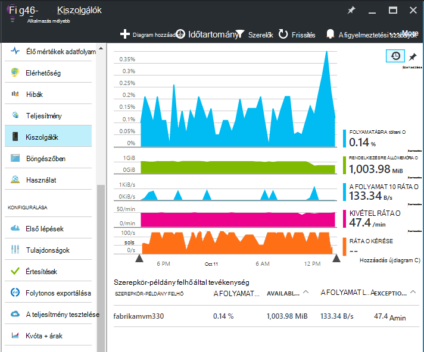
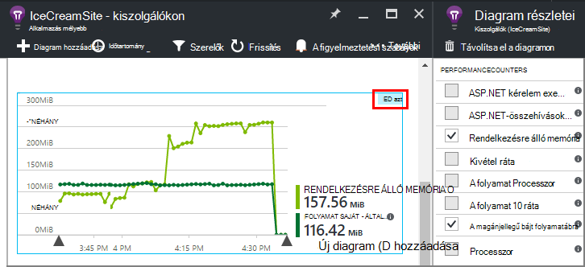
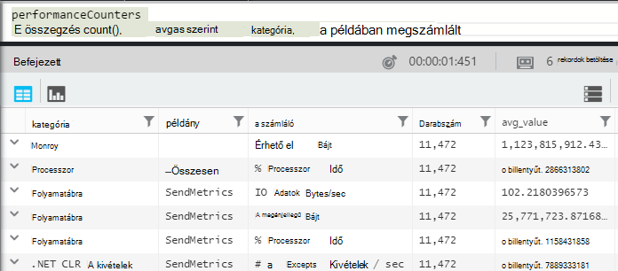
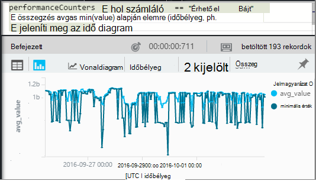
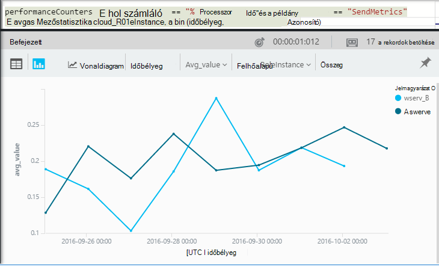

<properties 
    pageTitle="Az alkalmazás az összefüggéseket a teljesítmény számláló |} Microsoft Azure" 
    description="Figyelje a rendszer és az alkalmazás háttérismeretek számláló, egyéni .NET teljesítményét." 
    services="application-insights" 
    documentationCenter=""
    authors="alancameronwills" 
    manager="douge"/>

<tags 
    ms.service="application-insights" 
    ms.workload="tbd" 
    ms.tgt_pltfrm="ibiza" 
    ms.devlang="na" 
    ms.topic="article" 
    ms.date="10/11/2016" 
    ms.author="awills"/>
 
# <a name="system-performance-counters-in-application-insights"></a>Az alkalmazás az összefüggéseket a rendszer teljesítményét számláló


A Windows [Teljesítmény számláló](http://www.codeproject.com/Articles/8590/An-Introduction-To-Performance-Counters) például Processzor használati, memóriahasználat, a lemez és hálózati használatát számos különböző biztosít. Is meghatározhat a saját. [Alkalmazás az összefüggéseket](app-insights-overview.md) a teljesítmény számláló megjelenítheti, ha az alkalmazás az IIS fut a helyszíni host vagy virtuális gép, amelyhez rendszergazdai hozzáférése van. A diagramok jelzi a rendelkezésre álló, az élő alkalmazás források, és server-példányok között kiegyenítetlenségét betöltés azonosítása segít.

A kiszolgáló lap, tartalmazó táblázat adott szegmensek által kiszolgálói példány teljesítményét számláló jelennek meg.



(A teljesítmény számláló nem érhetők el az Azure-webalkalmazások. De [Azure diagnosztika alkalmazás mélyebb küldése](app-insights-azure-diagnostics.md)is.)

## <a name="configure"></a>Konfigurálása

Ha alkalmazás háttérismeretek állapot Monitor még nincs telepítve a kiszolgálóra gépeken, akkor telepítenie kell rákattint teljesítmény számláló.

Töltse le és az egyes kiszolgálói példány [állapot Monitor telepítő](http://go.microsoft.com/fwlink/?LinkId=506648) futtatását. Ha már telepítve van, akkor nem kell telepítse újra.

* *Tudom [telepíteni az alkalmazást az összefüggéseket SDK az alkalmazásom](app-insights-asp-net.md) fejlesztés alatt. Továbbra is szükségem állapot Monitor?*

    Igen, állapot Monitor teljesítményét számláló ASP.NET web Apps alkalmazások összegyűjtése szükséges. Előfordulhat, hogy már tudja, mint állapot Monitor is használható [, amely már live webes alkalmazásainak figyelése](app-insights-monitor-performance-live-website-now.md), a SDK telepítése során fejlesztési nélkül.


## <a name="view-counters"></a>Számláló megtekintése

A kiszolgáló lap alapértelmezés szerinti teljesítményt számláló jeleníti meg. 

A többi számláló, akár a diagramokkal a kiszolgálók lap szerkesztése, vagy egy új [Mértékek Explorer](app-insights-metrics-explorer.md) lap megnyitása és című új diagramok hozzáadása. 

A rendelkezésre álló számlálót szerepelnek mértékek diagram szerkesztésekor.



Ha látni szeretné a leghasznosabb diagramok – egy helyen, [Irányítópult](app-insights-dashboards.md) létrehozása, és rögzítenie őket hozzá.

## <a name="add-counters"></a>Számláló hozzáadása

Ha a teljesítmény számláló, amelyet nem jelenik meg a listában, a mértékek, ennek oka a webkiszolgálón az alkalmazás az összefüggéseket SDK nem gyűjt. Beállíthatja, erre.

1. Keresse meg, hogy milyen számláló érhetők el a kiszolgáló a kiszolgálón a PowerShell parancs használatával:

    `Get-Counter -ListSet *`

    (See [`Get-Counter`](https://technet.microsoft.com/library/hh849685.aspx).)

1. Nyissa meg a ApplicationInsights.config.

 * Az alkalmazás alkalmazás háttérismeretek hozzáadni a fejlesztés során, ha ApplicationInsights.config szerkesztése a projektben, és ezután újra kell üzembe a kiszolgálón.
 * Állapot Monitor használt eszköz futásidőben webalkalmazást, ha ApplicationInsights.config keresse meg a legfelső szintű könyvtárában található az IIS alkalmazást. Frissítse az egyes kiszolgálói példány ott.

2. A teljesítmény adatgyűjtő irányelv szerkesztése:

 ```XML

    <Add Type="Microsoft.ApplicationInsights.Extensibility.PerfCounterCollector.PerformanceCollectorModule, Microsoft.AI.PerfCounterCollector">
      <Counters>
        <Add PerformanceCounter="\Objects\Processes"/>
        <Add PerformanceCounter="\Sales(photo)\# Items Sold" ReportAs="Photo sales"/>
      </Counters>
    </Add>

```

Szabványos számláló és is azok végrehajtotta saját maga is rögzíthet. `\Objects\Processes`Példa egy szabványos számláló minden Windows rendszeren érhető el. `\Sales(photo)\# Items Sold`Íme egy egyéni számláló, előfordulhat, hogy egy webszolgáltatásból szerepelni fog. 

A formátum `\Category(instance)\Counter"`, vagy a kategóriák, amelyeken nincs telepítve a példányok csak `\Category\Counter`.

`ReportAs`szükség a számláló nevek, amelyek nem felelnek meg `[a-zA-Z()/-_ \.]+` – Ez azt jelenti, hogy a karakterek, amelyek nem a következő készletben bennük: kerekítés szögletes zárójelek között, perjel, kötőjel, aláhúzás, hely, a betűk pont.

Ha egy példány adja meg, akkor lesznek összegyűjtve "CounterInstanceName" a jelentett mérőszám dimenzióként.

### <a name="collecting-performance-counters-in-code"></a>Teljesítmény számláló kódban összegyűjtése

Gyűjt a rendszer teljesítményét számláló, és küldje el nekik alkalmazás hírcsatornájában, módosíthatja az alábbi kódtöredékének:

    var perfCollectorModule = new PerformanceCollectorModule();
    perfCollectorModule.Counters.Add(new PerformanceCounterCollectionRequest(
      @"\.NET CLR Memory([replace-with-application-process-name])\# GC Handles", "GC Handles")));
    perfCollectorModule.Initialize(TelemetryConfiguration.Active);

Vagy ugyanazt a létrehozott egyéni mértékek végezheti el:

    var perfCollectorModule = new PerformanceCollectorModule();
    perfCollectorModule.Counters.Add(new PerformanceCounterCollectionRequest(
      @"\Sales(photo)\# Items Sold", "Photo sales"));
    perfCollectorModule.Initialize(TelemetryConfiguration.Active);

## <a name="performance-counters-in-analytics"></a>Teljesítmény számláló Analytics

Kereshet és [Analytics](app-insights-analytics.md)számláló teljesítményjelentéseinek megjeleníteni.


A **performanceCounters** séma elérhetővé teszi a `category`, `counter` nevét, és `instance` minden teljesítmény számláló neve.  Az egyes alkalmazások telemetriai látni fogja, hogy az alkalmazás csak a számláló. Például hogy milyen számláló érhetők el: 



(Például"Itt utal, amelyet a teljesítményét számláló példány nem az szerepkör vagy a kiszolgáló gépi példány. A teljesítmény számláló példány neve általában szegmensek számláló processzor például a folyamaton, illetve az alkalmazás nevét.)

A rendelkezésre álló memória diagram beszerzése a legutóbbi időszak: 




Más telemetriai, például **performanceCounters** is van oszlop `cloud_RoleInstance` , amely jelzi, hogy az host server-példányt, amelyen fut az alkalmazás azonosítója. Ha például a különböző számítógépeken az alkalmazás teljesítményének összehasonlítása: 




## <a name="aspnet-and-application-insights-counts"></a>ASP.NET és az alkalmazás az összefüggéseket száma

*Mi a különbség a kivétel ráta és a kivételek mértékek között?*

* *Kivétel* ráta rendszer számláló teljesítményét. A CLR megszámolja az összes a kezelt és esetén nem kezelt kivétel elő van, és az összes olyan mintavételnél intervallum nullával való osztás az időköz hosszát. Az alkalmazás az összefüggéseket SDK ezt az eredményt gyűjti össze, és elküldi a portálra.
* *Kivételek* a TrackException jelentések megkapta az portált a diagram mintavételnél időtartományt számának. Csak a kezelt kivételek hol TrackException felhívja a kódot, és nem tartalmazza az összes [esetén nem kezelt kivételek](app-insights-asp-net-exceptions.md)írt tartalmazza. 

## <a name="alerts"></a>Értesítések

Más mértékek, például azt is megteheti [riasztás beállítása arra](app-insights-alerts.md) figyelmezteti, ha a teljesítmény számláló kívüli megadhatja korlátozás kerül. Nyissa meg a riasztások lap, majd kattintson a felhasználó hozzáadása.


## <a name="next"></a>Következő lépések

* [Függőség nyomon követése](app-insights-asp-net-dependencies.md)
* [A kivétel nyomon követése](app-insights-asp-net-exceptions.md)