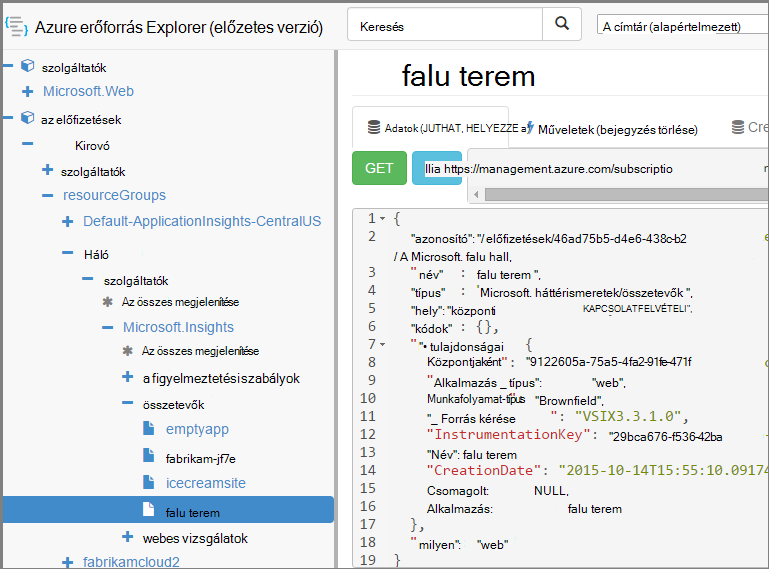

<properties 
    pageTitle="Hozzon létre alkalmazás Hírcsatornájában erőforrások PowerShell használatával" 
    description="Programozás útján létrehozása alkalmazás mélyebb erőforrások az összeállítás részeként." 
    services="application-insights" 
    documentationCenter=""
    authors="alancameronwills" 
    manager="douge"/>

<tags 
    ms.service="application-insights" 
    ms.workload="tbd" 
    ms.tgt_pltfrm="ibiza" 
    ms.devlang="na" 
    ms.topic="article" 
    ms.date="03/02/2016" 
    ms.author="awills"/>
 
# <a name="create-application-insights-resources-using-powershell"></a>Hozzon létre alkalmazás háttérismeretek erőforrások PowerShell használatával

Ez a cikk bemutatja, hogyan automatikusan létrehozza a egy [Alkalmazás háttérismeretek](app-insights-overview.md) erőforrás Azure-ban. Akkor lehet hasznos, például úgy build folyamat részeként. Együtt az egyszerű alkalmazás háttérismeretek erőforrás [elérhetősége webes azt vizsgálja](app-insights-monitor-web-app-availability.md), [állíthat be értesítéseket](app-insights-alerts.md), létrehozhat és más erőforrások: Azure létrehozása.

Ezek az erőforrások létrehozása kulcsa [Azure erőforrás-kezelő](../powershell-azure-resource-manager.md)JSON sablonokat. Rövid az eljárás van: a meglévő erőforrások; JSON-definíciók letöltése bizonyos értékét például a neveket; paraméterezni és futtassa a sablont, amikor hozzon létre egy új erőforrást szeretné. Több erőforrások együtt is csomag, tabulátorok létrehozására egyben az összes nyissa – például az alkalmazás monitor rendelkezésre állás-vizsgálat, értesítések és folyamatos exportálás tárhelyet. Vannak bizonyos subtleties, amely itt megismerheti a parameterizations részét.

## <a name="one-time-setup"></a>Egyszeri beállítása

Ha még nem használta PowerShell az Azure-előfizetéséhez előtt:

Telepítse az Azure Powershell-modult a számítógépen, amelyre a parancsfájlok futtatásának:

1. Telepítse [Microsoft webes Platform Installer (v5 vagy újabb)](http://www.microsoft.com/web/downloads/platform.aspx).
2. Annak segítségével a Microsoft Azure Powershell telepítése.

## <a name="copy-the-json-for-existing-resources"></a>A meglévő erőforrás JSON másolása

1. Állítsa be [Alkalmazás az összefüggéseket](app-insights-overview.md) a projekt hasonlóan, mint a automatikusan létrehozásához használni kívánt típusokra. Ha azt szeretné, vegye fel a webes vizsgálat és értesítések.
2. Hozzon létre egy új .json fájlt - vegyük hívja meg `template1.json` ebben a példában. A tartalom másolja azt:


    ```JSON

        {
          "$schema": "https://schema.management.azure.com/schemas/2015-01-01/deploymentTemplate.json#",
          "contentVersion": "1.0.0.0",
          "parameters": {
            "appName": { "type": "string" },
            "webTestName": { "type": "string" },
            "url": { "type": "string" },
            "text": { "type" : "string" }
          },
          "variables": {
            "testName": "[concat(parameters('webTestName'), 
               '-', toLower(parameters('appName')))]"
            "alertRuleName": "[concat(parameters('webTestName'), 
               '-', toLower(parameters('appName')), 
               '-', subscription().subscriptionId)]"
          },
          "resources": [
            {
              // component JSON file contents
            },
            {
              //web test JSON file contents
            },
            {
              //alert rule JSON file contents
            }
 
            // Any other resources go here
          ]
        }
    
    ```

    Ezzel a sablonnal fog beállítása mellett a fő erőforrás elérhetősége egy próba.


2. Nyissa meg az [Azure erőforrás-kezelő](https://resources.azure.com/). Mozgás lefelé `subscriptions/resourceGroups/<your resource group>/providers/Microsoft.Insights/components`, az alkalmazás erőforrásnézethez. 

    

    *Az egyszerű alkalmazás mélyebb forrásokat is tartalmaz, az alkalmazások megjelenítése a összetevői.* Vannak olyan társított riasztási szabályok és elérhetőség webes vizsgálatok külön erőforrásokat.

3. A JSON összetevő másolja be a megfelelő helyre a `template1.json`.
6. A tulajdonságok törlése:
  * `id`
  * `InstrumentationKey`
  * `CreationDate`
4. Nyissa meg a webtests és alertrules szakaszok, és a JSON egyedi elemek másolása a sablonba. (Nem másolja a webtests vagy alertrules csomópontok: válassza a azokat az elemeket be.)

    Minden webes vizsgálat egy társított szabályt, tartalmaz, így Önnek nem kell másolni őket a.

    A webes vizsgálat helyezzem, mielőtt a szabályt.

5. A séma kielégítéséhez Ez a sor beszúrása az egyes erőforrásokhoz:

    `"apiVersion": "2014-04-01",`

    (A séma is kapcsolatban az erőforrásnevek típus kis-és nagybetűk panaszt tesz `Microsoft.Insights/*` – ezek *nem* változnak, de.)


## <a name="parameterize-the-template"></a>A sablon paraméterezni

Most már van paraméterek cserélje ki az adott neveket. A [sablon paraméterezni](../resource-group-authoring-templates.md)kifejezések egy a [segítő funkcióinak beállítása](../resource-group-template-functions.md)kell írnia. 

Nem lehet egyszerűen részét egy paraméterezni, így `concat()` karakterláncok létrehozására.

Az alábbiakban példákat a helyettesítő, bizonyára tudni szeretné, hogy ellenőrizze. Vannak olyan minden helyettesítés több előfordulását. Szükség lehet másokat a sablon. Az alábbi példákban a paraméterek és a változók definiált tetején látható a sablont.

Keresés | cseréje
---|---
`"hidden-link:/subscriptions/.../components/MyAppName"`| `"[concat('hidden-link:',`<br/>` resourceId('microsoft.insights/components',` <br/> ` parameters('appName')))]"`
`"/subscriptions/.../alertrules/myAlertName-myAppName-subsId",` | `"[resourceId('Microsoft.Insights/alertrules', variables('alertRuleName'))]",`
`"/subscriptions/.../webtests/myTestName-myAppName",` | `"[resourceId('Microsoft.Insights/webtests', parameters('webTestName'))]",`
`"myWebTest-myAppName"` | `"[variables(testName)]"'`
`"myTestName-myAppName-subsId"` | `"[variables('alertRuleName')]"`
`"myAppName"` | `"[parameters('appName')]"`
`"myappname"`(kisbetűs) | `"[toLower(parameters('appName'))]"`
`"<WebTest Name=\"myWebTest\" ...`<br/>` Url=\"http://fabrikam.com/home\" ...>"`|`[concat('<WebTest Name=\"',` <br/> `parameters('webTestName'),` <br/> `'\" ... Url=\"', parameters('Url'),` <br/> `'\"...>')]" `


## <a name="set-dependencies-between-the-resources"></a>Az erőforrások közötti függőségek beállítása

Azure az erőforrások szigorú sorrendben kell beállítani. Győződjön meg arról, hogy egy telepítés befejezése, a következő megkezdése előtt, hogy függőség vonalak felvétele:

* A webhely erőforrás tesztelése:

    `"dependsOn": ["[resourceId('Microsoft.Insights/components', parameters('appName'))]"],`

* A riasztási erőforrás:

    `"dependsOn": ["[resourceId('Microsoft.Insights/webtests', variables('testName'))]"],`

## <a name="create-application-insights-resources"></a>Alkalmazás Hírcsatornájában erőforrások létrehozása

1. A PowerShell jelentkezzen be az Azure

    `Login-AzureRmAccount`

2. A parancsok jelennek meg:

    ```PS

        New-AzureRmResourceGroupDeployment -ResourceGroupName Fabrikam `
               -templateFile .\template1.json `
               -appName myNewApp `
               -webTestName aWebTest `
               -Url http://myapp.com `
               -text "Welcome!"
               -siteName "MyAzureSite"

    ``` 

    * -ResourceGroupName a csoportot, amelyhez az új erőforrások létrehozásához.
    * -templateFile kell fordulhat elő, az egyéni paraméter előtt.
    * -Alkalmazásnév hozhat létre az erőforrás nevére.
    * -webTestName létrehozása a webes vizsgálat nevét.
    * -URL-címe a web app URL-címét.
    * -A karakterlánc, amely az weblapon jelenik meg.
    * -siteName - használatos, ha egy Azure webhelyre


## <a name="define-metric-alerts"></a>Metrikus riasztások meghatározása

Nincs [Értesítések beállítása PowerShell metódusát](app-insights-alerts.md#set-alerts-by-using-powershell).


## <a name="an-example"></a>Példa

Az alábbiakban a teljes összetevő, a webes próba és a webes próba riasztási sablon létrehozott:

``` JSON

{
  "$schema": "https://schema.management.azure.com/schemas/2015-01-01/deploymentTemplate.json#",
  "contentVersion": "1.0.0.0",
  "parameters": {
    "webTestName": { "type": "string" },
    "appName": { "type": "string" },
    "URL": { "type": "string" },
    "text": { "type" : "string" }
  },
  "variables": {
    "alertRuleName": "[concat(parameters('webTestName'), '-', toLower(parameters('appName')), '-', subscription().subscriptionId)]",
    "testName": "[concat(parameters('webTestName'), '-', toLower(parameters('appName')))]"
  },
  "resources": [
    {
      //"id": "[resourceId('Microsoft.Insights/components', parameters('appName'))]",
      "apiVersion": "2014-04-01",
      "kind": "web",
      "location": "Central US",
      "name": "[parameters('appName')]",
      "properties": {
        "TenantId": "9122605a-471fc50f8438",
        "Application_Type": "web",
        "Flow_Type": "Brownfield",
        "Request_Source": "VSIX3.3.1.0",
        "Name": "[parameters('appName')]",
        //"CreationDate": "2015-10-14T15:55:10.0917441+00:00",
        "PackageId": null,
        "ApplicationId": "[parameters('appName')]"
      },
      "tags": { },
      "type": "microsoft.insights/components"
    },
    {
      //"id": "[resourceId('Microsoft.Insights/webtests', variables('testName'))]",
      "name": "[variables('testName')]",
      "apiVersion": "2014-04-01",
      "type": "microsoft.insights/webtests",
      "location": "Central US",
      "tags": {
        "[concat('hidden-link:', resourceId('microsoft.insights/components', parameters('appName')))]": "Resource"
      },
      "properties": {
        "provisioningState": "Succeeded",
        "Name": "[parameters('webTestName')]",
        "Description": "",
        "Enabled": true,
        "Frequency": 900,
        "Timeout": 120,
        "Kind": "ping",
        "RetryEnabled": true,
        "Locations": [
          {
            "Id": "us-va-ash-azr"
          },
          {
            "Id": "emea-nl-ams-azr"
          },
          {
            "Id": "emea-gb-db3-azr"
          }
        ],
        "Configuration": {
          "WebTest": "[concat(
             '<WebTest   Name=\"', 
                parameters('webTestName'), 
              '\"  Id=\"32cfc791-aaad-4b50-9c8d-993c21beb218\"   Enabled=\"True\"         CssProjectStructure=\"\"    CssIteration=\"\"  Timeout=\"120\"  WorkItemIds=\"\"         xmlns=\"http://microsoft.com/schemas/VisualStudio/TeamTest/2010\"         Description=\"\"  CredentialUserName=\"\"  CredentialPassword=\"\"         PreAuthenticate=\"True\"  Proxy=\"default\"  StopOnError=\"False\"         RecordedResultFile=\"\"  ResultsLocale=\"\">  <Items>  <Request Method=\"GET\"         Guid=\"a6f2c90b-61bf-b28hh06gg969\"  Version=\"1.1\"  Url=\"', 
              parameters('Url'), 
              '\" ThinkTime=\"0\"  Timeout=\"300\" ParseDependentRequests=\"True\"         FollowRedirects=\"True\" RecordResult=\"True\" Cache=\"False\"         ResponseTimeGoal=\"0\"  Encoding=\"utf-8\"  ExpectedHttpStatusCode=\"200\"         ExpectedResponseUrl=\"\" ReportingName=\"\" IgnoreHttpStatusCode=\"False\" />        </Items>  <ValidationRules> <ValidationRule  Classname=\"Microsoft.VisualStudio.TestTools.WebTesting.Rules.ValidationRuleFindText, Microsoft.VisualStudio.QualityTools.WebTestFramework, Version=10.0.0.0, Culture=neutral, PublicKeyToken=b03f5f7f11d50a3a\" DisplayName=\"Find Text\"         Description=\"Verifies the existence of the specified text in the response.\"         Level=\"High\"  ExectuionOrder=\"BeforeDependents\">  <RuleParameters>        <RuleParameter Name=\"FindText\" Value=\"', 
              parameters('text'), 
              '\" />  <RuleParameter Name=\"IgnoreCase\" Value=\"False\" />  <RuleParameter Name=\"UseRegularExpression\" Value=\"False\" />  <RuleParameter Name=\"PassIfTextFound\" Value=\"True\" />  </RuleParameters> </ValidationRule>  </ValidationRules>  </WebTest>')]"
        },
        "SyntheticMonitorId": "[variables('testName')]"
      }
    },
    {
      //"id": "[resourceId('Microsoft.Insights/alertrules', variables('alertRuleName'))]",
      "name": "[variables('alertRuleName')]",
      "apiVersion": "2014-04-01",
      "type": "microsoft.insights/alertrules",
      "location": "East US",
      "dependsOn": [
        "[resourceId('Microsoft.Insights/components', parameters('appName'))]",
        "[resourceId('Microsoft.Insights/webtests', variables('testName'))]"
      ],
      "tags": {
        "[concat('hidden-link:', resourceId('Microsoft.Insights/components', parameters('appName')))]": "Resource",
        "[concat('hidden-link:', resourceId('Microsoft.Insights/webtests', variables('testName')))]": "Resource"
      },
      "properties": {
        "name": "[variables('alertRuleName')]",
        "description": "",
        "isEnabled": true,
        "condition": {
          "$type": "Microsoft.WindowsAzure.Management.Monitoring.Alerts.Models.LocationThresholdRuleCondition, Microsoft.WindowsAzure.Management.Mon.Client",
          "odata.type": "Microsoft.Azure.Management.Insights.Models.LocationThresholdRuleCondition",
          "dataSource": {
            "$type": "Microsoft.WindowsAzure.Management.Monitoring.Alerts.Models.RuleMetricDataSource, Microsoft.WindowsAzure.Management.Mon.Client",
            "odata.type": "Microsoft.Azure.Management.Insights.Models.RuleMetricDataSource",
            "resourceUri": "[resourceId('microsoft.insights/webtests', variables('testName'))]",
            "metricName": "GSMT_AvRaW"
          },
          "windowSize": "PT15M",
          "failedLocationCount": 2
        },
        "action": {
          "$type": "Microsoft.WindowsAzure.Management.Monitoring.Alerts.Models.RuleEmailAction, Microsoft.WindowsAzure.Management.Mon.Client",
          "odata.type": "Microsoft.Azure.Management.Insights.Models.RuleEmailAction",
          "sendToServiceOwners": true,
          "customEmails": [ ]
        },
        "provisioningState": "Succeeded",
        "actions": [ ]
      }

    }
  ]
}

```

## <a name="see-also"></a>Lásd még:

Más automatizálási cikkeket:

* [Létrehozás egy alkalmazás háttérismeretek erőforrás](app-insights-powershell-script-create-resource.md) - gyors módszer sablon használata nélkül.
* [Értesítések beállítása](app-insights-powershell-alerts.md)
* [Webes vizsgálatok létrehozása](https://azure.microsoft.com/blog/creating-a-web-test-alert-programmatically-with-application-insights/)
* [Azure diagnosztika küldése alkalmazás mélyebb](app-insights-powershell-azure-diagnostics.md)
* [Megjelenés jegyzetek létrehozása](https://github.com/Microsoft/ApplicationInsights-Home/blob/master/API/CreateReleaseAnnotation.ps1)
