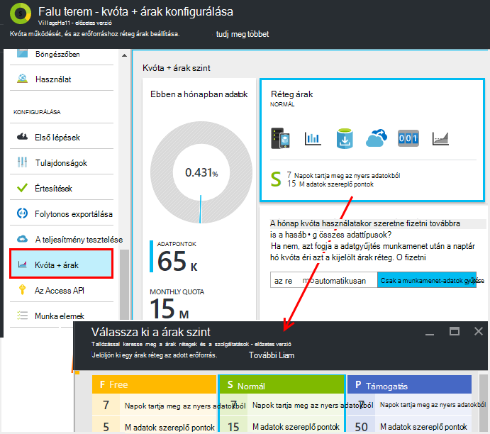
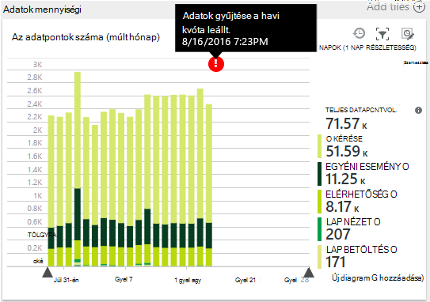
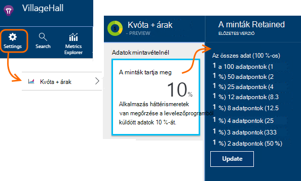
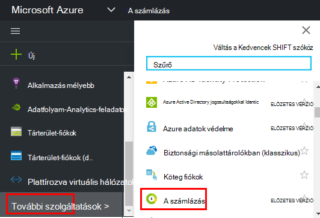

<properties 
    pageTitle="Árak és kvóta kezelése az alkalmazás az összefüggéseket |} Microsoft Azure" 
    description="Válassza ki a ár csomagot van szüksége, telemetriai kötet kezelése" 
    services="application-insights" 
    documentationCenter=""
    authors="alancameronwills" 
    manager="douge"/>

<tags 
    ms.service="application-insights" 
    ms.workload="tbd" 
    ms.tgt_pltfrm="ibiza" 
    ms.devlang="na" 
    ms.topic="article" 
    ms.date="10/13/2016" 
    ms.author="awills"/>

# Árak és kvóta alkalmazás háttérismeretek kezelése

*Alkalmazás háttérismeretek az előzetes verzióban.*

[Árak] [ pricing] for [Visual Studio alkalmazás háttérismeretek] [ start] alkalmazás használati adatok mennyiségi alapul. Van egy bizonyos korlátozások, a legtöbb szolgáltatását beszerzése jelentős ingyenes réteg.

Minden alkalmazás háttérismeretek az erőforrás alapdíjával különálló szolgáltatásként, és beleszámít a számla az Azure-előfizetését.

[Lásd: a árak rendszer][pricing].

## Tekintse át az alkalmazás az összefüggéseket erőforrás kvóta és ár megtervezése

Kvóta + árak az alkalmazás-erőforrás-beállítások lap megnyitása

A választási lehetőségek, a rendszer árak érinti:

* [Havi kvóta](#monthly-quota) - is elemzése havonta telemetriai mennyiségét.
* [Adatsebesség](#data-rate) - a legnagyobb érték az alkalmazás adatait feldolgozhatók.
* A [folyamatos exportálása](#continuous-export) - e exportálhatja az adatokat más eszközök és szolgáltatások.

Ezek a korlátok külön-külön az egyes alkalmazás háttérismeretek erőforrásokhoz vannak beállítva.

### Próba-előfizetésre prémium verzió

Új alkalmazás háttérismeretek erőforrás első létrehozásakor a szabad réteg indítja el.

Bármikor válthat 30 napos prémium a próba-előfizetésre. Ezzel kap a prémium réteg előnyeit. 30 nap után akkor automatikusan visszatér függetlenül az első csoportba tartozó, kivéve, ha kifejezetten kiválaszthatja, hogy egy másik előtt – a volt. A réteg szeretné a próbaidőszak során bármikor lehetőséget választja, de még mindig vissza az ingyenes próbaverziót 30 napos időszak vége előtt.

## Havi kvóta

* Minden egyes naptári hónapra az alkalmazás küldhet egy adott mennyiségű alkalmazás mélyebb telemetriai. A szabad árak réteg kvótája jelenleg 5 millió adatpontok havi és lényegében a további információ a rendszerek; vásárolhat további Ha eléri a kvóta.  Lásd: az [Office-téma árak] [ pricing] a tényleges számokhoz. 
* Kvóta attól függ, hogy az Ön által választott árak réteg.
* Kvóta származó minden hónap első napjától UTC éjfélét számít.
* Az adatok pontok diagram jeleníti meg, hogy mennyi a kvóta felhasználta ebben a hónapban.
* Kvóta mérése *adatpontok.* Egy egyetlen adatpontra merül fel hívást kezdeményez, a változáskövetési módszerekkel nevű kifejezetten a kódot, vagy a szabványos telemetriai modulok közül. Több csatolt tulajdonságokat és mérőszámok lehetnek.
* Adatpontok hozza létre:
 * [SDK modulokat](app-insights-configuration-with-applicationinsights-config.md) , amely automatikusan adatgyűjtés, például egy kérés vagy összeomlik jelentéséhez, vagy teljesítmény mérésére.
 * [API](app-insights-api-custom-events-metrics.md) `Track...` írt, például: hívások `TrackEvent` vagy `trackPageView`.
 * [Elérhetőség webes azt vizsgálja](app-insights-monitor-web-app-availability.md) , hogy be van állítva.
* Hibakeresése, közben láthatja az adatpontok elküldése az alkalmazás a Visual Studio kimeneti ablakban. Ügyfél-események is láthatja megnyitása a böngészőben network lap adatait a hibakeresési ablaktábla (általában az F12 billentyűt).
* *A munkamenet-adatai* nem számít bele a kvóta. Ide tartoznak a felhasználók, a munkamenetek, a környezet és az eszközadatok számát.
* Ha meg szeretné ellenőrzés felfelé az adatpontok száma, különböző helyen megtalálhatja őket:
 * Minden elem látható [diagnosztikai keresési](app-insights-diagnostic-search.md), amely tartalmazza a HTTP kéréseket, kivételeket, napló halad, lap nézetek, függőség események és egyéni események.
 * Minden egyes nyers, például a teljesítmény számláló [metrikus](app-insights-metrics-explorer.md) mérése. (A diagramok látja, pontok általában több nyers adatpontok összegzések.)
 * Webes elérhetősége diagram egyes pontjához több adatpontok összesített is.
* A forrás külön adatpontokhoz is megkeresése a hibakeresése során:
 * Ha az alkalmazás a Visual Studio hibakeresési módban, a kimeneti ablakban az adatpontok jelentkezett be. 
 * Az ügyfél adatpontok megtekintéséhez nyissa meg a böngésző hibakeresési ablaktáblát (általában F12), és nyissa meg a network lap.
* Az adatok ráta (alapértelmezés) csökkenthető [Adaptív mintavételnél](app-insights-sampling.md). Ez azt jelenti, hogy az alkalmazás nő használatát, mint a telemetriai ráta nem növelése, mint amennyit azt valószínűleg gondolná.

### Hozzárendelések

Ha az alkalmazás több, mint a havi kvóta küld, a következőkre van lehetősége:

* A fizetés további adatokat. Lásd: az [Office-téma árak] [ pricing] további információt. Megadhatja, hogy előre be ezt a beállítást. Ez a beállítás nem érhető el az ingyenes réteg árak.
* Frissítse a árak réteg.
* Nem tesz semmit. A munkamenet-adatai továbbra is a rögzítendő, de más adatok nem jelennek meg a diagnosztikai keresés vagy a mértékek Explorerben.

## Hogy mennyi adatot tapasztalok küldése?

Az ár alján a diagram lap jeleníti meg az alkalmazás adatok pont mennyiségi csoportosítva vannak adattípus pont. (Is létrehozhat a diagram metrikus Intézőben.)

Kattintson arra a diagramra, részletesebben, vagy húzza végig, és kattintson a (+) egy időtartományt részleteit.

A diagram jeleníti meg, hogy a kötet, melyek az alkalmazás az összefüggéseket szolgáltatás megérkezik [mintavételnél](app-insights-sampling.md)után.

Ha az adatok mennyiségi eléri a havi kvóta széljegyzet megjelenik a diagramon.

## Adatsebesség

A havi kvóta kívül korlátozás van érvényben szabályozási a adatsebesség a. A [réteg árak] ingyenes[ pricing] a korlát pontok/második átlagolni 5 percnél 200 adatok és a a kifizetett tiers van 500/s átlagolni több mint 1 perc. 

Vannak, amelyek külön-külön számítva három időszakok:

* [TrackTrace hívások](app-insights-api-custom-events-metrics.md#track-trace) és a [rögzített naplók](app-insights-asp-net-trace-logs.md)
* [A kivételek](app-insights-api-custom-events-metrics.md#track-exception)50 pontok/s korlátozódik.
* Minden más telemetriai (lap nézetek, munkamenetek, kérelmeket, függőségek, mértékek, egyéni események, webes vizsgálati eredmények).

*Mi történik, ha az alkalmazás meghaladja a másodpercenként ráta?*

* A hangerőt, melyek az alkalmazás által ismert percenként kell értékelni. Ha a munkafüzet meghalad az átlagolni fölé a percet másodpercenként ráta, a kiszolgáló megtagadja a egyes kérések. A SDK pufferek az adatokat, és próbálja újraküldéséhez magasra terjed néhány percig, amíg fölé. Ha az alkalmazás egységes küld adatot felett a szabályozási ráta, néhány adatot a program eltávolítja. (A ASP.NET Java és JavaScript SDK próbálkozzon ezzel a módszerrel küldje el újra, más SDK lehet egyszerűen szabályozott legördülő adatok.)

Ha szabályozásának fordul elő, egy figyelmeztetés, hogy ez történik értesítés jelenik meg.

*Honnan tudhatom, hogy hány adatpontot küld az alkalmazás?*

* Nyissa meg az adatok mennyiségi diagram beállításai/kvóta és árak.
* Vagy a mértékek Intézőben új diagram hozzáadása és válassza **az adatpont mennyiségi** annak metrikus. Váltás a csoportosítás, és a group by **adattípus**.

## A adatsebesség csökkentése

Ha a szabályozási korlátozások, Íme néhány dolog, amit végezheti el:

* [Példákat talál arra](app-insights-sampling.md)használja. Ez a technológia adatsebesség csökkenti a döntés a mértékek, és az azt jelenti, hogy a keresés egymáshoz kapcsolódó elemek közötti lépkedéshez megszakítása nélkül.
* [Ajax-hívások, amely lehet jelenteni számának korlátozása](app-insights-javascript.md#detailed-configuration) minden lap nézetben vagy a kapcsoló ki Ajax-jelentés.
* Kapcsolja ki a webhelycsoport-modulok fölösleges [ApplicationInsights.config](app-insights-configuration-with-applicationinsights-config.md)szerkesztésével. Dönthet például, hogy teljesítményét számláló vagy függőség adatok inessential is.
* Összesített előzetesen mértékek. Hívások TrackMetric illesztette be az alkalmazás, ha csökkentheti a forgalmat, amely a átlagának kiszámítása és egy köteg mérések szórása fogadja el a túlterhelés használatával. Másik lehetőségként használhatja [előre összesítése csomagot](https://www.myget.org/gallery/applicationinsights-sdk-labs). 

## Mintavételnél

A ráta, amelynél telemetriai a rendszer elküldi az alkalmazást, miközben továbbra is megőrzik az kapcsolódó eseményeket megkeresését diagnosztikai keresések során, és továbbra is a megfelelő eseményt megszámolja megőrzése csökkentése módszer [mintavételi](app-insights-sampling.md) . 

Mintavételnél használata hatékony módszer költségek csökkentése, és ne lépje túl a havi kvóta. A mintavételnél algoritmus megőrzi a telemetriai, a kapcsolódó elemek, így például keresési használatakor megtalálhatja a kérést, egy adott kivétel kapcsolatos. A algoritmus is helyes megszámolja, megtartja az, hogy a megfelelő értékeket metrikus Explorer kérelem díjak, a kivétel díjak és más száma látható.

Vannak olyan több, példákat talál arra az űrlapra.

* [Adaptív példákat talál arra](app-insights-sampling.md) az alapértelmezett érték esetében a ASP.NET SDK csomagjában talál, amelyek automatikus igazítása a elküldi az alkalmazást, hogy telemetriai hangerejének. Működik automatikusan a SDK csomagjában talál a a web App alkalmazásban, hogy a telemetriai forgalmat a hálózati csökken. 
* *Bevitel mintavételnél* egy alternatív megoldás, amely azon a ponton, ahol a telemetriai az alkalmazás belép az alkalmazás az összefüggéseket szolgáltatás működik. Az alkalmazás küldött telemetriai hangerejének nincs hatással, de csökkenti a hangerőt, a szolgáltatás tárolja. Használhatja a böngészők és más SDK telemetriai elsősorban kvóta csökkentése érdekében.

Bevitel mintavételnél beállításához állíthatja be a vezérlő kvóták + árak lap:

> [AZURE.WARNING] Az érték jelenik meg a minták megmarad csempe azt jelzi, hogy csak a bevitel mintavételnél megadott értéket. A mintavételnél ráta, hogy üzemel-e a SDK csomagjában talál az alkalmazásban a nem jeleníti meg. 
> 
> A bejövő telemetriai a SDK csomagjában talál a már lett mintaként, ha a program nem állítja a bevitel mintavételnél.
 
A tényleges mintavételnél ráta mindegy, hol lezárása felderítésére, például a [lekérdezés Analitikájának](app-insights-analytics.md) használni:

    requests | where timestamp > ago(1d)
  	| summarize 100/avg(itemCount) by bin(timestamp, 1h) 
  	| render areachart 

Az egyes megmarad a rekord `itemCount` azt, hogy az eredeti rekordokat, amely azt, egyenlő 1 + előző elvetett rekordok számát. 

## Tekintse át az Azure-előfizetését a számla

Alkalmazás háttérismeretek díjak számla Azure ad hozzá. Megtekintheti az Azure-portálra vagy az [Azure számlázási portál](https://account.windowsazure.com/Subscriptions)számlázási szakasznál bill az Azure részleteit. 

## Név korlátai

1.  Legfeljebb 200 egyedi metrikus és 200 egyedi tulajdonság nevét az alkalmazás. Mértékek TrackMetric, valamint egyéb adattípusokat, például az események méréseket keresztül küldött adatokat tartalmazza.  [Mértékek és a Tulajdonságok nevek] [ api] hatóköre egy műszerezettségi billentyűt.
2.  [Tulajdonságok] [ apiproperties] is használható, szűrés és csoportosítási csak, miközben az egyes tulajdonság 100-nál kevesebb egyedi értékei rendelkeznek. Egyedi értékek száma meghaladja a 100, miután is továbbra keresése az tulajdonság, de már nem használni szeretné a szűrők vagy csoportosítási.
3.  Általános tulajdonságok, például a név kérése és a weblap URL-CÍMÉT a 1000 egyedi értékek heti korlátozódik. Miután 1000 egyedi értéket további értékeket megjelölve "Egyéb értékek." Az eredeti értékek továbbra is használhatók teljes szövegét a Keresés és a szűrést.

Ha úgy találja, hogy az alkalmazás meghaladja az ezek a korlátok, fontolja meg, az adatok másik műszerezettségi kulcsok – Ez azt jelenti, hogy [Hozzon létre új alkalmazást az összefüggéseket erőforrások](app-insights-create-new-resource.md) közötti felosztása, és az új műszerezettségi kulcsokat küldése a adatainak egy részét. Előfordulhat, hogy az eredmény jobban épül. Ahhoz, hogy a különböző mérési módja miatt alakzatot ugyanazon a képernyőn, így ezt a megközelítést nem korlátozzák összehasonlítása a más mértékek [irányítópultok](app-insights-dashboards.md#dashboards) is használhatja. 

## Korlátozások összegzése

[AZURE.INCLUDE [application-insights-limits](../../includes/application-insights-limits.md)]

<!--Link references-->

[api]: app-insights-api-custom-events-metrics.md
[apiproperties]: app-insights-api-custom-events-metrics.md#properties
[start]: app-insights-overview.md
[pricing]: http://azure.microsoft.com/pricing/details/application-insights/

 