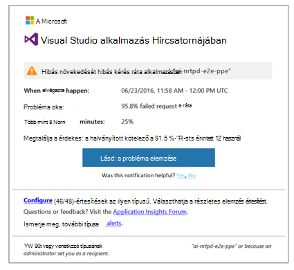
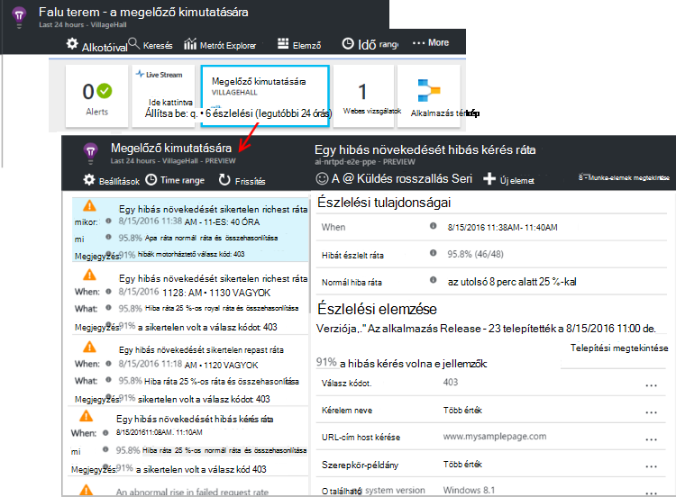

<properties 
    pageTitle="Az alkalmazás az összefüggéseket a megelőző diagnosztika |} Microsoft Azure" 
    description="Alkalmazás háttérismeretek az alkalmazás telemetriai automatikus mélyebb elemzéséhez hajt végre, és figyelmeztet az esetleges problémák." 
    services="application-insights" 
    documentationCenter="windows"
    authors="rakefetj" 
    manager="douge"/>

<tags 
    ms.service="application-insights" 
    ms.workload="tbd" 
    ms.tgt_pltfrm="ibiza" 
    ms.devlang="na" 
    ms.topic="article" 
    ms.date="08/15/2016" 
    ms.author="awills"/>

#  Az alkalmazás mélyebb megelőző diagnosztika

 Megelőző diagnosztika automatikusan figyelmeztet az esetleges teljesítményproblémákat a webalkalmazásban. A telemetriai [Visual Studio alkalmazás](app-insights-overview.md)mélyebb elküldi az alkalmazást, hogy az intelligens elemzésének hajtja végre. Ha hiba díjak hirtelen növekvő, és az ügyfél vagy a kiszolgáló teljesítményének hibás mintát, figyelmeztetést kap. Ez a funkció nem konfiguráció szükséges. Ha az alkalmazás által ismert elég telemetriai működik.

Megelőző észlelési riasztások is elérheti, mind az e-mailt kap, majd a a megelőző észlelése lap.

## Tekintse át a megelőző észlelési

Felfedezheti észlelési két módon:

* Az **e-mailt kap** az alkalmazás mélyebb. Íme egy tipikus példa:

    

    Kattintson a nagy gombra kattintva nyissa meg részletesebben a portálon.

* Az új figyelmeztetések száma **a megelőző észlelési csempe** az alkalmazás áttekintése lap jeleníti meg. Kattintson a csempére, egy új figyelmeztetések listájának megjelenítéséhez.

Jelölje ki a jelzést, a részletek megjelenítéséhez.

## Mi a probléma merül fel?

Háromféle észlelési van:

* [Megelőző hiba ráta diagnosztika](app-insights-proactive-failure-diagnostics.md). Gépi tanulási sikertelen kérelmek az alkalmazás, a várt sebességének beállításához használjuk, betöltése és egyéb tényezők használatával történik. Ha a hiba ráta kerül a várt boríték kívül, hogy jelzést küldjön.
* [Megelőző teljesítmény diagnosztika](app-insights-proactive-performance-diagnostics.md). Azt keresni anomalous mintázatok válaszidő és hiba díjak minden nap. Azt összehangolására alábbi tulajdonságait, például hely, a böngészőben, az ügyfél OS kapcsolatos problémák kiszolgálói példány és időpontja.
* [Azure Cloud Services](https://azure.microsoft.com/blog/proactive-notifications-on-cloud-service-issues-with-azure-diagnostics-and-application-insights/). Értesítéseket kapjon, az alkalmazás helyezkedik el az Azure Cloud Services és az egy szerepkör-példány indítások gyakori újrafelhasználás és runtime összeomlik.

(A Súgó az egyes értesítések hivatkozásokon a megfelelő cikkeket.)

## Következő lépések

Következő diagnosztikai eszközökkel nézze meg az alkalmazás a telemetriai nyújt segítséget:

* [Metrikus explorer](app-insights-metrics-explorer.md)
* [Keresési ablak](app-insights-diagnostic-search.md)
* [Analytics - hatékony lekérdezési nyelv](app-insights-analytics-tour.md)

Megelőző diagnosztika teljesen automatikus. De esetleg szeretné, hogy néhány további értesítések beállításával?

* [Saját kezűleg konfigurált metrikus értesítések](app-insights-alerts.md)
* [Elérhetőség webes vizsgálatok](app-insights-monitor-web-app-availability.md) 

