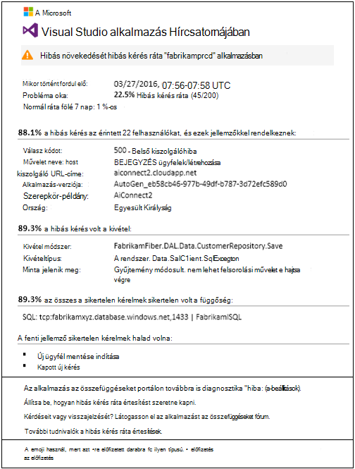
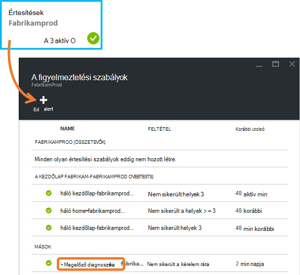
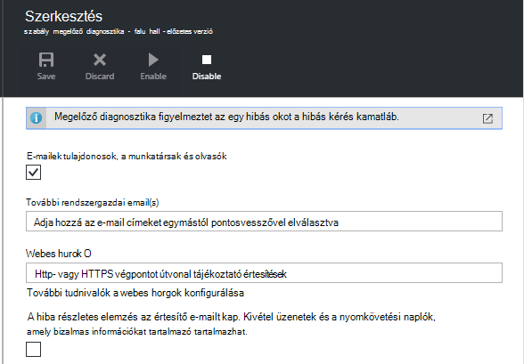
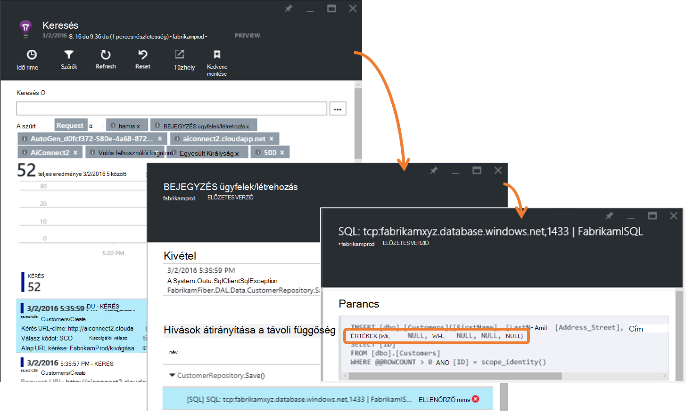
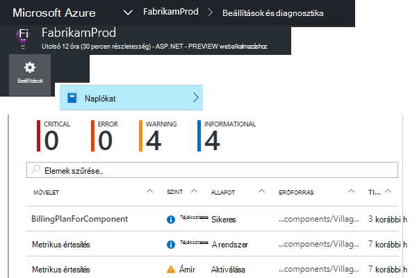
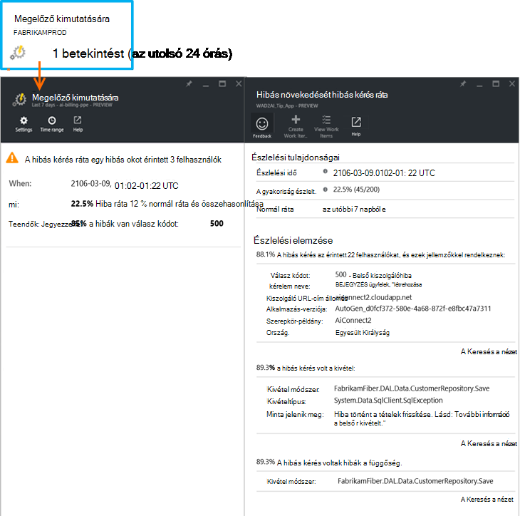

<properties 
    pageTitle="Az alkalmazás az összefüggéseket a megelőző hiba ráta diagnosztika |} Microsoft Azure" 
    description="Sikertelen kérelmek a web App-mértékének szokatlan változásokra figyelmeztető, és a diagnosztikai elemzés. Nincs konfiguráció szükséges." 
    services="application-insights" 
    documentationCenter=""
    authors="yorac" 
    manager="douge"/>

<tags 
    ms.service="application-insights" 
    ms.workload="tbd" 
    ms.tgt_pltfrm="ibiza" 
    ms.devlang="na" 
    ms.topic="article" 
    ms.date="10/12/2016" 
    ms.author="awills"/>
 
# Megelőző hiba ráta diagnosztika

[Visual Studio alkalmazás háttérismeretek](app-insights-overview.md) automatikusan jelzi, közeli valós időben, ha a web app-hibák mértéke hibás növekedését találkozik. Azt észleli, hogy mennyi díjat kell jelenteni, ahogy sikertelen a HTTP-kérések egy szokatlan növekedését. Ezek azok általában az válasz együtt a az 400 - és 500-tartományok szükségesek. Segít mailjei és a probléma diagnosztizálása, sikertelen kérelmek és a kapcsolódó telemetriai jellemzői elemzésének megadva az értesítésben. Az alkalmazás az összefüggéseket portál további diagnosztikai mutató hivatkozásokat is vannak. A szolgáltatás nem lehet beállítani vagy konfigurációja, szüksége van, a normál hiba ráta előrejelzésére gépi tanulási algoritmusok használ.

Ez a funkció Java és ASP.NET web Apps alkalmazások, a felhőben, vagy a saját kiszolgálók működik. Minden alkalmazás által generált kérelem telemetriai is működik, – például ha dolgozó szerepkörbe van, amely felhívja [TrackRequest()](app-insights-api-custom-events-metrics.md#track-request). 

Után állítsa be az [Alkalmazás az összefüggéseket a projekthez](app-insights-overview.md), és megadva, az alkalmazás hoz létre egy bizonyos minimális telemetriai, a megelőző hiba diagnosztika kerül 24 óra megtudhatja az alkalmazást, a rendes működését, mielőtt van-e kapcsolva, és elküldheti a riasztások.

Íme egy példa értesítés. 

> [AZURE.NOTE] Alapértelmezés szerint egy rövidebb formátum mail, mint ebben a példában kap. De [Váltson a részletes formátum](#configure-alerts)közül választhat.

Figyelje meg, hogy jelzi, hogy:

* A hiba kamatláb normál alkalmazás működése képest.
* Hány felhasználóm érintettek – így megtudhatja, hogy mennyi foglalkoznom.
* A hibák társított jellemző mintát. Ebben a példában van egy adott válasz kód, a kérelem nevét (művelet) és a app verziója lehetőséget. Amely azonnal Ez a kód megjeleníti ember. Egyéb lehetőségek az adott böngésző vagy egy ügyfél operációs rendszerű lehet.
* A kivétel, napló halad és függőség hiba (adatbázisok vagy más külső összetevők), amelyek a karakteres sikertelen kérelmek társítson jelennek meg.
* Közvetlenül a telemetriai az alkalmazás az összefüggéseket a megfelelő keresések mutató hivatkozásokat tartalmaz.

## Megelőző riasztások előnyei

Szokásos [metrikus riasztások](app-insights-alerts.md) mondani, előfordulhat, hogy probléma. De megelőző hiba diagnosztika elindítja a diagnosztikai munka, az elemzést, egyéb esetben kell illesztenie végezze el a saját maga sok elvégzéséhez. A eredményt el szépen csomagolása, ezzel megkönnyítve a probléma gyökerének gyors eléréséhez.

## Működése

Valós idejű megelőző diagnosztika monitorok közelében a telemetriai kapott, és különösen az alkalmazás a hibás kérés ráta. Ez a mérőszám darabszáma kérelmeket, amelynek a `Successful request` tulajdonság értéke hamis. Alapértelmezés szerint `Successful request== (resultCode < 400)` (kivéve, ha egyéni kódot írt [szűrő](app-insights-api-filtering-sampling.md#filtering) , vagy a saját [TrackRequest](app-insights-api-custom-events-metrics.md#track-request) hívások készítése). 

Az alkalmazás teljesítményének viselkedés tipikus mintát tartalmaz. Egyes kérések lesz gyakrabban hiba mint másoknak; és az általános hiba ráta lépjen a betöltés növekedése. Megelőző hiba diagnosztika gépi tanulási ezek rendellenességeinek kereséséhez használja. 

Telemetriai származik, az alkalmazás az összefüggéseket a web App alkalmazásban, miközben megelőző hiba diagnosztika az aktuális működés Miben más a mintázatok, a korábbi néhány nap alatt látható. Ha egy hibás okot hiba mértékének összehasonlítva előző teljesítményét, induljanak elemzését.

Az elemzés elindításakor a szolgáltatás sikertelen kérésre, próbálja ki a hibák kétszélű értékét értékek mintát azonosítása hajt végre a fürt elemzésre. A fenti példában az elemzés által megtalált, hogy a legtöbb hibák készül, egy adott eredmény kód, a kérelem név, a kiszolgáló URL-címe host és a szerepkör-példány. Az ügyfél operációs rendszer tulajdonságának felett több érték van meghatározva, és az így nem szerepel, által megtalált az elemzést.

A szolgáltatás az alábbi telemetriai van rendszereken, amikor a elemző keresi meg, kivétel és az általa megjelölt, minden olyan e kérelmeket társított nyomkövetési naplók példa együtt fürt kérések társított függőség hibát.

Az eredményül kapott elemzés küldi, mint a riasztás, hacsak nem konfigurálta.

[Értesítések beállítása manuálisan](app-insights-alerts.md), például a figyelmeztető állapotának vizsgálata és állítja be az alkalmazás az összefüggéseket erőforrás a riasztások lap. De eltérően más riasztást, nem kell adhatja meg, és állítsa be a megelőző hiba diagnosztika. Ha azt szeretné, tiltsa le, vagy a Céllista e-mail címeinek módosítása.

## Értesítések beállítása 

Tiltsa le a megelőző diagnosztika, módosíthatja az e-mail címzettjeinek, hozzon létre egy webhook vagy csatlakozás részletesebb figyelmeztető üzenetet.

Nyissa meg a riasztások lapot. Megelőző diagnosztika megtalálható együtt manuális beállítása ezeket az értesítéseket, és láthatja, hogy jelenleg riasztási állapotú.

Konfigurálja úgy, hogy a felhasználó lehetőségre.

Értesítés, hogy a megelőző diagnosztika letilthatja, de nem törölhető (vagy másikat is hozhat létre).

#### Részletes értesítések

Ha bejelöli a "Fogadása részletes elemzés" az e-mailt tartalmazó további diagnosztikai adatok. Előfordul, hogy is a kapcsolatos probléma, csak az e-mailben adatokból. 

Van, hogy a részletesebb figyelmeztető tartalmazó bizalmas információkat, kismértékű kockázat, mert azt tartalmaz, kivétel és a nyomkövetési üzeneteket. Azonban ez esetben csak fordulhat elő, ha a kód lehetővé tévő e-mailekbe bizalmas információkat. 

## Triaging és jelzést diagnosztizálása

Értesítés azt jelzi, hogy a hibás kérés ráta egy hibás növekedését észlelt. Valószínű, hogy az alkalmazás vagy a környezetéből valamilyen probléma van.

Érkező kérések és érintett felhasználók számát a százalékértéket megadhatja, hogy hogyan sürgős a probléma oka. A fenti példában 22.5 %-os hiba mértékének 1 %-os normál díjának Miben, azt jelzi, hogy egy hibás legyen a történésekkel kapcsolatban. Kézzel csak 11 felhasználók érintett. Az alkalmazás mintha lenne mérje fel, hogy hogyan komoly ez.

Sok esetben fogja tudni a probléma gyorsan kérelem nevét, a kivétel, szolgáltatott függőség hiba és a nyomkövetési adatok elemzéséhez. 

Vannak bizonyos egyéb jelek. Ha például a függőség hiba ebben a példában ráta ugyanaz, mint a kivétel ráta (89.3 %). A javításukhoz javasolt, hogy a kivétel merül fel közvetlenül a függőség hiba –, biztosítva ember, a kód megjeleníti a érdemes egy törlése.

További vizsgálja meg, hogy minden szakasz hivatkozásait viszi egyenes szűrve a megfelelő kéréseket, a kivétel, a függőség vagy a nyomkövetési naplók [Keresés lapra](app-insights-diagnostic-search.md) . Vagy nyissa meg az [Azure portál](https://portal.azure.com), nyissa meg azt az alkalmazást az összefüggéseket erőforrás, hogy az alkalmazás és a hibák lap megnyitásához.

Ebben a példában a 'A függőség hibák részletes adatainak megjelenítéséhez' hivatkozásra kattintva megnyílik, az SQL-utasítást a alkalmazás az összefüggéseket a Keresés lap és a kiváltóok: NULL értékek, ha a kötelező mezőket és a nem felelt meg az ellenőrzés során a Mentés művelet.

## Tekintse át az új figyelmeztetések

Tekintse át a portálon értesítések, nyissa meg a **beállításokat, a naplókat**.

Kattintson a bármely riasztás, a teljes részletek megjelenítéséhez.

Vagy kattintson a **megelőző észlelési** megszerezni a legutóbbi jelzésére egyenes:

## Mi a különbség...

Megelőző hiba ráta diagnosztika kiegészíti más hasonló de eltérő funkciói alkalmazás az összefüggéseket. 

* [Metrikus riasztások](app-insights-alerts.md) Ön által beállított, és miként figyelheti a mértékek, például Processzor használati, kérelem díjak, lapok betöltésével, és így tovább széles köre. A figyelmeztetést kérek, ha például további információforrásokat szüksége használhatja őket. Megelőző hiba diagnosztika ellentétben kis adattartomány kritikus mértékek (jelenleg csak Hibás kérés ráta), és értesíti a nyissa meg a valós időben után a web App alkalmazásban nem sikerült közelében kérése ráta növeli a web app normál viselkedés képest jelentősen terjed ki.

    Megelőző hiba ráta diagnosztika automatikus igazítása a mindenkori feltételek válaszul küszöbértéket.

    Megelőző hiba ráta diagnosztika indítsa el a diagnosztikai munkát igényelnek Öntől. 
* [Megelőző teljesítmény diagnosztika](app-insights-proactive-performance-diagnostics.md) is használja fel a mértékek szokatlan mintái gépi üzletiintelligencia, és Ön által semmilyen beállítás nem szükséges. De eltérően megelőző hiba ráta diagnosztika, a megelőző teljesítmény diagnosztika célja, hogy a használatát gyűjtőcső, előfordulhat, hogy rosszul felszolgált – például által meghatározott oldalak szegmensek keresse meg a böngésző egy bizonyos típusú. Az elemzés végrehajtott naponta, és ha minden eredményt található, akkor valószínűleg sokkal kevésbé sürgős, mint a riasztás. Ezzel ellentétben a megelőző hiba diagnosztika-elemzés bejövő telemetriai folyamatosan végzett, és értesítést kap percen belül nagyobb, mint a várt módon kiszolgáló hiba díjak esetén.

## Ha ráta megelőző hiba diagnosztika értesítés jelenik meg

*Miért kapott Ez az értesítés?*

*   A normál, a megelőző időszak eredeti összehasonlítva sikertelen kérelmek ráta egy hibás növekedését Önnél. A hibák és a kapcsolódó telemetriai elemzésének után azt tekintsen úgy, hogy van-e kell vizsgálja meg a problémát. 

*Az értesítés jelent növekedni biztosan fennáll a probléma?*

*   Azt próbálja meg a riasztási alkalmazás zavarok vagy csökkenés, bár csak is megértette szemantikáját és az alkalmazás vagy a felhasználók milyen hatással.

*Igen guys megnézi az adataimat?*

*   nem. A szolgáltatás nem teljesen automatikus. Csak az értesítést kap. A [személyes](app-insights-data-retention-privacy.md)adata.

*Szükség van ez az értesítés előfizetés?* 

*   nem. Minden alkalmazás küldő kérelem telemetriai tartalmaz a szabályt.

*Leiratkozás vagy inkább a munkatársaimnál küldött értesítések kérjen?*

*   Igen, a riasztási szabályok csoportban kattintson a megelőző diagnosztika szabály beállítása. Az értesítések letiltása, vagy módosítsa a címzettek az értesítésre vonatkozóan. 

*Elvesztettem az e-mailt. Hol találhatják meg a portálon az értesítéseket?*

*   Az a naplókat. Kattintson a naplókat, a beállítások, majd az előfordulás, hogy minden riasztást, de korlátozott részletes áttekintést adnak.

*A riasztások vannak az ismert problémákról, és nem szeretnék őket.*

*   A saját tartalék riasztási Tűzelfojtó van.

## Következő lépések

Következő diagnosztikai eszközökkel nézze meg az alkalmazás a telemetriai nyújt segítséget:

* [Metrikus explorer](app-insights-metrics-explorer.md)
* [Keresési ablak](app-insights-diagnostic-search.md)
* [Analytics - hatékony lekérdezési nyelv](app-insights-analytics-tour.md)

Megelőző észlelési teljesen automatikus. De esetleg szeretné, hogy néhány további értesítések beállításával?

* [Saját kezűleg konfigurált metrikus értesítések](app-insights-alerts.md)
* [Elérhetőség webes vizsgálatok](app-insights-monitor-web-app-availability.md) 

