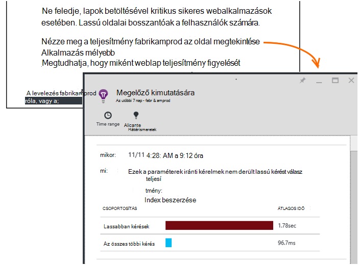

<properties 
    pageTitle="Alkalmazás háttérismeretek: Megelőző teljesítmény diagnosztika |} Microsoft Azure" 
    description="Alkalmazás háttérismeretek az alkalmazás telemetriai mélyebb elemzéséhez hajt végre, és figyelmeztet az esetleges problémák." 
    services="application-insights" 
    documentationCenter="windows"
    authors="antonfrMSFT" 
    manager="douge"/>

<tags 
    ms.service="application-insights" 
    ms.workload="tbd" 
    ms.tgt_pltfrm="ibiza" 
    ms.devlang="na" 
    ms.topic="article" 
    ms.date="08/31/2016" 
    ms.author="awills"/>

#  Megelőző teljesítmény diagnosztika

*Alkalmazás háttérismeretek az előzetes verzióban.*

[Visual Studio alkalmazás háttérismeretek](app-insights-overview.md) az alkalmazás telemetriai mélyebb elemzéséhez hajt végre, és figyelmezteti teljesítmény potenciális problémákról. Valószínűleg az olvasott meg, mert az e-mailben kapott a megelőző riasztások közül. 

Ez a funkció csak a telepítés nem, és automatikusan aktív, amikor az alkalmazás elég telemetriai hoz létre.

## Mik azok a megelőző teljesítmény diagnosztika?

Megelőző teljesítmény diagnosztika feltárja szokatlan mintázatok teljesítménye az alkalmazást, az alkalmazás mélyebb elküldi az alkalmazást, hogy a telemetriai elemzésével. 

Mindenekelőtt teljesítményproblémákat, amelyeket csak néhány felhasználó érinti, vagy csak a bizonyos esetekben felhasználókat érintő találja meg.

Ha például azt értesíti a felhasználót a alkalmazás lapok a böngészőben, mint a többi egy adott típusú sokkal lassabban betöltése, vagy ha kérelmek egy adott kiszolgálóról lassabban szolgáltatott. Azt is felfedezése problémák társított tulajdonságok kombinációi, például a nap adott időpontban földrajzi területen betölti lassú lap.

Ezek például rendellenességeinek nehezen nagyon észlelő csak az adatok vizsgálata, de gyakrabban, mint gondolná. Gyakran ezek csak felület, ha az ügyfelekkel panaszt. Abban az időpontban akkor is késedelmes: a versenytársak már vált át az érintett felhasználónál!

A algoritmusok jelenleg meg, lapok betöltésével, kérelem válaszidő a kiszolgálón, függőség válaszidő.  

Nem kell minden küszöbértékek beállítása vagy szabályok konfigurálása. Hibás szabályszerűségeket gépi tanulási és adatok adatbányászati algoritmusok szolgálnak. 

Sajnos nagyon belevágna, hogy a visszajelzést. Tudassa velünk, hogyan segít, a megelőző észlelési továbbfejlesztését és milyen további lehetőségeket szeretne hozzáadni, hogy mi. Visszajelzés küldése keresztül mosoly/rosszallás a portálon, vagy e-mailben nekünk AppInsightsML@microsoft.com. 

## Tudnivalók a megelőző értesítés

* *Miért kapott e e-mailek?*
 * Megelőző észlelése az alkalmazás alkalmazás mélyebb küldött, és az alkalmazás észlelt probléma a telemetriai elemezheti. 
* *Az értesítés jelent növekedni biztosan fennáll a probléma?*
 * nem. Egyszerűen javaslata bármiről érdemes lehet meg több közelebbről. 
* *Mit kell tenni?*
 * [Tekintse meg az adatokat mutatják be](#responding-to-an-alert). Mértékek Intézővel tekintse át az adott idő alatt a teljesítményt, és további metrikus részletezést. A kiváltóok keresőfunkciójának használata bizonyos eseményeket, amelyek segítségével kiszűrésére azonosítása 
* *Igen guys megnézi az adataimat?*
 * nem. A szolgáltatás nem teljesen automatikus. Csak az értesítést kap. A [személyes](app-insights-data-retention-privacy.md)adata.

## Az észlelési folyamatot

* *Milyen teljesítményt rendellenességeinek tapasztalnak?*
 * Mintákat volna megtalálta időigényes, ellenőrizze, hogy saját maga számára. Ha például teljesítményproblémákat hely bizonyos kombinációi, napi és a platform idő.
* *Az összes alkalmazás háttérismeretek által gyűjtött adatok elemzése?*
 * Jelenleg nem. Jelenleg válaszidő, a függőség válaszidő és a lapok betöltési idő kérelem elemzése azt. További mértékek elemzésének hamarosan. 
* *Létrehozhatok-e a saját rendellenességet észlelési szabályok?*
 * még nem. De van lehetősége:
 * [Értesítések beállítása](app-insights-alerts.md) , hogy amikor az egy mérőszám metszéspontja küszöbértéket.)
 * A [telemetriai exportálása](app-insights-export-telemetry.md) [adatbázis](app-insights-code-sample-export-sql-stream-analytics.md) vagy [a PowerBI](app-insights-export-power-bi.md) vagy [egyéb](app-insights-code-sample-export-telemetry-sql-database.md) eszközök, ahol elemezheti azt saját magának.
* *Milyen gyakran történik az elemzés?*
 * Azt az elemzés naponta futnak a a telemetriai az előző nap.
* * Így ez vált [metrikus értesítéseket](app-insights-alerts.md)?
 * nem.  Azt nem minden viselkedése, akkor fontolja meg hibás feltárása véglegesítése.

## Hogyan vizsgálja meg a problémákat, emelt

Nyissa meg a diagnosztikai jelentést, e-mailben vagy a rendellenességeinek listából.

* **Ha** a problémát észlelt időt mutatja.
* **Milyen** ismertetése
 * A probléma, hogy az észlelt;
 * Talált események megadása jellemzői jelenik meg a probléma viselkedését.
* A táblázat hasonlítja össze a rosszul működő beállítás az összes eseményének átlagos viselkedését.

Kattintson a hivatkozásra kattintva nyissa meg a metrikus Intézőt, és keresse a megfelelő jelentésekben, az idő és a lassú végrehajtása megadása tulajdonságainak szűrve.

Időtartomány és feltárása a telemetriai szűrők módosíthatók.

## Hogyan lehet a teljesítmény javítása?

Lassú és sikertelen válaszok azonosak a webhely-felhasználóknak a legfontosabb frustrations egyik tudja, a saját felhasználói felület. Ezért fontos, hogy a kapcsolatos problémák megoldása.

### Válogatása

Első lépésként számít? Lap mindig betöltése lassú, de csak 1 %-át a webhely felhasználói minden eddiginél is meg, esetleg esetén több fontos megfontolni. Azonban ha csak a felhasználók 1 %-át a megnyitáshoz, de minden alkalommal okoz a kivételek, amely érdekében érdemes lehet vizsgálat alatt.

A hatás utasítás használata az e-mailt az általános útmutató, de ügyeljen arra, hogy nincs-e a teljes szöveget. Győződjön meg arról, hogy más bizonyítékokra gyűjtése.

Fontolja meg határozza meg a problémát. Ha földrajzi függő, [elérhetősége azt vizsgálja](app-insights-monitor-web-app-availability.md) , köztük a régió beállítása: egyszerűen lehetnek hálózati problémák látható. 

### Lassú betöltését diagnosztizálása 

Hol található a probléma? Válasz lassú a kiszolgáló, az oldal nagyon sok, vagy a böngésző muszáj végezze el a nagy mennyiségű munka jelenítheti meg?

Nyissa meg a böngészők metrikus lap. A [böngésző lap betöltési idejének szegmentált megjelenítésének](app-insights-javascript.md#explore-your-data) jeleníti meg, hol fogom az időt. 

* Ha **Küldés kérés ideje** magas, vagy a kiszolgáló lassan válaszol, vagy a kérést egy bejegyzésben, a nagy mennyiségű adatot. Nézze meg a [teljesítménymutatók](app-insights-web-monitor-performance.md#metrics) vizsgálja meg a válaszidő. 
* Beállítása [függőség nyomon követése](app-insights-dependencies.md) , hogy a lassúsága a külső szolgáltatások vagy az adatbázis miatt nem.
* Ha **Fogadása válasz** elsődleges, a lapot, és annak függő részei - JavaScript, CSS, képek és így tovább (de aszinkron betöltött adatok) hosszúak. Állítsa be az [Elérhetőség vizsgálat](app-insights-monitor-web-app-availability.md), és ne felejtse el a függő kijelzők betöltése beállításainak megadása. Ha bizonyos eredményeket, nyissa meg a részleteket az eredményt, és bontsa ki a töltődnek be a lapok a különböző fájlok megtekintéséhez.
* Magas **ügyfél feldolgozása idő** javasol parancsfájlok lassan futnak. Ha azért nem egyértelmű, időzítés kód bővítse, és az időpontok küldése trackMetric hívásokat.

### Lassú lapok javítása

Van egy teljes tanácsadás a kiszolgáló válaszokat és a lapok betöltésével, javítására, akkor ismételje meg az összes itt nem próbálja a webhelyet. Íme néhány tipp, valószínűleg már tudja, kapcsolatban, csak hogy ne gondolok:

* Lassú miatt nagy fájlok betöltése: a parancsfájlok és más összetevők aszinkron betöltés. Használja a parancsprogram hozzákapcsolása. A főoldalra szétválasztani vezérlők, amelyek az adatokat külön-külön be. Egyszerű régi HTML-hosszú táblázatokhoz küldésének mellőzése: az adatok kérése JSON vagy más tömör formátumban parancsfájl segítségével, majd töltse ki a táblázat helyen. Vannak olyan remek keretek mindez segítséget. (Is ró nagy parancsfájlok, természetesen.)
* Lassú a kiszolgáló függőségek: fontolja meg a összetevők földrajzi helye. Ha Azure használ, győződjön meg arról, hogy az érintett webkiszolgálóra, és az adatbázis mindegyike ugyanabban a régióban. Lekérdezések beolvasásához végezze el a szükséges több információt? Gyorsítótár- vagy a Súgó kötegelés szeretne?
* Kapacitás problémák: tekintse meg a kiszolgáló mérési módja miatt válasz hányszor, és megszámolja, hogy kérelmet. Ha válaszidő aránytalanul csúcsok kérelem megszámolja a maximális, akkor valószínű, hogy a kiszolgálóját úgy módosítja a program. 

## Értesítő e-mailben

* *Szükség van annak érdekében, hogy értesítéseket fizessen elő a szolgáltatás?*
 * nem. A bot rendszeres felmérések az összes alkalmazás mélyebb felhasználó adatait, és értesítést küld, ha azt észleli, hogy problémákat.
* *Leiratkozás vagy inkább a munkatársaimnál küldött értesítések kérjen?*
 * Kattintson az e-mailben vagy riasztás leiratkozási hivatkozás. 
 
    Jelenleg azok küldött [az alkalmazás mélyebb erőforráshoz írási hozzáféréssel](app-insights-resources-roles-access-control.md)rendelkező személyek.

    A címzettek listájához beállítások a megelőző észlelése lap is szerkesztheti.
* *Nem szeretném megjeleníteni az üzenetek elhagyni.*
 * Azok a csak a legfontosabb kérdésben azt még nem jelentett kapcsolatos még naponta egy. Bármelyik üzenet ismétlési nem fog kapni.
* *Ha nem tesz semmit, fog szerezhető be emlékeztetőt?*
 * Nem, hibaüzenet minden problémáról csak egyszer. 
* *Elvesztettem az e-mailt. Hol találhatják meg a portálon az értesítéseket?*
 * Kattintson az alkalmazás alkalmazás háttérismeretek áttekintése a **Megelőző észlelési** csempére. Nincs is be minden értesítést keresésére napján vissza.

## Következő lépések

Következő diagnosztikai eszközökkel nézze meg az alkalmazás a telemetriai nyújt segítséget:

* [Metrikus explorer](app-insights-metrics-explorer.md)
* [Keresési ablak](app-insights-diagnostic-search.md)
* [Analytics - hatékony lekérdezési nyelv](app-insights-analytics-tour.md)

Megelőző észlelési teljesen automatikus. De esetleg szeretné, hogy néhány további értesítések beállításával?

* [Saját kezűleg konfigurált metrikus értesítések](app-insights-alerts.md)
* [Elérhetőség webes vizsgálatok](app-insights-monitor-web-app-availability.md) 

