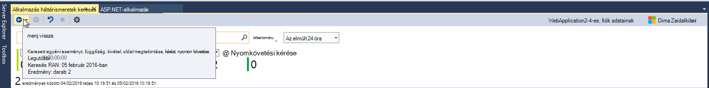
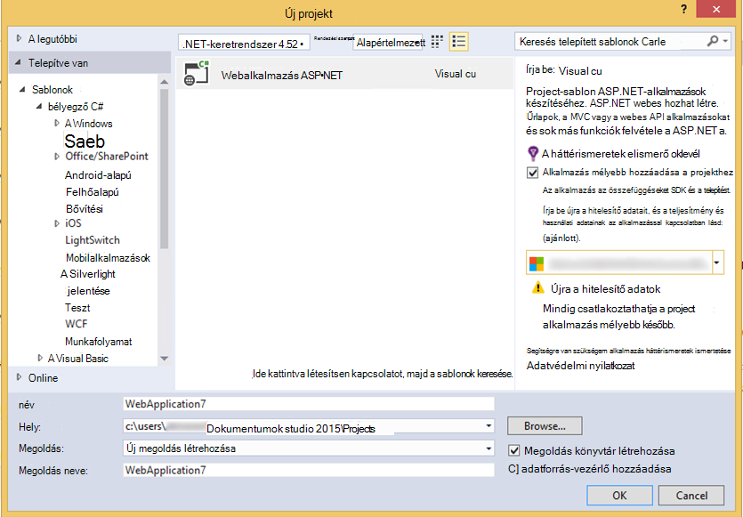

<properties
    pageTitle="Kibocsátási megjegyzések az Fejlesztőeszközök Analytics Visual Studio-bővítmény"
    description="A Visual Studio eszközök Fejlesztőeszközök elemzéséhez legújabb frissítéseit."
    services="application-insights"
    documentationCenter=""
    authors="acearun"
    manager="douge"/>
<tags
    ms.service="application-insights"
    ms.workload="tbd"
    ms.tgt_pltfrm="ibiza"
    ms.devlang="na"
    ms.topic="article"
    ms.date="06/09/2016"
    ms.author="acearun"/>

# Kibocsátási megjegyzések az analitikai Fejlesztőeszközök
Újdonságok: alkalmazás háttérismeretek és HockeyApp a Visual Studióban analytics.
## 7.0-s verzió
### Visual Studio alkalmazás háttérismeretek trendek
Visual Studio alkalmazásban az összefüggéseket a Visual Studióban, az alkalmazás működését időbeli elemzéséhez használható új eszköz. Első lépésként az **Alkalmazás az összefüggéseket** eszköztárgombra be- és az alkalmazás az összefüggéseket keresési ablakában válassza a **Feltárása Telemetriai trendek**. Vagy, a **Nézet** menüben kattintson az **Egyéb Windows**, és válassza az **Alkalmazás az összefüggéseket trendek**. Válasszon egyet az öt általános lekérdezések kezdéshez. Különböző készletek telemetriai típusú, az idő tartományait és az egyéb tulajdonságokat alapján elemezheti. Az adatok rendellenességeinek kereséséhez a a rendellenességet lehetőségekből választhat a **Nézet típusa** legördülő listában. Az ablak alján a szűrési lehetőségek megkönnyítik az adott részhalmazának a telemetriai a hone.

### Kivételek a CodeLens
Kivétel telemetriai most CodeLens jelenik meg. Ha a projekt összekapcsolta az alkalmazás az összefüggéseket szolgáltatás, látni fogja a kivételek gyártási az elmúlt 24 órán belül mindegyik módszernek előfordult számát. A CodeLens ugorhat a vizsgálja meg a kivételek részletesebben a Keresés és a trendek.

### ASP.NET Core támogatás
Alkalmazás háttérismeretek támogatja ASP.NET Core RC2 projektek Visual Studio. Az új ASP.NET Core RC2 projektek alkalmazás háttérismeretek vehet az **Új projekt** párbeszédpanel, ahogy az alábbi képernyőképen. Vagy hozzá egy meglévő projekten szeretne, kattintson a jobb gombbal a projekt a megoldást Intézőben, és válassza az **Alkalmazás az összefüggéseket Telemetriai hozzáadása**.

ASP.NET 5 RC1 és ASP.NET Core RC2 projekteket is új támogatása a diagnosztikai eszközökkel ablakban. Alkalmazás háttérismeretek eseményeket, például kérelmek és a kivételek megjelenik az ASP.NET-alkalmazás, a számítógépen helyben hibakeresése során. Az egyes események kattintson a **Keresés** olvashat részletesen.

### Univerzális Windows alkalmazásai HockeyApp
Béta terjesztési és a felhasználó visszajelzést mellett HockeyApp itt jelentéskészítési a univerzális Windows-alkalmazásokat a symbolicated összeomlik. Végeztünk azt még jobban megkönnyíti a HockeyApp SDK hozzáadása: kattintson a jobb gombbal a univerzális Windows projekten, és kattintson a **Hockey alkalmazás – összeomolhat Analytics engedélyezése**gombra. Ez a SDK csomagjában talál a telepítést, beállítja az összeomlást a webhelycsoport és rendelkezések HockeyApp erőforrás a felhőben, az alkalmazás feltöltése az HockeyApp szolgáltatás nélkül.

További új funkcióit:

* Az alkalmazás az összefüggéseket keresőmoduljának gyorsabb és egyszerűbben végeztünk. Most idő tartományban, a részletekhez tartozó szűrők automatikusan veszi, jelölje ki őket.
* Is alkalmazás háttérismeretek keresés, most már nincs ugorhat a kódot közvetlenül a kérelem telemetriai beállítást.
* Bejelentkezés módja HockeyApp javított végeztünk.
* A diagnosztikai eszközök gyártási telemetriai adatokat az kivételek jelenik meg.

## Verzió 5,2
Értesítés HockeyApp esetek a Visual Studióban bevezetésével Boldog vagyunk. Az első integráció a béta-eloszlás univerzális Windows-alkalmazások és a Visual Studio Windows Forms alkalmazások szerepel.

A béta-eloszláshoz, töltse fel az alkalmazások korai verziói HockeyApp ügyfelei vagy tesztelők webhelyről szeretne egy kijelölt részét eloszlás. Béta-eloszlás kombinált HockeyApp összeomlik a webhelycsoport és a felhasználó visszajelzés szolgáltatásokkal, adja meg a értékes információkkal, az alkalmazás előtt tanácsos lehet, hogy egy általános megjelenés. Használhatja ezt az információt problémák megoldására az alkalmazást, hogy elkerülése érdekében, vagy kisméretűvé alakítása a jövőbeli problémák, például alacsony alkalmazás minősítések, negatív visszajelzések és így tovább.

Jelölőnégyzet, hogy milyen egyszerűen állíthatja feltöltése Visual Studio a béta-eloszlás hoz létre.
### Univerzális Windows-alkalmazások
A helyi menü egy univerzális Windows app a project csomópont most már magában foglalja a egy HockeyApp feltölteni a Szerkesztés lehetőséget.

Válassza ki az elemet, és a feltöltés párbeszédpanel HockeyApp. Töltse fel a Szerkesztés egy HockeyApp fiók szüksége lesz. Ne aggódjon, ha új felhasználó. Fiók létrehozása a következő egyszerű áll.

Ha rendelkezik, megjelenik a feltöltés űrlap párbeszédpaneljén.

Jelölje ki a tartalmat feltöltése (.appxbundle vagy .appx fájl), és válassza a megjelenési programjai a varázslóban. Kibocsátási megjegyzések tetszés szerint adhat meg a következő lapra. Válassza a **Befejezés gombra** a feltöltés a kezdéshez.

Amikor a feltöltés befejeződött, a megerősítést kérő és az alkalmazás a HockeyApp portálon mutató hivatkozás HockeyApp értesítés jelenik meg.

Az egész! Csak az Ön által feltöltött építés béta-eloszlás mindössze néhány kattintással.

Az alkalmazás számos módon a HockeyApp portálon kezelheti. Ide tartoznak a meghívott felhasználók összeomlik jelentések megtekintése és módosítása visszajelzést adatait, és így tovább.

Lásd: a [HockeyApp Tudásbázis](http://support.hockeyapp.net/kb/app-management-2) alkalmazás management olvashat bővebben.

### Windows-alkalmazások űrlapok
A helyi menüje a Windows képernyő projekt csomópontját most már tartalmaz egy beállítást az összeállítás feltöltése HockeyApp.

Ekkor megnyílik a feltöltés hasonlít egy univerzális Windows-alkalmazás egyik HockeyApp párbeszédpanel.

Megjegyzés: Ez a varázsló új mezője alkalmazás verzióját megadására szolgáló. Univerzális Windows alkalmazásai az adatok az a jegyzék van kitöltve. Windows Forms alkalmazásokat, sajnos nem rendelkezik egy ezzel egyenértékű a szolgáltatással. Meg kell manuálisan adja meg.

A folyamat a többi univerzális Windows alkalmazások hasonlít: válassza a Szerkesztés és engedje fel a beállítások, adja hozzá a Megjelenés jegyzetek, töltse fel, és a HockeyApp portálon kezelheti.

Egyszerűen, hogy. Tegyen egy próbát, és ossza meg velünk véleményét.
## A 4,3 verziója
### Keresés telemetriai helyi hibakeresési munkamenetek
Az ebben a kiadásban most kereshet a Visual Studio hibakeresési munkamenetben létrehozott alkalmazás háttérismeretek telemetriai. Mielőtt is használja a Keresőt, csak akkor, ha az alkalmazás regisztrálta az alkalmazás az összefüggéseket. Most az alkalmazás csak kell lennie az alkalmazás az összefüggéseket SDK telepített a helyi telemetriai kereséséhez.

Ha az alkalmazás az összefüggéseket SDK ASP.NET-alkalmazások, végezze el a keresés funkció használatához az alábbi lépéseket.

1. Az alkalmazás hibakeresése.
2. Nyissa meg az alkalmazást az összefüggéseket keresés között az alábbi lehetőségek állnak rendelkezésére:
    - A **Nézet** menüben válassza a **Más Windows**, és jelölje ki az **Alkalmazást az összefüggéseket találatot**.
    - Kattintson az **Alkalmazás az összefüggéseket** eszköztár gombra.
    - A megoldás Intézőben bontsa ki a **ApplicationInsights.config**, és kattintson a **Keresés hibakeresési munkamenet telemetriai**.
3. Ha még nem jelentkezett az alkalmazás hírcsatornájában, a Keresés ablakban hibakeresési munkamenet telemetriai módban nyílnak meg.
4. Kattintson a **Keresés** ikonra, a helyi telemetriai megjelenítéséhez.

## Verzió 4.2.
Ebben a kiadásban azt, hogy az események keretében adatok az azt jelenti, hogy az további adatok események és az alkalmazás az összefüggéseket a naplózás adatokat küldeni egy egyszerű élmény kód Ugrás a keresés funkciókkal bővítettük. A bővítmény havi frissül. Ha visszajelzések vagy szolgáltatás kérelmeket, küldje el azt aidevtools@microsoft.com.
### Nincs kattintásra naplózás élmény
Felhőszolgáltatásában már használ NLog, log4net vagy System.Diagnostics.Tracing, ha, nem kell aggódnia amiatt, hogy az összes a nyomkövetési naplók alkalmazás mélyebb áthelyezése. Ebben a kiadásban azt az alkalmazást az összefüggéseket a naplózás kártyák a normál konfigurációs felület már integrált.
Már e konfigurálva naplózás keretek közül, a következő szakasz ismerteti, hogyan szerezheti be.
**Ha korábban már felvett alkalmazás Hírcsatornájában:**
1. Kattintson a jobb gombbal a projekt csomópontját, és válassza az **Alkalmazás Hírcsatornájában**, és válassza az **Alkalmazás az összefüggéseket konfigurálása**. Győződjön meg arról, hogy látható-e a megfelelő adaptert hozzáadásának konfigurációs ablakában.
2. Azt is megteheti, ha a megoldás generál, Megjegyzés az előugró ablak, a képernyő tetején látható a képernyő, és kattintson a **Konfigurálás**gombra.

Ha telepítve van a naplózás-adaptert, futtassa az alkalmazást, és ellenőrizze, hogy látható-e az adatok jelennek meg a diagnosztikai eszközök lapon:

### Ugrás a vagy a kód megkeresése, ahol a telemetriai eseménytulajdonság kibocsátott
Az új verziójának megjelenése felhasználói elemre bármelyik értéke az Eseménynapló részletek és a jelenlegi megnyitott megoldásban egyező karakterlánc keresi meg. Eredmények jelennek meg, a Visual Studio "Keresés" eredményében alább látható módon:

### Ha nem jelentkezett az új keresőablak
Azt már továbbfejlesztett az alkalmazás az összefüggéseket keresőablak segítséget nyújtanak az adatok keresése, az alkalmazás gyártási közben megjelenését.

### Az eseménnyel társított összes telemetriai esemény megtekintéséhez
Hozzáadtunk egy új lapon, a felhasználó által megtekintett mellett az esemény részletei lapon a telemetriai rendezvényhez kapcsolódó összes adatra vonatkozó előre definiált lekérdezések. Például egy kérelmet tartalmaz egy **Művelet azonosító**neve mezőbe. Minden a kérelem társított esemény **Művelet Azonosítóját**az azonos értékkel rendelkezik. A művelet a kérelem feldolgozása közben kivételt esetben a kivétel kap művelet azonosítója az értekezlet-összehívást könnyebben megtalálható legyen megegyezik. Kérésére megtalálja, kattintson az **összes telemetriai ehhez a művelethez** a nyisson meg egy új lapot, amely megjeleníti az új keresési eredmények.

### Előre és vissza előzmények keresése
Most már láthatja el másikba keresési eredmények között.

## 4.1-es verziójában
Ebben a kiadásban megtalálható számos új szolgáltatást és frissítések. Frissítés 1 ebben a kiadásban telepítve van szükség.

### Ugrás a kivételt módszer forráskód
Most kivételek nézi meg a gyártási alkalmazásból, az alkalmazás az összefüggéseket Keresés ablakban, ha ugorhat a módszerrel a kódban a kivétel mi hol. Csak akkor van szüksége, hogy a megfelelő projekthez betöltött, és a többi alkalmazást az összefüggéseket gondoskodik! (A többet szeretne tudni az alkalmazás az összefüggéseket keresőablak, lásd: a kibocsátási megjegyzések az alábbi szakaszok 4.0 verziójú.)

Hogyan működik? Alkalmazások háttérismeretek keresési is használhatja, akkor is, ha nincs nyitva a megoldást. A Papírhalom nyomkövetési terület megjelenik egy tájékoztató üzenetet, és a Papírhalom követés eleme közül számos csak a nem érhető el.

Fájl információ érhető el, ha egyes elemeket valószínűleg a hivatkozásokat, de a megoldás elem továbbra is látható marad.

Ha a hivatkozás gombra kattint, a kiválasztott módszerrel helyének fogja Ugrás a kódot. Előfordulhat, hogy a verziószám közötti különbség, de a szolgáltatás ugorhat a kódot, a megfelelő verziója fog érkezni a későbbi kiadásokban.

### A megoldás Intézőben tapasztalható új belépési pontról keresése
Most már érheti el keresési megoldás Explorer böngészőn keresztül.

### Értesítést jelenít meg közzétenni, amikor befejeződik
Előugró megjelenik egy párbeszédpanel a project online-ban, közzétételekor, hogy az alkalmazás az összefüggéseket adatok gyártási megtekintése.

## 4.0-s verzió

### Visual Studio adatainak alkalmazás háttérismeretek keresése
A keresési funkció az alkalmazás az összefüggéseket portálon most a Visual Studio szűrheti és a Keresés a esemény típusa, ingatlanértékek és szöveg hasonlóan, és majd nézze meg az egyes események.

### Lásd: a diagnosztikai eszközökkel helyi számítógépen az adatok

A telemetriai kívül más hibakeresési adatok a Visual Studio diagnosztikai eszközök lapon tekintheti meg. Csak a ASP.NET 4.5 használata támogatott.

### A SDK hozzáadása a projekthez Azure bejelentkezés nélkül

Már nem kell jelentkezzen be az Azure alkalmazás háttérismeretek csomagok hozzáadása a projekthez, vagy az **Új projekt** párbeszédpanel keresztül, vagy a projekt helyi menüből. Ha bejelentkezni, a SDK telepítve, és úgy beállítva, hogy telemetriai elküldése előtt, a portálra. Ha Ön nem jelentkezik be, a SDK hozzá a projekthez, és telemetriai esetében a diagnosztikai központi létrehoz. Beállíthatja azt később, ha azt szeretné.

### Eszköztámogatás

A *Csatlakozás;* 2015 hogy a [jelenti be](https://azure.microsoft.com/blog/deep-diagnostics-for-web-apps-with-application-insights/) , hogy a mobil fejlesztők számára eszközökhöz HockeyApp-e. HockeyApp segít béta buildjeiben a tesztelők webhelyről való terjesztése, összegyűjtése és elemzése az alkalmazás az összes összeomlik és a visszajelzések összegyűjtése közvetlenül az ügyfelekkel.
HockeyApp bármelyik platform létrehozásához, úgy dönt, hogy, amely az iOS, Android, vagy a Windows vagy Xamarin, Cordova és egységét platformok megoldást legyen-e az alkalmazás használatát támogatja.

A jövőben az alkalmazás az összefüggéseket bővítmény verziókban azt fogja mutassa be egy még jobban integrálhatja a yammert HockeyApp és a Visual Studio között. Most elindíthatja a HockeyApp NuGet hivatkozás egyszerűen hozzáadásával. További információt a [dokumentációjában](http://support.hockeyapp.net/kb/client-integration-windows-and-windows-phone) találhat.
