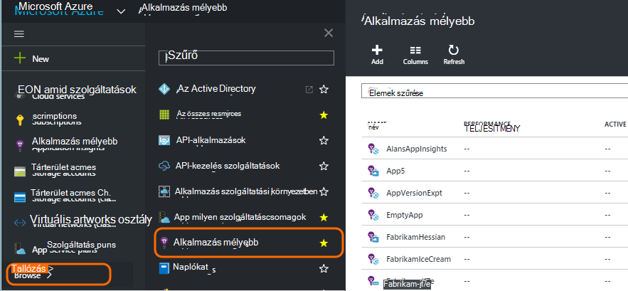
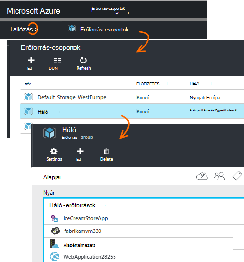
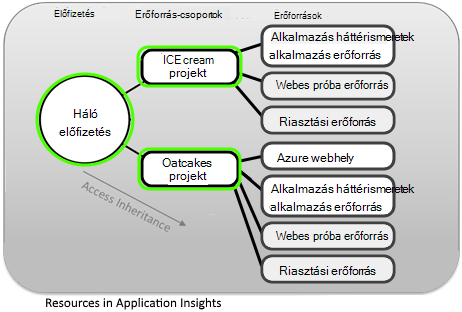
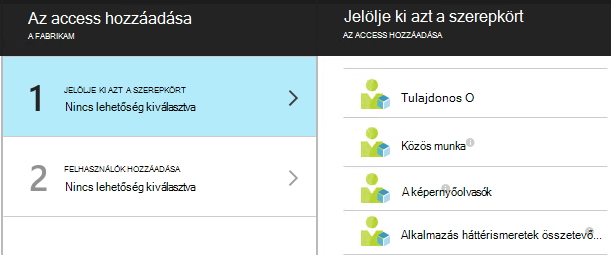
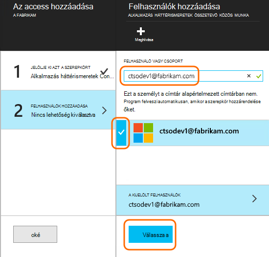

<properties
    pageTitle="Erőforrások, a szerepkörök és az alkalmazás az összefüggéseket a hozzáférés-vezérlés"
    description="Tulajdonosok, a munkatársak és a szervezet mélyebb olvasói."
    services="application-insights"
    documentationCenter=""
    authors="alancameronwills"
    manager="douge"/>

<tags
    ms.service="application-insights"
    ms.workload="tbd"
    ms.tgt_pltfrm="ibiza"
    ms.devlang="na"
    ms.topic="article"
    ms.date="05/07/2016"
    ms.author="awills"/>

# Erőforrások, a szerepkörök és az alkalmazás az összefüggéseket a hozzáférés-vezérlés

Megadhatja, hogy ki olvasási van, és a Visual Studio [Alkalmazás háttérismeretek]az adatok frissítése access[start], [a Microsoft Azure szerepköralapú hozzáférés-vezérlés](../active-directory/role-based-access-control-configure.md)használatával.

> [AZURE.IMPORTANT] Hozzáférés hozzárendelése a felhasználókhoz az **erőforráscsoport vagy -előfizetésre** , amelyhez tartozik az alkalmazás erőforrás - nem az erőforrás magát. Az **alkalmazás az összefüggéseket összetevő munkatársi** szerepkörök kiosztása. Ezzel biztosíthatja, hogy az access web vizsgálatok és az értesítések és az alkalmazás erőforrás egységes vezérlő. [Tudjon meg többet](#access).

## Erőforrások, csoportok és előfizetések

Először is, néhány meghatározása:

* **Erőforrás** – a Microsoft Azure szolgáltatás egy példánya. Az alkalmazás az összefüggéseket erőforrás által gyűjtött, elemzi, és megjeleníti az telemetriai adatokat küld a levelezőprogramból.  Más típusú erőforrásokat Azure web Apps alkalmazások, adatbázisok és VMs tartalmazzák.

    Az összes erőforrás megtekintéséhez nyissa meg az [Azure-portálon][portal], jelentkezzen be, és kattintson a Tallózás gombra.

    

* [**Erőforráscsoport** ] [ group] – minden erőforrás egy csoporthoz tartozik. Egy csoport kényelmes módja a kapcsolódó források, különösen a hozzáférés-vezérlés kezelésére. Például egy erőforrás csoportba sikerült helyezi webalkalmazást egy alkalmazás háttérismeretek erőforrás az alkalmazás figyelése és tároló erőforrás tartja exportált adatokat.

    

* [**Előfizetés**](https://manage.windowsazure.com) - alkalmazás Hírcsatornájában vagy más Azure erőforrások Azure-előfizetésbe jelentkezzen be. Minden erőforráscsoport tartozik egy Azure előfizetését, ahol válassza az ár csomag és, ha egy szervezet előfizetését, válassza a tagok és a hozzáférési engedélyek.
* [**Microsoft-fiók** ] [ account] – a felhasználónév és a Microsoft Azure előfizetések, XBox Live, Outlook.com vagy más Microsoft-szolgáltatásokkal való bejelentkezéshez használt jelszót.

## Az erőforráscsoport hozzáférés szabályozása

Fontos megértéséhez, hogy mellett az erőforrás az alkalmazáshoz létrehozott is figyelmeztetések és webes vizsgálatok külön rejtett erőforrásokat. Az alkalmazás azonos [erőforráscsoport](#resource-group) csatolt. Előfordulhat, hogy is illesztette be más Azure szolgáltatás be van, például webhelyek vagy tároló.

Az alábbi források, ezért ajánlott való hozzáférés szabályozása:

* Hozzáférés szabályozása a **erőforráscsoport vagy -előfizetésre** szintjén.
* Az **alkalmazás az összefüggéseket összetevő munkatársi** szerepkörök hozzárendelése a felhasználókhoz. Lehetővé teszi őket szerkesztése webes azt vizsgálja, az értesítéseket és erőforrások alkalmazás hírcsatornájában, anélkül, hogy hozzáférhetővé tenné csoportjának más szolgáltatásokat.

## Ahhoz, hogy az access egy másik felhasználónak

Az előfizetés vagy az erőforráscsoport tulajdonosi engedélyekkel kell rendelkeznie.

A felhasználó [Microsoft-fiókkal]kell rendelkeznie[account], vagy a [Szervezeti Microsoft-fiókkal](..\active-directory\sign-up-organization.md)való hozzáférést. Személyek, valamint az Azure Active Directory definiált felhasználói csoportok hozzáférési lehet nyújtani.

#### Nyissa meg azt az erőforráscsoport

Vegye fel a felhasználónak van.

Vagy sikerült Ugrás felfelé egy másik szintű, és vegye fel a felhasználót az előfizetést.

#### Jelölje ki azt a szerepkört

Szerepkör | Az erőforráscsoport
---|---
Tulajdonos | Is módosítható, beleértve a felhasználói hozzáférés
Közös munka | Szerkesztheti a tartalmat valamit, beleértve az összes erőforrás
Alkalmazás háttérismeretek összetevő közös munka | Erőforrások, a webes vizsgálatok és a riasztásokat alkalmazás háttérismeretek szerkesztheti
A képernyőolvasók | Megtekintheti, de nem módosítható

"Szerkesztés" tartalmazza, létrehozása, törlése és frissítése:

* Erőforrások
* Webes vizsgálatok
* Értesítések
* Folytonos exportálása

#### Jelölje ki a felhasználót

Ha a kívánt felhasználó a címtárban nem, meghívhatja a Microsoft-fiókkal rendelkező összes felhasználó.
(Ha szolgáltatásai, például Outlook.com, a onedrive-on, a Windows Phone vagy a XBox Live használják, azok rendelkezik Microsoft-fiókkal.)

## Felhasználók és szerepkörök

* [Szerepköralapú hozzáférés-vezérlés Azure-ban](../active-directory/role-based-access-control-configure.md)

<!--Link references-->

[account]: https://account.microsoft.com
[group]: ../resource-group-overview.md
[portal]: https://portal.azure.com/
[start]: app-insights-overview.md
