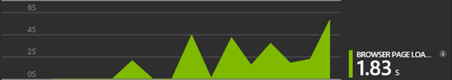

<properties 
    pageTitle="Útmutató: A Microsoft Dynamics CRM az alkalmazás az összefüggéseket figyelése" 
    description="Telemetriai beolvasása a Microsoft Dynamics CRM Online alkalmazás mélyebb használatával. Útmutató: a telepítés adatokat, a képi megjelenítések és az Exportálás első." 
    services="application-insights" 
    documentationCenter=""
    authors="mazharmicrosoft" 
    manager="douge"/>

<tags 
    ms.service="application-insights" 
    ms.workload="tbd" 
    ms.tgt_pltfrm="ibiza" 
    ms.devlang="na" 
    ms.topic="article" 
    ms.date="11/17/2015" 
    ms.author="awills"/>
 
# Forgatókönyv: Telemetriai engedélyezése a Microsoft Dynamics CRM Online alkalmazás háttérismeretek használatával

Ez a cikk bemutatja, hogyan szeretné telemetriai adatok beolvasása a [Microsoft Dynamics CRM Online](https://www.dynamics.com/) használja a [Visual Studio alkalmazásban az összefüggéseket](https://azure.microsoft.com/services/application-insights/). Módszeren végigvezetjük alkalmazás háttérismeretek parancsprogram hozzáadása az alkalmazás, a teljes folyamat adatok és adatmegjelenítés rögzítéséhez.

>[AZURE.NOTE] [Keresse meg a minta megoldás](https://dynamicsandappinsights.codeplex.com/).

## Új vagy meglévő CRM Online példány alkalmazás háttérismeretek hozzáadása 

Az alkalmazás figyelése, vegyen fel egy alkalmazás háttérismeretek SDK az alkalmazás. A SDK telemetriai küld az [alkalmazás háttérismeretek portál](https://portal.azure.com), amelyen a hatékony elemzés és a diagnosztikai eszközök, vagy exportálja az adatokat tároló.

### Hozzon létre egy alkalmazás háttérismeretek erőforrás Azure-ban

1. Ismerkedés a [Microsoft Azure-fiók](http://azure.com/pricing). 
2. Jelentkezzen be az [Azure-portálra](https://portal.azure.com) , és új alkalmazás háttérismeretek erőforrás hozzáadása. Ez a hol az adatok feldolgozott és jelenik meg.

    

    ASP.NET válassza az alkalmazás típusa.

3. Nyissa meg az első lépések lapon, és nyissa meg a kód parancsfájl.

    

**A kódlapot nyitva tartása** , miközben a következő lépésben egy másik böngészőablakban. Hamarosan kell a kódot. 

### A JavaScript webes erőforrás létrehozása a Microsoft Dynamics CRM rendszerben

1. Nyissa meg a CRM Online példány, és jelentkezzen be rendszergazdai jogosultságokkal.
2. Nyissa meg a Microsoft Dynamics CRM beállítások, testreszabás, a rendszer testreszabása

    
    
    

    

3. Hozzon létre egy JavaScript erőforrást.

    

    Adja meg egy nevet, jelölje ki a **parancsfájl (JScript)** , és nyissa meg a szövegszerkesztőben.

    
    
4. Alkalmazás mélyebb másolja a kódot. Győződjön meg arról, hogy másolása során figyelmen kívül hagyja a parancsprogram címkéket tartalmaznak. Olvassa el a képernyőfelvétel alatt:

    

    A kódot a műszerezettségi kulcsot, az alkalmazás mélyebb erőforrás azonosítására szolgáló tartalmazza.

5. Mentés és közzététel gombra.

    

### Űrlapok eszköz

1. A Microsoft CRM Online az ügyfél űrlap megnyitása

    

2. Nyissa meg az űrlap tulajdonságai

    

3. Az Ön által létrehozott JavaScript webes erőforrás hozzáadása

    

    

4. Mentése és közzététele a űrlap testreszabása.

## Rögzített mérőszámok

Most már beállított telemetriai rögzítése a képernyő. Használja, amikor adatokat küld a alkalmazás háttérismeretek erőforrás.

Az alábbiakban a minták, látni fogja az adatok.

#### Alkalmazás állapota

Böngésző kivételeket:

Kattintson arra a diagramra, részletesebb megszerezni:

#### Használat

#### Böngészők

#### Feloldás földrajzi helye

#### Sárga ceruzák lap kérelem megtekintése

## Minta kódot.

[Keresse meg a minta kódot](https://dynamicsandappinsights.codeplex.com/).

## A Power BI

Lehetőség van még mélyebb elemzés, ha [exportálja az adatokat a Microsoft Power bi-bA](app-insights-export-power-bi.md).

## Példa a Microsoft Dynamics CRM megoldás

[Az alábbiakban a minta megoldást szerepelni fog a Microsoft Dynamics CRM] (https://dynamicsandappinsights.codeplex.com/).

## tudj meg többet

* [Mi az alkalmazás az összefüggéseket?](app-insights-overview.md)
* [Weblapok alkalmazás Hírcsatornájában](app-insights-javascript.md)
* [További minták és forgatókönyvek](app-insights-code-samples.md)

 
