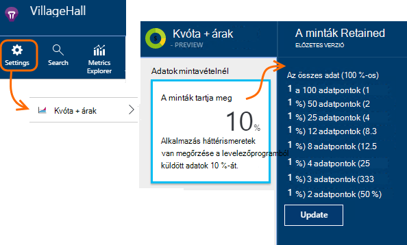

<properties 
    pageTitle="Az alkalmazás az összefüggéseket telemetriai mintavételnél |} Microsoft Azure" 
    description="Hogyan lehet tartsa ellenőrzés alatt telemetriai hangerejének." 
    services="application-insights" 
    documentationCenter="windows"
    authors="vgorbenko" 
    manager="douge"/>

<tags 
    ms.service="application-insights" 
    ms.workload="tbd" 
    ms.tgt_pltfrm="ibiza" 
    ms.devlang="na" 
    ms.topic="article" 
    ms.date="08/30/2016" 
    ms.author="awills"/>

#  <a name="sampling-in-application-insights"></a>Az alkalmazás az összefüggéseket mintavételnél

*Alkalmazás háttérismeretek az előzetes verzióban.*


Mintavételnél érték [Visual Studio alkalmazás háttérismeretek](app-insights-overview.md) az egyik funkciójáról telemetriai forgalmat és a tárhely csökkentése megőrzése mellett egy statisztikailag megfelelő alkalmazás adatok elemzése az ajánlott módszereket. A szűrő, hogy meg tudja nyitni a diagnosztikai vizsgálatok során elemek közötti kapcsolódó elemek kijelölése
Metrikus megszámolja a portálon Önnek mutatnak be, amikor azok figyelembe véve a mintavételnél lekicsinyítheti a statisztika hatással vannak renormalized.

Mintavételnél csökkenti a forgalmat, segít, hogy ne lépjék havi adatok kvóták és segítségével elkerülheti a szabályozásának.

## <a name="in-brief"></a>Röviden:

* Mintavételnél megtartja az *n* rekordok 1 figyelmen kívül hagyása a többi. Például akkor lehet, hogy megőrzi az 1: 5 eseményeket, 20 %-os mintavételnél díjának. 
* Mintavételnél automatikusan történik, ha az alkalmazás telemetriai, sok küld az ASP.NET-kiszolgáló webalkalmazásokban.
* Is beállíthatja, hogy mintavételi manuálisan, vagy a portálon árak lapon; vagy a ASP.NET SDK a .config fájlban is csökkentheti a hálózati forgalmának engedélyezésére.
* Ha egyéni naplózása, és győződjön meg arról, hogy egy sor olyan események tartja meg az vagy eldobása együtt szeretne, ellenőrizze, hogy biztosítanak-e OperationId azonos értékkel.
* A tulajdonság minden rekordjának jelenteni a mintavételnél osztót *n* `itemCount`, amely a keresési a felhasználóbarát név "kérelem számát adja meg" vagy "események száma" csoportban jelenik meg. Ha mintavételnél nem szerepel a művelet, `itemCount==1`.
* Ha Analytics-lekérdezéseket írni, érdemes [figyelembe vétele mintavételnél](app-insights-analytics-tour.md#counting-sampled-data). Mindenekelőtt helyett bejegyzések egyszerűen megszámolása, kell használnia `summarize sum(itemCount)`.


## <a name="types-of-sampling"></a>Mintavételnél típusai


Háromféleképpen alternatív mintavételnél:

* **Adaptív mintavételnél** automatikus igazítása a SDK csomagjában talál az ASP.NET alkalmazásában küldünk telemetriai hangerejének. Alapértelmezés szerint a SDK v 2.0.0-beta3. ASP.NET kiszolgálóoldali telemetriai jelenleg elérhető. 
* **Rögzített díjú mintavételnél** csökkenti a ASP.NET kiszolgáló és a felhasználói böngészőből küldött telemetriai hangerejének. A sebesség beállítása. Az ügyfél- és kiszolgálóoldali szinkronizálja a mintavételnél úgy, hogy a keresési navigálhat kapcsolódó lap nézetek és kéréseket között.
* **Bevitel mintavételnél** csökkenti a tartja meg az alkalmazást az összefüggéseket szolgáltatás beállított sebessége telemetriai mennyiségű. Telemetriai forgalom nem csökkentése, de segít a havi keretén belül megtartani. 

A művelet adaptív vagy a rögzített ráta mintavételnél esetén bevitel mintavételnél le van tiltva.

## <a name="ingestion-sampling"></a>Bevitel mintavételnél

Ezen az űrlapon példákat talál arra a pontra, ahol a telemetriai, a webkiszolgáló, böngészők és eszközökön eléri a alkalmazás háttérismeretek szolgáltatás végpontjának működik. Bár ezt nem az alkalmazás telemetriai adatforgalom csökkentéséhez, csökkentheti a feldolgozott és megmarad (és az előfizetést) szerint az alkalmazás az összefüggéseket.

Használja az ilyen típusú mintavételnél, ha a havi kvótáját gyakran áttekintést az alkalmazását, és nincs mintavételnél SDK-alapú típusú valamelyikével lehetőséget. 

A kvótákat és árak lap mintavételnél időközének beállítása:



Más típusú mintavételnél, például a algoritmus megőrzi a kapcsolódó telemetriai elemek. Például amikor keresés a telemetriai vizsgálat is a kérést, egy adott kivétel kapcsolatos kereséséhez. Metrikus megszámolja, például a kérelem ráta, és a kivétel ráta megfelelően megőrződnek.

Adatpontok, amely nem őrződnek meg mintavételnél által a minden alkalmazás háttérismeretek funkcióval [Folyamatos exportálni](app-insights-export-telemetry.md), például nem érhetők el.

Bevitel mintavételnél SDK adaptív vagy rögzített díjú mintavételnél művelet során nem működnek. Ha a SDK csomagjában talál példákat talál arra sebességét 100 %-nál kisebb, a bevitel mintavételnél ráta beállított figyelmen kívül hagyja.

> [AZURE.WARNING] Az érték jelenik meg a csempére azt jelzi, hogy a bevitel mintavételnél megadott értéket. Ha SDK csomagjában talál példákat talál arra a művelet, akkor a tényleges mintavételnél ráta nem képviseli.


## <a name="adaptive-sampling-at-your-web-server"></a>A webkiszolgáló adaptív mintavételnél

Adaptív mintavételnél az alkalmazás az összefüggéseket SDK az ASP.NET v 2.0.0-beta3 és újabb verzióiban érhető el, és alapértelmezés szerint engedélyezve van. 


Adaptív mintavételnél alkalmazásával miként változna meg a kiszolgáló-webalkalmazásból az alkalmazás mélyebb szolgáltatásnak küldött telemetriai hangerejének. A hangerő belül forgalom megadott maximális sebesség megtartása automatikusan módosul.

Azt nem működnek telemetriai, kis mennyiségű így-alkalmazás hibakeresése során, vagy nem befolyásolja a kihasználtság rendelkező webhelyet.

A cél mennyiségi eléréséhez a létrehozott telemetriai egy része elvész. De mintavételnél más típusú, például a algoritmus megőrzi a kapcsolódó telemetriai elemek. Például amikor keresés a telemetriai vizsgálat is a kérést, egy adott kivétel kapcsolatos kereséséhez. 

Metrikus megszámolja, például a kérelem ráta, a kivétel ráta pedig a mintavételnél ráta kompenzálja, hogy azok metrikus Explorer körülbelül helyes értékek megjelenítése.

**A projekt NuGet frissítése** csomagok háttérismeretek alkalmazás *előzetes* verziót: kattintson a jobb gombbal a projekt a megoldást Intézőben, válassza a NuGet csomagok kezelése, **előzetes tartalmazza** , és keressen a Microsoft.ApplicationInsights.Web ellenőrzése. 

A [ApplicationInsights.config](app-insights-configuration-with-applicationinsights-config.md), beállíthatja, hogy a több paramétert a `AdaptiveSamplingTelemetryProcessor` csomópontot. A megjelenített érték az alapértelmezett értékeket:

* `<MaxTelemetryItemsPerSecond>5</MaxTelemetryItemsPerSecond>`

    Cél ráta, amely az **egyes kiszolgáló állomás**célja a adaptív algoritmus. Ha sok hosts fut a web App alkalmazásban, csökkentheti a ezt az értéket, hogy az alkalmazás az összefüggéseket portált a forgalmat a cél mértéke belül maradjon.

* `<EvaluationInterval>00:00:15</EvaluationInterval>` 

    Az intervallumra, amelynél az aktuális telemetriai mérték újra kiértékelt. Kiértékelés mint a mozgó átlag történik. Érdemes lehet az intervallum rövidíteni, ha a telemetriai hirtelen felszakadásáig.

* `<SamplingPercentageDecreaseTimeout>00:02:00</SamplingPercentageDecreaseTimeout>`

    Százalékos értéket módosítások mintavételezésnél hogyan hamarosan után azt engedélyezettek mintavételnél százalékos újra kevesebb adatot rögzítéséhez csökkentéséhez.

* `<SamplingPercentageIncreaseTimeout>00:15:00</SamplingPercentageIncreaseTimeout>`

    Százalékos értéket módosítások mintavételezésnél után hogyan, amint azt engedélyezettek mintavételnél százalékos újra több adat rögzítéséhez növeléséhez.

* `<MinSamplingPercentage>0.1</MinSamplingPercentage>`

    Százalékos mintavételi változik, mint a Mi az a legkisebb értéket, azt is engedélyezett beállítása.

* `<MaxSamplingPercentage>100.0</MaxSamplingPercentage>`

    Százalékos mintavételi változik, mint a Mi az a megengedettnél azt is állíthatja.

* `<MovingAverageRatio>0.25</MovingAverageRatio>` 

    A mozgó átlag kiszámításához a vastagság rendelve a legutóbbi értéket. Írja be egy 1-nél kisebb vagy egyenlő értéket. A kisebb értékek módosítsa a algoritmus kisebb reaktív hirtelen szeretne.

* `<InitialSamplingPercentage>100</InitialSamplingPercentage>`

    Amikor az alkalmazás elkezdte hozzárendelt érték. Nem csökkentése ezzel, hibakeresése közben. 

### <a name="alternative-configure-adaptive-sampling-in-code"></a>Alternatív: Adaptív mintavételnél kód beállítása

Eredményhez tartozó mintavételnél a .config fájlban, hanem a kódot is használhatja. Lehetővé teszi, hogy adja meg a visszahívási függvény hív meg, amikor a mintavételnél ráta újra kiértékelt. Ezzel, például megtudhatja, hogy milyen mintavételnél ráta van használatban.

Távolítsa el a `AdaptiveSamplingTelemetryProcessor` .config fájlból csomópontot.


*C#*

```C#

    using Microsoft.ApplicationInsights;
    using Microsoft.ApplicationInsights.Extensibility;
    using Microsoft.ApplicationInsights.WindowsServer.Channel.Implementation;
    using Microsoft.ApplicationInsights.WindowsServer.TelemetryChannel;
    ...

    var adaptiveSamplingSettings = new SamplingPercentageEstimatorSettings();

    // Optional: here you can adjust the settings from their defaults.

    var builder = TelemetryConfiguration.Active.TelemetryProcessorChainBuilder;
    
    builder.UseAdaptiveSampling(
         adaptiveSamplingSettings,

        // Callback on rate re-evaluation:
        (double afterSamplingTelemetryItemRatePerSecond,
         double currentSamplingPercentage,
         double newSamplingPercentage,
         bool isSamplingPercentageChanged,
         SamplingPercentageEstimatorSettings s
        ) =>
        {
          if (isSamplingPercentageChanged)
          {
             // Report the sampling rate.
             telemetryClient.TrackMetric("samplingPercentage", newSamplingPercentage);
          }
      });

    // If you have other telemetry processors:
    builder.Use((next) => new AnotherProcessor(next));

    builder.Build();

```

([Megtudhatja, hogy telemetriai processzorok](app-insights-api-filtering-sampling.md#filtering).)


<a name="other-web-pages"></a>
## <a name="sampling-for-web-pages-with-javascript"></a>Weblapok JavaScript mintavételnél

Beállíthatja a weblapok rögzített ráta mintavételnél bármely kiszolgálóról. 

Amikor az [alkalmazás az összefüggéseket a weblapok beállítása](app-insights-javascript.md), módosítása, amely az alkalmazás az összefüggéseket portálról el a kódtöredék. (Az ASP.NET-alkalmazásokban a kódtöredék általában mutat _Layout.cshtml.)  Szúrjon be egy sort, például `samplingPercentage: 10,` a műszerezettségi kulcs előtt:

    <script>
    var appInsights= ... 
    }({ 


    // Value must be 100/N where N is an integer.
    // Valid examples: 50, 25, 20, 10, 5, 1, 0.1, ...
    samplingPercentage: 10, 

    instrumentationKey:...
    }); 
    
    window.appInsights=appInsights; 
    appInsights.trackPageView(); 
    </script> 

A mintavételnél százalékértéket válassza a százalékos leginkább hasonlító 100/N, ahol N egy egész szám.  Mintavételi jelenleg nem támogatja a más érték.

Ha engedélyezi a rögzített ráta mintavételnél a kiszolgálón is, az ügyfelek és a kiszolgáló szinkronizálja úgy, hogy a keresési navigálhat kapcsolódó lap nézetek és kéréseket között.


## <a name="fixed-rate-sampling-for-aspnet-web-sites"></a>Rögzített ráta mintavételnél ASP.NET webhelyek

Rögzített ráta mintavételnél csökkenti a webkiszolgálót és böngészők érkező forgalmat. Adaptív mintavételnél, eltérően csökkenti úgy döntött, Ön által rögzített sebessége telemetriai. Azt is szinkronizálja az ügyfél és a kiszolgáló példákat talál arra, hogy a kapcsolódó elemek megmaradnak – például, hogy egy szót a Keresés lap nézetben tekinti meg, ha megtalálhatja a kapcsolódó megkeresésében.

A mintavételnél algoritmus megtartja a kapcsolódó elemek. A minden HTTP-kérelmek esemény, és a kapcsolódó eseményeket figyelmen kívül vagy továbbított információk. 

Mértékek, például a kérelem és a kivétel száma a mértékek Intézőben megszorzása az mintavételnél ráta kompenzálja tényezővel, hogy körülbelül helyességéről.

1. **A projekt NuGet csomagjaihoz** háttérismeretek alkalmazás *előzetes* verziót. Kattintson a jobb gombbal a projekt a megoldást Intézőben, válasszon NuGet csomagok kezelése, és jelölje be az **előzetes tartalmazza** , és keressen a Microsoft.ApplicationInsights.Web. 

2. **Adaptív mintavételnél letiltása**: [ApplicationInsights.config](app-insights-configuration-with-applicationinsights-config.md), távolítsa el vagy ki a megjegyzést a `AdaptiveSamplingTelemetryProcessor` csomópontot.

    ```xml

    <TelemetryProcessors>
    <!-- Disabled adaptive sampling:
      <Add Type="Microsoft.ApplicationInsights.WindowsServer.TelemetryChannel.AdaptiveSamplingTelemetryProcessor, Microsoft.AI.ServerTelemetryChannel">
        <MaxTelemetryItemsPerSecond>5</MaxTelemetryItemsPerSecond>
      </Add>
    -->
    

    ```

2. **Engedélyezze a rögzített ráta mintavételnél modulra.** Adja hozzá a kódtöredék [ApplicationInsights.config](app-insights-configuration-with-applicationinsights-config.md):

    ```XML

    <TelemetryProcessors>
     <Add  Type="Microsoft.ApplicationInsights.WindowsServer.TelemetryChannel.SamplingTelemetryProcessor, Microsoft.AI.ServerTelemetryChannel">

      <!-- Set a percentage close to 100/N where N is an integer. -->
     <!-- E.g. 50 (=100/2), 33.33 (=100/3), 25 (=100/4), 20, 1 (=100/100), 0.1 (=100/1000) -->
      <SamplingPercentage>10</SamplingPercentage>
      </Add>
    </TelemetryProcessors>

    ```

> [AZURE.NOTE] A mintavételnél százalékértéket válassza a százalékos leginkább hasonlító 100/N, ahol N egy egész szám.  Mintavételi jelenleg nem támogatja a más érték.


### <a name="alternative-enable-fixed-rate-sampling-in-your-server-code"></a>Másik megoldás: a kiszolgáló kódban rögzített ráta mintavételnél engedélyezése


A mintavételnél paraméter beállítása a .config fájlban, hanem a kódot is használhatja. 

*C#*

```C#

    using Microsoft.ApplicationInsights.Extensibility;
    using Microsoft.ApplicationInsights.WindowsServer.TelemetryChannel;
    ...

    var builder = TelemetryConfiguration.Active.GetTelemetryProcessorChainBuilder();
    builder.UseSampling(10.0); // percentage

    // If you have other telemetry processors:
    builder.Use((next) => new AnotherProcessor(next));

    builder.Build();

```

([Megtudhatja, hogy telemetriai processzorok](app-insights-api-filtering-sampling.md#filtering).)


## <a name="when-to-use-sampling"></a>Mikor érdemes használni a mintavételnél?

Adaptív mintavételnél automatikusan engedélyezett, ha használja az ASP.NET SDK verzió 2.0.0-beta3 vagy újabb verziójában. Mindegy, melyik SDK-verziót használ bevitel mintavételnél (a kiszolgálón) is használhatja.

A legtöbb közepes és kis méret alkalmazások mintavételnél nem szükséges. Az összes felhasználó tevékenység vonatkozó adatok gyűjtése a leghasznosabb diagnosztikai adatok és a legpontosabb statisztikai meghatározásához. 

 
A mintavételnél legfontosabb előnye a következők:

* Alkalmazás háttérismeretek szolgáltatás csepp ("szabályozás") adatpontok esetén az alkalmazás által ismert telemetriai nagyon magas mértéke rövid időintervallum. 
* Hogy csak a árak réteg adatpontok [Kvóta](app-insights-pricing.md) belül. 
* A különféle telemetriai csökkentheti a hálózati forgalmának engedélyezésére. 

### <a name="which-type-of-sampling-should-i-use"></a>Milyen típusú mintavételnél érdemes használnom?


**Használja a bevitel mintavételi, ha:**

* A telemetriai havi kvótáját gyakran mesteroldalhoz.
* Nem támogató mintavételnél – például a SDK csomagjában talál, Java SDK vagy verziók ASP.NET verziójának 2-nél korábbi használ.
* A felhasználói böngészők telemetriai sok érkezik.

**Használja a rögzített ráta mintavételi, ha:**

* Használata esetén az alkalmazás az összefüggéseket SDK ASP.NET web services verziója 2.0.0 vagy újabb, és
* Azt szeretné, szinkronizált mintavételi közötti ügyfél- és kiszolgálóoldali, így megoldásán dolgozunk a [Keresés](app-insights-diagnostic-search.md)eseményeket, amikor az ügyfél és a kiszolgálón, például lap nézetek és a HTTP-kérések kapcsolódó eseményeket között válthat.
* Biztos abban a megfelelő mintavételnél százalékos az alkalmazás. Elég magas pontos mértékek első kell lennie, de gyakorisága alatt, amely meghaladja a árak kvóta és a szabályozási korlátai. 


**Adaptív mintavételnél használja:**

Egyéb esetben javasoljuk, hogy adaptív mintavételnél. Ez a ASP.NET-kiszolgáló verziója 2.0.0-beta3 SDK alapértelmezés szerint engedélyezve van vagy újabb verziójában. Azt nem forgalom csökkentése csak egy bizonyos minimális ráta, így nem lesz hatással egy alacsony használható webhelyet.


## <a name="how-do-i-know-whether-sampling-is-in-operation"></a>Honnan tudom, hogy van-e mintavételnél műveletben?

A tényleges mintavételnél ráta mindegy, hol lezárása felderítésére, például a [lekérdezés Analitikájának](app-insights-analytics.md) használni:

    requests | where timestamp > ago(1d)
  	| summarize 100/avg(itemCount) by bin(timestamp, 1h) 
  	| render areachart 

Az egyes megmarad a rekord `itemCount` azt, hogy az eredeti rekordokat, amely azt, egyenlő 1 + előző elvetett rekordok számát. 


## <a name="how-does-sampling-work"></a>Hogyan működik a mintavételnél?

Rögzített ráta és adaptív mintavételnél a-tól 2.0.0 ASP.NET verzióiban SDK szolgáltatás. Bevitel mintavételnél az alkalmazás az összefüggéseket szolgáltatás funkciója, és lehet a műveletet, ha a SDK nem hajt végre mintavételnél. 

A mintavételnél algoritmus úgy dönt, hogy mely telemetriai elemek törlése, és melyeket, hogy rögzítse (a SDK vagy akár az alkalmazás az összefüggéseket szolgáltatásban). A mintavételnél döntés célja, hogy egymáshoz adatpontok sértetlen értekezletekre és megbízható még egy csökkentett adathalmaz az alkalmazás az összefüggéseket a diagnosztikai rendszerének fenntartása megőrzése több szabállyal alapul. Például ha egy hibás kérés az alkalmazás küld további telemetriai elemek (például kivétel és halad-e-összehívásokban bejelentkezett), mintavételnél nem felbontja a kérelem és más telemetriai. Azt továbbra is vagy az összes közös megszakítja őket. Eredményt adja ha megnézi az alkalmazás az összefüggéseket a kérelem részletei, bármikor megnézheti, a társított telemetriai elemek együtt a kérést. 

"Felhasználó" meghatározó alkalmazásokhoz (Ez azt jelenti, hogy leggyakoribb webalkalmazások), a mintavételnél döntés a kivonat a felhasználói azonosítójában, ami azt jelenti, hogy minden olyan felhasználó összes telemetriai megmaradnak vagy kihagyott alapul. A felhasználók (például a webes szolgáltatások) nem meghatározó alkalmazások típusú mintavételnél döntés alapján a kérelem művelet azonosítója. Végül a telemetriai elemek, amelyek sem művelet sem a felhasználói azonosító beállítása (például telemetriai elemek nincsenek http környezettel aszinkron szálak jelentett) mintavételnél egyszerűen rögzíti telemetriai elemek minden típusú százalékában. 

Telemetriai előad vissza, ha az alkalmazás az összefüggéseket szolgáltatás megadja a mértékek azonos százalékkal mintavételnél használt webhelycsoport időben kompenzálja a hiányzó adatpontokat. Így megjeleníti az alkalmazás az összefüggéseket a telemetriai, amikor a felhasználók láthatók, amelyek rendkívül közelébe az valós számmá statisztikailag megfelelő becsléseket.

A közelítését pontosságát nagymértékben konfigurált mintavételnél százalékos függ. Is a pontosság megnöveli-alkalmazásokhoz, amelyet a felhasználók rengeteg általában hasonló kérelmeket nagy mennyiségű kezelni. Kézzel-alkalmazásokhoz, amelyek jelentősen terhelést nem működnek, mintavételnél nincs szükség, ezeket az alkalmazásokat általában is elküldheti a azok a telemetriai belül kvóta, anélkül, hogy az adatok elvesztését a szabályozásának kapcsolat közben. 

Figyelje meg, hogy az alkalmazás háttérismeretek nem minta mértékek és a munkamenetek telemetriai típusok óta az ilyen, lehet, hogy a pontosság csökkenése erősen nemkívánatos. 

### <a name="adaptive-sampling"></a>Adaptív mintavételnél

Adaptív mintavételnél hozzáad egy összetevő, amely a jelenlegi átviteli a SDK csomagjában talál a figyeli, és próbálja ki, hogy ne lépje túl a cél maximális sebesség mintavételnél százalékos igazítása. A kiigazítás újraszámításakor rendszeres időközönként, és a mozgó átlag, a kimenő adatfolyamok alapul.

## <a name="sampling-and-the-javascript-sdk"></a>Mintavételnél és a JavaScript SDK

Az ügyféloldali (JavaScript) SDK vesz rögzített díjú mintavételnél a kiszolgálóoldali SDK együtt. A felműszerezett lapok csak küldje el a ügyféloldali telemetriai a ugyanazokat a felhasználókat, amelynek a kiszolgálóoldali elvégzett döntése "minta." Ez a módszer megőrzéséhez felhasználói munkamenet integritását több ügyfél - és kiszolgáló-oldalból lett tervezve. Eredményt adja az alkalmazás az összefüggéseket adott telemetriai bármelyikére megtalálhatja minden más telemetriai elem az adott felhasználó vagy a munkamenetet. 

*Az ügyfél és a kiszolgálóoldali telemetriai nem összehangolt minta látható módon adja meg a fenti.*

* Győződjön meg arról, hogy engedélyezve van-e rögzíteni ráta mintavételnél kiszolgáló és az ügyfél.
* Győződjön meg róla, hogy a SDK verzió 2.0-s vagy újabb.
* Ellenőrizze, hogy az ügyfél- és kiszolgálóoldali állíthatja be az azonos mintavételnél százalékos értékét.


## <a name="frequently-asked-questions"></a>Gyakori kérdések 

*Miért nem mintavételi egy egyszerű "gyűjtése X telemetriai típusonként százalék"?*

 *  Mintavételnél eljárás a nagyon magas pontosság metrikus becsléseket volna biztosítson, miközben meg szeretné oldaltörés azt jelenti, hogy egy felhasználó, a munkamenet és a kérelmet, amelyet fontosságú diagnostics a diagnosztikai adatok összehangolására. Ezért mintavételi works jobban "az összes telemetriai elemek összegyűjtése az X készültségi alkalmazás felhasználók" vagy "X alkalmazás kérések százalékos aránya az összes telemetriai összegyűjtése" összefüggés. A telemetriai elemek (például a háttér aszinkron feldolgozása) kérelmek nem társított, a őszi vissza, ha "az összes elem az egyes telemetriai: százalék X gyűjt." 

*Adott idő alatt módosíthatja a mintavételnél százalékos?*

 * Igen, adaptív mintavételnél váltó a mintavételnél százalékértéket, a telemetriai jelenleg megfigyelt mennyisége alapján.

 

*Rögzített díjú mintavételnél használatakor hogyan állapíthatom meg, hogy melyik mintavételnél százalékos működnek a legjobb az alkalmazás?*

* Egyik módja van induljon adaptív mintavételnél, ismerje meg, hogy milyen árfolyam azt rendezi (lásd a fenti kérdésnél), és kattintson a rögzített ráta mintavétel adott ráta használatával. 

    Egyéb esetben ha kitalálhatják megosztott. Az aktuális telemetriai használatát a AI elemzése, tekintse át az bármely szabályozásának, hogy mi és az összegyűjtött telemetriai hangerejének becslése. E három ráfordítások, a kijelölt árak réteg együtt ajánlja fel, hogy mennyire érdemes lehet az összegyűjtött telemetriai számának csökkentése. Azonban azoknak a felhasználóknak a száma növekedése vagy néhány egyéb shift telemetriai mennyiségének előfordulhat, hogy érvényteleníti a becsült.

*Mi történik, ha állítható be a mintavételnél százalékos túl halk?*

* Túlzottan alacsony mintavételnél százalékos (over-aggressive mintavételnél) a becsléseket, pontosságát csökkenti az alkalmazás az összefüggéseket a Megjelenítés az adatok adatok mennyiségi csökkentésére egyenlíti alkalommal, amikor. Is diagnosztikai tapasztalatok negatív sebességét, mivel előfordulhat, hogy ki mintát a ritkán hibás vagy lassú kérések részét.

*Mi történik, ha állítható be a mintavételnél százalékos túl nagy?*

* Az összegyűjtött telemetriai hangerejének egy elegendő csökkenése eredményez túl nagy mintavételnél százalékos (nem olyan szigorú elég) beállítása. Akkor is előfordulhatnak szabályozásának kapcsolódó telemetriai az adatok elvesztését, és lehet, hogy alkalmazás háttérismeretek költségét magasabb szintű, a tervezett költségek többlet miatt.

*Milyen platformon futó van lehetőség mintavételnél?*

* Bevitel mintavételnél automatikusan fordulhat bármely telemetriai fölé egy bizonyos kötet, ha a SDK nem hajt végre mintavételnél. Ez működő, például az alkalmazás egy Java-kiszolgálót használ, vagy ha a ASP.NET SDK egy régebbi verzióját használja.

* ASP.NET SDK verziók 2.0.0 használata és fölött (Azure-ban vagy a saját kiszolgálón is), adaptív alapértelmezés szerint mintavételi kap, de a fentebb ismertetett rögzített ráta válthat. A rögzített ráta példákat talál arra, a SDK böngészőt automatikusan szinkronizálja a példa a kapcsolódó eseményeket. 

*Vannak bizonyos ritka események szeretném mindig látható. Hogyan szerezhetők be a mintavételnél modul múltbeli?*

 * Egy új TelemetryConfiguration (nem az alapértelmezett aktív) a TelemetryClient külön példányát inicializálni. Használja a ritka események küldhet.


## <a name="next-steps"></a>Következő lépések

* [Szűrés](app-insights-api-filtering-sampling.md) a SDK küld további szigorú irányításának lehet nyújtani.
